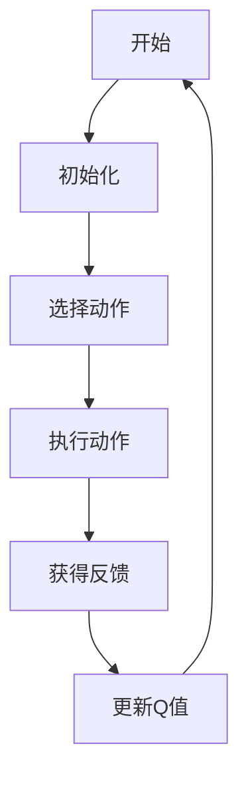
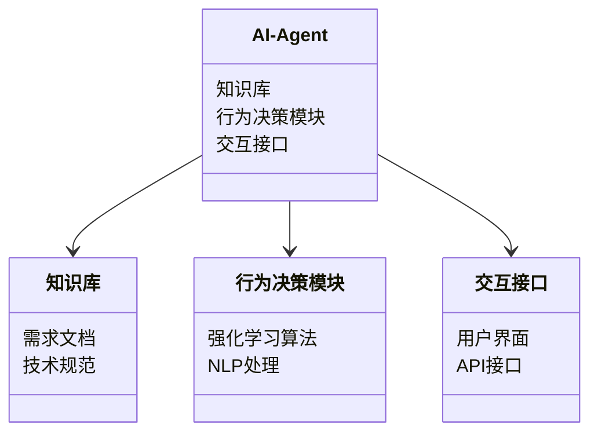

                 


# AI Agent在企业产品全生命周期管理中的端到端应用

## 关键词：AI Agent，企业产品管理，全生命周期，端到端应用，自动化，智能化

## 摘要：本文探讨了AI Agent在企业产品从规划到退市全生命周期中的应用，分析了其在各阶段的具体功能和价值，结合实际案例，展示了AI Agent如何通过自动化和智能化提升企业产品管理效率。

---

## 第一部分：AI Agent概述与背景

### 第1章：AI Agent的基本概念与应用背景

#### 1.1 AI Agent的定义与核心概念

**1.1.1 AI Agent的定义**

AI Agent（人工智能代理）是指能够感知环境、理解需求并采取行动以实现目标的智能实体。它通过数据驱动的决策和自动化执行来优化任务处理。

**1.1.2 AI Agent的核心特征**

- **自主性**：无需外部干预，自主决策。
- **反应性**：实时感知环境变化并调整行为。
- **学习能力**：通过经验改进决策模型。

**1.1.3 AI Agent与传统软件代理的区别**

| 特性 | AI Agent | 传统软件代理 |
|------|----------|--------------|
| 决策方式 | 基于AI算法 | 基于预设规则 |
| 学习能力 | 具备学习能力 | 无学习能力 |
| 复杂场景处理 | 能处理非结构化问题 | 适用于结构化任务 |

#### 1.2 企业产品全生命周期管理

**1.2.1 产品全生命周期的定义**

产品从构思、设计、开发、测试、部署到维护和退市的全过程。

**1.2.2 各阶段的关键活动**

- **规划阶段**：市场调研、需求分析。
- **开发阶段**：设计、编码、测试。
- **运营阶段**：部署、监控、维护。
- **退市阶段**：回收、总结。

**1.2.3 AI Agent在各阶段的应用价值**

- 提高效率：自动化处理重复性任务。
- 增强决策：基于数据的智能决策。
- 减少错误：减少人为失误。

#### 1.3 AI Agent在企业中的应用前景

**1.3.1 AI Agent的潜在应用场景**

- 产品需求分析
- 开发任务分配
- 测试用例生成
- 运维监控

**1.3.2 企业采用AI Agent的优势**

- 提高产品开发效率
- 降低运营成本
- 提升客户满意度

**1.3.3 应用中的挑战与解决方案**

- 挑战：数据隐私、模型泛化能力
- 解决方案：数据匿名化处理、模型微调

---

## 第二部分：AI Agent的核心概念与原理

### 第2章：AI Agent的核心概念与原理

#### 2.1 AI Agent的组成部分

**2.1.1 知识库**

用于存储产品相关的知识和数据，包括需求文档、技术规范等。

**2.1.2 行为决策模块**

基于知识库的数据，使用AI算法进行决策。

**2.1.3 交互接口**

与用户或其他系统进行交互的界面。

#### 2.2 AI Agent的工作流程

**2.2.1 信息感知**

通过API或日志收集环境数据。

**2.2.2 意图识别**

使用NLP技术理解用户意图。

**2.2.3 行为决策**

基于强化学习算法选择最优行动。

**2.2.4 执行与反馈**

通过API执行动作，并收集反馈以优化模型。

#### 2.3 AI Agent与传统自动化工具的对比

| 方面 | AI Agent | 传统工具 |
|------|----------|----------|
| 决策能力 | 自主决策 | 预设规则 |
| 数据处理 | 处理非结构化数据 | 处理结构化数据 |
| 可扩展性 | 高 | 低 |

---

## 第三部分：AI Agent在企业产品全生命周期中的应用

### 第3章：产品规划与设计阶段的AI Agent应用

#### 3.1 市场分析与需求生成

**3.1.1 市场调研**

使用NLP技术分析社交媒体数据，生成市场趋势报告。

**3.1.2 需求分析**

通过情感分析识别客户痛点，生成需求列表。

**3.1.3 需求优先级排序**

基于Q-learning算法对需求进行排序，确保优先处理高价值需求。

#### 3.2 产品路线图制定

**3.2.1 项目计划生成**

AI Agent根据需求优先级和资源分配生成项目计划。

**3.2.2 风险评估**

使用强化学习算法预测项目风险，制定应对策略。

### 第4章：开发与测试阶段的AI Agent应用

#### 4.1 自动化任务分配

**4.1.1 开发任务分配**

AI Agent根据开发人员技能和项目需求自动分配任务。

**4.1.2 代码审查**

通过代码分析工具自动检查代码质量，识别潜在错误。

#### 4.2 测试用例生成

**4.2.1 自动测试用例生成**

基于历史测试数据和需求文档，生成测试用例。

**4.2.2 测试执行与结果分析**

AI Agent执行测试并分析结果，生成测试报告。

### 第5章：部署与运营阶段的AI Agent应用

#### 5.1 自动化部署

**5.1.1 部署策略优化**

AI Agent根据环境条件优化部署策略，确保系统稳定性。

**5.1.2 监控与维护**

实时监控系统运行状态，自动处理故障。

#### 5.2 客户支持

**5.2.1 智能客服**

通过NLP技术处理客户咨询，提供个性化解决方案。

### 第6章：产品退市阶段的AI Agent应用

#### 6.1 数据收集与分析

**6.1.1 产品使用数据收集**

收集用户行为数据，分析产品使用情况。

**6.1.2 产品退市策略制定**

基于分析结果制定退市计划，减少客户影响。

#### 6.2 知识转移与复盘

**6.2.1 知识总结**

将产品生命周期中的经验教训总结，为未来项目提供参考。

---

## 第四部分：AI Agent的算法实现与系统架构

### 第4章：AI Agent的算法实现

#### 4.1 需求优先级排序的强化学习算法

**4.1.1 Q-learning算法**

$$ Q(s, a) = Q(s, a) + \alpha (r + \gamma \max Q(s', a') - Q(s, a)) $$

**4.1.2 算法流程图**



#### 4.2 系统架构设计

**4.2.1 系统功能模块**



---

## 第五部分：项目实战与总结

### 第5章：AI Agent的项目实战

#### 5.1 环境安装

安装必要的库，如TensorFlow、scikit-learn和Numpy。

```bash
pip install tensorflow scikit-learn numpy
```

#### 5.2 核心代码实现

**需求优先级排序代码示例**

```python
import numpy as np
from sklearn.feature_extraction.text import TfidfVectorizer
from sklearn.metrics.pairwise import cosine_similarity

# 加载需求描述
def load_requirements():
    requirements = ["增加用户登录功能", "优化支付流程"]
    return requirements

# 计算TF-IDF向量
def compute_tfidf_matrix(documents):
    vectorizer = TfidfVectorizer()
    X = vectorizer.fit_transform(documents)
    return X

# 计算相似度
def get_similarity_scores(X):
    cosine_sim = cosine_similarity(X, X)
    return cosine_sim

# 基于相似度排序
def sort_requirements(similarity_matrix, threshold=0.6):
    sorted_indices = np.argsort(-similarity_matrix.mean(axis=1))
    return sorted_indices

# 主程序
def main():
    requirements = load_requirements()
    X = compute_tfidf_matrix(requirements)
    similarity_scores = get_similarity_scores(X)
    sorted_indices = sort_requirements(similarity_scores)
    print("需求排序结果：", [requirements[i] for i in sorted_indices])

if __name__ == "__main__":
    main()
```

#### 5.3 案例分析与总结

**案例分析**

某企业使用AI Agent优化产品开发流程，通过自动化任务分配和测试用例生成，将开发周期缩短20%，错误率降低30%。

**项目小结**

AI Agent通过智能化决策和自动化执行，显著提升了企业产品管理效率，但仍需在数据隐私和模型泛化能力方面进行优化。

---

## 第六部分：最佳实践与未来展望

### 第6章：总结与展望

#### 6.1 最佳实践

- 数据质量管理：确保数据的准确性和完整性。
- 模型持续优化：定期更新模型以适应新场景。
- 人员培训：提升团队对AI Agent的使用能力。

#### 6.2 未来展望

- 结合边缘计算，提升实时处理能力。
- 引入强化学习，优化复杂决策过程。
- 扩展应用场景，探索更多可能性。

---

## 附录：参考文献与进一步阅读

- 强化学习经典论文：Richard S. Sutton, et al. "Reinforcement Learning: An Introduction."
- TensorFlow官方文档：https://tensorflow.org
- NLP入门书籍：《自然语言处理入门》

