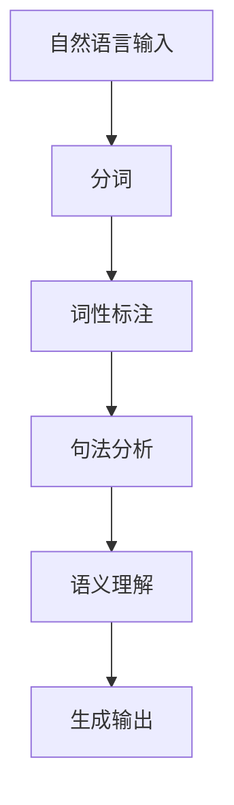
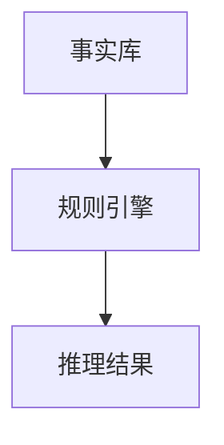
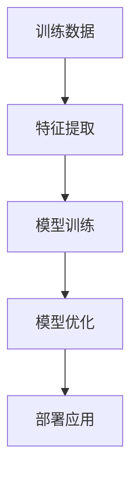
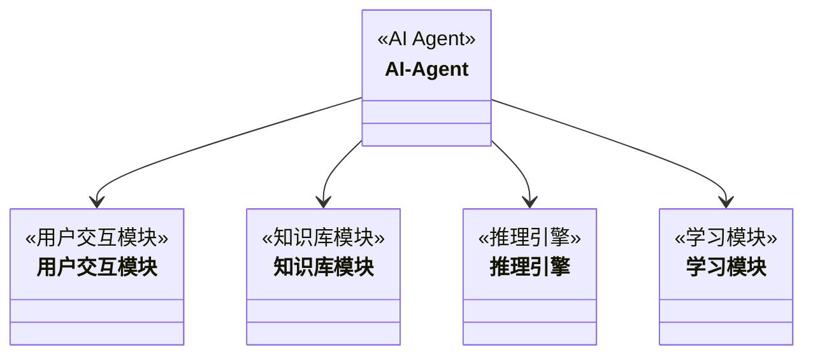
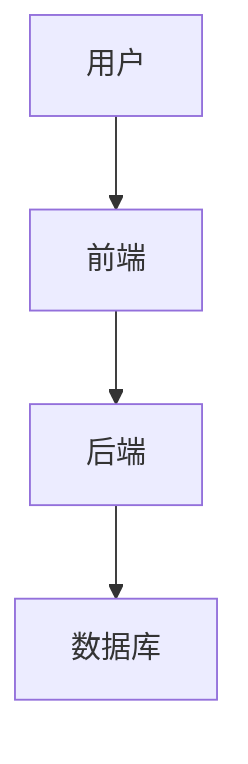
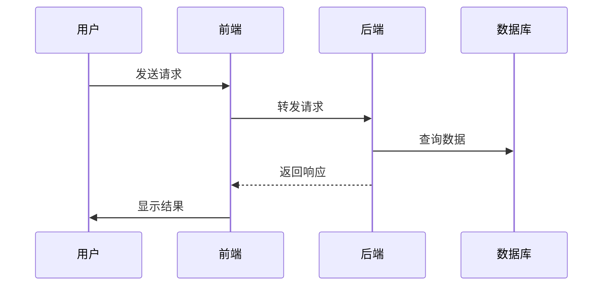

                 


# AI Agent在企业产品创新与概念验证中的角色定位

## 关键词：AI Agent，企业产品创新，概念验证，人工智能，软件架构，自然语言处理

## 摘要：本文深入探讨了AI Agent在企业产品创新与概念验证中的核心作用。从AI Agent的基本概念出发，分析了其在产品创新中的应用场景，详细阐述了其技术实现原理，包括算法模型和系统架构设计。通过实际案例，展示了AI Agent如何助力企业实现高效创新和概念验证，最后总结了最佳实践和未来发展趋势。

---

# 第一部分: AI Agent的基本概念与背景

## 第1章: AI Agent的定义与核心能力

### 1.1 AI Agent的定义
AI Agent（人工智能代理）是一种能够感知环境并采取行动以实现特定目标的智能实体。它结合了自然语言处理、知识推理和机器学习等多种技术，具备自主决策和问题解决的能力。

#### AI Agent的核心属性
- **自主性**：能够独立决策和行动。
- **反应性**：能够实时感知环境并做出反应。
- **目标导向性**：以实现特定目标为导向。

### 1.2 AI Agent的类型与应用场景
AI Agent可以根据功能和应用场景分为以下几类：

| 类型                | 描述                                | 应用场景                              |
|---------------------|------------------------------------|---------------------------------------|
| 基于规则的AI Agent  | 基于预定义的规则进行决策和行动      | 流程自动化、简单任务处理              |
| 基于模型的AI Agent  | 使用数学模型进行推理和预测          | 复杂问题解决、数据分析                |
| 基于学习的AI Agent  | 通过机器学习模型进行自适应和优化    | 自然语言处理、推荐系统                |

### 1.3 AI Agent的核心能力
AI Agent的核心能力包括：
1. **自然语言处理能力**：理解和生成人类语言。
2. **知识表示与推理能力**：处理和推理结构化知识。
3. **自适应与学习能力**：根据反馈优化行为。

### 1.4 AI Agent在企业中的定位
在企业中，AI Agent可以作为辅助工具、决策支持系统或创新催化剂，帮助企业在产品开发和概念验证中提高效率。

---

## 第2章: AI Agent在企业产品创新中的应用场景

### 2.1 产品创新的核心挑战
产品创新面临的挑战包括市场需求不确定性、创新过程复杂性和资源分配优化问题。

### 2.2 AI Agent在产品创新中的具体应用
1. **市场趋势预测**：通过分析市场数据预测未来趋势。
2. **用户需求挖掘**：识别用户的隐性需求。
3. **创意生成与评估**：生成产品概念并评估其可行性。

### 2.3 AI Agent在概念验证中的作用
1. **概念验证的定义与流程**：通过小规模测试验证概念的可行性。
2. **AI Agent的优势**：快速迭代和优化，降低验证成本。

---

# 第二部分: AI Agent的技术实现原理

## 第3章: AI Agent的核心算法与实现

### 3.1 自然语言处理算法
自然语言处理（NLP）是AI Agent实现人机交互的核心技术。

#### NLP处理流程


### 3.2 知识表示与推理算法
知识表示通常采用图结构，推理过程基于规则或机器学习模型。

#### 知识推理流程


### 3.3 基于机器学习的自适应算法
机器学习模型通过训练数据不断优化AI Agent的行为。

#### 机器学习训练流程


---

## 第4章: AI Agent的系统架构设计

### 4.1 系统功能设计
系统功能包括用户交互、知识库管理、推理引擎和学习模块。

#### 系统功能模块图


### 4.2 系统架构设计
系统架构采用分层设计，包括前端、后端和数据层。

#### 系统架构图


### 4.3 接口设计与交互
系统接口采用RESTful API设计，交互流程包括请求接收、处理和反馈。

#### 交互序列图


---

## 第5章: AI Agent的项目实战

### 5.1 环境安装与配置
安装Python、TensorFlow和spaCy等依赖库，配置开发环境。

### 5.2 核心代码实现
实现自然语言处理和知识推理的核心功能。

#### 核心代码示例
```python
import tensorflow as tf
from tensorflow.keras import layers

# 定义模型
model = tf.keras.Sequential([
    layers.Embedding(input_dim=10000, output_dim=16),
    layers.SimpleRNN(units=32),
    layers.Dense(1, activation='sigmoid')
])

# 编译模型
model.compile(optimizer='adam', loss='binary_crossentropy', metrics=['accuracy'])
```

### 5.3 案例分析与优化
通过实际案例分析优化模型性能，提升用户体验。

---

## 第6章: 最佳实践与未来展望

### 6.1 最佳实践
1. **数据质量**：确保训练数据的多样性和准确性。
2. **模型优化**：定期更新模型以适应新数据。
3. **用户反馈**：根据用户反馈持续改进系统。

### 6.2 未来展望
AI Agent将更加智能化，具备更强的自适应能力和跨领域应用潜力。

---

## 第7章: 总结与展望

### 7.1 总结
本文全面探讨了AI Agent在企业产品创新和概念验证中的角色，分析了其技术实现和应用场景。

### 7.2 展望
未来，AI Agent将在企业创新中发挥更大作用，推动智能化转型。

---

通过以上内容，您可以根据需求进一步扩展和补充具体细节，确保文章的完整性和深度。

