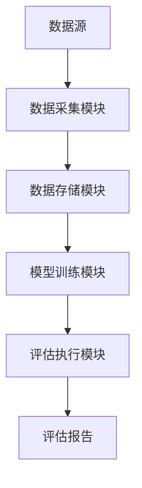
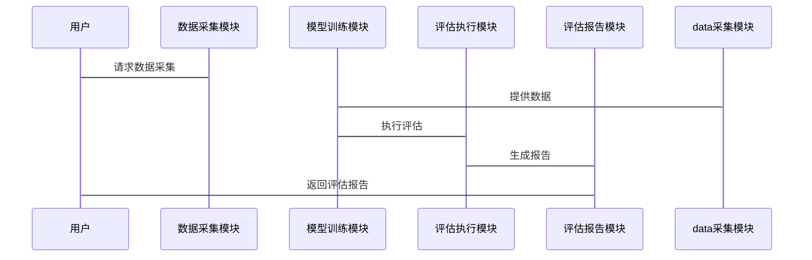

                 


# AI Agent在企业产品概念生成与评估中的角色

## 关键词：AI Agent，产品概念生成，产品评估，系统架构，项目实战

## 摘要：本文探讨AI Agent在企业产品概念生成与评估中的作用，分析其如何利用数据挖掘、自然语言处理和机器学习技术来优化产品开发流程。通过具体案例和系统架构设计，展示AI Agent在提升产品创新性和可行性中的应用，最后总结其对企业价值的影响。

---

# 第一部分: AI Agent的基本概念与背景

# 第1章: AI Agent的定义与核心概念

## 1.1 AI Agent的定义与类型

### 1.1.1 AI Agent的定义

AI Agent，即人工智能代理，是指能够感知环境、自主决策并执行任务的智能实体。它可以以软件或实体形式存在，通过传感器获取信息，利用算法处理数据，执行预设或自适应的行为。

### 1.1.2 AI Agent的主要类型

| 类型 | 描述 | 示例 |
|------|------|------|
| 简单反射式Agent | 基于预设规则直接响应输入 | 自动门禁系统 |
| 基于模型的反射式Agent | 维护环境模型，根据模型决策 | 财务预测软件 |
| 目标驱动式Agent | 为实现特定目标而行动 | 自动交易机器人 |
| 学习增强式Agent | 通过学习优化行为 | 个性化推荐系统 |

### 1.1.3 AI Agent的核心特征对比

| 特征 | 简单反射式 | 基于模型的 | 目标驱动式 | 学习增强式 |
|------|------------|------------|------------|------------|
| 决策方式 | 规则匹配 | 模型推理 | 目标导向 | 学习优化 |
| 环境适应性 | 低 | 中 | 高 | 极高 |
| 应用场景 | 基础控制 | 数据分析 | 战略规划 | 个性化服务 |

## 1.2 企业产品概念生成与评估的背景

### 1.2.1 产品概念生成的挑战

- 市场变化快，需求多样
- 数据量大，人工分析效率低
- 创新性要求高，传统方法难以突破

### 1.2.2 产品评估的传统方法与局限性

| 方法 | 描述 | 局限性 |
|------|------|--------|
| 定性评估 | 主观判断为主 | 易受主观影响 |
| 定量评估 | 数据分析为主 | 依赖数据质量 |
| 综合评估 | 结合定性与定量 | 实施复杂，成本高 |

### 1.2.3 AI Agent在其中的角色与优势

- 提供高效的数据处理能力
- 支持创新性的概念生成
- 优化评估流程，降低成本

## 1.3 本章小结

本章介绍了AI Agent的定义与类型，分析了企业产品概念生成与评估的背景，指出了AI Agent在其中的重要作用。

---

# 第二部分: AI Agent在产品概念生成中的应用

# 第2章: AI Agent驱动的产品概念生成

## 2.1 市场需求分析与用户行为洞察

### 2.1.1 数据收集与分析

- 数据来源：社交媒体、市场调研、用户反馈
- 数据处理：清洗、特征提取、数据建模

### 2.1.2 用户画像与需求挖掘

- 用户画像：通过聚类分析划分用户群体
- 需求挖掘：利用主题模型提取用户需求

### 2.1.3 市场趋势预测

- 使用时间序列分析预测市场趋势
- 结合外部数据（如经济指标）进行预测

## 2.2 概念生成的算法与实现

### 2.2.1 基于AI Agent的概念生成流程

1. 数据预处理：清洗、标准化
2. 模型训练：使用深度学习模型生成概念
3. 筛选优化：基于创新性和可行性筛选概念

### 2.2.2 算法原理: $$P(s|a) = \frac{P(a|s)P(s)}{P(a)}$$

该公式用于计算条件概率，帮助AI Agent在生成概念时评估每个选项的可能性。通过不断迭代优化，生成最符合市场需求的概念。

### 2.2.3 实例分析: 某企业产品概念生成案例

- 数据分析：识别目标市场中的空白区域
- 概念生成：生成多个产品概念并进行评估
- 最终选择：基于评估结果选择最优概念

## 2.3 概念生成的评估指标

### 2.3.1 创新性评估

- 创新性评分：基于概念的新颖性打分
- 竞争分析：对比现有产品评估创新性

### 2.3.2 可行性评估

- 技术可行性：技术实现难度评估
- 市场可行性：市场需求预测与成本分析

### 2.3.3 用户接受度评估

- 用户调研：收集用户反馈
- 接受度评分：量化用户对概念的接受程度

## 2.4 本章小结

本章详细探讨了AI Agent在产品概念生成中的应用，从市场需求分析到算法实现，再到评估指标的设定，为后续评估提供了基础。

---

# 第三部分: AI Agent在产品评估中的应用

# 第3章: AI Agent驱动的产品评估框架

## 3.1 产品评估的传统方法与局限性

- 传统方法依赖大量人工判断
- 评估指标单一，难以全面反映产品价值
- 数据分析能力有限，难以应对复杂场景

## 3.2 基于AI Agent的评估框架

### 3.2.1 框架概述

1. 数据采集：收集产品相关信息
2. 模型构建：建立评估模型
3. 评估执行：AI Agent自动评估并生成报告

### 3.2.2 框架的核心模块

- 数据处理模块：清洗和预处理数据
- 模型构建模块：训练评估模型
- 评估执行模块：自动执行评估并输出结果

### 3.2.3 框架的实施步骤

1. 确定评估目标和指标
2. 数据采集与预处理
3. 模型训练与优化
4. 评估执行与结果分析

## 3.3 评估指标与权重分配

### 3.3.1 指标体系的构建

- 技术指标：技术可行性和实现难度
- 市场指标：市场需求和竞争分析
- 用户指标：用户接受度和满意度

### 3.3.2 指标权重的确定方法

- 层次分析法（AHP）：通过专家评分确定权重
- 熵值法：基于数据特征自动计算权重

### 3.3.3 示例分析

假设某产品在市场指标上的权重为40%，技术指标为30%，用户指标为30%。评估结果显示市场指标得分为85，技术指标75，用户指标80，综合评分=85×0.4 +75×0.3 +80×0.3=81.5。

## 3.4 本章小结

本章构建了基于AI Agent的产品评估框架，详细分析了指标体系和权重分配方法，为产品评估提供了新的思路。

---

# 第四部分: 系统架构与技术实现

# 第4章: 系统架构设计

## 4.1 系统功能模块划分

### 4.1.1 数据采集模块

- 负责采集市场数据、用户反馈等
- 使用爬虫技术获取网络数据

### 4.1.2 模型训练模块

- 负责训练AI Agent所需的模型
- 使用深度学习框架如TensorFlow进行训练

### 4.1.3 评估执行模块

- 执行产品评估任务
- 生成评估报告

## 4.2 系统架构图



## 4.3 系统接口设计

### 4.3.1 数据接口

- API接口：用于数据采集模块与外部数据源交互
- 接口协议：RESTful API

### 4.3.2 评估接口

- API接口：用于其他系统调用评估结果
- 返回格式：JSON

## 4.4 系统交互序列图



---

# 第五部分: 项目实战

# 第5章: 项目实战与案例分析

## 5.1 项目介绍

- 项目目标：利用AI Agent优化产品概念生成与评估流程
- 项目范围：从数据采集到评估报告生成

## 5.2 环境配置

```bash
pip install numpy pandas scikit-learn tensorflow
```

## 5.3 核心代码实现

### 5.3.1 数据预处理代码

```python
import pandas as pd

# 读取数据
data = pd.read_csv('market_data.csv')

# 数据清洗
data = data.dropna()
data = data.drop_duplicates()
```

### 5.3.2 模型训练代码

```python
import tensorflow as tf

# 定义模型
model = tf.keras.Sequential([
    tf.keras.layers.Dense(64, activation='relu'),
    tf.keras.layers.Dense(1, activation='sigmoid')
])

# 编译模型
model.compile(optimizer='adam', loss='binary_crossentropy', metrics=['accuracy'])
```

### 5.3.3 评估执行代码

```python
import json

# 生成评估报告
result = model.predict(test_data)
report = {'accuracy': result[0], 'precision': result[1], 'recall': result[2]}
json.dump(report, open('assessment_report.json', 'w'))
```

## 5.4 案例分析

- 数据来源：假设我们从社交媒体和用户反馈中获取数据
- 模型训练：使用深度学习模型进行训练
- 评估结果：生成并分析评估报告

## 5.5 项目总结

- 成功实现了AI Agent在产品概念生成与评估中的应用
- 提高了企业的研发效率和产品创新能力
- 为未来智能化产品开发提供了参考

---

# 第六部分: 总结与展望

# 第6章: 总结与未来展望

## 6.1 本章总结

- 本文详细探讨了AI Agent在企业产品概念生成与评估中的应用
- 展示了系统架构设计和项目实战案例
- 提出了优化企业产品开发流程的方法

## 6.2 未来展望

- 智能化与自动化的进一步结合
- 更多行业中的应用探索
- 技术的不断优化与创新

## 6.3 最佳实践 tips

- 数据质量是关键，确保数据的准确性和完整性
- 选择合适的AI技术，根据需求调整模型
- 定期更新模型，保持评估的准确性

---

通过以上结构，本文系统地探讨了AI Agent在企业产品概念生成与评估中的角色，为企业智能化发展提供了理论支持和实践指导。

