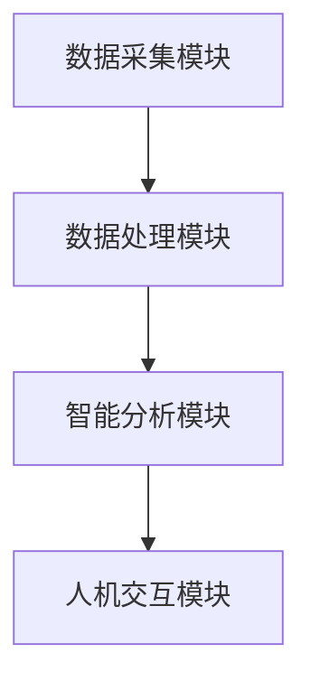
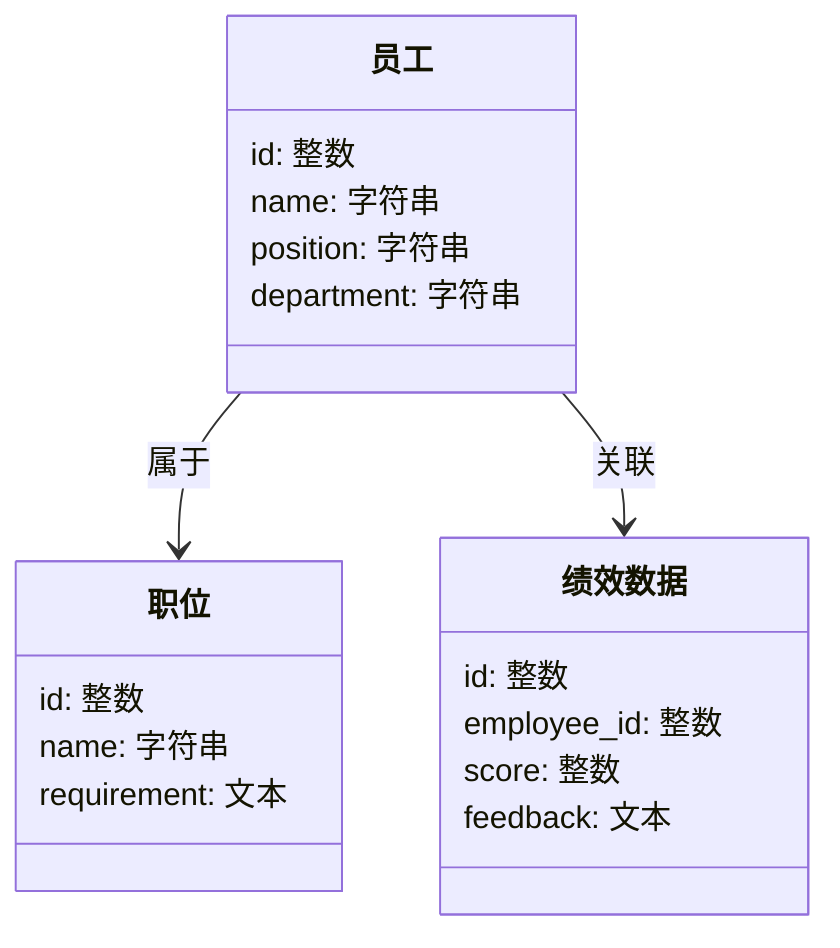
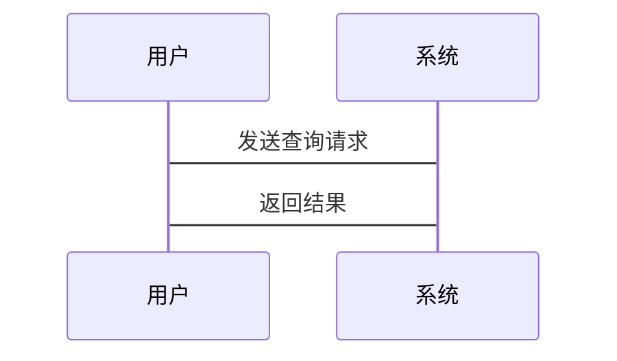

                 


# AI Agent在企业人力资源管理中的创新应用

> **关键词**：AI Agent，企业，人力资源管理，创新应用，数字化转型

> **摘要**：本文探讨了AI Agent在企业人力资源管理中的创新应用，分析了AI Agent的核心技术、系统架构与设计，以及在招聘、培训、绩效管理等环节的具体应用场景。通过案例分析和系统设计，本文详细展示了AI Agent如何助力企业实现人力资源管理的数字化转型，提升管理效率和决策能力。

---

## 第1章 AI Agent与企业人力资源管理概述

### 1.1 AI Agent的基本概念

AI Agent（人工智能代理）是一种能够感知环境并采取行动以实现目标的智能实体。它通过与环境交互，利用传感器获取信息，并通过执行器采取行动。AI Agent的核心特征包括自主性、反应性、目标导向性和社交能力。

#### AI Agent的核心特征
1. **自主性**：AI Agent能够在没有外部干预的情况下独立运作。
2. **反应性**：能够实时感知环境变化并做出相应反应。
3. **目标导向性**：以预设目标为导向，采取最优行动。
4. **社交能力**：能够与其他系统或人类进行有效交互。

### 1.2 AI Agent在企业管理中的作用

AI Agent在企业管理中的作用主要体现在以下几个方面：

1. **数据处理与分析**：通过机器学习算法，AI Agent能够快速处理大量数据，提取有价值的信息，辅助决策。
2. **自动化操作**：在企业日常运营中，AI Agent可以自动完成重复性任务，如邮件分发、日历管理等。
3. **智能交互**：通过自然语言处理技术，AI Agent能够与人类进行流畅的对话，提供实时支持。

### 1.3 企业人力资源管理的数字化转型

企业人力资源管理的数字化转型是通过技术手段优化管理流程、提升效率的过程。AI Agent在这一过程中扮演着关键角色，它能够帮助HR部门实现招聘、培训、绩效管理等环节的智能化。

#### 数字化转型的背景与趋势
1. **技术驱动**：人工智能、大数据等技术的发展为企业提供了强大的技术支持。
2. **效率提升**：数字化转型能够显著提高企业运营效率，降低成本。
3. **创新驱动**：数字化转型为企业带来了新的商业模式和竞争优势。

---

## 第2章 AI Agent的核心技术与算法原理

### 2.1 自然语言处理（NLP）技术

自然语言处理技术是AI Agent实现人机交互的基础。NLP通过理解人类语言，使AI Agent能够与用户进行自然对话。

#### NLP的核心算法
1. **词袋模型（Bag of Words）**：将文本表示为词汇的集合，忽略词序。
2. **TF-IDF（词频-逆文档频率）**：用于衡量词语在文本中的重要性。
3. **神经网络语言模型（NNLM）**：通过神经网络建模语言结构。

#### NLP在HR管理中的应用
- **简历筛选**：通过NLP技术自动分析简历内容，匹配职位要求。
- **员工反馈分析**：分析员工满意度调查，识别问题点。

### 2.2 机器学习与深度学习

机器学习和深度学习是AI Agent实现智能决策的核心技术。通过训练模型，AI Agent能够从数据中学习规律，并做出预测或分类。

#### 机器学习的核心算法
1. **线性回归**：用于预测连续型变量。
2. **支持向量机（SVM）**：用于分类问题。
3. **随机森林**：用于分类和回归问题。

#### 深度学习的核心算法
1. **卷积神经网络（CNN）**：常用于图像识别任务。
2. **循环神经网络（RNN）**：用于处理序列数据，如时间序列。
3. **长短期记忆网络（LSTM）**：用于处理长序列数据。

### 2.3 知识图谱与语义理解

知识图谱是一种结构化的知识表示形式，能够帮助AI Agent更好地理解上下文。

#### 知识图谱的核心特征
1. **实体与关系**：知识图谱由实体和关系组成，描述了实体之间的关联。
2. **语义理解**：通过知识图谱，AI Agent能够理解文本的深层含义。

#### 知识图谱在HR管理中的应用
- **职位匹配**：通过知识图谱分析职位需求和候选人技能，实现精准匹配。
- **组织架构优化**：通过分析组织架构，识别潜在问题并提出优化建议。

---

## 第3章 AI Agent在企业人力资源管理中的系统架构与设计

### 3.1 系统整体架构

AI Agent在企业人力资源管理中的系统架构通常包括以下几个模块：

1. **数据采集模块**：负责采集企业内部数据，如员工信息、绩效数据等。
2. **数据处理模块**：对采集的数据进行清洗、转换和存储。
3. **智能分析模块**：利用机器学习和深度学习算法对数据进行分析，生成决策支持。
4. **人机交互模块**：通过自然语言处理技术与用户进行交互，提供实时支持。

#### 系统架构图（Mermaid）


### 3.2 系统功能设计

系统功能设计需要考虑以下几个方面：

1. **领域模型设计**：通过类图描述系统中的实体及其关系。
2. **功能流程设计**：通过流程图描述系统的功能流程。

#### 领域模型设计（Mermaid类图）


### 3.3 系统接口设计

系统接口设计需要考虑以下几个方面：

1. **API接口设计**：定义系统的输入输出接口。
2. **接口交互流程图**：通过序列图描述接口的交互流程。

#### 接口交互流程图（Mermaid序列图）


---

## 第4章 AI Agent在企业人力资源管理中的项目实战

### 4.1 环境配置

项目实战需要以下环境配置：

1. **Python 3.8+**
2. **TensorFlow 2.0+**
3. **NLTK库**
4. **Spacy库**
5. **Flask框架**

### 4.2 核心代码实现

以下是一个简单的AI Agent实现示例：

```python
import nltk
from nltk.chatbot import ChatBot
from nltk.chatbot.train import train

# 训练数据
training_data = [
    ("What is your name?", "My name is AI Agent."),
    ("What can you do?", "I can help with HR management.")
]

# 训练模型
bot = ChatBot("AI Agent")
train(bot, training_data)

# 交互示例
print("请输入问题：")
while True:
    query = input()
    if query == "exit":
        break
    response = bot.get_response(query)
    print(response)
```

### 4.3 案例分析与详细解读

以招聘环节为例，AI Agent可以通过以下步骤实现自动化招聘：

1. **职位描述分析**：AI Agent自动分析职位描述，提取关键技能和要求。
2. **简历筛选**：通过NLP技术自动筛选简历，匹配职位要求。
3. **候选人推荐**：根据匹配度推荐候选人，并生成推荐报告。

---

## 第5章 总结与展望

### 5.1 总结

本文详细探讨了AI Agent在企业人力资源管理中的创新应用，分析了AI Agent的核心技术与系统架构，并通过具体案例展示了AI Agent在招聘、培训、绩效管理等环节的应用场景。

### 5.2 展望

未来，AI Agent在企业人力资源管理中的应用将更加广泛。随着技术的不断发展，AI Agent将具备更强的智能性和适应性，为企业提供更加精准和高效的管理支持。

---

### 最佳实践 Tips

1. 在实际应用中，建议结合企业实际情况，选择合适的AI Agent解决方案。
2. 数据安全和隐私保护是AI Agent应用中的重要问题，需引起高度重视。
3. 定期更新AI Agent模型，以适应不断变化的业务需求。

---

### 参考文献

1. 刘军, 等. 《人工智能在企业管理中的应用》. 北京: 清华大学出版社, 2020.
2. 张伟, 等. 《深度学习与自然语言处理》. 北京: 人民邮电出版社, 2019.

---

通过本文的分析与实践，我们可以看到AI Agent在企业人力资源管理中的巨大潜力。未来，随着技术的不断进步，AI Agent将为企业带来更多创新和突破，推动企业管理走向更加智能化和高效化的方向。

