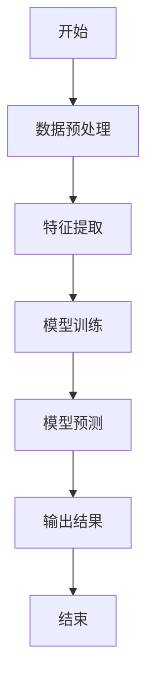
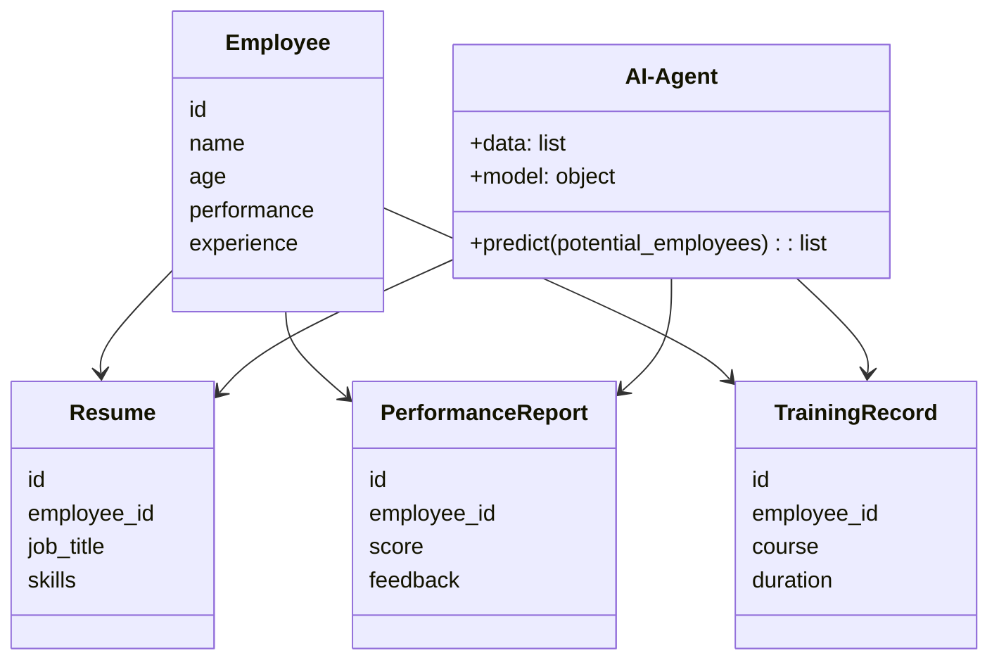

                 


# AI Agent在企业人才发展与继任计划中的应用

> 关键词：AI Agent，企业人才发展，继任计划，机器学习，自然语言处理，系统架构

> 摘要：本文探讨了AI Agent在企业人才发展与继任计划中的应用，详细介绍了AI Agent的核心概念、技术原理、系统架构以及在实际项目中的应用。通过分析AI Agent如何利用数据驱动、自动化和智能化的方法优化企业的人才管理流程，本文展示了如何利用AI技术提升继任计划的科学性和效率。

---

# 第一部分: AI Agent 在企业人才发展与继任计划中的应用概述

## 第1章: AI Agent 的基本概念与背景介绍

### 1.1 AI Agent 的核心概念

#### 1.1.1 什么是AI Agent
AI Agent（人工智能代理）是指能够感知环境、执行任务并做出决策的智能系统。它可以理解为一种能够自主或协助人类完成特定任务的软件或实体。

#### 1.1.2 AI Agent 的基本特征
- **自主性**：能够在没有人工干预的情况下执行任务。
- **反应性**：能够根据环境变化调整行为。
- **目标导向**：具有明确的目标，能够优化决策以实现目标。
- **学习能力**：能够通过数据和经验不断优化自身性能。

#### 1.1.3 AI Agent 的分类与应用场景
AI Agent 可以分为多种类型，如基于规则的Agent、基于模型的Agent、基于学习的Agent等。其应用场景广泛，包括智能助手、自动化交易、智能推荐、智能客服等。

### 1.2 企业人才发展与继任计划的背景

#### 1.2.1 传统企业人才管理的痛点
- 人才选拔的主观性和片面性。
- 继任计划的不确定性。
- 培训与发展缺乏个性化和数据支持。

#### 1.2.2 继任计划的重要性
继任计划是确保企业长期发展的关键，通过科学的方法选拔和培养接班人，降低管理风险。

#### 1.2.3 数字化人才管理的趋势
随着技术的发展，企业越来越依赖数据驱动的方法进行人才管理，AI Agent 在其中扮演了重要角色。

---

## 第2章: AI Agent 在企业人才管理中的核心价值

### 2.1 AI Agent 的技术优势

#### 2.1.1 数据驱动的决策能力
AI Agent 可以通过分析大量数据，提供客观、科学的决策支持。

#### 2.1.2 自动化与智能化的结合
AI Agent 可以自动化处理招聘、培训、绩效管理等流程，提升效率。

#### 2.1.3 实时反馈与优化能力
AI Agent 可以实时监控员工表现，并根据反馈优化管理策略。

### 2.2 AI Agent 在人才管理中的应用场景

#### 2.2.1 招聘与筛选
AI Agent 可以通过简历筛选、面试安排等自动化流程，提高招聘效率。

#### 2.2.2 培训与发展
AI Agent 可以根据员工的技能缺口，推荐个性化的培训方案。

#### 2.2.3 绩效管理
AI Agent 可以实时分析员工绩效数据，提供数据支持的反馈。

#### 2.2.4 继任计划优化
AI Agent 可以基于员工能力和潜力，制定科学的继任计划。

---

## 第3章: AI Agent 的技术原理与算法基础

### 3.1 AI Agent 的核心算法

#### 3.1.1 机器学习算法
机器学习算法是AI Agent 的核心，常用的包括线性回归、决策树、支持向量机、随机森林等。

#### 3.1.2 自然语言处理技术
自然语言处理技术（NLP）用于理解员工的文本数据，如简历、绩效报告等。

#### 3.1.3 强化学习机制
强化学习用于优化AI Agent 的决策过程，通过奖励机制不断改进策略。

### 3.2 AI Agent 的数学模型

#### 3.2.1 状态空间与动作空间
AI Agent 的状态空间包括环境中的所有可能状态，动作空间是AI Agent 可以执行的所有动作。

#### 3.2.2 Q-Learning 算法
Q-Learning 是一种强化学习算法，通过更新Q值表来优化决策。

$$ Q(s, a) = Q(s, a) + \alpha [r + \gamma \max Q(s', a') - Q(s, a)] $$

其中：
- $Q(s, a)$：当前状态 $s$ 下执行动作 $a$ 的价值。
- $\alpha$：学习率。
- $r$：奖励。
- $\gamma$：折扣因子。
- $s'$：下一个状态。

#### 3.2.3 模型的训练与优化
模型的训练过程包括数据预处理、特征提取、模型训练、验证和优化。

---

## 第4章: AI Agent 的系统架构与设计

### 4.1 系统架构概述

#### 4.1.1 分层架构
分层架构将系统分为数据层、业务逻辑层和用户界面层，便于模块化开发。

#### 4.1.2 微服务架构
微服务架构将系统功能分解为独立的服务，每个服务负责特定的功能，如招聘、培训、绩效管理等。

#### 4.1.3 数据流与交互流程
数据流从用户输入开始，经过处理、分析，最终输出结果。

### 4.2 系统功能设计

#### 4.2.1 数据采集与处理
数据采集包括简历、绩效报告等，数据处理包括清洗、特征提取。

#### 4.2.2 模型训练与部署
模型训练基于机器学习算法，部署到生产环境。

#### 4.2.3 用户交互界面
用户可以通过网页或移动应用与AI Agent 进行交互。

---

## 第5章: AI Agent 在继任计划中的系统实现

### 5.1 继任计划系统的需求分析

#### 5.1.1 项目背景
随着企业的发展，人才选拔和继任计划变得越来越重要。

#### 5.1.2 项目目标
开发一个基于AI Agent 的继任计划系统，优化企业的人才管理流程。

#### 5.1.3 项目范围
包括招聘、培训、绩效管理、继任计划等模块。

### 5.2 系统功能模块设计

#### 5.2.1 数据分析模块
通过机器学习算法分析员工数据，识别高潜力员工。

#### 5.2.2 模型预测模块
基于强化学习算法，预测员工的未来发展潜力。

#### 5.2.3 报告生成模块
生成继任计划报告，包括职位空缺、候选名单、培训建议等。

---

## 第6章: 项目实战——AI Agent 在企业继任计划中的应用

### 6.1 项目背景与目标

#### 6.1.1 项目背景
某跨国公司希望通过AI Agent 优化其继任计划。

#### 6.1.2 项目目标
开发一个基于AI Agent 的继任计划系统，提升选拔效率和准确性。

### 6.2 项目实施步骤

#### 6.2.1 数据收集与预处理
收集员工简历、绩效报告、培训记录等数据，清洗和特征提取。

#### 6.2.2 模型训练
基于机器学习算法训练模型，预测员工的潜力和适合性。

#### 6.2.3 系统部署与测试
将模型部署到生产环境，进行测试和优化。

#### 6.2.4 用户反馈与优化
根据用户反馈，不断优化系统功能和性能。

### 6.3 系统实现细节

#### 6.3.1 数据分析模块实现
使用Python的pandas库进行数据清洗和特征提取。

```python
import pandas as pd

# 读取数据
data = pd.read_csv('employee_data.csv')

# 数据清洗
data.dropna(inplace=True)
data['age'] = data['age'].fillna(data['age'].mean())

# 特征提取
data['potential'] = data['performance'] * 0.3 + data['experience'] * 0.7
```

#### 6.3.2 模型预测模块实现
使用Scikit-learn库训练随机森林模型，预测员工潜力。

```python
from sklearn.ensemble import RandomForestRegressor

# 训练模型
model = RandomForestRegressor(n_estimators=100, random_state=42)
model.fit(X_train, y_train)

# 预测
y_pred = model.predict(X_test)
```

#### 6.3.3 报告生成模块实现
生成继任计划报告，包括高潜力员工名单和培训建议。

---

## 第7章: 总结与展望

### 7.1 总结
本文详细介绍了AI Agent 在企业人才发展与继任计划中的应用，包括技术原理、系统设计和项目实战。

### 7.2 展望
未来，随着AI技术的不断发展，AI Agent 在企业人才管理中的应用将更加广泛和深入。

---

### 附录

#### 附录A: 算法流程图



#### 附录B: 系统架构图



---

### 参考文献

1. Russell, S., & Norvig, P. (2010). Artificial Intelligence: A Modern Approach.
2. Goodfellow, I., Bengio, Y., & Courville, A. (2016). Deep Learning.

