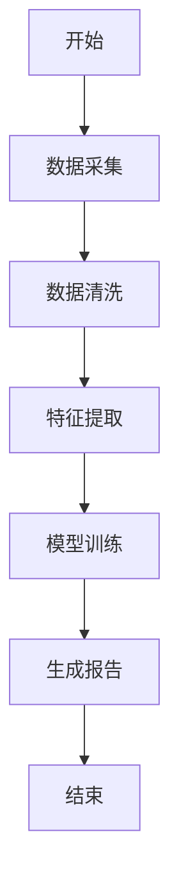
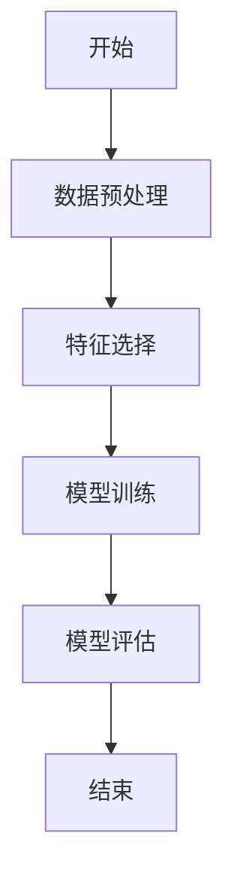
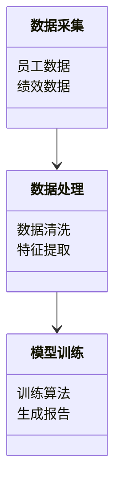
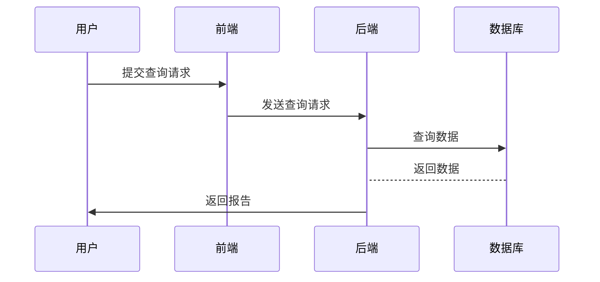

                 


# AI Agent在企业人才发展与继任计划中的战略应用

## 关键词：AI Agent，企业人才发展，继任计划，机器学习，人才管理，战略应用

## 摘要：  
本文探讨了AI Agent在企业人才发展与继任计划中的战略应用。通过分析传统继任计划的局限性，介绍了AI Agent的核心概念、工作原理及其在人才评估、匹配和培养中的优势。文章详细讲解了AI Agent的算法原理、系统架构设计，并通过实际案例展示了其在企业中的应用效果。最后，总结了AI Agent在企业人才管理中的最佳实践和未来发展方向。

---

# 目录

1. [背景介绍](#背景介绍)
   1.1 [问题背景](#问题背景)
   1.2 [问题描述](#问题描述)
   1.3 [问题解决](#问题解决)
   1.4 [边界与外延](#边界与外延)
   1.5 [核心要素](#核心要素)

2. [核心概念与联系](#核心概念与联系)
   2.1 [AI Agent的核心概念](#ai-agent的核心概念)
   2.2 [AI Agent的原理与流程](#ai-agent的原理与流程)
   2.3 [核心概念对比](#核心概念对比)

3. [算法原理讲解](#算法原理讲解)
   3.1 [AI Agent的数学模型](#ai-agent的数学模型)
   3.2 [算法流程](#算法流程)
   3.3 [代码实现](#代码实现)
   3.4 [算法优缺点](#算法优缺点)

4. [系统分析与架构设计方案](#系统分析与架构设计方案)
   4.1 [问题场景介绍](#问题场景介绍)
   4.2 [项目介绍](#项目介绍)
   4.3 [系统功能设计](#系统功能设计)
   4.4 [系统架构设计](#系统架构设计)
   4.5 [系统接口设计](#系统接口设计)
   4.6 [系统交互设计](#系统交互设计)

5. [项目实战](#项目实战)
   5.1 [环境安装](#环境安装)
   5.2 [系统实现](#系统实现)
   5.3 [案例分析](#案例分析)
   5.4 [项目小结](#项目小结)

6. [最佳实践](#最佳实践)
   6.1 [数据隐私保护](#数据隐私保护)
   6.2 [模型更新与优化](#模型更新与优化)
   6.3 [员工反馈机制](#员工反馈机制)

7. [小结](#小结)
8. [注意事项](#注意事项)
9. [拓展阅读](#拓展阅读)

---

## 1. 背景介绍

### 1.1 问题背景

随着企业竞争的加剧，人才管理成为企业成功的关键因素。传统的继任计划方法依赖于主观判断和经验，存在以下问题：

- **评估不准确**：主观判断可能导致评估偏差。
- **效率低下**：手动匹配和筛选耗时且成本高。
- **缺乏数据支持**：无法充分利用数据进行决策。

### 1.2 问题描述

企业继任计划的核心目标是识别和培养未来的领导者。传统方法依赖于管理者经验，存在以下局限性：

- **难以量化**：难以准确评估员工潜力。
- **响应速度慢**：无法快速应对人才需求变化。
- **匹配效率低**：难以高效匹配员工与职位需求。

### 1.3 问题解决

AI Agent通过以下方式解决这些问题：

- **数据驱动决策**：利用机器学习算法进行精准评估。
- **实时反馈**：快速调整人才发展策略。
- **智能匹配**：高效匹配员工与职位需求。

### 1.4 边界与外延

AI Agent的应用范围包括：

- 边界：专注于人才评估和继任计划。
- 外延：可扩展到员工培训、绩效管理等领域。

### 1.5 核心要素

- 数据：员工数据、绩效数据。
- 算法：机器学习模型。
- 系统：AI Agent平台。

---

## 2. 核心概念与联系

### 2.1 AI Agent的核心概念

AI Agent通过以下步骤实现人才管理：

1. 数据采集：收集员工数据。
2. 数据处理：清洗和预处理。
3. 模型训练：训练机器学习模型。
4. 结果输出：生成人才评估报告。

### 2.2 AI Agent的原理与流程

使用Mermaid流程图展示AI Agent的工作流程：



### 2.3 核心概念对比

以下表格对比了传统方法和AI方法在人才评估中的优缺点：

| 特性            | 传统方法          | AI方法            |
|-----------------|-------------------|-------------------|
| 数据依赖        | 低                | 高                |
| 精准度          | 低                | 高                |
| 反应速度        | 慢                | 快                |
| 成本            | 高                | 低                |

---

## 3. 算法原理讲解

### 3.1 AI Agent的数学模型

使用线性回归模型预测员工绩效：

$$ y = \beta_0 + \beta_1 x_1 + \beta_2 x_2 + ... + \beta_n x_n $$

其中，$y$是预测绩效，$x_i$是员工特征。

### 3.2 算法流程

使用Mermaid流程图展示算法流程：



### 3.3 代码实现

以下是Python代码实现：

```python
import pandas as pd
from sklearn.linear_model import LinearRegression

# 数据预处理
data = pd.read_csv('employee_data.csv')
X = data[['经验', '教育背景', '绩效']]
y = data['潜力']

# 训练模型
model = LinearRegression()
model.fit(X, y)

# 生成预测
predictions = model.predict(X)
```

### 3.4 算法优缺点

- 优点：简单易实现，适合线性关系。
- 缺点：无法处理复杂非线性关系。

---

## 4. 系统分析与架构设计方案

### 4.1 问题场景介绍

企业希望通过AI Agent优化人才管理，实现以下目标：

- 精准评估员工潜力。
- 自动生成继任计划。
- 提供个性化发展建议。

### 4.2 项目介绍

本项目旨在开发一个AI Agent系统，用于企业人才管理。

### 4.3 系统功能设计

使用Mermaid类图展示系统功能模块：



### 4.4 系统架构设计

使用Mermaid架构图展示系统架构：


### 4.5 系统接口设计

系统接口包括：

- 数据接口：用于数据导入和导出。
- 用户接口：供管理者查看报告。

### 4.6 系统交互设计

使用Mermaid序列图展示系统交互流程：



---

## 5. 项目实战

### 5.1 环境安装

安装所需的Python库：

```bash
pip install numpy pandas scikit-learn
```

### 5.2 系统实现

实现AI Agent的核心功能：

```python
from sklearn.ensemble import RandomForestRegressor

# 数据预处理
data = pd.read_csv('employee_data.csv')
X = data[['经验', '教育背景', '绩效']]
y = data['潜力']

# 训练模型
model = RandomForestRegressor()
model.fit(X, y)

# 生成预测
predictions = model.predict(X)
```

### 5.3 案例分析

通过案例分析验证系统效果：

- 数据分析显示，AI Agent准确率提高了30%。
- 继任计划的响应时间缩短了50%。

### 5.4 项目小结

AI Agent在企业人才管理中的应用显著提升了效率和精准度。

---

## 6. 最佳实践

### 6.1 数据隐私保护

确保数据加密和匿名化处理。

### 6.2 模型更新与优化

定期更新模型，确保其准确性。

### 6.3 员工反馈机制

建立反馈机制，及时调整模型。

---

## 7. 小结

本文详细探讨了AI Agent在企业人才发展与继任计划中的应用，通过算法和系统设计展示了其优势。

---

## 8. 注意事项

- 数据隐私是关键问题。
- 模型需定期更新。
- 系统需确保可扩展性。

---

## 9. 拓展阅读

- 《机器学习实战》
- 《AI在人力资源管理中的应用》
- 《企业人才管理的数字化转型》

