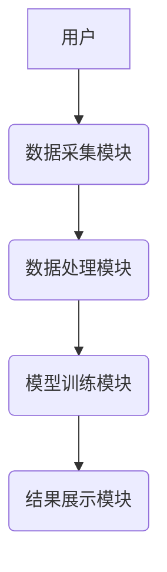

                 


# AI Agent在企业人才发展与继任计划制定中的应用

## 关键词：
AI Agent, 企业人才发展, 继任计划, 人工智能, 人才管理, 智能代理

## 摘要：
本文深入探讨AI Agent在企业人才发展与继任计划中的应用，分析其核心原理、技术实现及实际案例，为企业优化人才管理提供参考。

---

# 第1章: AI Agent 的核心概念与背景介绍

## 1.1 AI Agent 的基本概念

### 1.1.1 什么是AI Agent
AI Agent是一种智能代理，通过感知环境、执行任务和优化决策，帮助用户达成目标。它具备自主性、反应性、目标导向和社交能力等特点。

### 1.1.2 AI Agent 的核心特征
| 特征 | 描述 |
|------|------|
| 自主性 | 能够独立执行任务 |
| 反应性 | 根据环境反馈调整行为 |
| 目标导向 | 有明确的目标驱动 |
| 社交能力 | 能够与人类或其他系统交互 |

### 1.1.3 AI Agent 的工作原理
AI Agent的工作原理通常包括感知、决策和执行三个步骤：
1. **感知**：通过传感器或数据输入获取信息。
2. **决策**：基于感知信息，利用算法做出决策。
3. **执行**：通过执行器或输出模块实现决策。

## 1.2 企业人才发展与继任计划的背景

### 1.2.1 传统人才发展与继任计划的挑战
传统方法依赖主观判断，存在效率低、准确性差的问题。

### 1.2.2 数字化转型对企业人才管理的影响
数字化转型推动企业采用新技术优化人才管理流程。

### 1.2.3 AI Agent 在企业人才管理中的定位与作用
AI Agent通过数据驱动的方法，提高人才评估和继任计划的效率与准确性。

---

# 第2章: AI Agent 在企业人才管理中的核心应用

## 2.1 AI Agent 在人才评估中的应用

### 2.1.1 基于AI的员工能力评估
AI Agent分析员工的历史绩效和技能，提供客观评估。

### 2.1.2 AI Agent 在员工绩效分析中的作用
通过机器学习模型预测员工绩效，帮助企业优化资源分配。

### 2.1.3 AI Agent 在员工潜力预测中的应用
基于历史数据，AI Agent预测员工晋升潜力。

## 2.2 AI Agent 在人才培养中的应用

### 2.2.1 个性化学习路径的设计
AI Agent根据员工技能差距，推荐个性化学习计划。

### 2.2.2 基于AI的培训内容推荐
系统根据员工需求，实时推荐相关培训资源。

### 2.2.3 AI Agent 在员工技能提升中的反馈机制
通过实时反馈和评估，帮助员工快速提升技能。

## 2.3 AI Agent 在继任计划中的应用

### 2.3.1 基于AI的继任者识别
AI Agent分析员工能力和潜力，识别合适的继任者。

### 2.3.2 继任计划的动态调整
根据企业战略和员工发展情况，动态调整继任计划。

### 2.3.3 AI Agent 在领导力发展的支持作用
通过模拟决策场景，提升领导力。

---

# 第3章: AI Agent 在企业人才管理中的技术实现

## 3.1 AI Agent 的技术架构

### 3.1.1 数据采集与处理
AI Agent通过多种渠道收集员工数据，进行清洗和预处理。

### 3.1.2 模型训练与优化
使用机器学习算法训练模型，优化预测准确性。

### 3.1.3 系统集成与部署
将AI Agent集成到企业现有系统中，确保无缝运行。

## 3.2 AI Agent 的算法原理

### 3.2.1 机器学习算法选择
常用算法包括支持向量机（SVM）和随机森林（RF）。

### 3.2.2 深度学习模型的应用
使用神经网络模型处理复杂数据。

### 3.2.3 自然语言处理技术的实现
利用NLP技术分析员工反馈和报告。

## 3.3 AI Agent 的系统设计

### 3.3.1 系统功能模块划分
- 数据采集模块
- 模型训练模块
- 结果展示模块

### 3.3.2 系统架构设计
采用微服务架构，确保高扩展性和灵活性。

### 3.3.3 系统接口设计
定义清晰的API接口，便于与其他系统集成。

---

# 第4章: AI Agent 在企业人才管理中的系统实现

## 4.1 系统需求分析

### 4.1.1 业务需求分析
明确系统需要实现的功能和目标。

### 4.1.2 技术需求分析
确定系统的技术选型和架构设计。

### 4.1.3 用户需求分析
了解用户的真实需求，优化系统设计。

## 4.2 系统功能设计

### 4.2.1 人才评估模块
- 员工能力评估
- 绩效分析
- 潜力预测

### 4.2.2 人才培养模块
- 个性化学习路径
- 培训内容推荐
- 反馈机制

### 4.2.3 继任计划模块
- 继任者识别
- 动态调整
- 领导力发展

## 4.3 系统架构设计

### 4.3.1 系统架构图


---

# 第5章: AI Agent 在企业人才管理中的项目实战

## 5.1 项目背景介绍

### 5.1.1 项目介绍
介绍一个使用AI Agent优化继任计划的实际案例。

## 5.2 核心代码实现

### 5.2.1 数据处理代码
```python
import pandas as pd

def preprocess_data(data):
    # 数据清洗和预处理
    data = data.dropna()
    data = pd.get_dummies(data)
    return data
```

### 5.2.2 模型训练代码
```python
from sklearn.ensemble import RandomForestClassifier

def train_model(data, target):
    model = RandomForestClassifier()
    model.fit(data, target)
    return model
```

## 5.3 实际案例分析

### 5.3.1 案例介绍
某科技公司使用AI Agent优化继任计划，提升了领导层的准确率。

### 5.3.2 实施效果
- 提高了继任计划的准确性
- 优化了领导力发展路径
- 提升了员工满意度

---

# 第6章: AI Agent 在企业人才管理中的最佳实践与未来展望

## 6.1 最佳实践 tips

### 6.1.1 数据质量
确保数据的准确性和完整性。

### 6.1.2 模型优化
定期更新模型，保持预测准确性。

### 6.1.3 用户培训
对员工进行系统培训，确保正确使用。

## 6.2 小结
AI Agent在企业人才管理中的应用前景广阔，能够显著提升效率和准确性。

## 6.3 注意事项
- 数据隐私保护
- 系统稳定性保障
- 模型解释性要求

## 6.4 拓展阅读
推荐相关书籍和论文，供读者深入学习。

---

# 附录

## 附录A: 参考文献
列出文章中引用的书籍和论文。

## 附录B: 工具与资源
推荐相关工具和资源，供读者参考。

---

通过以上结构，您可以逐步深入地撰写这篇文章，确保内容全面且逻辑清晰。

