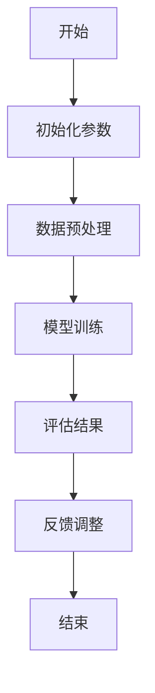
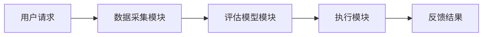

                 


# AI Agent在企业供应商管理与评估中的应用

## 关键词
AI Agent, 企业供应商管理, 供应商评估, 数据驱动决策, 人工智能, 供应链优化

## 摘要
随着企业供应链管理的日益复杂化，利用AI Agent优化供应商管理成为趋势。本文探讨AI Agent在供应商筛选、评估、监控及优化中的应用，通过案例分析展示其优势，并展望未来发展方向。

# 第一部分: AI Agent与企业供应商管理概述

## 第1章: AI Agent的基本概念

### 1.1 AI Agent的定义与特点
- **定义**：AI Agent是能感知环境、自主决策并执行任务的智能实体。
- **特点**：自主性、反应性、目标导向、社交能力。

## 第2章: 企业供应商管理现状与挑战

### 2.1 传统供应商管理流程
- 数据收集与初步筛选
- 供应商评估与评分
- 持续监控与绩效管理

### 2.2 当前存在的主要问题
- 数据碎片化
- 评估标准不统一
- 监控效率低

## 第3章: AI Agent的应用价值

### 3.1 提高评估效率
- 快速处理大量数据
- 自动生成评估报告

### 3.2 优化决策过程
- 多维度数据分析
- 智能推荐最优供应商

### 3.3 实时监控与预警
- 自动检测异常情况
- 提供风险预警

## 第4章: 供应商管理中的AI Agent目标

### 4.1 自动化筛选
- 基于AI的供应商初筛

### 4.2 智能评估
- 多维度评估模型

### 4.3 实时监控与反馈
- 动态监控与优化

# 第二部分: AI Agent的核心概念与原理

## 第5章: AI Agent的核心概念

### 5.1 感知模块
- 数据收集与处理
- 特征提取与分析

### 5.2 决策模块
- 算法选择与实现
- 决策规则制定

### 5.3 执行模块
- 行动计划生成
- 执行与反馈

## 第6章: 核心概念对比表

| 模块 | 描述 | 输入 | 输出 |
|------|------|------|------|
| 感知模块 | 数据收集与特征提取 | 供应商数据 | 供应商特征向量 |
| 决策模块 | 模型评估与优化 | 特征向量 | 供应商评分与行动计划 |
| 执行模块 | 行动计划与反馈 | 行动计划 | 反馈结果 |

## 第7章: ER实体关系图

```mermaid
erDiagram
    supplier [供应商] {
        id: integer
        name: string
        rating: integer
        status: string
    }
    criteria [评估标准] {
        id: integer
        name: string
        weight: float
    }
    assessment [评估结果] {
        id: integer
        score: float
        comments: string
    }
    relationship( supplier, criteria ) --> "通过评估标准评估供应商"
    relationship( supplier, assessment ) --> "供应商的评估结果"
```

# 第三部分: 算法原理与实现

## 第8章: 算法原理

### 8.1 多目标优化算法
- 目标函数设定
- 约束条件处理
- 优化策略制定

### 8.2 算法流程图



### 8.3 Python实现代码

```python
import numpy as np
from sklearn.metrics import mean_squared_error

def multi_objective_optimization(X, y):
    # 初始化参数
    params = np.random.rand(2)
    # 定义目标函数
    def objective(x):
        y_pred = x[0] * X + x[1]
        return mean_squared_error(y, y_pred)
    # 优化过程
    for _ in range(100):
        cost = objective(params)
        # 计算梯度
        grad = ... # 省略具体计算
        params -= grad * 0.01
    return params

# 示例数据
X = np.linspace(0, 10, 100)
y = 2 * X + 3 + np.random.randn(100)
params = multi_objective_optimization(X, y)
print(params)
```

### 8.4 数学模型

$$
\text{目标函数} = \sum_{i=1}^{n} (y_i - (w_1 x_i + w_0))^2
$$

### 8.5 示例分析
- 使用上述代码进行供应商评分预测，展示AI Agent如何优化评估过程。

## 第9章: 系统架构设计

### 9.1 系统功能模块
- 数据采集模块
- 评估模型模块
- 执行模块

### 9.2 系统架构图



### 9.3 接口设计
- RESTful API设计
- 输入输出格式定义

## 第10章: 项目实战

### 10.1 环境安装
- 安装Python和相关库

### 10.2 核心代码实现

```python
import requests

def get_supplier_data(api_key):
    response = requests.get(f'http://api.supplier.com/data?api_key={api_key}')
    return response.json()

def evaluate_supplier(data):
    # 数据预处理
    processed_data = preprocess(data)
    # 模型评估
    score = model.predict(processed_data)
    return score

def preprocess(data):
    # 数据清洗与特征提取
    pass

def model_predict(processed_data):
    # 训练模型并预测
    pass
```

### 10.3 代码解读与分析
- 解释每部分代码的功能
- 展示实际运行结果

### 10.4 案例分析
- 使用AI Agent进行供应商评估的具体案例

## 第11章: 最佳实践

### 11.1 数据质量的重要性
- 数据清洗与特征工程

### 11.2 模型调优
- 参数调整与验证集使用

### 11.3 系统扩展性
- 微服务架构与模块化设计

### 11.4 系统安全性
- 数据加密与访问控制

## 第12章: 总结与展望

### 12.1 总结
- AI Agent在供应商管理中的应用价值

### 12.2 未来展望
- 新技术如强化学习的应用
- 更智能化的决策支持系统

---

# 结束语
通过以上章节的详细讲解，我们全面探讨了AI Agent在企业供应商管理中的应用，从理论到实践，帮助读者掌握这一技术的实际应用方法。

