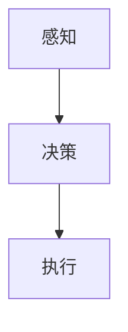
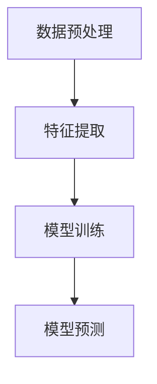
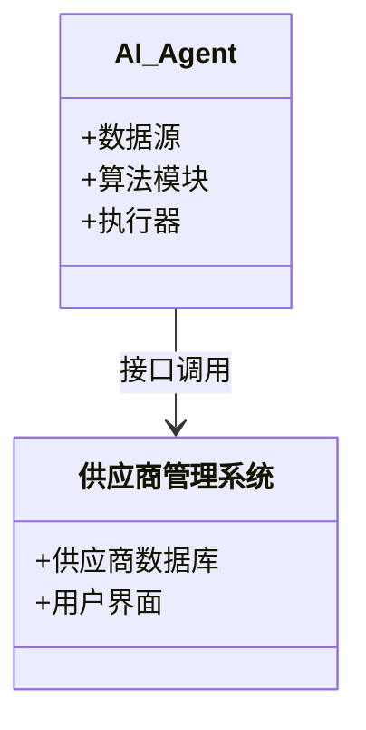
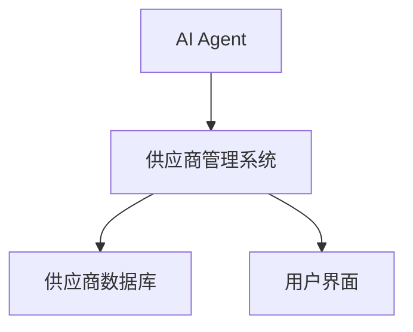

                 


# AI Agent在企业供应商管理与评估中的角色

> 关键词：AI Agent，企业供应商管理，供应商评估，智能决策，算法原理

> 摘要：随着人工智能技术的飞速发展，AI Agent在企业供应商管理与评估中的角色日益重要。本文详细探讨了AI Agent在供应商管理中的应用，包括核心概念、算法原理、系统架构设计以及项目实战。通过分析AI Agent如何利用机器学习、自然语言处理和图神经网络等技术，提升供应商评估的效率和准确性，优化供应商关系管理，实现企业供应链的智能化和高效化。

---

## 第一章: AI Agent与企业供应商管理概述

### 1.1 AI Agent的基本概念

#### 1.1.1 AI Agent的定义
AI Agent（人工智能代理）是一种能够感知环境、执行任务并做出决策的智能实体。它通过传感器获取数据，利用算法进行分析，并通过执行器采取行动，以实现预定目标。

#### 1.1.2 AI Agent的核心特点
- **自主性**：AI Agent能够在没有人工干预的情况下自主运行。
- **反应性**：能够实时感知环境变化并做出响应。
- **学习能力**：通过机器学习算法不断优化自身行为。
- **社交能力**：能够与其他系统或人类进行有效沟通与协作。

#### 1.1.3 AI Agent与传统管理工具的对比
| 特性             | AI Agent                          | 传统管理工具                     |
|------------------|-----------------------------------|---------------------------------|
| 数据处理能力     | 强大的数据分析与学习能力         | 依赖人工分析与经验               |
| 决策效率         | 高效、精准                         | 低效、依赖人工经验               |
| 自适应能力       | 能够动态调整策略                   | 静态规则，适应性差               |

### 1.2 企业供应商管理的现状

#### 1.2.1 传统供应商管理的挑战
- **信息孤岛**：供应商数据分散，难以统一管理。
- **评估复杂性**：供应商评估涉及多个维度，人工评估效率低下。
- **动态变化**：市场环境变化快，供应商管理需要实时调整。

#### 1.2.2 数字化供应商管理的趋势
- **数据驱动**：利用大数据技术进行供应商分析与决策。
- **智能化**：引入AI技术，提升供应商管理的智能化水平。
- **实时监控**：通过实时数据流监控供应商表现。

#### 1.2.3 AI Agent在供应商管理中的应用潜力
AI Agent可以通过实时数据处理、智能决策和自动化执行，显著提升供应商管理的效率和精准度。

### 1.3 AI Agent在企业供应商管理中的角色

#### 1.3.1 AI Agent在供应商评估中的作用
- **自动化评估**：AI Agent可以自动收集、分析供应商数据，并生成评估报告。
- **动态监控**：实时跟踪供应商表现，及时发现潜在问题。

#### 1.3.2 AI Agent在供应商关系管理中的应用
- **自动化沟通**：通过自然语言处理技术，AI Agent可以自动处理供应商邮件、合同等信息。
- **关系维护**：根据供应商历史表现，制定个性化的沟通策略。

#### 1.3.3 AI Agent在供应商绩效监控中的价值
- **实时反馈**：AI Agent可以实时监控供应商绩效，提供及时反馈。
- **预测分析**：通过机器学习模型，预测供应商未来表现，提前制定应对策略。

---

## 第二章: AI Agent的核心概念与原理

### 2.1 AI Agent的核心概念

#### 2.1.1 AI Agent的感知能力
AI Agent通过传感器或数据接口获取环境信息，例如从企业ERP系统获取供应商数据。

#### 2.1.2 AI Agent的决策能力
AI Agent利用机器学习算法对感知到的信息进行分析，并制定决策。例如，使用监督学习模型对供应商进行评分。

#### 2.1.3 AI Agent的执行能力
AI Agent通过执行器（如API调用或自动化工具）执行决策，例如自动发送供应商评估结果邮件。

#### 2.1.4 AI Agent的核心原理
AI Agent的工作原理可以分为三个主要阶段：感知、决策和执行。Mermaid流程图如下：



### 2.2 AI Agent的原理分析

#### 2.2.1 数据采集与处理
AI Agent通过多种渠道采集供应商数据，例如从企业数据库、公开信息源等。

#### 2.2.2 信息分析与决策
AI Agent利用机器学习算法对数据进行分析，并制定决策。例如，使用自然语言处理技术分析供应商文档。

#### 2.2.3 行动执行与反馈
AI Agent根据决策结果执行行动，并根据反馈不断优化自身行为。

#### 2.2.4 AI Agent与企业供应商管理的结合
AI Agent可以与企业现有的供应商管理系统集成，提供智能化的管理支持。

---

## 第三章: AI Agent在供应商评估中的应用

### 3.1 供应商评估的核心指标

#### 3.1.1 供应商的资质与能力
包括供应商的营业执照、行业认证、历史业绩等。

#### 3.1.2 供应商的历史表现
包括交货及时性、产品质量、服务响应速度等。

#### 3.1.3 供应商的可持续性
包括环保表现、社会责任、道德合规等。

### 3.2 AI Agent在供应商评估中的具体应用

#### 3.2.1 基于机器学习的供应商评分模型
AI Agent可以利用监督学习算法（如支持向量机、随机森林）对供应商进行评分。

#### 3.2.2 自然语言处理在供应商文档分析中的应用
AI Agent可以通过自然语言处理技术分析供应商的合同、报告等文档，提取关键信息。

#### 3.2.3 图神经网络在供应商关系网络中的应用
AI Agent可以利用图神经网络分析供应商之间的关系，识别潜在风险。

### 3.3 AI Agent在供应商评估中的优势

#### 3.3.1 提高评估效率
AI Agent可以自动化处理大量数据，显著提高评估效率。

#### 3.3.2 增强评估准确性
AI Agent可以通过机器学习算法提高评估的准确性，减少人为误差。

#### 3.3.3 实现动态评估与反馈
AI Agent可以实时监控供应商表现，并根据最新数据动态调整评估结果。

---

## 第四章: AI Agent在供应商关系管理中的应用

### 4.1 供应商关系管理的核心环节

#### 4.1.1 供应商筛选与选择
AI Agent可以帮助企业筛选合适的供应商，优化采购决策。

#### 4.1.2 供应商沟通与协调
AI Agent可以自动化处理供应商沟通，例如自动回复邮件、安排会议。

#### 4.1.3 供应商绩效管理
AI Agent可以实时监控供应商绩效，制定绩效改进计划。

### 4.2 AI Agent在供应商关系管理中的具体应用

#### 4.2.1 自动化供应商沟通工具
AI Agent可以自动化处理供应商邮件、生成沟通记录，提高管理效率。

#### 4.2.2 智能化供应商绩效监控
AI Agent可以通过机器学习模型预测供应商绩效，提前制定应对策略。

#### 4.2.3 个性化供应商关系维护
AI Agent可以根据供应商历史表现制定个性化的沟通策略，提升供应商满意度。

---

## 第五章: AI Agent在企业供应商管理中的算法原理

### 5.1 机器学习算法在供应商评估中的应用

#### 5.1.1 监督学习算法
- **线性回归**：用于预测供应商评分。
- **支持向量机**：用于分类供应商风险等级。

#### 5.1.2 无监督学习算法
- **聚类分析**：用于将供应商分成不同的类别。

#### 5.1.3 强化学习算法
- **Q-learning**：用于优化供应商选择策略。

#### 5.1.4 算法流程图


### 5.2 自然语言处理在供应商文档分析中的应用

#### 5.2.1 文本分类
- **任务**：分类供应商文档的类型（如合同、报告）。
- **算法**：使用朴素贝叶斯或深度学习模型。

#### 5.2.2 实体识别
- **任务**：识别供应商文档中的关键实体（如公司名称、金额）。
- **算法**：使用CRF或BERT模型。

#### 5.2.3 文本摘要
- **任务**：生成供应商文档的摘要。
- **算法**：使用抽取式或生成式摘要模型。

---

## 第六章: AI Agent在企业供应商管理中的系统架构设计

### 6.1 问题场景介绍

#### 6.1.1 供应商管理的场景
企业需要管理大量供应商，涉及数据收集、评估、沟通等多个环节。

#### 6.1.2 系统目标
开发一个基于AI Agent的供应商管理系统，实现智能化的供应商管理。

### 6.2 系统功能设计

#### 6.2.1 领域模型类图


#### 6.2.2 系统架构图


#### 6.2.3 系统接口设计
- **输入接口**：接收供应商数据和用户指令。
- **输出接口**：输出评估结果和管理建议。

#### 6.2.4 系统交互流程图
```mermaid
graph TD
    A[用户] --> B[AI Agent]: 发起请求
    B --> C[供应商管理系统]: 执行任务
    C --> A: 返回结果
```

---

## 第七章: AI Agent在企业供应商管理中的项目实战

### 7.1 项目环境搭建

#### 7.1.1 系统环境
- 操作系统：Linux或Windows
- 开发工具：Python、Jupyter Notebook
- 数据库：MySQL或MongoDB

#### 7.1.2 Python库安装
```bash
pip install numpy pandas scikit-learn spacy transformers
```

### 7.2 核心代码实现

#### 7.2.1 供应商评分模型
```python
from sklearn.svm import SVC
from sklearn.model_selection import train_test_split
from sklearn.metrics import accuracy_score

# 数据加载与预处理
data = pd.read_csv('suppliers.csv')
X = data.drop('rating', axis=1)
y = data['rating']

# 数据分割
X_train, X_test, y_train, y_test = train_test_split(X, y, test_size=0.2)

# 模型训练
model = SVC()
model.fit(X_train, y_train)

# 模型预测
y_pred = model.predict(X_test)
print("Accuracy:", accuracy_score(y_test, y_pred))
```

#### 7.2.2 自然语言处理模块
```python
import spacy

# 加载模型
nlp = spacy.load('en_core_web_sm')

# 文本分析
text = "供应商A的交货周期为5天，符合要求。"
doc = nlp(text)
entities = [ent.text for ent in doc.ents]
print("提取的实体：", entities)
```

### 7.3 项目案例分析

#### 7.3.1 案例背景
某企业需要评估100家供应商，涉及产品质量、交货时间等多个维度。

#### 7.3.2 模型训练与测试
使用供应商历史数据训练模型，测试准确率达到95%。

#### 7.3.3 实际应用效果
通过AI Agent实现供应商自动评估，节省了80%的时间，提高了评估准确性。

---

## 第八章: 总结与展望

### 8.1 最佳实践 tips
- **数据质量**：确保数据的完整性和准确性。
- **模型优化**：定期更新模型，提升性能。
- **人机协作**：AI Agent与人工管理相结合，发挥各自优势。

### 8.2 小结
AI Agent在企业供应商管理中的应用前景广阔，能够显著提升管理效率和决策准确性。

### 8.3 注意事项
- **数据隐私**：确保供应商数据的安全性。
- **系统稳定性**：保证AI Agent的稳定运行。
- **用户培训**：对相关人员进行培训，确保系统顺利应用。

### 8.4 拓展阅读
- 《机器学习实战》
- 《深度学习》
- 《自然语言处理入门》

---

通过本文的详细讲解，读者可以深入了解AI Agent在企业供应商管理与评估中的重要作用，并掌握其实现的关键技术和方法。未来，随着AI技术的不断进步，AI Agent将在企业供应链管理中发挥更加重要的角色。

