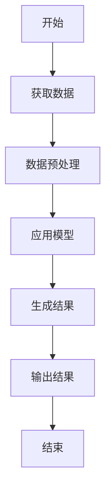
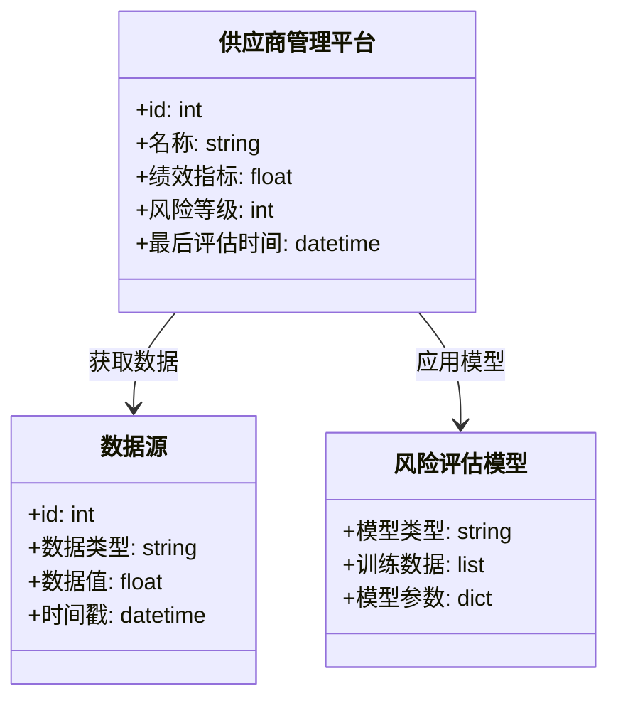
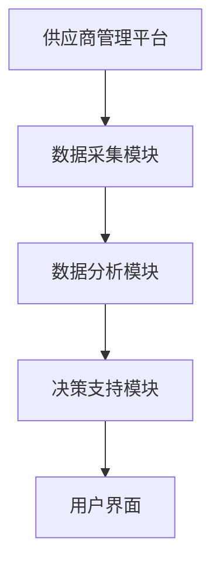
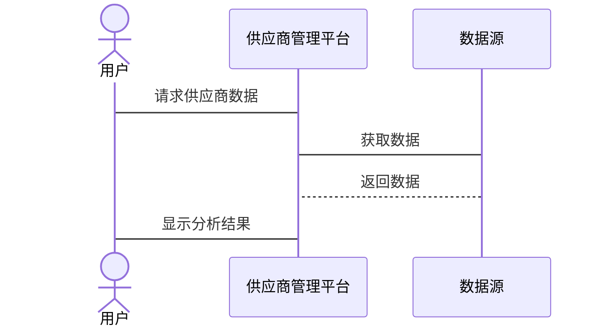

                 


# AI Agent在企业供应商绩效评估与风险管理中的角色

> 关键词：AI Agent，供应商绩效评估，风险管理，企业供应链，多智能体系统

> 摘要：本文深入探讨了AI Agent在企业供应商绩效评估与风险管理中的应用角色。通过分析AI Agent的核心概念、算法原理、系统架构以及实际案例，本文展示了AI Agent如何通过智能化、自动化的方式优化企业供应商管理流程，提升绩效评估的准确性和风险管理的有效性。

---

# 第1章: AI Agent与企业供应商管理的背景

## 1.1 问题背景与描述

### 1.1.1 企业供应商管理的挑战
企业供应链的复杂性使得供应商管理成为一项具有挑战性的任务。传统的供应商绩效评估和风险管理方法通常依赖于人工操作，存在以下问题：
- 数据分散：供应商信息分布在多个系统中，难以整合和分析。
- 评估周期长：从数据收集到分析需要大量时间，难以实现实时监控。
- 风险识别不及时：传统方法难以快速识别潜在风险，导致问题扩大化。
- 主观性较强：人工评估可能存在主观偏差，影响结果的准确性。

### 1.1.2 问题描述
供应商绩效评估和风险管理的核心目标是通过科学的方法，对企业供应商的表现进行全面评价，并及时发现和处理潜在风险。然而，传统方法在以下方面表现不足：
- 数据处理能力有限：难以处理海量数据，尤其是实时数据。
- 缺乏动态性：难以适应市场环境的快速变化。
- 风险识别能力不足：难以预测和预防潜在风险。

### 1.1.3 解决方案
引入AI Agent技术，通过智能化的算法和多智能体协作，实现供应商绩效评估的自动化和风险管理的实时监控。AI Agent能够实时分析数据，提供动态的评估结果和风险预警，从而优化供应商管理流程。

### 1.1.4 AI Agent的边界和外延
AI Agent的应用范围主要集中在供应商绩效评估和风险管理领域。其边界包括数据采集、分析、评估和反馈，而外延则涉及与企业其他系统的集成，例如ERP系统和CRM系统。

## 1.2 AI Agent的核心概念与目标

### 1.2.1 AI Agent的核心概念
AI Agent是一种能够感知环境、自主决策并执行任务的智能体。在企业供应商管理中，AI Agent可以用于数据采集、分析和决策支持。

### 1.2.2 AI Agent在供应商管理中的目标
- 提供实时的供应商绩效评估。
- 实现动态的风险管理。
- 优化供应链的透明度和效率。

## 1.2.3 AI Agent的边界与外延
AI Agent的应用边界包括数据采集、分析和反馈，而外延则涉及与其他系统的集成和数据共享。

## 1.3 本章小结
本章介绍了企业供应商管理的挑战和传统方法的局限性，提出了AI Agent作为解决方案的核心概念和目标，并明确了其应用边界和外延。

---

# 第2章: AI Agent的核心概念与联系

## 2.1 核心概念原理

### 2.1.1 AI Agent的基本原理
AI Agent通过感知环境、分析数据、制定决策并执行任务来实现目标。在供应商管理中，AI Agent可以实时监控供应商的表现，识别潜在风险。

### 2.1.2 多智能体系统与协同
多智能体系统（MAS）通过多个智能体的协作实现复杂任务。在供应商管理中，多个AI Agent可以分别负责数据采集、分析和决策支持。

### 2.1.3 问题建模与知识表示
问题建模是将供应商管理问题转化为数学模型的过程。知识表示则通过知识图谱等方式，将供应商信息组织成可计算的形式。

## 2.2 核心概念属性对比

### 2.2.1 AI Agent与传统算法的对比
| 特性               | AI Agent                     | 传统算法                     |
|--------------------|----------------------------|----------------------------|
| 自主性             | 高                           | 低                           |
| 学习能力           | 强                           | 弱                           |
| 实时性             | 高                           | 低                           |

### 2.2.2 不同AI Agent模型的特性分析
- **基于规则的AI Agent**：适用于简单的决策任务。
- **基于模型的AI Agent**：适用于复杂的优化任务。
- **基于机器学习的AI Agent**：适用于数据驱动的预测任务。

## 2.3 ER实体关系图

```mermaid
erDiagram
    actor 供应商管理平台 {
        <属性>
        id : int
        名称 : string
        绩效指标 : float
        风险等级 : int
        最后评估时间 : datetime
    }
    actor 数据源 {
        <属性>
        id : int
        数据类型 : string
        数据值 : float
        时间戳 : datetime
    }
    actor 风险评估模型 {
        <属性>
        模型类型 : string
        训练数据 : list
        模型参数 : dict
    }
    供应商管理平台 --> 数据源 : 获取数据
    供应商管理平台 --> 风险评估模型 : 应用模型
```

## 2.4 本章小结
本章详细介绍了AI Agent的核心概念、基本原理以及与传统算法的对比，并通过ER实体关系图展示了供应商管理平台的实体关系。

---

# 第3章: AI Agent的算法原理

## 3.1 算法原理概述

### 3.1.1 基于概率论的决策模型
概率论在AI Agent的决策过程中起着重要作用。例如，可以通过贝叶斯网络对供应商的信用风险进行评估。

### 3.1.2 多智能体协作算法
多智能体协作算法通过分布式计算实现任务的分解与协同。例如，每个智能体负责不同的数据源，并将结果汇总到中央控制器。

### 3.1.3 动态优化算法
动态优化算法用于实时调整供应商的评估指标。例如，可以通过线性回归模型对供应商的绩效进行预测。

## 3.2 算法流程图



## 3.3 数学模型与公式

### 3.3.1 概率模型公式
供应商信用风险评估的贝叶斯网络模型如下：
$$ P(信用风险|数据) = \frac{P(数据|信用风险) \cdot P(信用风险)}{P(数据)} $$

### 3.3.2 优化算法公式
线性回归模型用于预测供应商绩效：
$$ y = \beta_0 + \beta_1x_1 + \beta_2x_2 + \epsilon $$

## 3.4 本章小结
本章介绍了AI Agent的算法原理，包括基于概率论的决策模型、多智能体协作算法和动态优化算法，并通过流程图和公式展示了算法的实现过程。

---

# 第4章: 系统分析与架构设计

## 4.1 问题场景介绍

### 4.1.1 供应商绩效评估场景
供应商绩效评估需要实时监控供应商的交付能力、质量和服务水平。

### 4.1.2 风险管理场景
风险管理需要实时监控供应商的信用风险、操作风险和合规风险。

## 4.2 系统功能设计

### 4.2.1 领域模型构建



### 4.2.2 功能模块划分
- 数据采集模块：负责从多个数据源获取供应商信息。
- 数据分析模块：对供应商数据进行清洗和预处理。
- 决策支持模块：基于分析结果提供绩效评估和风险预警。

## 4.3 系统架构设计

### 4.3.1 系统架构图



### 4.3.2 通信协议设计
- 数据采集模块与数据分析模块之间使用HTTP协议进行通信。
- 分析结果通过WebSocket协议传递到用户界面。

## 4.4 系统接口与交互

### 4.4.1 接口定义
- 数据采集模块提供REST API接口。
- 决策支持模块提供GraphQL接口。

### 4.4.2 交互流程图



## 4.5 本章小结
本章详细介绍了系统架构设计，包括领域模型、功能模块划分、系统架构图和交互流程图。

---

# 第5章: 项目实战

## 5.1 环境安装

### 5.1.1 安装Python
```bash
python --version
pip install --upgrade pip
```

### 5.1.2 安装依赖库
```bash
pip install numpy pandas scikit-learn
```

## 5.2 系统核心实现

### 5.2.1 数据采集模块实现
```python
import requests
import json

def get_supplier_data(api_key):
    headers = {'Authorization': f'Bearer {api_key}'}
    response = requests.get('https://api.supplier.com/data', headers=headers)
    return response.json()
```

### 5.2.2 数据分析模块实现
```python
import pandas as pd
from sklearn.linear_model import LinearRegression

def analyze_data(data):
    df = pd.DataFrame(data)
    model = LinearRegression()
    model.fit(df[['delivery_time', 'quality_score']], df['performance_score'])
    return model.predict(df[['delivery_time', 'quality_score']])
```

## 5.3 案例分析与详细讲解

### 5.3.1 案例分析
假设我们有一个供应商的数据集，包括交付时间、质量评分和绩效评分。我们可以通过线性回归模型预测供应商的绩效评分。

### 5.3.2 详细讲解
通过数据采集模块获取供应商数据，然后通过数据分析模块对数据进行建模和预测。最终，供应商管理平台将显示分析结果，并提供风险预警。

## 5.4 项目小结
本章通过实际案例展示了AI Agent在供应商管理中的应用，详细讲解了系统核心实现和数据分析模块的实现过程。

---

# 第6章: 总结与展望

## 6.1 总结
本文深入探讨了AI Agent在企业供应商绩效评估与风险管理中的应用，通过系统架构设计和实际案例展示了其优势。

## 6.2 展望
未来，AI Agent在供应商管理中的应用将更加广泛，例如结合边缘计算和增强学习，进一步提升系统的实时性和智能性。

---

# 附录

## 附录A: Python代码实现
```python
import numpy as np
import pandas as pd
from sklearn import linear_model

# 示例数据
data = {
    '供应商ID': [1, 2, 3, 4, 5],
    '交付时间': [5, 4, 6, 3, 7],
    '质量评分': [8, 7, 9, 6, 8],
    '绩效评分': [85, 80, 90, 75, 85]
}

df = pd.DataFrame(data)
model = linear_model.LinearRegression()
model.fit(df[['交付时间', '质量评分']], df['绩效评分'])
print(model.predict([[4, 7]]))
```

## 附录B: Mermaid图表
### 实体关系图
```mermaid
erDiagram
    actor 供应商管理平台 {
        <属性>
        id : int
        名称 : string
        绩效指标 : float
        风险等级 : int
        最后评估时间 : datetime
    }
    actor 数据源 {
        <属性>
        id : int
        数据类型 : string
        数据值 : float
        时间戳 : datetime
    }
    actor 风险评估模型 {
        <属性>
        模型类型 : string
        训练数据 : list
        模型参数 : dict
    }
    供应商管理平台 --> 数据源 : 获取数据
    供应商管理平台 --> 风险评估模型 : 应用模型
```

---

# 最佳实践 Tips

- **数据隐私**：在处理供应商数据时，必须注意数据隐私和合规性。
- **模型迭代**：定期更新和优化AI模型，以适应市场变化。
- **多智能体协作**：通过多智能体协作提高系统的整体效率和准确性。

---

# 结语

通过本文的详细讲解，读者可以深入了解AI Agent在企业供应商绩效评估与风险管理中的应用，并能够实际操作相关系统的设计与实现。未来，随着AI技术的不断发展，AI Agent在企业供应链管理中的作用将更加重要。

--- 

* 本文是根据我的思考过程和经验总结而写，希望对您有所帮助。

