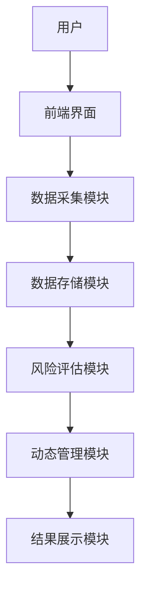
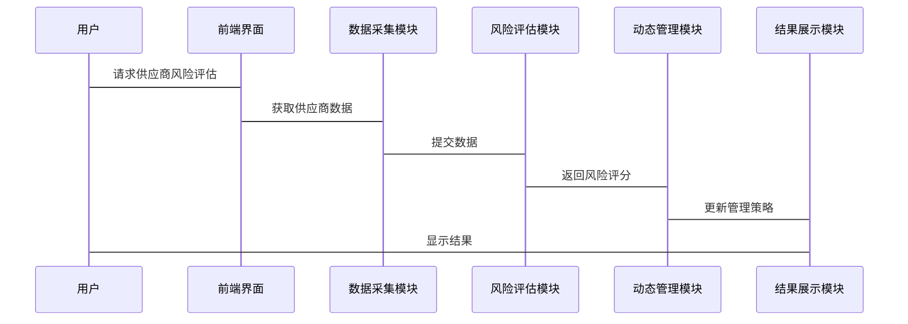

                 


# AI Agent在企业供应商风险评估与动态管理中的应用

> 关键词：AI Agent, 供应商风险评估, 动态管理, 企业供应链, 人工智能

> 摘要：本文详细探讨了AI Agent在企业供应商风险评估与动态管理中的应用，从背景介绍到系统设计，从算法原理到项目实战，全面解析了AI Agent如何助力企业实现供应商管理的智能化和动态化。文章结合实际案例，深入分析了AI Agent的优势、实现原理及应用场景，为企业供应链管理提供了新的思路和解决方案。

---

## 第一部分: 背景介绍

### 第1章: 问题背景与核心概念

#### 1.1 问题背景
企业供应链管理是企业运营的核心环节之一，供应商作为供应链的重要组成部分，其表现直接影响企业的运营效率和风险敞口。然而，传统的供应商风险管理方式存在以下问题：

- **信息滞后**：依赖人工收集和分析，导致信息更新不及时，难以应对市场变化。
- **维度单一**：通常仅关注财务指标，忽视了交付能力、合规性等多维度风险。
- **静态管理**：缺乏动态调整能力，无法根据市场变化实时优化供应商策略。

#### 1.2 问题描述
供应商风险管理的核心目标是通过实时监控和分析供应商的多维度数据，识别潜在风险并制定应对策略。然而，传统方法存在以下局限性：

- 数据来源分散，难以整合和分析。
- 缺乏实时性，无法快速响应风险事件。
- 需要大量人工干预，效率低下。

#### 1.3 问题解决与边界
AI Agent（人工智能代理）是一种能够感知环境、自主决策并采取行动的智能系统。它在供应商风险管理中的应用，可以实现以下目标：

- **实时监控**：通过AI Agent实时收集和分析供应商数据，识别潜在风险。
- **动态调整**：根据风险评估结果，动态调整供应商管理策略。
- **智能决策**：基于历史数据和实时信息，提供最优决策建议。

#### 1.4 核心概念与要素
- **AI Agent**：具备感知、决策和执行能力的智能系统。
- **供应商风险评估**：通过多维度数据评估供应商的信用风险、交付能力和合规性。
- **动态管理**：根据风险评估结果，实时调整供应商管理策略。

---

## 第二部分: 核心概念与联系

### 第2章: AI Agent的核心原理与技术

#### 2.1 AI Agent的基本原理
AI Agent通过感知环境、分析数据并采取行动来实现目标。其核心原理包括：

- **感知环境**：通过数据采集模块实时获取供应商数据，包括财务数据、交付记录、市场反馈等。
- **分析与决策**：利用机器学习算法对数据进行分析，评估供应商风险并制定管理策略。
- **执行行动**：根据决策结果，自动调整供应商关系，例如更换供应商或加强监控。

#### 2.2 AI Agent在供应商管理中的应用原理
- **数据采集**：通过API接口、爬虫等方式获取供应商的多维度数据。
- **风险评估**：利用机器学习模型对供应商进行信用评估、交付能力评估和合规性评估。
- **动态管理**：根据评估结果，动态调整供应商管理策略，例如增加对高风险供应商的监控频率。

#### 2.3 核心技术对比
| 技术 | 优点 | 缺点 |
|------|------|------|
| 传统方法 | 实施简单，成本低 | 数据滞后，效率低 |
| AI Agent | 实时性高，准确性强 | 技术复杂，实施成本高 |

---

## 第三部分: 算法原理

### 第3章: AI Agent的算法实现

#### 3.1 风险评估模型
- **输入**：供应商的历史数据和实时数据。
- **输出**：供应商的风险评分和风险类型。
- **算法步骤**：
  1. 数据清洗与预处理。
  2. 特征提取：从供应商数据中提取关键特征，例如财务指标、交付记录、市场反馈。
  3. 模型训练：使用机器学习算法（如随机森林、XGBoost）训练风险评估模型。
  4. 风险评分：根据模型预测结果，生成供应商的风险评分。

#### 3.2 动态管理模型
- **输入**：供应商的风险评分和实时数据。
- **输出**：动态调整的管理策略。
- **算法步骤**：
  1. 根据风险评分，将供应商分为高风险、中风险和低风险。
  2. 根据实时数据，动态调整供应商的管理策略，例如增加高风险供应商的监控频率。

#### 3.3 数学模型
- **风险评分公式**：
  $$ \text{风险评分} = w_1 \cdot \text{财务指标} + w_2 \cdot \text{交付能力} + w_3 \cdot \text{合规性} $$
  其中，$w_1, w_2, w_3$为各维度的权重，通常通过机器学习算法训练得出。

---

## 第四部分: 系统分析与架构设计

### 第4章: 系统架构设计

#### 4.1 系统功能设计
- **数据采集模块**：实时采集供应商的多维度数据。
- **风险评估模块**：基于机器学习模型评估供应商风险。
- **动态管理模块**：根据风险评估结果，动态调整管理策略。

#### 4.2 系统架构图


#### 4.3 系统接口设计
- **API接口**：提供RESTful API，供前端界面调用。
- **数据接口**：与供应商管理系统、财务系统等对接。

#### 4.4 系统交互图


---

## 第五部分: 项目实战

### 第5章: 项目实现

#### 5.1 环境安装
- **Python 3.8+**
- **机器学习库（scikit-learn, xgboost）**
- **数据处理库（pandas, numpy）**
- **可视化库（matplotlib, seaborn）**

#### 5.2 核心代码实现
```python
import pandas as pd
import numpy as np
from sklearn.ensemble import RandomForestClassifier
from sklearn.metrics import accuracy_score

# 数据加载
data = pd.read_csv('suppliers.csv')

# 数据预处理
data = data.dropna()
X = data.drop(columns=['risk_score'])
y = data['risk_score']

# 特征工程
from sklearn.preprocessing import StandardScaler
scaler = StandardScaler()
X_scaled = scaler.fit_transform(X)

# 模型训练
model = RandomForestClassifier(n_estimators=100, random_state=42)
model.fit(X_scaled, y)

# 模型预测
new_data = pd.read_csv('new_suppliers.csv')
new_data = new_data.dropna()
X_new = new_data.drop(columns=['risk_score'])
X_new_scaled = scaler.transform(X_new)
y_pred = model.predict(X_new_scaled)

# 模型评估
accuracy = accuracy_score(y_true, y_pred)
print(f'模型准确率: {accuracy}')
```

#### 5.3 案例分析
假设我们有一个新的供应商数据集，我们可以通过上述代码预测其风险评分，并根据评分结果动态调整管理策略。例如，对于高风险供应商，我们可以增加对其的审计频率或寻找替代供应商。

---

## 第六部分: 最佳实践与小结

### 第6章: 最佳实践

#### 6.1 注意事项
- 数据隐私与安全：确保供应商数据的安全性，遵守相关法律法规。
- 模型更新：定期更新机器学习模型，以适应市场变化。
- 人工干预：在AI Agent决策的基础上，保留人工干预的权利，避免误判。

#### 6.2 小结
AI Agent在企业供应商风险评估与动态管理中的应用，不仅提高了管理效率，还显著降低了风险。通过实时监控和动态调整，企业能够更好地应对供应链中的各种不确定性。

#### 6.3 拓展阅读
- 《机器学习实战》
- 《人工智能: 一种现代的方法》
- 《企业供应链管理》

---

通过本文的详细讲解，读者可以全面了解AI Agent在企业供应商管理中的应用，并能够将其实际应用于企业的供应链管理中，提升企业的竞争力和抗风险能力。

