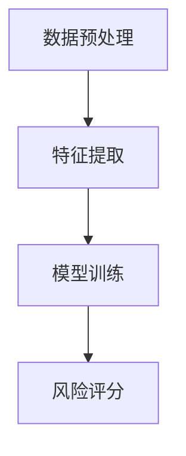
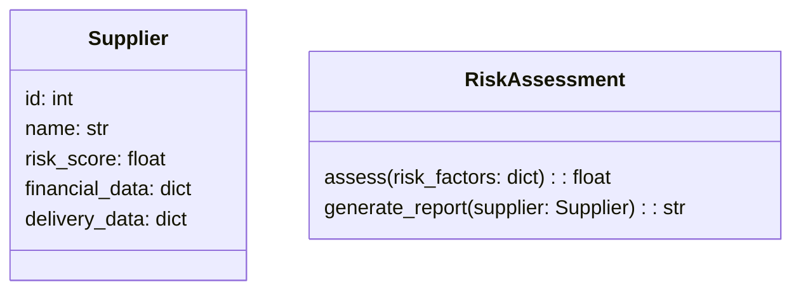
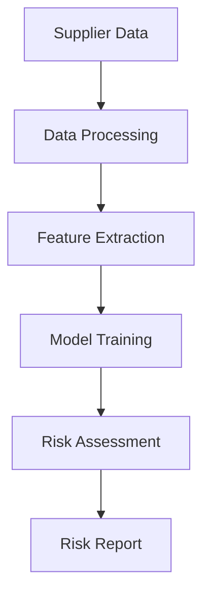
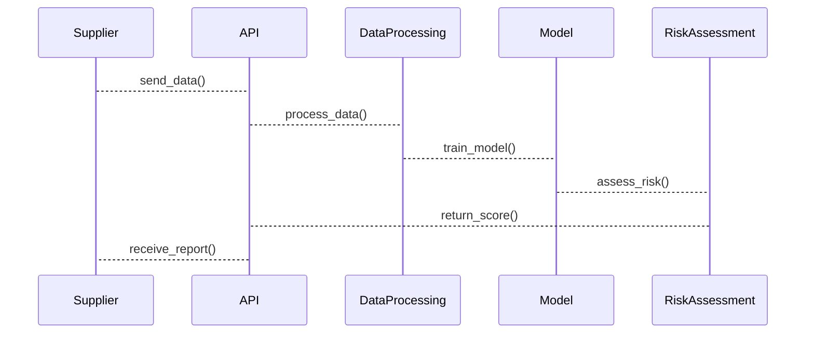

                 


# 《AI Agent在企业供应商风险评估与管理中的应用》

---

## 关键词：  
- AI Agent（人工智能代理）  
- 企业供应商风险管理  
- 供应链管理  
- 风险评估  
- 人工智能算法  

---

## 摘要：  
本文深入探讨了AI Agent在企业供应商风险评估与管理中的应用，从理论基础到实际案例，系统性地分析了AI Agent如何通过智能化手段优化供应商风险管理流程。文章首先介绍了供应商风险管理的背景与挑战，随后详细阐述了AI Agent的核心原理及其在供应链管理中的独特优势。接着，通过算法原理、系统架构设计和项目实战，展示了AI Agent如何实现供应商风险的智能化评估与管理。最后，本文总结了AI Agent在企业供应商风险管理中的最佳实践与未来发展方向。

---

# 第一部分: AI Agent在企业供应商风险评估与管理中的应用背景

---

# 第1章: 企业供应商风险评估与管理的背景介绍

## 1.1 问题背景

### 1.1.1 企业供应链管理的重要性  
供应链管理是企业运营的核心环节，涉及供应商选择、采购、物流、库存管理等。供应商是供应链的核心组成部分，其稳定性直接影响企业的运营效率和成本控制。  

### 1.1.2 供应商风险管理的挑战  
- 传统供应商管理依赖人工经验，存在主观性和片面性。  
- 市场波动、 geopolitical风险、疫情等外部因素增加了供应商风险管理的复杂性。  
- 数据量庞大且分散，难以实时监控和评估。  

### 1.1.3 AI技术在供应链管理中的潜力  
AI技术能够通过大数据分析、机器学习等手段，实现供应商风险的智能化评估与管理，提升供应链的弹性和效率。  

---

## 1.2 问题描述

### 1.2.1 供应商风险的多维度特征  
供应商风险包括信用风险、交付风险、质量风险、合规风险等，涉及多个维度。  

### 1.2.2 传统供应商风险管理的局限性  
- 依赖人工判断，主观性强。  
- 数据分散，难以形成全面的评估体系。  
- 响应速度慢，难以应对突发风险。  

### 1.2.3 需求驱动的AI Agent解决方案  
通过AI Agent实时监控供应商的动态数据，构建动态风险评估模型，实现智能化的供应商风险管理。  

---

## 1.3 问题解决

### 1.3.1 AI Agent的核心作用  
AI Agent能够实时收集、分析供应商数据，生成风险评估报告，并提供优化建议。  

### 1.3.2 AI Agent在供应商风险管理中的具体应用  
- 实时监控供应商的财务状况、交付能力、市场表现等数据。  
- 预测供应商可能面临的潜在风险，并提前预警。  
- 优化供应商选择，降低供应链的整体风险。  

### 1.3.3 AI Agent的优势与局限性  
- **优势**：提高风险管理的准确性和效率，降低人为错误。  
- **局限性**：依赖高质量数据，模型的泛化能力需进一步提升。  

---

## 1.4 边界与外延

### 1.4.1 AI Agent的适用场景  
- 适用于数据量大、风险因素多的复杂供应链环境。  
- 适用于需要实时监控和动态调整的供应商管理场景。  

### 1.4.2 与传统供应商管理的区分  
AI Agent不是完全替代传统供应商管理，而是通过智能化手段辅助传统方法，提升效率和准确性。  

### 1.4.3 技术边界与未来发展  
当前AI Agent主要应用于风险评估和监控，未来可扩展至供应链优化、协同管理等领域。  

---

## 1.5 概念结构与核心要素

### 1.5.1 AI Agent的基本构成  
- **感知层**：数据采集与处理。  
- **认知层**：风险分析与预测。  
- **执行层**：风险预警与优化建议。  

### 1.5.2 供应商风险管理的核心要素  
- 数据采集：供应商的财务、交付、质量等数据。  
- 风险评估：信用评分、交付准时率、合规性评估。  
- 风险控制：风险预警、供应商替换建议、供应链优化方案。  

### 1.5.3 AI Agent与供应商风险管理的结合模型  
通过AI Agent构建动态风险评估模型，实时更新供应商风险评分，并提供优化建议。  

---

## 1.6 本章小结  
本章从企业供应链管理的背景出发，分析了供应商风险管理的挑战与传统方法的局限性，提出了AI Agent作为解决方案的核心作用，并明确了其适用场景和技术边界。

---

# 第2章: AI Agent与供应商风险管理的核心概念与联系

---

## 2.1 AI Agent的基本原理

### 2.1.1 AI Agent的定义与分类  
AI Agent是一种能够感知环境、自主决策并执行任务的智能体。根据功能可分为监视器、执行器、协调器等类型。  

### 2.1.2 AI Agent的核心特征  
- **自主性**：能够自主决策。  
- **反应性**：能够实时感知环境变化。  
- **学习能力**：能够通过数据优化模型。  

---

## 2.2 供应商风险管理的核心概念

### 2.2.1 供应商风险评估的关键指标  
- 信用评分：基于供应商的财务状况和履约历史。  
- 交付准时率：基于历史交付记录。  
- 质量稳定性：基于产品质量检测数据。  

### 2.2.2 供应商风险管理的流程  
1. 数据采集：收集供应商的财务、交付、质量等数据。  
2. 风险评估：基于数据计算风险评分。  
3. 风险控制：根据评分制定应对策略。  

---

## 2.3 AI Agent与供应商风险管理的联系

### 2.3.1 AI Agent在供应商风险管理中的作用  
- **数据采集**：实时收集供应商的动态数据。  
- **风险评估**：基于机器学习模型计算风险评分。  
- **风险控制**：提供优化建议和预警信息。  

### 2.3.2 AI Agent的核心优势  
- **智能化**：能够自动分析和优化。  
- **实时性**：能够实时监控和调整。  

---

## 2.4 本章小结  
本章详细阐述了AI Agent的基本原理和供应商风险管理的核心概念，分析了AI Agent在供应商风险管理中的独特优势。

---

# 第3章: AI Agent在供应商风险管理中的算法原理

---

## 3.1 算法原理概述

### 3.1.1 算法选择与原理  
本文采用基于机器学习的供应商风险评估模型，主要包括以下步骤：  
1. 数据预处理：清洗和特征提取。  
2. 模型训练：使用随机森林或支持向量机（SVM）进行分类。  
3. 风险评分：根据模型输出生成风险评分。  

### 3.1.2 算法实现流程图  


---

## 3.2 核心算法实现

### 3.2.1 机器学习模型的选择  
- **随机森林**：适用于特征重要性分析和分类任务。  
- **SVM**：适用于高维数据的分类任务。  

### 3.2.2 算法实现代码  
```python
import pandas as pd
from sklearn.ensemble import RandomForestClassifier
from sklearn.metrics import accuracy_score

# 数据加载与预处理
data = pd.read_csv('suppliers.csv')
X = data.drop('risk_score', axis=1)
y = data['risk_score']

# 模型训练
model = RandomForestClassifier()
model.fit(X, y)

# 模型评估
y_pred = model.predict(X)
print("Accuracy:", accuracy_score(y, y_pred))
```

### 3.2.3 算法原理的数学模型  
随机森林的分类概率计算公式：  
$$ P(y|x) = \frac{\sum_{i=1}^{n} w_i I(y_i = y)}{\sum_{i=1}^{n} w_i} $$  
其中，$w_i$ 是决策树的重要性权重，$I(y_i = y)$ 是指示函数。  

---

## 3.3 本章小结  
本章通过机器学习算法详细阐述了AI Agent在供应商风险管理中的实现原理，并通过代码示例展示了算法的具体实现。

---

# 第4章: 系统分析与架构设计方案

---

## 4.1 问题场景介绍

### 4.1.1 系统目标  
构建一个基于AI Agent的供应商风险管理系统，实现供应商风险的智能化评估与管理。  

### 4.1.2 系统需求  
- 实时监控供应商数据。  
- 自动生成风险评估报告。  
- 提供风险优化建议。  

---

## 4.2 系统功能设计

### 4.2.1 领域模型类图  


---

## 4.3 系统架构设计

### 4.3.1 系统架构图  


---

## 4.4 系统接口设计

### 4.4.1 API接口  
- **输入接口**：接收供应商数据。  
- **输出接口**：返回风险评分和优化建议。  

### 4.4.2 交互流程图  


---

## 4.5 本章小结  
本章通过系统架构设计和接口设计，展示了基于AI Agent的供应商风险管理系统的实现方案。

---

# 第5章: 项目实战

---

## 5.1 环境安装

### 5.1.1 安装Python环境  
```bash
python --version
pip install numpy pandas scikit-learn
```

---

## 5.2 核心代码实现

### 5.2.1 数据加载与预处理  
```python
import pandas as pd
from sklearn.ensemble import RandomForestClassifier

data = pd.read_csv('suppliers.csv')
X = data.drop('risk_score', axis=1)
y = data['risk_score']

model = RandomForestClassifier()
model.fit(X, y)
```

### 5.2.2 风险评估与报告生成  
```python
def assess_risk(supplier_data):
    # 数据预处理
    processed_data = preprocess(supplier_data)
    # 模型预测
    risk_score = model.predict(processed_data)
    return risk_score[0]

# 示例供应商数据
supplier = {
    'revenue': 1000000,
    'net_profit': 200000,
    'delivery_delay': 5
}
assess_risk(supplier)
```

---

## 5.3 案例分析与解读

### 5.3.1 案例背景  
某制造企业需要评估其供应商的信用风险，使用AI Agent进行风险评估。  

### 5.3.2 数据分析  
供应商A的财务数据、交付记录和市场表现显示，其风险评分为0.6，属于中等风险。  

### 5.3.3 优化建议  
建议企业加强对供应商A的财务监控，并考虑多元化供应链以降低整体风险。  

---

## 5.4 本章小结  
本章通过实际案例展示了AI Agent在供应商风险管理中的具体应用，并详细解读了代码实现和优化建议。

---

# 第6章: 最佳实践与未来展望

---

## 6.1 最佳实践 tips

### 6.1.1 数据质量管理  
确保数据的准确性和完整性，是AI Agent有效运行的基础。  

### 6.1.2 模型优化  
定期更新模型，确保其适应市场变化和供应商动态。  

### 6.1.3 人机结合  
AI Agent辅助决策，但最终决策应结合人类经验。  

---

## 6.2 小结  
AI Agent在供应商风险管理中的应用，显著提升了供应链管理的效率和准确性，为企业降本增效提供了有力支持。  

---

## 6.3 注意事项

### 6.3.1 数据隐私与合规性  
确保数据处理符合相关法律法规。  

### 6.3.2 模型可解释性  
复杂的模型需具备可解释性，便于企业理解和优化。  

---

## 6.4 拓展阅读

### 6.4.1 相关书籍  
- 《人工智能：一种现代的方法》  
- 《供应链管理：战略与案例分析》  

### 6.4.2 技术博客与资源  
- [机器学习在供应链管理中的应用](https://example.com)  
- [AI Agent的最佳实践](https://example.com)  

---

# 结语  
AI Agent正在 revolutionizing 企业供应商风险管理的方式，通过智能化的手段，企业能够更好地应对复杂多变的市场环境，提升供应链的整体竞争力。未来，随着技术的不断发展，AI Agent将在更多领域发挥重要作用。

--- 

感谢您的耐心阅读，希望本文能为您的学习和研究提供有价值的参考！

