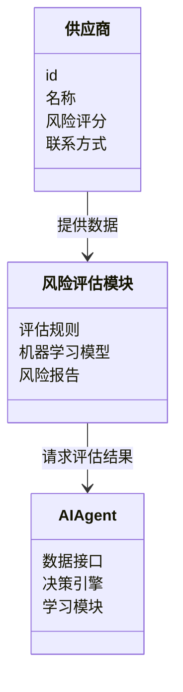
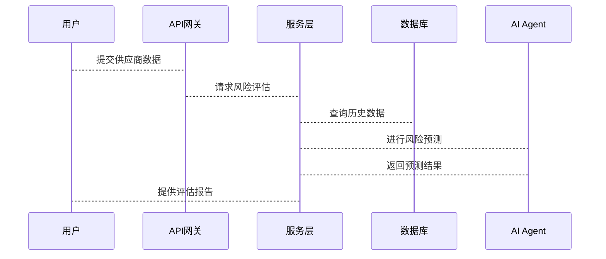

                 


# AI Agent在企业供应商风险评估与管理中的角色

## 关键词：AI Agent, 供应商风险管理, 企业供应链, 机器学习, 风险评估

## 摘要：本文探讨AI Agent在企业供应商风险评估与管理中的应用，分析其在供应商筛选、风险预测、监控和优化中的作用。通过机器学习算法和自然语言处理技术，AI Agent能够提升供应商管理的效率和准确性，降低企业风险，优化供应链表现。

---

# 第1章 AI Agent与企业供应商管理概述

## 1.1 什么是AI Agent
### 1.1.1 AI Agent的定义
AI Agent（人工智能代理）是能够感知环境、自主决策并执行任务的智能系统，通常具备学习、推理和自适应能力。

### 1.1.2 AI Agent的核心特征
- **自主性**：无需人工干预，自动完成任务。
- **反应性**：实时感知环境变化并调整行为。
- **学习性**：通过数据和经验改进决策能力。
- **协作性**：与其他系统或人类协同工作。

### 1.1.3 AI Agent与传统管理工具的区别
AI Agent不仅能够执行预设任务，还能通过学习优化决策，适应复杂变化的环境。

## 1.2 企业供应商管理的挑战
### 1.2.1 供应商风险管理的重要性
供应商是企业供应链的关键环节，其稳定性直接影响企业运营。供应商风险包括信用风险、交付风险和合规风险。

### 1.2.2 传统供应商管理的局限性
- **效率低**：依赖人工审核，耗时且易出错。
- **覆盖面窄**：难以实时监控供应商的动态。
- **数据孤岛**：各部门数据分散，缺乏统一的评估标准。

### 1.2.3 数字化转型对企业供应商管理的影响
数字化工具的应用提升了供应商管理的效率，而AI Agent的引入进一步增强了风险预测和应对能力。

## 1.3 AI Agent在供应商管理中的应用前景
### 1.3.1 AI Agent在供应商风险管理中的优势
- **实时监控**：通过AI Agent实时跟踪供应商的表现。
- **数据驱动决策**：利用机器学习模型进行精准预测。
- **自动化响应**：AI Agent能够自动触发应对措施，减少人为延误。

### 1.3.2 企业采用AI Agent的驱动力
- **效率提升**：减少人工干预，加快决策速度。
- **成本降低**：通过优化供应链减少资源浪费。
- **风险降低**：提前识别和应对潜在风险。

### 1.3.3 AI Agent在供应商管理中的潜在价值
AI Agent能够优化供应商选择、评估、监控和反馈机制，推动供应链的整体优化。

## 1.4 本章小结
AI Agent通过智能化手段提升了供应商管理的效率和准确性，是企业数字化转型中的重要工具。

---

# 第2章 AI Agent的核心概念与原理

## 2.1 AI Agent的基本原理
### 2.1.1 AI Agent的感知与决策机制
AI Agent通过传感器或数据接口感知环境信息，利用机器学习模型进行分析，生成决策方案。

### 2.1.2 AI Agent的自主性与适应性
AI Agent能够根据环境反馈调整行为，适应变化，无需人工干预。

### 2.1.3 AI Agent的学习与优化能力
通过监督学习、无监督学习和强化学习，AI Agent不断提升自身的决策能力。

## 2.2 AI Agent与供应商风险管理的结合
### 2.2.1 供应商风险的多维度分析
供应商风险包括信用风险、交付风险、合规风险和声誉风险。

### 2.2.2 AI Agent在供应商风险评估中的角色
AI Agent能够分析供应商的历史数据、市场表现和实时动态，评估其风险等级。

### 2.2.3 AI Agent如何优化供应商管理流程
通过自动化筛选、实时监控和智能预警，AI Agent优化了供应商的选择和管理流程。

## 2.3 AI Agent的核心算法与技术
### 2.3.1 机器学习算法在AI Agent中的应用
常用算法包括决策树、随机森林和神经网络，用于供应商风险分类和预测。

### 2.3.2 自然语言处理在供应商信息分析中的作用
NLP技术用于分析供应商文档、新闻和社交媒体数据，提取关键信息。

### 2.3.3 数据挖掘技术在供应商风险预测中的应用
通过数据挖掘发现供应商之间的关联性，识别潜在风险。

## 2.4 本章小结
AI Agent的核心原理在于其感知、学习和决策能力，这些能力使其在供应商风险管理中发挥重要作用。

---

# 第3章 基于机器学习的供应商风险评估算法

## 3.1 供应商风险评估的机器学习模型
### 3.1.1 数据预处理与特征提取
- 数据清洗：处理缺失值、异常值。
- 特征选择：提取关键特征，如供应商的历史违约率、交付准时率等。

### 3.1.2 常见的机器学习算法选择
- **决策树**：适合分类问题，如供应商信用评级。
- **随机森林**：用于特征重要性分析和风险预测。
- **支持向量机**：适用于小样本数据的分类。

### 3.1.3 模型训练与优化
- 使用交叉验证优化模型参数。
- 评估模型性能，如准确率、召回率和F1分数。

## 3.2 基于决策树的供应商风险评估
### 3.2.1 决策树算法的基本原理
决策树是一种直观的分类模型，通过特征分裂构建决策树，最终预测供应商风险等级。

### 3.2.2 决策树在供应商风险分类中的应用
- 示例：使用ID3算法构建决策树，预测供应商的信用风险。

### 3.2.3 决策树模型的优缺点分析
- 优点：易于解释，适合小样本数据。
- 缺点：易受噪声数据影响，过拟合风险较高。

## 3.3 基于随机森林的供应商风险评估
### 3.3.1 随机森林算法的基本原理
随机森林通过构建多棵决策树，并行投票机制进行预测，提升模型的准确性和稳定性。

### 3.3.2 随机森林在供应商风险预测中的应用
- 示例：预测供应商的交付准时率，识别高风险供应商。

### 3.3.3 随机森林模型的优缺点分析
- 优点：抗过拟合能力强，适合高维数据。
- 缺点：计算复杂度较高。

## 3.4 本章小结
机器学习算法为供应商风险评估提供了强大的工具，决策树和随机森林是常用的分类算法。

---

# 第4章 系统分析与架构设计方案

## 4.1 问题场景介绍
供应商风险管理系统的应用场景包括供应商筛选、风险监控和绩效评估。

## 4.2 系统功能设计
### 4.2.1 领域模型设计
使用Mermaid类图描述系统的主要实体和交互关系。



### 4.2.2 系统架构设计
使用Mermaid架构图展示系统的整体架构。


## 4.3 系统接口设计
### 4.3.1 接口描述
- **输入接口**：接收供应商数据和评估请求。
- **输出接口**：返回风险评估结果和建议。

## 4.4 系统交互设计
使用Mermaid序列图展示系统交互流程。



## 4.5 本章小结
系统架构设计确保了AI Agent能够高效地与企业系统集成，实现供应商风险管理的自动化。

---

# 第5章 项目实战

## 5.1 环境安装
### 5.1.1 安装Python和必要的库
- 安装Python 3.8+
- 安装scikit-learn、pandas、numpy、mermaid、pyecharts

## 5.2 系统核心实现
### 5.2.1 代码实现
```python
from sklearn.ensemble import RandomForestClassifier
from sklearn.metrics import accuracy_score
import pandas as pd

# 加载数据
data = pd.read_csv('suppliers.csv')
X = data.drop('risk_score', axis=1)
y = data['risk_score']

# 训练模型
model = RandomForestClassifier(n_estimators=100)
model.fit(X, y)

# 预测
predictions = model.predict(X)
print("准确率:", accuracy_score(y, predictions))
```

### 5.2.2 代码解读
- 数据加载：从CSV文件读取供应商数据。
- 特征选择：剔除目标变量，提取特征。
- 模型训练：使用随机森林分类器训练模型。
- 模型预测：对供应商进行风险评分预测。

## 5.3 实际案例分析
### 5.3.1 案例背景
某制造企业需要评估100家供应商的信用风险。

### 5.3.2 数据分析
- 数据预处理：处理缺失值和异常值。
- 模型训练：训练随机森林模型，评估准确率为85%。

### 5.3.3 风险报告生成
- 生成供应商风险评分报告，识别高风险供应商。

## 5.4 本章小结
通过项目实战，展示了AI Agent在供应商风险管理中的具体应用。

---

# 第6章 最佳实践与小结

## 6.1 最佳实践
- **数据质量**：确保数据的准确性和完整性。
- **模型选择**：根据具体场景选择合适的算法。
- **持续优化**：定期更新模型，适应新的数据和环境。

## 6.2 小结
AI Agent通过智能化手段优化了供应商风险管理流程，显著提升了企业的运营效率和抗风险能力。

## 6.3 注意事项
- **数据隐私**：确保供应商数据的安全性。
- **模型解释性**：选择可解释性较强的算法，便于分析结果。

## 6.4 拓展阅读
建议阅读相关书籍和论文，深入理解机器学习和AI Agent的应用。

---

# 结语
AI Agent在企业供应商风险评估与管理中的应用前景广阔，随着技术的不断发展，其作用将更加显著。企业应积极拥抱数字化转型，充分利用AI Agent提升供应链的竞争力。

--- 

希望这篇文章能满足你的需求！如果需要进一步修改或补充，请随时告诉我。

