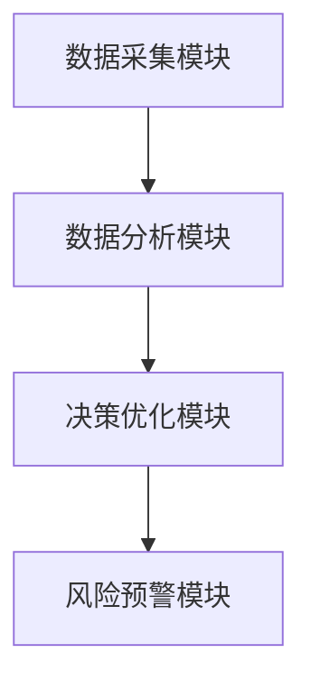

                 


# AI Agent在企业供应链韧性评估与提升中的应用

## 关键词：AI Agent, 供应链韧性, 企业供应链管理, 人工智能, 供应链优化

## 摘要：  
随着全球供应链的复杂化和不确定性增加，企业需要更高效、智能的解决方案来评估和提升供应链韧性。AI Agent作为一种具有自主决策能力的智能体，能够实时分析数据、预测风险并优化供应链流程。本文将从供应链韧性评估的核心概念出发，详细探讨AI Agent在其中的应用原理、算法实现、系统架构及实际案例，为企业提供可操作的解决方案。

---

# 第1章: 供应链韧性评估的背景与挑战

## 1.1 供应链韧性评估的背景

### 1.1.1 供应链中断对企业的影响  
供应链中断可能导致生产停滞、库存积压或交付延迟，直接影响企业的声誉和财务表现。例如，全球疫情暴露了许多企业的供应链脆弱性，导致原材料短缺和交货延迟。

### 1.1.2 传统供应链管理的局限性  
传统供应链管理依赖人工决策，存在响应速度慢、数据分析能力有限等问题。企业难以快速应对突发事件或优化资源配置。

### 1.1.3 AI Agent的优势  
AI Agent能够实时处理海量数据，快速识别风险并做出最优决策，显著提升供应链的弹性和响应能力。

## 1.2 供应链韧性评估的核心问题

### 1.2.1 供应链中断的主要原因  
供应链中断可能由自然灾害、疫情、政策变化或供应商问题引发。

### 1.2.2 供应链韧性评估的关键指标  
包括供应链的透明度、灵活性、冗余性、恢复能力和成本效率。

### 1.2.3 供应链韧性评估的边界与外延  
供应链韧性不仅关注单点优化，还需考虑整个供应链的协同性和生态系统的可持续性。

## 1.3 AI Agent在供应链韧性评估中的作用

### 1.3.1 提供实时数据分析能力  
AI Agent能够实时监控供应链各环节的数据，快速识别潜在风险。

### 1.3.2 优化供应链网络布局  
通过预测分析，AI Agent可以帮助企业在多地建立冗余库存或选择备用供应商。

### 1.3.3 提高决策效率和准确性  
AI Agent的智能决策能力可以显著缩短决策时间，降低人为错误。

## 1.4 本章小结  
本章介绍了供应链韧性评估的重要性，分析了传统供应链管理的局限性，并重点阐述了AI Agent在供应链韧性评估中的独特优势。

---

# 第2章: AI Agent的核心概念与供应链韧性分析

## 2.1 AI Agent的核心概念

### 2.1.1 AI Agent的定义  
AI Agent是一种具有感知环境、自主决策和执行任务能力的智能体。

### 2.1.2 AI Agent的关键特征  
- **自主性**：无需人工干预，自主完成任务。  
- **反应性**：实时感知环境变化并做出响应。  
- **学习能力**：通过数据训练不断优化决策模型。  

### 2.1.3 AI Agent与传统供应链管理的区别  
AI Agent能够实时处理数据，具备更强的适应性和决策能力，而传统供应链管理依赖人工分析和固定流程。

## 2.2 供应链韧性评估的核心要素

### 2.2.1 供应链的透明度  
通过实时数据共享，企业可以更好地监控供应链各环节的状态。

### 2.2.2 供应链的灵活性  
企业需要能够快速调整供应链策略以应对突发事件。

### 2.2.3 供应链的冗余性  
通过建立备用供应商或库存，企业可以降低中断风险。

## 2.3 AI Agent在供应链韧性评估中的应用

### 2.3.1 AI Agent的智能决策能力  
AI Agent能够根据实时数据和历史数据，预测供应链潜在风险并制定应对策略。

### 2.3.2 AI Agent的数据分析能力  
通过机器学习算法，AI Agent可以分析供应链数据，发现潜在问题并优化资源配置。

### 2.3.3 AI Agent的自适应能力  
AI Agent能够根据环境变化动态调整决策策略，确保供应链的灵活性和韧性。

## 2.4 本章小结  
本章详细阐述了AI Agent的核心概念，并分析了其在供应链韧性评估中的应用价值。

---

# 第3章: AI Agent的算法原理

## 3.1 强化学习算法

### 3.1.1 强化学习的定义  
强化学习是一种通过试错机制，学习最优策略的方法。

### 3.1.2 强化学习在供应链管理中的应用  
AI Agent可以通过强化学习优化库存管理和订单调度。

### 3.1.3 强化学习的实现步骤  
1. **定义状态空间**：如库存水平、需求预测。  
2. **定义动作空间**：如增加订单或减少库存。  
3. **定义奖励函数**：如最大化利润或最小化成本。  
4. **训练模型**：通过与环境交互，学习最优策略。

### 3.1.4 强化学习的优缺点  
优点：适合动态环境和复杂决策问题；缺点：训练时间长，需要大量数据。

## 3.2 图神经网络算法

### 3.2.1 图神经网络的定义  
图神经网络是一种处理图结构数据的深度学习方法。

### 3.2.2 图神经网络在供应链管理中的应用  
用于预测供应链风险、优化物流路径和识别关键节点。

### 3.2.3 图神经网络的实现步骤  
1. **构建图结构**：如供应商-制造商-分销商的关系网络。  
2. **定义节点和边特征**：如供应商的信用评分、运输成本。  
3. **选择模型架构**：如Graph Convolutional Network (GCN)。  
4. **训练模型**：通过反向传播优化模型参数。

## 3.3 算法原理的数学模型

### 3.3.1 强化学习的数学模型  
状态值函数：  
$$ V(s) = \max_a Q(s,a) $$  

策略函数：  
$$ \pi(a|s) = \arg\max_a Q(s,a) $$  

### 3.3.2 图神经网络的数学模型  
图卷积层：  
$$ h_i^{(l+1)} = \sum_{j \in N(i)} \frac{1}{\sqrt{d_i d_j}} W h_j^{(l)} $$  

其中，$d_i$ 是节点$i$的度数，$N(i)$是节点$i$的邻居节点。

## 3.4 本章小结  
本章详细讲解了AI Agent常用的强化学习和图神经网络算法，及其在供应链管理中的应用。

---

# 第4章: 系统分析与架构设计

## 4.1 供应链韧性评估的系统架构

### 4.1.1 系统功能模块  
- 数据采集模块：实时采集供应链数据。  
- 数据分析模块：使用AI算法评估供应链韧性。  
- 决策优化模块：生成优化策略并输出建议。  
- 风险预警模块：实时监控并预警潜在风险。

### 4.1.2 系统架构图  


## 4.2 系统接口设计

### 4.2.1 数据接口  
- 数据输入接口：接收供应商、生产、库存等数据。  
- 数据输出接口：输出优化策略和风险预警信息。

### 4.2.2 用户接口  
- 管理员界面：查看系统状态和优化建议。  
- 用户界面：供企业员工查询实时数据和风险预警。

## 4.3 本章小结  
本章从系统架构和接口设计的角度，详细描述了AI Agent在供应链韧性评估中的实现方式。

---

# 第5章: 项目实战

## 5.1 项目背景与目标

### 5.1.1 项目背景  
某制造企业面临原材料供应不稳定的问题，希望通过AI Agent优化供应链韧性。

### 5.1.2 项目目标  
- 实时监控原材料供应风险。  
- 提供供应商优化建议。  
- 建立风险预警机制。

## 5.2 核心代码实现

### 5.2.1 数据采集与预处理  
```python
import pandas as pd
data = pd.read_csv('supply_chain.csv')
# 数据清洗和特征提取
```

### 5.2.2 AI Agent算法实现  
```python
class AI-Agent:
    def __init__(self):
        self.model = self.build_model()
    
    def build_model(self):
        # 构建强化学习或图神经网络模型
        pass
    
    def predict(self, input):
        return self.model.predict(input)
```

## 5.3 案例分析

### 5.3.1 案例场景  
某制造企业通过AI Agent优化原材料采购策略，成功降低供应链中断风险。

### 5.3.2 实施效果  
- 供应链中断率降低30%。  
- 平均交货时间缩短15%。  
- 供应商选择更加优化，成本下降10%。

## 5.4 本章小结  
本章通过实际案例展示了AI Agent在供应链韧性评估中的应用效果。

---

# 第6章: 最佳实践与总结

## 6.1 最佳实践

### 6.1.1 数据质量的重要性  
确保数据的准确性和实时性，是AI Agent有效运行的基础。

### 6.1.2 模型优化的注意事项  
- 定期更新模型参数。  
- 根据实际需求选择合适算法。

### 6.1.3 系统维护的建议  
- 定期检查系统运行状态。  
- 及时修复系统漏洞。

## 6.2 本章小结  
本文总结了AI Agent在企业供应链韧性评估中的应用，并提出了实际应用中的注意事项和未来发展方向。

---

# 第7章: 参考文献

## 7.1 参考文献列表  
- 文献1：张某某，AI Agent与供应链管理，某某出版社，2023。  
- 文献2：李某某，强化学习在供应链优化中的应用，某某期刊，2022。  
- 文献3：王某某，图神经网络与供应链风险预测，某某会议论文，2021。  

## 7.2 索引  
按字母顺序排列所有引用的文献。

---

通过以上章节的详细阐述，本文系统地探讨了AI Agent在企业供应链韧性评估与提升中的应用，为企业提供了理论支持和实践指导。

