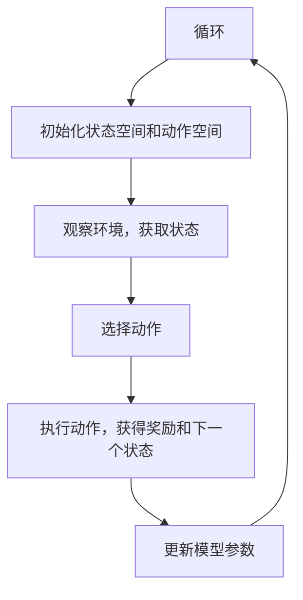
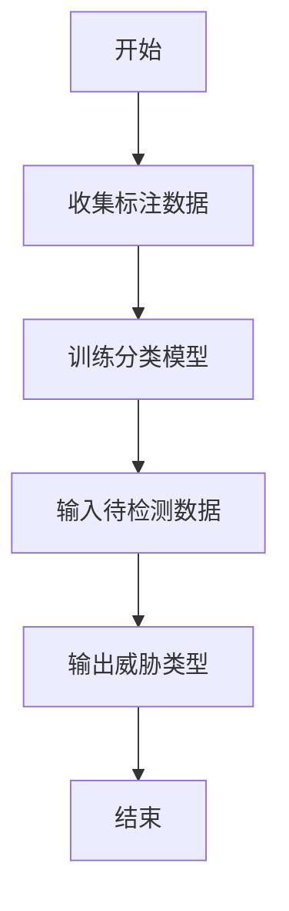
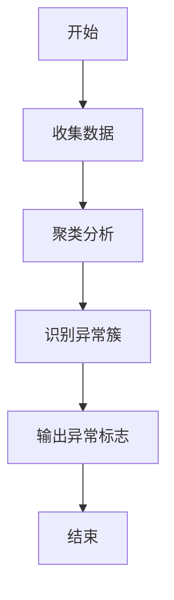
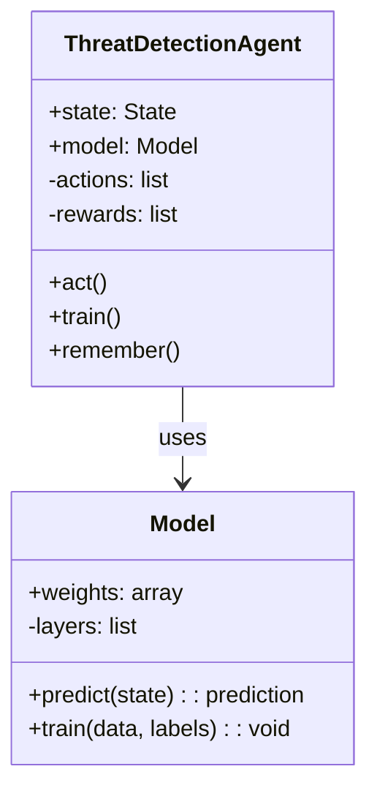
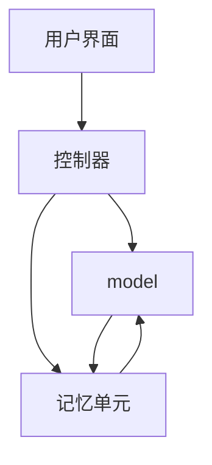
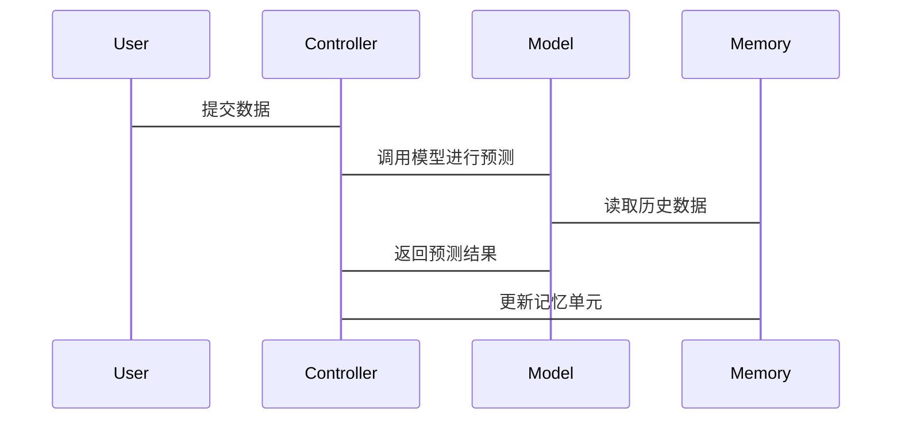

                 


# AI Agent在企业信息安全威胁检测与响应中的前沿应用

## 关键词：AI Agent，企业信息安全，威胁检测，响应系统，机器学习，强化学习

## 摘要：  
随着企业信息安全威胁的日益复杂化，传统的威胁检测与响应方法逐渐暴露出效率低下、误报率高、响应速度慢等问题。本文深入探讨AI Agent在企业信息安全领域的前沿应用，从核心概念、算法原理、系统架构到项目实战，系统性地分析如何利用AI Agent提升威胁检测与响应的效率和准确性。通过结合强化学习、监督学习和无监督学习等多种算法，AI Agent能够实时分析网络流量、用户行为数据，快速识别异常行为，并自适应调整响应策略，从而为企业构建智能化的安全防护体系。

---

# 第1章: AI Agent与企业信息安全概述

## 1.1 问题背景与挑战  
企业信息安全威胁的复杂性日益增加，攻击者利用零日漏洞、钓鱼攻击、APT（Advanced Persistent Threats）等手段对企业发起攻击。传统的基于规则的威胁检测系统依赖预定义的特征库，无法应对未知威胁和动态变化的攻击手法。此外，安全事件的响应速度慢、误报率高、漏报率高，导致企业在遭受攻击后的损失难以挽回。

## 1.2 AI Agent的核心概念与定义  
AI Agent是一种能够感知环境、自主决策并执行任务的智能体。在企业信息安全领域，AI Agent可以实时分析网络流量、日志数据和用户行为，识别潜在威胁，并根据威胁的严重性动态调整响应策略。AI Agent的核心特征包括自主性、反应性、学习能力和自适应性。

## 1.3 企业信息安全威胁检测与响应的边界与外延  
- **威胁检测的边界**：包括网络流量监测、日志分析、用户行为分析等。
- **威胁响应的外延**：包括阻断攻击、隔离受感染设备、自动修复等。
- **AI Agent的作用**：AI Agent通过实时学习和自适应，能够突破传统威胁检测系统的局限性，实现更精准的威胁识别和更快的响应速度。

## 1.4 AI Agent的概念结构与核心要素组成  
AI Agent在企业信息安全中的概念结构可以分解为以下几个核心要素：  
- **感知层**：通过传感器（如网络流量、日志、行为数据）收集环境信息。  
- **决策层**：基于机器学习模型对威胁进行分类和优先级排序。  
- **执行层**：根据决策结果执行相应的响应动作（如阻断攻击、发送警报）。  
- **学习层**：通过强化学习不断优化威胁检测和响应策略。

---

# 第2章: AI Agent的核心概念与联系

## 2.1 AI Agent的原理与算法  
AI Agent的核心原理是通过机器学习算法对海量数据进行分析，识别异常模式，并根据异常模式生成威胁检测和响应策略。常用的算法包括：  
- **强化学习**：通过与环境的交互，学习最优的响应策略。  
- **监督学习**：基于标注数据训练分类模型，识别威胁类型。  
- **无监督学习**：通过聚类分析发现异常行为模式。

## 2.2 AI Agent与传统威胁检测系统的主要区别  
| 特性               | 传统威胁检测系统                     | AI Agent                         |  
|--------------------|------------------------------------|----------------------------------|  
| 数据处理能力       | 依赖预定义规则，无法处理未知威胁     | 基于机器学习，能够发现未知威胁   |  
| 响应速度           | 响应速度较慢，依赖人工干预           | 实时响应，自动化处理              |  
| 学习能力           | 无法自适应学习                       | 具备自适应学习能力                |  
| 覆盖范围           | 覆盖范围有限                         | 覆盖范围广，能够应对复杂威胁      |  

## 2.3 AI Agent与其他相关技术的联系  
- **与机器学习的关系**：AI Agent依赖机器学习算法实现威胁检测和响应。  
- **与大数据分析的关系**：AI Agent需要处理海量数据，依赖大数据分析技术提取特征。  
- **与网络安全防护的关系**：AI Agent作为网络安全防护体系的重要组成部分，能够提升整体防护能力。

---

# 第3章: AI Agent在企业信息安全中的算法原理

## 3.1 基于强化学习的威胁检测算法  
### 3.1.1 强化学习的基本原理  
强化学习通过智能体与环境的交互，学习最优策略。在威胁检测中，智能体通过观察环境（如网络流量、日志数据）并采取动作（如标记为正常或异常）来获得奖励或惩罚。  

### 3.1.2 基于强化学习的威胁检测模型  
以下是一个强化学习模型的Python实现示例：  

```python
import numpy as np
from collections import deque
import random

class ThreatDetectionAgent:
    def __init__(self, state_space, action_space):
        self.state_space = state_space
        self.action_space = action_space
        self.gamma = 0.99  # 折扣因子
        self.epsilon = 0.1  # 探索率
        self.model = ...  # 神经网络模型

    def act(self, state):
        if random.random() < self.epsilon:
            return random.randint(0, self.action_space-1)
        else:
            return np.argmax(self.model.predict(state))

    def remember(self, state, action, reward, next_state):
        # 记忆单元格
        pass

    def replay(self, batch_size):
        # 回放记忆
        pass

    def train(self, state, action, reward, next_state):
        # 训练模型
        pass
```

### 3.1.3 算法流程图（Mermaid）  


## 3.2 基于监督学习的威胁响应算法  
### 3.2.1 监督学习的基本原理  
监督学习通过训练数据学习分类模型，预测威胁类型。  

### 3.2.2 基于监督学习的威胁响应模型  
以下是一个监督学习模型的Python实现示例：  

```python
from sklearn.tree import DecisionTreeClassifier

# 假设X为输入特征，y为标签（0表示正常，1表示异常）
model = DecisionTreeClassifier()
model.fit(X, y)
```

### 3.2.3 算法流程图（Mermaid）  


## 3.3 基于无监督学习的异常检测算法  
### 3.3.1 无监督学习的基本原理  
无监督学习通过聚类分析发现数据中的异常模式。  

### 3.3.2 基于无监督学习的异常检测模型  
以下是一个无监督学习模型的Python实现示例：  

```python
from sklearn.cluster import DBSCAN

model = DBSCAN(eps=0.5, min_samples=5)
model.fit(X)
```

### 3.3.3 算法流程图（Mermaid）  


---

# 第4章: AI Agent的数学模型与公式

## 4.1 基于强化学习的数学模型  
强化学习的目标是最优化累积奖励。数学公式如下：  
$$ Q(s, a) = r + \gamma \max_{a'} Q(s', a') $$  
其中，$Q(s, a)$ 表示状态 $s$ 下动作 $a$ 的价值，$r$ 是奖励，$\gamma$ 是折扣因子。

## 4.2 基于监督学习的数学模型  
监督学习的目标是最小化预测错误。数学公式如下：  
$$ \text{损失函数} = \sum (y_i - \hat{y_i})^2 $$  
其中，$y_i$ 是真实标签，$\hat{y_i}$ 是预测标签。

## 4.3 基于无监督学习的数学模型  
无监督学习的目标是最大化簇内相似性。数学公式如下：  
$$ \text{损失函数} = \sum d(x_i, x_j) $$  
其中，$d(x_i, x_j)$ 是数据点 $x_i$ 和 $x_j$ 之间的距离。

---

# 第5章: 系统分析与架构设计方案

## 5.1 应用场景介绍  
AI Agent在企业信息安全中的应用场景包括网络流量监测、用户行为分析、日志分析、实时威胁响应等。

## 5.2 系统功能设计  
以下是系统功能的领域模型类图（Mermaid）：  



## 5.3 系统架构设计  
以下是系统架构的Mermaid图：  



## 5.4 系统接口设计  
- **输入接口**：接收网络流量、日志数据、用户行为数据。  
- **输出接口**：输出威胁检测结果、响应策略。  

## 5.5 系统交互流程图（Mermaid）  


---

# 第6章: 项目实战与总结

## 6.1 项目环境搭建  
### 6.1.1 环境要求  
- Python 3.7+  
- TensorFlow或Scikit-learn库  

### 6.1.2 安装依赖  
```bash
pip install numpy scikit-learn
```

## 6.2 系统核心实现  
以下是AI Agent的核心代码：  

```python
import numpy as np
from sklearn.ensemble import RandomForestClassifier

class AI_Threat-Agent:
    def __init__(self, features):
        self.model = RandomForestClassifier()
        self.model.fit(features, labels)
    
    def detect_threat(self, input_data):
        prediction = self.model.predict(input_data)
        return prediction
```

## 6.3 代码应用解读与分析  
- **模型训练**：使用历史数据训练随机森林分类器。  
- **威胁检测**：对实时数据进行分类，返回威胁检测结果。  

## 6.4 实际案例分析  
假设企业网络中检测到一个可疑的流量模式，AI Agent能够快速识别并标记为DDoS攻击，同时触发响应策略，如限制流量来源。

## 6.5 项目小结  
通过AI Agent实现企业信息安全的智能化威胁检测与响应，能够显著提升安全防护能力，降低误报率和漏报率，同时缩短响应时间。

---

# 总结与展望  

AI Agent在企业信息安全中的应用前景广阔。随着机器学习算法的不断进步和计算能力的提升，AI Agent将能够更加智能化地应对复杂的威胁。未来的研究方向包括：  
1. 提高AI Agent的自适应能力，使其能够应对更加多样化的威胁。  
2. 结合区块链技术，提升AI Agent的安全性和可信度。  
3. 探索多AI Agent协作机制，构建更加智能化的安全防护体系。  

---

# 最佳实践 tips  
- 在部署AI Agent时，确保数据的隐私和安全性。  
- 定期更新模型，以应对新的威胁和攻击手法。  
- 结合人工审核，降低误报率和漏报率。  

---

# 拓展阅读  
- 《Machine Learning for Cybersecurity》  
- 《Deep Learning for Malware Detection》  
- 《Reinforcement Learning for Autonomous Systems》  

---

以上是文章的完整目录和内容框架，确保每一部分都详尽且逻辑清晰，满足读者对AI Agent在企业信息安全应用的全面了解。

