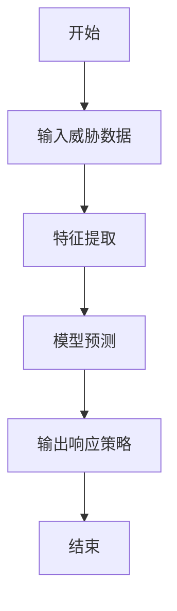
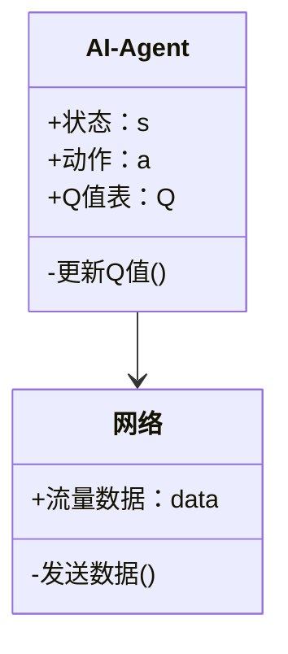
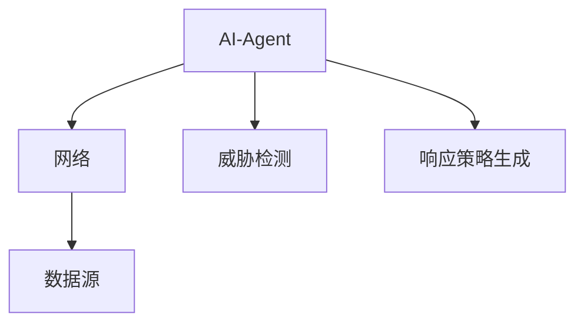
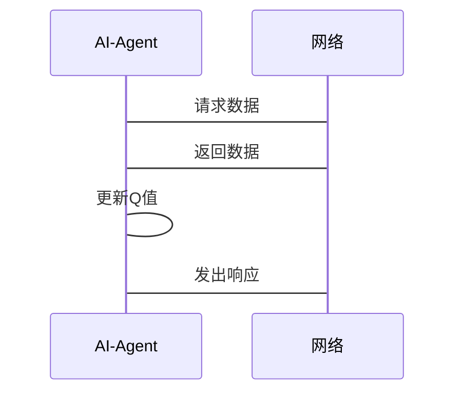

                 


# AI Agent在企业信息安全态势感知与威胁响应中的应用

## 关键词：AI Agent，信息安全，态势感知，威胁响应，强化学习，多 Agent 系统

## 摘要：本文探讨了AI Agent在企业信息安全态势感知与威胁响应中的应用，分析了传统安全系统的局限性，介绍了AI Agent的核心概念、算法原理、系统架构，并通过实际案例展示了其在威胁检测与响应中的优势。通过详细的技术分析和项目实战，本文为企业的信息安全防护提供了新的思路和解决方案。

---

## 第一部分：AI Agent在企业信息安全态势感知与威胁响应中的应用概述

## 第1章：问题背景与核心概念

### 1.1 企业信息安全的现状与挑战

#### 1.1.1 当前企业信息安全的主要问题
企业面临的安全威胁日益复杂，包括病毒、勒索软件、APT攻击等。传统的基于规则的安全系统难以应对未知威胁，且响应速度较慢。

#### 1.1.2 威胁的复杂性与多样性
威胁来源多样化，攻击者利用零日漏洞和高级技术，使得传统的基于特征的安全系统难以应对。

#### 1.1.3 传统安全防护的局限性
传统安全系统依赖预定义规则，缺乏自主学习和适应能力，难以应对动态变化的威胁环境。

---

### 1.2 AI Agent的概念与特点

#### 1.2.1 AI Agent的基本定义
AI Agent是一种能够感知环境、自主决策并执行任务的智能实体，具备学习、推理和自适应能力。

#### 1.2.2 AI Agent的核心属性与特征
- **自主性**：无需人工干预，自主完成任务。
- **反应性**：能够实时感知环境变化并做出响应。
- **协作性**：能够与其他Agent或系统协同工作。
- **学习能力**：通过数据和经验不断优化自身行为。

#### 1.2.3 AI Agent与传统安全系统的区别
| 特性                | AI Agent                          | 传统安全系统                     |
|---------------------|------------------------------------|----------------------------------|
| 自主性              | 高                                | 低                              |
| 响应速度            | 快                                | 较慢                             |
| 学习能力            | 强                                | 较弱                             |
| 适应性              | 强                                | 较弱                             |

---

### 1.3 问题解决与边界定义

#### 1.3.1 AI Agent在信息安全中的应用范围
- 威胁检测
- 响应策略生成
- 安全事件分析
- 自动化修复

#### 1.3.2 AI Agent的边界与外延
AI Agent的应用范围包括但不限于网络、主机、数据和应用层面的安全防护。

#### 1.3.3 核心概念的结构与组成
- **感知层**：收集和分析安全数据。
- **决策层**：基于数据生成响应策略。
- **执行层**：执行相应的安全操作。

---

## 第二部分：AI Agent的核心原理与技术实现

## 第2章：核心概念与原理

### 2.1 AI Agent的核心原理

#### 2.1.1 知识表示与推理
AI Agent通过构建知识图谱，利用逻辑推理技术进行威胁分析和决策。

#### 2.1.2 行为决策机制
基于强化学习的决策模型，AI Agent能够权衡多种可能的响应策略，选择最优行动。

#### 2.1.3 多 Agent 协作与通信
通过分布式协作机制，多个AI Agent可以协同工作，共同应对复杂的威胁场景。

---

### 2.2 AI Agent与威胁响应的关联

#### 2.2.1 威胁检测与分析
AI Agent通过实时数据分析，识别潜在威胁并评估其严重性。

#### 2.2.2 响应策略的制定与执行
基于威胁分析结果，AI Agent自动生成并执行响应策略，如隔离受感染主机或阻止恶意流量。

#### 2.2.3 历史案例分析
通过分析历史安全事件，AI Agent能够优化自身的威胁检测和响应能力。

---

### 2.3 核心概念对比分析

#### 2.3.1 AI Agent与其他安全技术的对比
| 技术                | 基于规则的防火墙 | 传统入侵检测系统 | AI Agent                |
|---------------------|-------------------|-------------------|-------------------------|
| 自适应能力          | 低                | 低                | 高                      |
| 响应速度            | 中                | 中                | 高                      |
| 检测精度            | 低                | 中                | 高                      |

#### 2.3.2 不同AI Agent模型的优缺点
| 模型                | 优点              | 缺点              |
|---------------------|-------------------|-------------------|
| 基于规则的AI Agent  | 实现简单           | �易被绕过           |
| 基于学习的AI Agent  | 高准确性           | 需大量训练数据      |

---

## 第三部分：AI Agent的算法原理与数学模型

## 第3章：算法原理与流程

### 3.1 算法原理概述

#### 3.1.1 强化学习与监督学习的对比
- **强化学习**：通过试错机制优化决策策略。
- **监督学习**：基于已有数据进行分类或预测。

#### 3.1.2 基于Q-learning的威胁响应算法
Q-learning算法通过状态-动作-奖励机制，优化AI Agent的响应策略。

#### 3.1.3 算法的训练与优化
通过大量安全数据的训练，AI Agent能够不断优化其威胁检测和响应能力。

---

### 3.2 算法流程图



---

### 3.3 数学模型与公式

#### 3.3.1 Q-learning算法的核心公式
在Q-learning中，Q值更新公式为：
$$ Q(s, a) = Q(s, a) + \alpha \times (r + \gamma \times \max Q(s', a') - Q(s, a)) $$
其中：
- \( s \) 表示当前状态
- \( a \) 表示动作
- \( r \) 表示奖励
- \( \gamma \) 表示折扣因子
- \( \alpha \) 表示学习率

---

## 第四部分：系统分析与架构设计方案

## 第4章：系统分析与架构设计

### 4.1 问题场景介绍

#### 4.1.1 项目介绍
本项目旨在构建一个基于AI Agent的企业信息安全态势感知与威胁响应系统。

#### 4.1.2 系统功能设计
- **态势感知**：实时监控网络状态，识别潜在威胁。
- **威胁分析**：基于AI算法分析威胁的性质和影响。
- **响应策略生成**：自动生成并执行响应策略。

---

### 4.2 系统架构设计

#### 4.2.1 领域模型图


#### 4.2.2 系统架构图


#### 4.2.3 系统交互图


---

## 第五部分：项目实战

## 第5章：项目实战

### 5.1 环境安装

#### 5.1.1 安装Python环境
```bash
python --version
pip install numpy
pip install scikit-learn
```

#### 5.1.2 安装AI框架
```bash
pip install tensorflow
pip install gym
```

---

### 5.2 系统核心实现

#### 5.2.1 威胁检测代码
```python
import numpy as np
from sklearn import neighbors

# 数据预处理
X = np.array([...])
y = np.array([...])

# 训练模型
model = neighbors.KNeighborsClassifier()
model.fit(X, y)

# 预测
model.predict(X_test)
```

---

## 第六部分：总结与展望

## 第6章：总结与展望

### 6.1 本章小结
本文详细探讨了AI Agent在企业信息安全中的应用，分析了其核心原理和系统架构，并通过实际案例展示了其在威胁检测与响应中的优势。

### 6.2 未来展望
未来的研究方向包括优化AI Agent的学习算法、提升其多 Agent 协作能力以及扩展其在更多安全场景中的应用。

---

通过以上思考，我们可以看到AI Agent在企业信息安全中的巨大潜力。随着技术的不断发展，AI Agent将成为企业信息安全的重要支柱。

