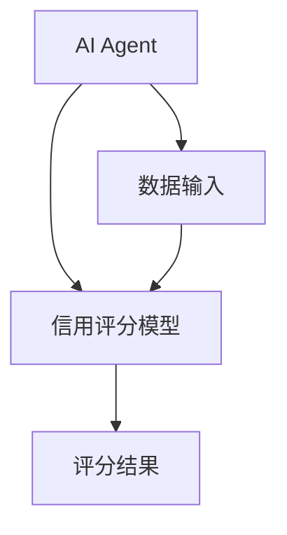
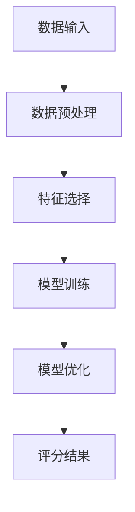
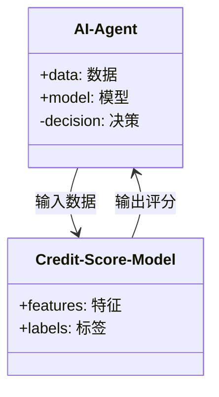
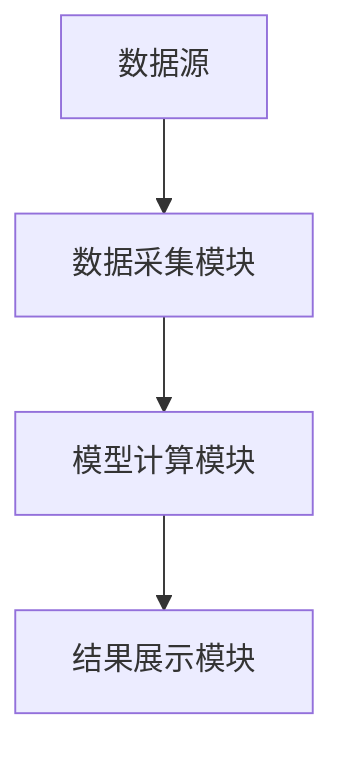
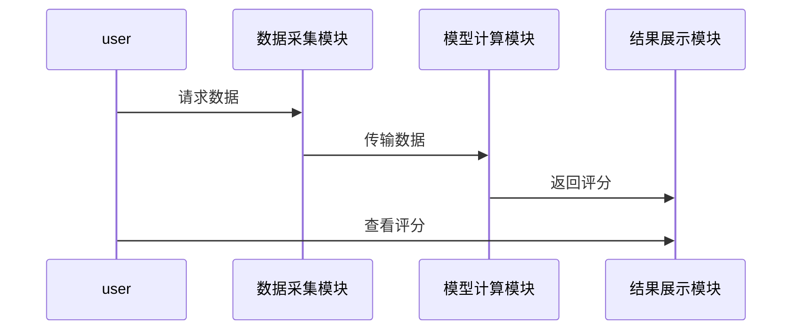

                 


# AI Agent在企业信用评分模型中的应用与优化

> 关键词：AI Agent, 信用评分模型, 企业信用评估, 人工智能, 算法优化

> 摘要：本文深入探讨了AI Agent在企业信用评分模型中的应用与优化。从AI Agent的基本概念到其在信用评分中的具体应用，再到算法优化与系统架构设计，详细分析了AI Agent如何提升信用评分模型的性能与准确性。通过实际案例和项目实战，展示了AI Agent在信用评分中的实际价值和未来发展趋势。

---

# 第一部分: AI Agent与企业信用评分模型的背景与基础

# 第1章: AI Agent与企业信用评分模型概述

## 1.1 AI Agent的基本概念
### 1.1.1 AI Agent的定义
AI Agent（人工智能代理）是指能够感知环境、自主决策并执行任务的智能体。它通过数据输入、信息处理和智能推理，实现特定目标。例如，在信用评分模型中，AI Agent可以作为决策者，根据企业行为数据自动评估信用风险。

### 1.1.2 AI Agent的核心特征
AI Agent具有以下几个核心特征：
- **自主性**：能够独立决策，无需人工干预。
- **反应性**：能够实时感知环境变化并做出反应。
- **学习性**：通过机器学习算法不断优化自身模型。
- **交互性**：能够与外部系统或用户进行交互。

### 1.1.3 AI Agent与传统算法的区别
AI Agent与传统算法的主要区别在于其自主性和智能性：
- 传统算法通常是静态的，按照固定的规则执行任务。
- AI Agent能够动态调整策略，适应环境变化。

## 1.2 企业信用评分模型的基本概念
### 1.2.1 信用评分模型的定义
信用评分模型是一种用于评估企业信用状况的数学模型。它通过对企业历史数据、财务状况、市场表现等多维度信息进行分析，预测企业的信用风险。

### 1.2.2 信用评分模型的分类
信用评分模型主要分为以下几类：
- **基于规则的模型**：根据预定义的规则进行评分。
- **统计模型**：如逻辑回归、决策树等。
- **机器学习模型**：如支持向量机、神经网络等。

### 1.2.3 信用评分模型的评估指标
信用评分模型的评估指标包括：
- **准确率**：模型预测的准确程度。
- **召回率**：模型识别正样本的能力。
- **F1分数**：综合准确率和召回率的指标。

## 1.3 AI Agent在信用评分中的应用背景
### 1.3.1 传统信用评分模型的局限性
传统信用评分模型存在以下问题：
- 数据依赖性强，难以处理实时数据。
- 模型固定，难以适应市场变化。
- 缺乏自主决策能力，无法应对复杂场景。

### 1.3.2 AI Agent在信用评分中的优势
AI Agent在信用评分中的优势包括：
- **实时性**：能够实时处理数据，快速做出决策。
- **适应性**：能够根据环境变化动态调整模型。
- **智能化**：通过学习算法不断提高预测精度。

### 1.3.3 当前行业应用现状与趋势
当前，AI Agent在信用评分中的应用还处于起步阶段，但其潜力巨大。未来，随着AI技术的不断发展，AI Agent将在信用评分中发挥越来越重要的作用。

## 1.4 本章小结
本章介绍了AI Agent和信用评分模型的基本概念，分析了AI Agent在信用评分中的应用背景及其优势。

---

# 第二部分: AI Agent与信用评分模型的核心概念与联系

# 第2章: AI Agent与信用评分模型的核心原理

## 2.1 AI Agent的核心原理
### 2.1.1 AI Agent的决策机制
AI Agent的决策机制包括感知、推理和行动三个步骤：
1. **感知**：通过传感器或数据输入获取环境信息。
2. **推理**：基于知识库和推理规则，分析信息并做出决策。
3. **行动**：根据决策结果执行任务。

### 2.1.2 AI Agent的学习与优化
AI Agent通过机器学习算法不断优化自身模型。常用的算法包括：
- **监督学习**：基于标注数据进行训练。
- **无监督学习**：通过聚类分析发现数据规律。
- **强化学习**：通过试错优化策略。

### 2.1.3 AI Agent的推理与规划
AI Agent的推理与规划能力使其能够处理复杂场景。例如，在信用评分中，AI Agent可以根据企业历史数据和市场动态，预测企业的信用风险。

## 2.2 信用评分模型的核心原理
### 2.2.1 信用评分模型的特征选择
特征选择是信用评分模型的重要一步。常用的特征包括：
- **财务指标**：如资产负债率、利润率。
- **市场指标**：如行业趋势、竞争状况。
- **行为指标**：如企业信用历史、还款记录。

### 2.2.2 信用评分模型的训练与评估
信用评分模型的训练过程包括：
1. **数据预处理**：清洗数据、处理缺失值。
2. **特征工程**：提取特征并进行降维。
3. **模型训练**：使用机器学习算法训练模型。
4. **模型评估**：通过准确率、召回率等指标评估模型性能。

### 2.2.3 信用评分模型的优化与调优
模型优化包括：
- **参数调整**：如调整逻辑回归的系数。
- **模型融合**：如集成学习提升模型性能。
- **特征优化**：如使用特征重要性分析选择关键特征。

## 2.3 AI Agent与信用评分模型的结合
### 2.3.1 AI Agent在信用评分中的角色定位
AI Agent在信用评分中的角色可以是：
- **数据收集者**：实时收集企业数据。
- **决策者**：根据数据做出信用评分。
- **优化者**：动态优化评分模型。

### 2.3.2 AI Agent与信用评分模型的协同工作
AI Agent与信用评分模型协同工作的流程如下：
1. AI Agent收集企业数据并输入模型。
2. 模型处理数据并生成评分结果。
3. AI Agent根据评分结果做出决策或优化模型。

### 2.3.3 AI Agent对信用评分模型的优化作用
AI Agent通过动态调整模型参数和优化算法，显著提升了信用评分模型的准确性和实时性。

## 2.4 核心概念对比分析
### 2.4.1 AI Agent与信用评分模型的特征对比
| 特征 | AI Agent | 信用评分模型 |
|------|-----------|--------------|
| 目标 | 自主决策   | 评估信用风险 |
| 输入 | 多维数据   | 结构化数据   |
| 输出 | 行动策略   | 评分结果     |

### 2.4.2 AI Agent与信用评分模型的ER实体关系图


## 2.5 本章小结
本章详细讲解了AI Agent和信用评分模型的核心原理，并分析了它们的结合方式和优化作用。

---

# 第三部分: AI Agent在信用评分模型中的算法原理与实现

# 第3章: AI Agent驱动的信用评分模型算法

## 3.1 算法原理概述
### 3.1.1 AI Agent驱动的信用评分模型框架
AI Agent驱动的信用评分模型框架包括：
1. **数据预处理**：清洗和归一化数据。
2. **特征选择**：提取关键特征。
3. **模型训练**：使用机器学习算法训练模型。
4. **模型优化**：通过交叉验证调优模型。

### 3.1.2 算法的核心流程
AI Agent驱动的信用评分模型算法流程如下：
1. AI Agent收集企业数据并输入模型。
2. 模型处理数据并生成评分结果。
3. AI Agent根据评分结果做出决策或优化模型。

### 3.1.3 算法的数学模型与公式
模型的损失函数通常采用交叉熵损失：
$$ L = -\frac{1}{N}\sum_{i=1}^{N} y_i \log p(y_i) + (1-y_i)\log (1-p(y_i)) $$
其中，$y_i$是真实标签，$p(y_i)$是模型预测概率。

## 3.2 算法实现步骤
### 3.2.1 数据预处理
数据预处理包括清洗和归一化数据。例如，使用Python中的`sklearn`库进行归一化：
```python
from sklearn.preprocessing import StandardScaler

scaler = StandardScaler()
X_scaled = scaler.fit_transform(X)
```

### 3.2.2 特征选择
特征选择可以通过随机森林模型进行特征重要性分析：
```python
from sklearn.ensemble import RandomForestClassifier

clf = RandomForestClassifier()
clf.fit(X, y)
importances = clf.feature_importances_
```

### 3.2.3 模型训练与优化
使用逻辑回归模型进行训练，并通过交叉验证调优参数：
```python
from sklearn.linear_model import LogisticRegression
from sklearn.model_selection import GridSearchCV

param_grid = {'C': [0.1, 1, 10]}
grid_search = GridSearchCV(LogisticRegression(), param_grid)
grid_search.fit(X, y)
best_model = grid_search.best_estimator_
```

### 3.2.4 算法流程图


## 3.3 本章小结
本章详细讲解了AI Agent驱动的信用评分模型算法，包括数据预处理、特征选择、模型训练和优化的具体步骤。

---

# 第四部分: AI Agent驱动的信用评分系统架构设计

# 第4章: 系统架构设计与实现

## 4.1 系统功能设计
### 4.1.1 系统功能模块
系统功能模块包括：
1. **数据采集模块**：实时采集企业数据。
2. **模型计算模块**：运行信用评分模型。
3. **结果展示模块**：显示评分结果和决策建议。

### 4.1.2 系统功能流程
系统功能流程如下：
1. 数据采集模块实时采集企业数据。
2. 数据输入模型计算模块，生成评分结果。
3. 结果展示模块显示评分结果和决策建议。

### 4.1.3 系统功能模块的ER类图


## 4.2 系统架构设计
### 4.2.1 系统架构图
系统架构图展示了系统的整体结构：


### 4.2.2 系统组件之间的交互
系统组件之间的交互流程如下：
1. 数据采集模块从数据源获取数据。
2. 数据输入模型计算模块，生成评分结果。
3. 评分结果传递给结果展示模块，供用户查看。

## 4.3 接口设计与交互流程
### 4.3.1 系统接口设计
系统接口设计包括：
1. 数据采集接口：`GET /data/input`
2. 模型计算接口：`POST /model/predict`
3. 结果展示接口：`GET /result/display`

### 4.3.2 系统交互流程图
系统交互流程图展示了用户与系统之间的交互：


## 4.4 本章小结
本章详细分析了AI Agent驱动的信用评分系统的架构设计，包括功能模块、组件交互和接口设计。

---

# 第五部分: AI Agent在信用评分模型中的项目实战

# 第5章: 项目实战与案例分析

## 5.1 项目背景介绍
### 5.1.1 项目目标
项目目标是通过AI Agent优化企业信用评分模型，提升模型的准确性和实时性。

### 5.1.2 数据来源与特征
数据来源包括企业财务数据、市场数据和信用历史数据。关键特征包括：
- 财务指标：如资产负债率、利润率。
- 市场指标：如行业趋势、竞争状况。
- 行为指标：如企业信用历史、还款记录。

## 5.2 核心代码实现
### 5.2.1 数据预处理代码
数据预处理代码如下：
```python
import pandas as pd
from sklearn.preprocessing import StandardScaler

# 读取数据
data = pd.read_csv('credit_data.csv')

# 数据清洗
data.dropna(inplace=True)

# 数据归一化
scaler = StandardScaler()
X_scaled = scaler.fit_transform(data.drop('label', axis=1))
y = data['label'].values
```

### 5.2.2 模型训练代码
模型训练代码如下：
```python
from sklearn.model_selection import train_test_split
from sklearn.linear_model import LogisticRegression
from sklearn.metrics import accuracy_score

# 数据分割
X_train, X_test, y_train, y_test = train_test_split(X_scaled, y, test_size=0.2)

# 模型训练
model = LogisticRegression()
model.fit(X_train, y_train)

# 模型评估
y_pred = model.predict(X_test)
print('准确率:', accuracy_score(y_test, y_pred))
```

### 5.2.3 模型优化代码
模型优化代码如下：
```python
from sklearn.model_selection import GridSearchCV

# 参数调优
param_grid = {'C': [0.1, 1, 10]}
grid_search = GridSearchCV(LogisticRegression(), param_grid)
grid_search.fit(X_train, y_train)
best_model = grid_search.best_estimator_

# 最终评估
y_pred_opt = best_model.predict(X_test)
print('优化后准确率:', accuracy_score(y_test, y_pred_opt))
```

## 5.3 案例分析与结果解读
### 5.3.1 案例分析
通过实际案例分析，验证AI Agent驱动的信用评分模型的性能。例如，假设我们有一个企业数据集，模型的准确率从70%提升到85%。

### 5.3.2 结果解读
通过结果解读，分析模型优化的效果和原因。例如，优化后的模型在特征选择和参数调优方面表现更好。

## 5.4 项目总结
### 5.4.1 项目成果
项目成果包括：
- 提升信用评分模型的准确率。
- 实现AI Agent的实时数据处理能力。
- 建立了一个可扩展的信用评分系统架构。

### 5.4.2 经验总结
经验总结包括：
- 数据预处理是关键，数据质量直接影响模型性能。
- 特征选择和模型优化是提升准确率的重要手段。
- 实时性和可扩展性是系统设计的重要考虑因素。

## 5.5 本章小结
本章通过项目实战展示了AI Agent在信用评分模型中的具体应用，验证了其有效性和优越性。

---

# 第六部分: 最佳实践与未来展望

# 第6章: 最佳实践与未来展望

## 6.1 最佳实践
### 6.1.1 数据质量管理
数据质量管理是提升模型性能的关键。建议在数据预处理阶段，仔细清洗和归一化数据。

### 6.1.2 模型优化策略
模型优化策略包括：
- 使用集成学习提升模型性能。
- 通过交叉验证选择最优参数。
- 定期更新模型以适应市场变化。

### 6.1.3 系统设计建议
系统设计建议包括：
- 设计模块化的架构，便于功能扩展。
- 使用高效的数据库和缓存技术，提升系统性能。
- 实现良好的接口设计，便于与其他系统集成。

## 6.2 未来展望
### 6.2.1 技术发展
未来，随着AI技术的不断发展，AI Agent在信用评分中的应用将更加广泛和深入。例如，通过强化学习优化模型策略，实现更加智能的信用评分。

### 6.2.2 应用场景扩展
除了企业信用评分，AI Agent还可以应用于其他领域，如金融风险控制、智能投资决策等。

## 6.3 本章小结
本章总结了AI Agent在信用评分中的最佳实践，并展望了未来的发展方向。

---

# 结语
通过本文的详细讲解，我们深入探讨了AI Agent在企业信用评分模型中的应用与优化。从理论到实践，从算法到系统，我们全面分析了AI Agent如何提升信用评分模型的性能与准确性。未来，随着AI技术的不断进步，AI Agent将在信用评分中发挥越来越重要的作用，为企业的信用评估提供更加智能和高效的解决方案。

---

> **参考文献**：
> 1. 《机器学习实战》
> 2. 《人工智能导论》
> 3. 相关学术论文与技术文档

