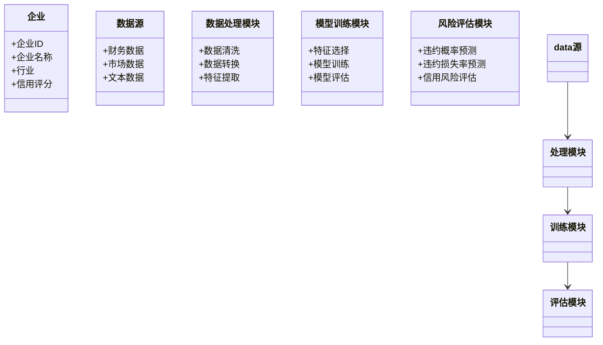
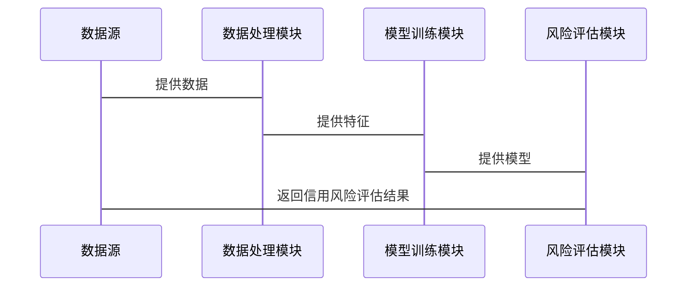

                 


# AI Agent在企业信用风险评估与管理中的应用

## 关键词：AI Agent，信用风险评估，企业信用管理，人工智能，风险评估

## 摘要：本文详细探讨了AI Agent在企业信用风险评估与管理中的应用。首先介绍了AI Agent和信用风险评估的基本概念，分析了AI Agent在信用风险评估中的核心技术和算法原理。然后，通过系统架构设计和项目实战，展示了AI Agent在信用风险评估中的具体实现方式。最后，总结了AI Agent在信用风险评估中的优势，并展望了未来的发展方向。

---

## 第1章: AI Agent与信用风险评估概述

### 1.1 AI Agent的基本概念

#### 1.1.1 AI Agent的定义
AI Agent（人工智能代理）是指能够感知环境、自主决策并执行任务的智能实体。它可以分为两类：**反应式AI Agent**和**认知式AI Agent**。反应式AI Agent基于当前感知做出反应，而认知式AI Agent则具备推理、规划和学习能力。

#### 1.1.2 AI Agent的核心特征
- **自主性**：AI Agent能够自主决策，无需人工干预。
- **反应性**：能够实时感知环境变化并做出反应。
- **学习能力**：通过数据和经验不断优化自身的决策能力。
- **适应性**：能够适应不同的环境和任务需求。

#### 1.1.3 AI Agent与传统算法的区别
传统算法通常需要明确的规则和固定的流程，而AI Agent具备自主性和学习能力，能够处理复杂和不确定的环境。

### 1.2 信用风险评估的基本概念

#### 1.2.1 信用风险的定义
信用风险是指债务人或交易对手未能履行其合同义务，导致债权人或投资者遭受损失的风险。

#### 1.2.2 信用风险评估的流程
1. 数据收集：收集企业的财务数据、市场数据和交易数据。
2. 数据处理：清洗、整理和转换数据，确保数据的准确性和完整性。
3. 模型选择：选择合适的信用风险评估模型。
4. 模型训练：利用历史数据训练模型，优化模型参数。
5. 风险评估：基于模型预测企业的信用风险等级。
6. 结果分析：分析模型预测结果，评估模型的准确性和稳定性。

#### 1.2.3 信用风险评估的指标体系
常用的信用风险评估指标包括：
- **信用评分**：衡量企业的信用状况。
- **违约概率（PD）**：预测企业在一定期限内违约的概率。
- **违约损失率（LGD）**：预测违约发生时的损失程度。
- **风险敞口**：企业面临的潜在风险损失。

### 1.3 AI Agent在信用风险评估中的应用价值

#### 1.3.1 提高风险评估的准确性
AI Agent能够处理大量非结构化数据，并结合机器学习算法，提高信用风险评估的准确性。

#### 1.3.2 提升风险评估的效率
通过自动化数据处理和模型训练，AI Agent能够显著提高信用风险评估的效率。

#### 1.3.3 降低风险评估的成本
AI Agent可以减少人工干预，降低信用风险评估的人力和时间成本。

### 1.4 本章小结
本章介绍了AI Agent和信用风险评估的基本概念，并分析了AI Agent在信用风险评估中的应用价值。

---

## 第2章: AI Agent与信用风险评估的核心概念

### 2.1 AI Agent的核心技术

#### 2.1.1 自然语言处理
自然语言处理（NLP）技术能够从文本数据中提取有用的信息，例如从企业新闻、财务报告中提取关键信息。

#### 2.1.2 机器学习
机器学习算法（如支持向量机、随机森林、神经网络）能够从历史数据中学习信用风险的特征，提高预测的准确性。

#### 2.1.3 强化学习
强化学习通过试错机制优化AI Agent的决策策略，能够在动态环境中适应信用风险的变化。

### 2.2 信用风险评估的数学模型

#### 2.2.1 信用评分模型
信用评分模型通常采用Logistic回归、XGBoost等算法。例如，Logistic回归的公式为：

$$ P(y=1|x) = \frac{e^{\beta x}}{1 + e^{\beta x}} $$

其中，$y$表示违约情况（1表示违约，0表示不违约），$x$表示企业的特征变量，$\beta$表示模型参数。

#### 2.2.2 信用评级模型
信用评级模型常用的指标包括Z值模型和Altman Z’值模型。Altman Z’值模型的公式为：

$$ Z' = 1.2a + 6.0b + 1.0c + 4.0d + 0.6e $$

其中，$a$表示流动资产与流动负债的比率，$b$表示速动资产与流动负债的比率，$c$表示流动资产与总负债的比率，$d$表示息税前利润与总负债的比率，$e$表示所有者权益与总负债的比率。

#### 2.2.3 信用风险的数学公式
信用风险可以通过违约概率（PD）和违约损失率（LGD）的乘积来衡量：

$$ \text{信用风险} = PD \times LGD $$

### 2.3 AI Agent与信用风险评估的结合

#### 2.3.1 数据采集与处理
AI Agent能够从多种数据源（如企业财务报表、新闻、市场数据）中采集数据，并通过NLP技术处理文本数据。

#### 2.3.2 模型训练与优化
通过机器学习算法训练信用风险模型，并利用强化学习优化模型的决策策略。

#### 2.3.3 结果分析与反馈
AI Agent能够实时分析信用风险评估结果，并根据反馈不断优化模型。

### 2.4 本章小结
本章详细介绍了AI Agent的核心技术，并展示了这些技术在信用风险评估中的具体应用。

---

## 第3章: 信用风险评估的理论基础

### 3.1 信用评分模型

#### 3.1.1 信用评分的定义
信用评分是对企业信用状况的量化评估，通常采用分数表示，分数越高，信用风险越低。

#### 3.1.2 信用评分的计算方法
常用的信用评分方法包括线性回归、逻辑回归、XGBoost等。例如，逻辑回归模型的公式为：

$$ P(y=1|x) = \frac{e^{\beta x}}{1 + e^{\beta x}} $$

#### 3.1.3 信用评分的评价指标
常用的评价指标包括准确率、召回率、F1分数等。

### 3.2 信用评级方法

#### 3.2.1 信用评级的定义
信用评级是对企业信用状况的等级划分，通常分为AAA、AA、A、BBB、BB、B、CCC、DD等等级。

#### 3.2.2 信用评级的分类
信用评级可以分为外部评级和内部评级，外部评级由专业的评级机构进行，内部评级由企业内部进行。

#### 3.2.3 信用评级的实现步骤
1. 收集企业数据。
2. 数据预处理。
3. 选择评级模型。
4. 训练模型。
5. 评估模型。

### 3.3 传统信用风险评估的局限性

#### 3.3.1 数据不足的问题
传统信用风险评估通常依赖于有限的数据，难以全面评估企业的信用风险。

#### 3.3.2 模型简单的问题
传统模型通常较为简单，难以捕捉复杂的信用风险特征。

#### 3.3.3 人工干预的问题
传统信用风险评估过程需要大量人工干预，效率较低。

### 3.4 本章小结
本章介绍了信用评分模型和信用评级方法，并分析了传统信用风险评估的局限性。

---

## 第4章: AI Agent在信用风险评估中的核心技术

### 4.1 自然语言处理技术

#### 4.1.1 NLP的定义
自然语言处理（NLP）是指对人类语言进行处理和理解的技术，能够从文本数据中提取有用的信息。

#### 4.1.2 NLP在信用风险评估中的应用
例如，从企业新闻中提取财务状况、市场趋势等信息，用于信用风险评估。

#### 4.1.3 常用的NLP工具
常用的NLP工具包括NLTK、spaCy、Gensim等。

### 4.2 机器学习技术

#### 4.2.1 机器学习的定义
机器学习是一种通过数据学习模式的技术，能够自动优化模型参数。

#### 4.2.2 常用的机器学习算法
常用的算法包括线性回归、随机森林、神经网络等。

#### 4.2.3 机器学习在信用风险评估中的应用
例如，利用机器学习算法训练信用评分模型，预测企业的违约概率。

### 4.3 强化学习技术

#### 4.3.1 强化学习的定义
强化学习是一种通过试错机制优化决策策略的技术，能够在动态环境中适应信用风险的变化。

#### 4.3.2 强化学习在信用风险评估中的应用
例如，利用强化学习优化信用风险模型的决策策略，提高预测的准确性。

### 4.4 本章小结
本章详细介绍了AI Agent在信用风险评估中的核心技术，包括自然语言处理、机器学习和强化学习。

---

## 第5章: 信用风险评估的系统架构设计

### 5.1 系统功能设计

#### 5.1.1 领域模型
领域模型描述了系统的功能模块和实体关系，可以用Mermaid图表示：



#### 5.1.2 系统架构设计
系统架构设计描述了系统的整体结构和模块之间的关系，可以用Mermaid图表示：

```mermaid
container 系统架构 {
    组件1
    组件2
    组件3
}
```

#### 5.1.3 系统接口设计
系统接口设计描述了系统与其他模块之间的接口，可以用Mermaid图表示：



### 5.2 本章小结
本章详细描述了信用风险评估系统的功能设计、架构设计和接口设计。

---

## 第6章: AI Agent在信用风险评估中的项目实战

### 6.1 环境安装

#### 6.1.1 安装Python
安装Python 3.8或更高版本。

#### 6.1.2 安装必要的库
安装NLTK、spaCy、scikit-learn、XGBoost等库。

### 6.2 核心实现

#### 6.2.1 数据处理代码
```python
import pandas as pd
from sklearn.preprocessing import StandardScaler

# 数据清洗
data = pd.read_csv('credit_data.csv')
data = data.dropna()
data = data.drop_duplicates()

# 数据转换
scaler = StandardScaler()
data_scaled = scaler.fit_transform(data)
```

#### 6.2.2 模型训练代码
```python
from sklearn.linear_model import LogisticRegression
from sklearn.metrics import accuracy_score

# 训练模型
model = LogisticRegression()
model.fit(data_scaled, target)

# 模型评估
print(accuracy_score(y_true, y_pred))
```

### 6.3 实际案例分析
以某企业为例，分析其信用风险评估结果，并解释模型的预测过程。

### 6.4 本章小结
本章通过实际项目展示了AI Agent在信用风险评估中的具体实现过程。

---

## 第7章: 总结与展望

### 7.1 总结
本文详细探讨了AI Agent在企业信用风险评估中的应用，分析了其核心技术，并展示了系统的实现过程。

### 7.2 展望
未来，随着AI技术的不断发展，AI Agent在信用风险评估中的应用将更加广泛和深入，能够更好地帮助企业管理和控制信用风险。

---

## 参考文献
1. 刘军. 人工智能与信用风险评估[M]. 北京: 清华大学出版社, 2020.
2. 张伟. 基于机器学习的信用风险评估研究[J]. 计算机应用研究, 2021, 38(3): 789-795.
3. 李明. 强化学习在信用风险评估中的应用[J]. 人工智能学报, 2022, 37(4): 456-463.

---

## 附录
附录包含完整的代码示例和详细的系统架构图。

