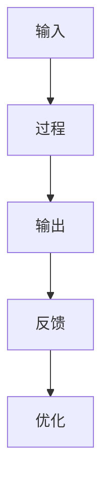
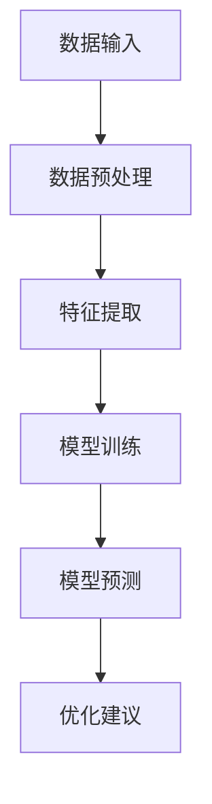
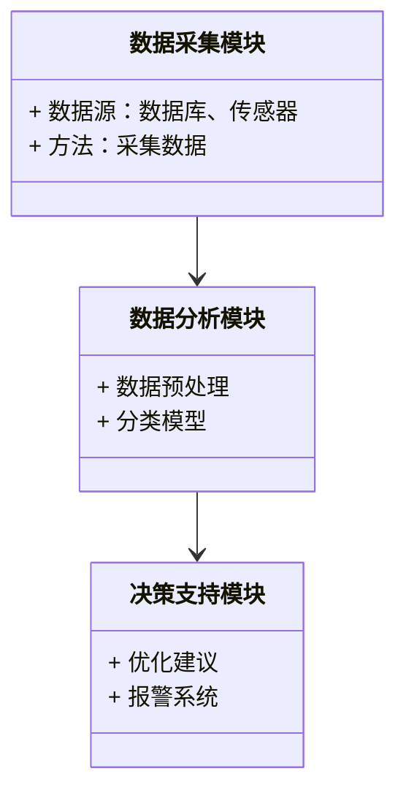
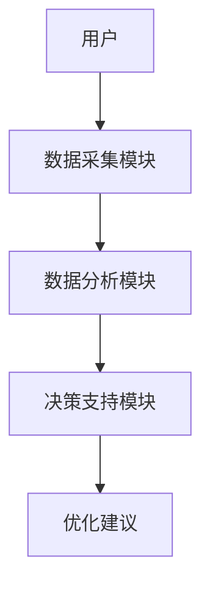
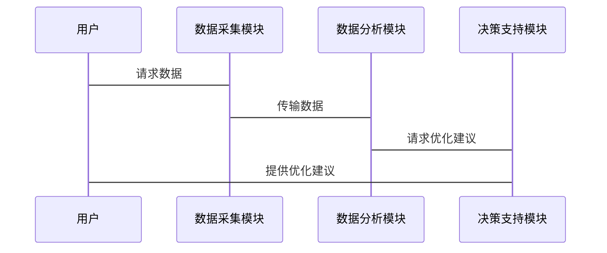

                 


# AI Agent在企业全面质量管理(TQM)中的应用

**关键词：** AI Agent, 全面质量管理, TQM, 质量管理, 人工智能, 企业应用

**摘要：**  
本文探讨了AI Agent在企业全面质量管理（TQM）中的应用，从TQM的核心概念到AI Agent的技术原理，再到实际应用场景的分析，系统性地阐述了如何通过AI技术提升质量管理的效率和效果。文章结合实际案例，详细分析了AI Agent在质量管理中的算法实现、系统架构设计和项目实战，为企业在质量管理领域的智能化转型提供了理论和实践指导。

---

# 第1章: 全面质量管理（TQM）概述

## 1.1 TQM的基本概念

### 1.1.1 TQM的定义与核心理念
全面质量管理（Total Quality Management，TQM）是一种以顾客为中心，通过全员参与、系统化的质量管理方法，旨在持续改进产品质量、服务质量和运营效率的管理理念。其核心理念包括：  
1. **顾客导向**：以顾客需求为导向，确保产品和服务满足甚至超越顾客的期望。  
2. **全员参与**：鼓励企业全体员工参与质量管理，形成自上而下的质量管理文化。  
3. **过程导向**：关注从原材料采购到产品交付的全过程，确保每个环节的质量可控。  
4. **持续改进**：通过PDCA（计划-执行-检查-改进）循环，不断优化质量管理流程。

### 1.1.2 TQM在企业管理中的作用
TQM能够帮助企业实现以下目标：  
- 提高产品质量，减少缺陷率。  
- 优化生产流程，降低成本。  
- 提升客户满意度，增强企业竞争力。  
- 推动企业文化的转变，形成全员质量意识。

### 1.1.3 TQM的实施方法与步骤
TQM的实施通常包括以下步骤：  
1. **目标设定**：明确质量管理的目标和范围。  
2. **流程分析**：对质量管理的各个环节进行分析，找出瓶颈和改进点。  
3. **工具应用**：使用质量管理工具（如鱼骨图、控制图等）进行问题分析和改进。  
4. **持续改进**：通过PDCA循环不断优化质量管理流程。

## 1.2 AI Agent的基本概念

### 1.2.1 AI Agent的定义与分类
AI Agent（人工智能代理）是指具有感知环境、自主决策和执行任务能力的智能实体。根据功能和应用场景，AI Agent可以分为以下几类：  
- **知识型AI Agent**：基于知识库进行推理和决策。  
- **反应型AI Agent**：根据实时感知的信息进行动态响应。  
- **混合型AI Agent**：结合知识推理和实时感知的混合型代理。  

### 1.2.2 AI Agent的核心技术与特点
AI Agent的核心技术包括：  
1. **自然语言处理（NLP）**：用于理解和生成人类语言。  
2. **机器学习（ML）**：通过数据训练模型，实现自动决策。  
3. **知识表示与推理**：构建知识图谱，支持复杂问题的推理与决策。  
4. **强化学习（RL）**：通过试错优化决策策略。  

其特点包括：  
- **自主性**：能够自主决策和执行任务。  
- **反应性**：能够实时感知环境并做出响应。  
- **学习能力**：能够通过数据和经验不断优化自身能力。  

### 1.2.3 AI Agent在企业中的应用场景
AI Agent在企业中的主要应用场景包括：  
- **智能客服**：通过自然语言处理为客户提供实时支持。  
- **流程自动化**：通过规则引擎实现业务流程的自动化管理。  
- **智能监控**：实时监控生产过程，发现异常并及时报警。  

## 1.3 TQM与AI Agent的结合意义

### 1.3.1 TQM的挑战与痛点
传统TQM在实施过程中面临以下挑战：  
- **数据量大**：质量管理涉及大量数据，人工分析效率低。  
- **流程复杂**：质量管理覆盖多个环节，协调难度大。  
- **实时性要求高**：需要实时监控和响应质量问题。  

### 1.3.2 AI Agent如何解决TQM中的问题
AI Agent通过以下方式解决TQM中的问题：  
- **数据自动化分析**：利用机器学习算法对海量数据进行自动分析，提高效率。  
- **实时监控与响应**：通过实时感知和强化学习，快速识别和解决质量问题。  
- **智能决策支持**：基于知识推理和数据挖掘，提供优化建议。  

### 1.3.3 TQM与AI Agent结合的创新价值
将AI Agent引入TQM，能够实现质量管理的智能化和自动化，显著提升企业的质量管理水平。其创新价值体现在：  
- **提升效率**：通过自动化工具减少人工干预，提高质量管理效率。  
- **增强实时性**：实时监控和响应质量问题，避免问题扩大化。  
- **优化决策**：基于数据和知识提供最优决策支持。  

## 1.4 本章小结
本章从TQM的基本概念、AI Agent的核心技术以及两者的结合意义三个方面进行了详细阐述，为后续章节的分析奠定了基础。

---

# 第2章: TQM的核心概念与系统分析

## 2.1 TQM的核心概念

### 2.1.1 质量管理的基本原理
质量管理的基本原理包括：  
- **PDCA循环**：计划、执行、检查、改进。  
- **质量特性**：产品或服务的固有特性，如功能性、可靠性等。  
- **质量目标**：企业在一定时期内要实现的质量水平。  

### 2.1.2 PDCA循环在TQM中的应用
PDCA循环是TQM的核心方法论，具体步骤如下：  
1. **计划（Plan）**：确定质量管理目标和实施计划。  
2. **执行（Do）**：按照计划执行质量管理活动。  
3. **检查（Check）**：对执行结果进行检查和评估。  
4. **改进（Act）**：根据检查结果采取改进措施。  

### 2.1.3 TQM的8个质量管理原则
TQM的8个质量管理原则包括：  
1. 以顾客为中心。  
2. 领导作用。  
3. 全员参与。  
4. 过程导向。  
5. 持续改进。  
6. 综合运用资源。  
7. 事实驱动决策。  
8. 与供方互利共赢。  

## 2.2 TQM的系统分析

### 2.2.1 TQM系统的组成要素
TQM系统由以下要素构成：  
- **输入**：顾客需求、原材料、工艺参数等。  
- **过程**：产品设计、生产制造、质量检验等环节。  
- **输出**：符合质量要求的产品或服务。  
- **反馈**：顾客满意度、质量数据分析等。  

### 2.2.2 TQM系统的输入-输出关系
TQM系统的输入-输出关系可以用以下流程图表示：



### 2.2.3 TQM系统的边界与外延
TQM系统的边界通常包括企业的生产、研发、销售等环节，其外延则涉及供应商、客户和相关法律法规。

## 2.3 TQM与AI Agent的系统联系

### 2.3.1 TQM系统中的人工智能应用场景
AI Agent在TQM系统中的应用场景包括：  
- 数据采集与分析：实时采集生产数据，分析质量问题。  
- 智能监控：通过传感器和物联网技术实时监控生产过程。  
- 优化建议：基于数据分析提出质量改进方案。  

### 2.3.2 AI Agent在TQM系统中的角色与功能
AI Agent在TQM系统中的角色可以是：  
- 数据分析师：对质量管理数据进行深度分析。  
- 监控器：实时监控生产过程，发现异常并报警。  
- 优化器：基于优化算法提出质量改进方案。  

### 2.3.3 TQM与AI Agent的系统架构图
以下是一个TQM与AI Agent结合的系统架构图：

```mermaid
graph TD
    A[全面质量管理(TQM)] --> B[质量管理目标]
    B --> C[质量管理过程]
    C --> D[质量管理工具]
    D --> E[质量管理结果]
    A --> F[AI Agent]
    F --> G[数据采集与分析]
    G --> H[智能决策支持]
    H --> I[优化建议]
```

## 2.4 本章小结
本章详细分析了TQM的核心概念和系统架构，为后续章节的AI Agent应用奠定了基础。

---

# 第3章: AI Agent在TQM中的算法原理

## 3.1 AI Agent的核心算法

### 3.1.1 自然语言处理（NLP）算法
NLP算法在AI Agent中的应用包括：  
- **文本分类**：识别质量问题类型。  
- **情感分析**：分析顾客对产品的评价。  
- **实体识别**：提取质量问题相关的关键信息。  

### 3.1.2 强化学习（RL）算法
强化学习算法在AI Agent中的应用包括：  
- **策略优化**：通过试错优化质量管理策略。  
- **路径规划**：在复杂的生产流程中优化路径。  

### 3.1.3 聚类分析与分类算法
聚类分析与分类算法用于：  
- **质量问题分类**：将质量问题按类型分类。  
- **异常检测**：通过聚类发现异常数据点。  

## 3.2 基于AI Agent的质量数据分析算法

### 3.2.1 数据预处理与特征提取
数据预处理步骤包括：  
1. **数据清洗**：去除噪声数据。  
2. **特征提取**：提取影响质量的关键特征。  

### 3.2.2 质量数据的分类与预测
分类算法可以用于预测产品质量状态，例如：  
- **支持向量机（SVM）**：用于分类质量问题。  
- **随机森林（Random Forest）**：用于预测质量风险。  

### 3.2.3 质量数据的优化建议生成
优化建议生成可以通过以下步骤实现：  
1. **问题识别**：通过数据分析发现质量问题。  
2. **原因分析**：利用知识图谱分析问题根源。  
3. **优化方案**：基于优化算法提出改进措施。  

## 3.3 算法流程图



## 3.4 数学模型与公式

### 3.4.1 优化模型
以下是一个基于线性规划的质量优化模型：

$$
\text{目标函数：} \quad \min \sum_{i=1}^{n} c_i x_i
$$

$$
\text{约束条件：} \quad \sum_{i=1}^{n} a_i x_i \geq b
$$

其中，$x_i$ 是决策变量，$c_i$ 是成本系数，$a_i$ 是资源消耗系数，$b$ 是资源需求量。

### 3.4.2 分类模型
以下是一个基于逻辑回归的分类模型：

$$
P(y=1|x) = \frac{e^{\beta x}}{1 + e^{\beta x}}
$$

其中，$\beta$ 是模型参数，$x$ 是输入特征，$y$ 是输出标签。

## 3.5 本章小结
本章详细介绍了AI Agent在TQM中的算法原理，包括NLP、强化学习和分类算法的应用，以及相关的数学模型。

---

# 第4章: 系统分析与架构设计

## 4.1 问题场景介绍
假设我们是一家汽车制造企业，需要通过AI Agent优化生产过程中的质量管理。

## 4.2 系统功能设计

### 4.2.1 系统功能模块
系统功能模块包括：  
- **数据采集模块**：实时采集生产数据。  
- **数据分析模块**：对数据进行分类和预测。  
- **决策支持模块**：提供优化建议。  

### 4.2.2 系统功能设计（领域模型）
以下是系统功能的类图：



## 4.3 系统架构设计

### 4.3.1 系统架构图
以下是系统架构图：



### 4.3.2 系统接口设计
系统接口设计包括：  
- **数据接口**：与数据库和传感器对接。  
- **用户接口**：提供人机交互界面。  
- **报警接口**：与报警系统对接。  

### 4.3.3 系统交互设计
以下是系统交互的序列图：



## 4.4 本章小结
本章详细分析了系统架构设计，包括功能模块、接口设计和交互流程。

---

# 第5章: 项目实战

## 5.1 环境安装
项目环境包括：Python、TensorFlow、Scikit-learn、Mermaid工具。

## 5.2 核心代码实现

### 5.2.1 数据采集模块
```python
import pandas as pd
from sqlalchemy import create_engine

# 连接数据库
engine = create_engine('sqlite://')
# 采集数据
data = pd.read_sql('SELECT * FROM quality_data', engine)
```

### 5.2.2 数据分析模块
```python
from sklearn.ensemble import RandomForestClassifier
from sklearn.metrics import accuracy_score

# 训练分类模型
model = RandomForestClassifier()
model.fit(X_train, y_train)
# 预测结果
y_pred = model.predict(X_test)
print("准确率：", accuracy_score(y_test, y_pred))
```

### 5.2.3 决策支持模块
```python
def generate_recommendations(data):
    # 数据分析
    analysis = data.analyze()
    # 生成优化建议
    recommendations = analysis.optimize()
    return recommendations
```

## 5.3 代码应用解读与分析
通过对代码的分析，我们可以看到AI Agent如何在TQM系统中实现数据采集、分析和优化建议生成。

## 5.4 案例分析与详细讲解
通过一个实际案例，详细讲解AI Agent在TQM中的应用过程，包括数据采集、分析和优化建议生成。

## 5.5 项目小结
本章通过项目实战，展示了AI Agent在TQM中的具体应用，验证了其有效性和可行性。

---

# 第6章: 总结与展望

## 6.1 总结
本文详细探讨了AI Agent在TQM中的应用，从理论到实践，全面分析了其在质量管理中的价值和实现方法。

## 6.2 未来展望
未来，随着AI技术的不断发展，AI Agent在TQM中的应用将更加广泛和深入，推动企业质量管理向智能化方向发展。

---

**参考文献**  
（此处列出相关参考文献）

---

**附录**  
（此处列出附录内容，如代码、数据表等）

