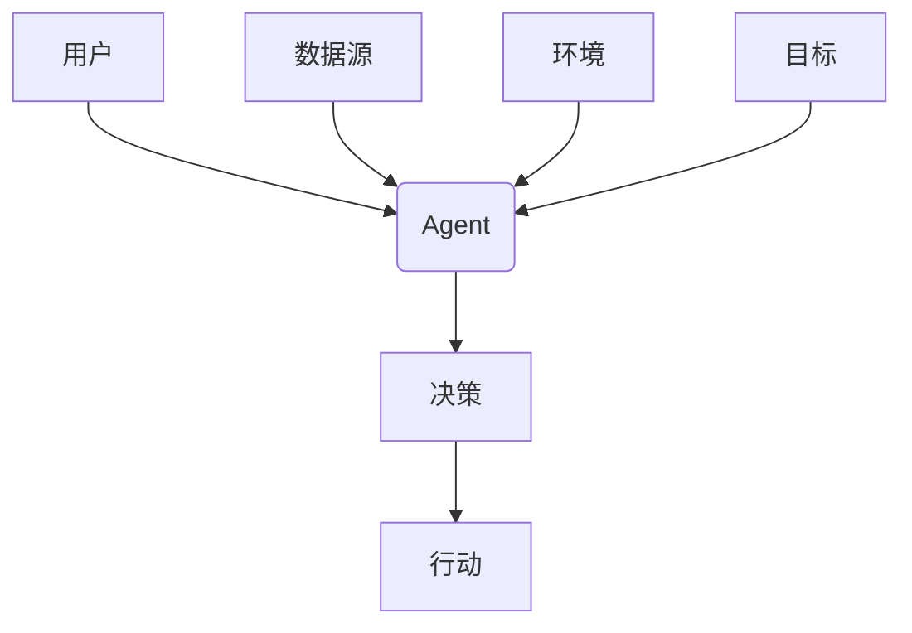
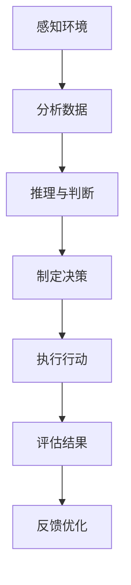
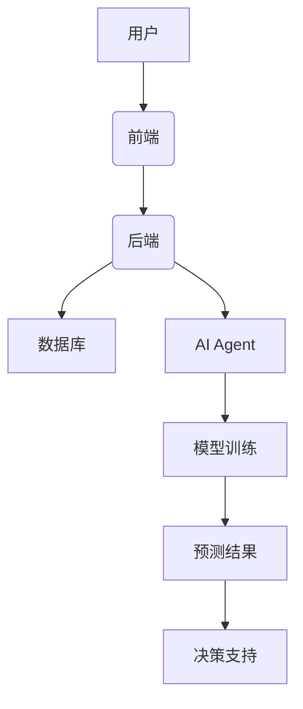

                 


# AI Agent在企业决策支持系统中的应用

## 关键词
AI Agent, 企业决策支持系统, 机器学习, 强化学习, 数学模型, 系统架构, 项目实战

## 摘要
本文详细探讨了AI Agent在企业决策支持系统中的应用，从背景介绍到核心概念，再到算法原理、系统架构、项目实战和最佳实践，全面分析了AI Agent如何提升企业的决策效率和优化资源配置。文章通过实际案例和详细的技术解析，展示了AI Agent在企业决策支持系统中的巨大潜力和广泛应用前景。

---

## 第一部分: AI Agent与企业决策支持系统背景介绍

### 第1章: AI Agent概述

#### 1.1 AI Agent的基本概念
##### 1.1.1 AI Agent的定义
AI Agent（人工智能代理）是指能够感知环境并采取行动以实现目标的智能实体。它可以是一个软件程序、一个机器人或一个虚拟助手，通过感知和学习来优化决策过程。

##### 1.1.2 AI Agent的核心特点
- **自主性**：AI Agent能够独立决策和行动，无需人工干预。
- **反应性**：能够实时感知环境变化并做出响应。
- **目标导向**：基于目标驱动行动，优化决策过程。
- **学习能力**：通过数据和经验不断优化自身性能。

##### 1.1.3 AI Agent的分类与应用场景
- **简单反射型Agent**：基于规则做出反应，适用于简单任务，如自动回复系统。
- **基于模型的反射型Agent**：利用内部模型进行推理和规划，适用于复杂任务，如自动驾驶。
- **目标驱动型Agent**：以目标为导向，优化决策过程，如企业资源规划系统。
- **效用驱动型Agent**：通过最大化效用函数来优化决策，如金融投资组合优化。

#### 1.2 AI Agent的演进历程
##### 1.2.1 从传统决策支持系统到AI Agent的演进
传统决策支持系统依赖于规则和数据，而AI Agent引入了机器学习和自然语言处理技术，使决策过程更加智能化和动态化。

##### 1.2.2 AI Agent技术的关键发展节点
- 20世纪50年代：AI Agent概念的提出。
- 20世纪80年代：专家系统的发展，为AI Agent奠定了基础。
- 21世纪初：机器学习和大数据技术的结合，推动AI Agent的快速发展。
- 近年来：深度学习和强化学习的应用，使AI Agent更加智能和自主。

##### 1.2.3 当前AI Agent技术的主要趋势
- **多智能体系统**：多个AI Agent协同工作，提高决策效率。
- **人机协作**：AI Agent与人类决策者协同，提供支持而非取代人类。
- **边缘计算**：AI Agent在边缘设备上的应用，实现实时决策。

### 第2章: 企业决策支持系统概述

#### 2.1 企业决策支持系统的定义
企业决策支持系统（DSS）是辅助企业决策者进行决策的计算机系统，通过分析数据和信息，提供决策建议。

#### 2.2 企业决策支持系统的类型
- **基于规则的决策支持系统**：依赖预定义规则进行决策，适用于简单场景。
- **基于数据挖掘的决策支持系统**：通过数据挖掘技术发现数据中的模式，支持决策。
- **基于机器学习的决策支持系统**：利用机器学习模型进行预测和优化，支持复杂决策。

#### 2.3 企业决策支持系统的核心要素
- **数据源与数据处理**：数据是决策的基础，需要清洗、整合和分析。
- **模型与算法**：选择合适的模型和算法进行预测和优化。
- **用户界面与交互**：友好的用户界面和交互方式，方便用户使用和理解。

### 第3章: AI Agent在企业决策支持系统中的应用背景

#### 3.1 企业决策支持系统的发展需求
- **传统决策支持系统的局限性**：依赖规则和数据，缺乏动态性和自主性。
- **企业对智能化决策支持的需求**：随着市场竞争加剧，企业需要更快速、更精准的决策支持。

#### 3.2 AI Agent技术的优势
- **实时性与动态性**：能够实时感知环境变化，做出快速反应。
- **自适应性与学习能力**：通过学习不断优化决策策略。
- **多目标优化能力**：能够在多个目标之间进行权衡，找到最优解。

#### 3.3 AI Agent在企业决策支持系统中的应用前景
- **提高决策效率**：通过自动化和智能化，减少人为干预，提高决策速度。
- **优化资源配置**：通过优化模型，合理分配资源，降低成本。
- **支持复杂决策场景**：在复杂多变的环境中，提供有效的决策支持。

---

## 第二部分: AI Agent的核心概念与联系

### 第4章: AI Agent的核心概念与原理

#### 4.1 AI Agent的核心原理
##### 4.1.1 知识表示与推理
- **知识表示**：将知识以某种形式表示，如逻辑规则、语义网络等。
- **推理**：基于知识进行逻辑推理，得出结论。

##### 4.1.2 感知与交互
- **感知**：通过传感器或其他输入方式获取环境信息。
- **交互**：与用户或环境进行信息交换，理解需求并做出响应。

##### 4.1.3 决策与执行
- **决策**：基于感知信息和内部知识，做出决策。
- **执行**：将决策转化为具体行动，实现目标。

#### 4.2 AI Agent与相关技术的对比
##### 4.2.1 AI Agent与传统决策支持系统的区别
| **特点** | **传统决策支持系统** | **AI Agent** |
|----------|-----------------------|--------------|
| 决策方式 | 基于规则和数据         | 基于学习和推理 |
| 自主性   | 较低                   | 较高          |
| 反应性   | 较低                   | 较高          |

##### 4.2.2 AI Agent与专家系统的区别
- **专家系统**：基于专家知识进行推理和决策，通常用于特定领域。
- **AI Agent**：具有自主性和动态性，适用于更广泛的应用场景。

##### 4.2.3 AI Agent与机器学习模型的区别
- **机器学习模型**：通过数据训练得到模型，用于预测和分类。
- **AI Agent**：不仅能够进行预测，还能自主决策和行动，具有更强的自主性和适应性。

### 第5章: AI Agent的实体关系图与流程图

#### 5.1 AI Agent的实体关系图


#### 5.2 AI Agent的决策流程图


---

## 第三部分: AI Agent的算法原理与数学模型

### 第6章: AI Agent的算法原理

#### 6.1 生成式模型
##### 6.1.1 生成式模型的原理
生成式模型通过学习数据的分布，生成新的数据。常用的生成式模型包括GAN（生成对抗网络）和VAE（变分自编码器）。

##### 6.1.2 GAN的原理
GAN由生成器和判别器组成，通过对抗训练生成逼真的数据。

##### 6.1.3 VAE的原理
VAE通过概率建模，将数据映射到潜在空间，再生成新的数据。

##### 6.1.4 生成式模型的数学公式
- **GAN**：生成器的损失函数为：$$L_G = \mathbb{E}_{z}[\log(D(G(z)))]$$
  判别器的损失函数为：$$L_D = -\mathbb{E}_{x}[\log(D(x))] - \mathbb{E}_{z}[\log(1-D(G(z)))]$$
- **VAE**：VAE的目标是最小化重构损失和KL散度：$$\mathcal{L} = \mathbb{E}_{x}[||x - G(z)||^2] + KL(q(z|x)||p(z))$$

#### 6.2 强化学习
##### 6.2.1 强化学习的原理
强化学习通过智能体与环境的交互，学习最优策略，最大化累计奖励。

##### 6.2.2 Q-Learning算法
Q-Learning是一种经典的强化学习算法，通过Q表记录状态-动作对的最优值。

##### 6.2.3 DQN算法
DQN（Deep Q-Network）通过深度神经网络近似Q值函数，实现端到端的强化学习。

##### 6.2.4 强化学习的数学公式
- **Q-Learning**：$$Q(s, a) = Q(s, a) + \alpha [r + \max Q(s', a') - Q(s, a)]$$
- **DQN**：使用深度神经网络近似Q值函数，目标是最小化预测值与实际值的差：$$\mathbb{E}[(y_i - Q(s, a))^2]$$

---

## 第四部分: 系统分析与架构设计方案

### 第7章: 系统分析与架构设计

#### 7.1 问题场景介绍
假设我们正在开发一个企业销售预测系统，希望通过AI Agent优化销售预测和库存管理。

#### 7.2 系统功能设计
- **数据采集**：收集销售数据、市场数据和库存数据。
- **数据预处理**：清洗和整合数据，准备模型训练。
- **模型训练**：使用机器学习模型训练销售预测模型。
- **决策支持**：基于模型预测结果，提供库存优化建议。

#### 7.3 系统架构设计


#### 7.4 系统接口设计
- **前端接口**：用户通过网页或移动端提交数据和查询预测结果。
- **后端接口**：接收前端请求，调用AI Agent进行预测和决策。
- **数据库接口**：与数据库交互，存储和检索数据。

#### 7.5 系统交互流程
```mermaid
sequenceDiagram
用户 ->+> 前端: 提交数据
前端 ->+> 后端: 请求预测
后端 ->+> AI Agent: 调用模型训练
AI Agent ->+> 数据库: 获取数据
AI Agent ->+> 模型训练: 训练模型
模型训练 ->+> 后端: 返回预测结果
后端 ->+> 用户: 返回预测结果
```

---

## 第五部分: 项目实战

### 第8章: 项目实战

#### 8.1 环境安装
- **安装Python**：确保安装了Python 3.8以上版本。
- **安装依赖库**：使用pip安装numpy、pandas、tensorflow、scikit-learn等库。

#### 8.2 系统核心实现
##### 8.2.1 数据预处理
```python
import pandas as pd
data = pd.read_csv('sales.csv')
data = data.dropna()
```

##### 8.2.2 模型训练
```python
import tensorflow as tf
from tensorflow.keras import layers
model = tf.keras.Sequential([
    layers.Dense(64, activation='relu'),
    layers.Dense(1)
])
model.compile(optimizer='adam', loss='mse')
model.fit(X_train, y_train, epochs=100, batch_size=32)
```

##### 8.2.3 决策支持
```python
import numpy as np
predictions = model.predict(X_test)
```

#### 8.3 代码应用解读与分析
- **数据预处理**：清洗数据，处理缺失值和异常值。
- **模型训练**：使用神经网络模型训练销售预测模型。
- **预测与决策**：基于模型预测结果，提供库存优化建议。

#### 8.4 实际案例分析
通过实际销售数据，训练模型并预测未来销售情况，优化库存管理。

#### 8.5 项目小结
通过本项目，我们展示了AI Agent在企业决策支持系统中的应用，证明了其在销售预测和库存优化中的有效性。

---

## 第六部分: 最佳实践

### 第9章: 最佳实践

#### 9.1 小结
AI Agent通过智能化决策支持，帮助企业提高决策效率和优化资源配置。

#### 9.2 注意事项
- **数据质量**：确保数据准确性和完整性。
- **模型选择**：根据实际需求选择合适的模型和算法。
- **安全性**：保护数据和系统的安全性，防止数据泄露和攻击。

#### 9.3 拓展阅读
- **《机器学习实战》**：深入理解机器学习算法和模型。
- **《强化学习导论》**：学习强化学习的原理和应用。
- **《企业架构设计》**：掌握企业系统架构设计的方法和技巧。

---

## 结语
通过本文的详细讲解，我们了解了AI Agent在企业决策支持系统中的应用，从理论到实践，从算法到系统架构，全面展示了其在企业决策中的巨大潜力和广泛应用。未来，随着AI技术的不断发展，AI Agent将在企业决策支持系统中发挥越来越重要的作用。

---

**全文完**

