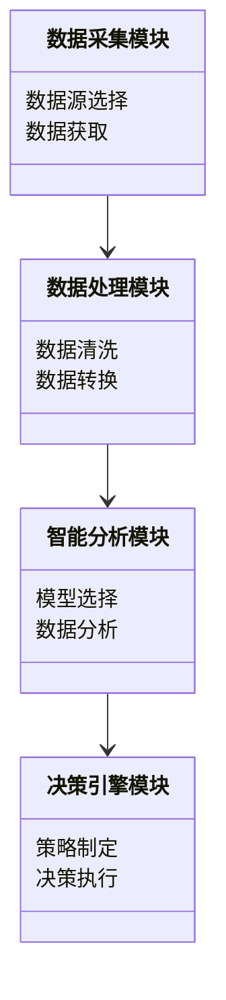
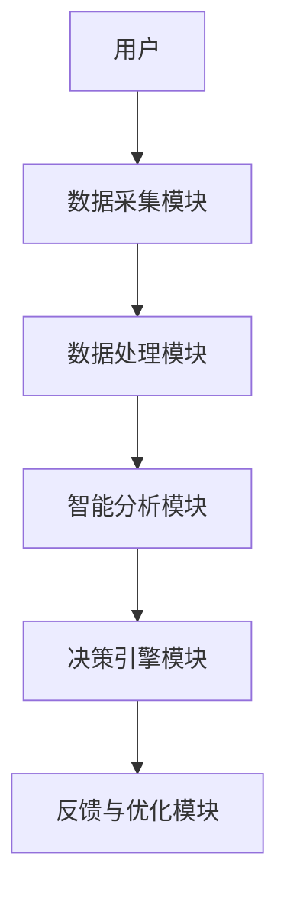
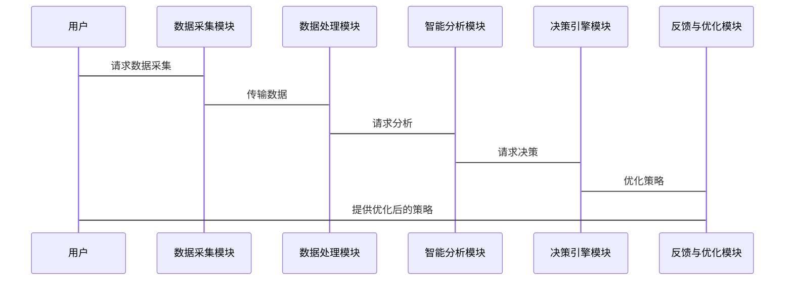

                 


# AI Agent在企业决策支持系统中的角色与实现

> 关键词：AI Agent, 企业决策支持系统, 决策优化, 强化学习, 系统架构, 自然语言处理

> 摘要：本文探讨AI Agent在企业决策支持系统中的角色与实现，结合理论分析和实际案例，详细介绍AI Agent的核心原理、实现技术、系统架构设计，以及在企业中的实际应用。通过深入分析，揭示AI Agent如何通过数据处理、智能推理和优化决策，显著提升企业决策效率和准确性。

---

## 第1章: AI Agent与企业决策支持系统概述

### 1.1 AI Agent的基本概念

#### 1.1.1 AI Agent的定义
AI Agent（人工智能代理）是指能够感知环境、做出决策并采取行动以实现特定目标的智能实体。AI Agent可以是软件程序，也可以是硬件设备，通过传感器、数据库或其他输入渠道获取信息，利用算法进行分析和推理，最终生成相应的输出或执行特定操作。

#### 1.1.2 AI Agent的核心特征
- **自主性**：AI Agent能够在没有外部干预的情况下独立运行。
- **反应性**：能够实时感知环境变化并做出相应的反应。
- **目标导向**：所有的行为都围绕实现特定目标展开。
- **学习能力**：通过数据和经验不断优化自身的决策能力。

#### 1.1.3 AI Agent与传统决策支持系统的区别
传统决策支持系统（DSS）依赖于固定的规则和模型，而AI Agent具备更强的自主性和适应性，能够根据实时数据和动态环境调整决策策略。AI Agent能够主动获取信息、分析问题并提出解决方案，而DSS则更多是被动地提供数据支持。

### 1.2 企业决策支持系统概述

#### 1.2.1 企业决策支持系统的定义
企业决策支持系统（EDSS）是利用信息技术辅助企业高层管理者进行决策的系统，旨在通过数据处理、模型分析和结果展示，为企业提供科学的决策依据。

#### 1.2.2 企业决策支持系统的关键功能模块
- 数据采集与处理模块：负责从企业内外部获取数据并进行清洗和预处理。
- 数据分析与建模模块：利用统计分析、机器学习等技术对数据进行建模和分析。
- 决策模拟与优化模块：通过模拟不同决策方案的效果，选择最优方案。
- 结果展示与报告模块：将分析结果以直观的方式呈现给决策者。

#### 1.2.3 企业决策支持系统的应用领域
企业决策支持系统广泛应用于财务管理、市场营销、生产管理、供应链管理等领域。例如，在财务管理中，EDSS可以帮助企业预测财务状况、优化资金分配；在市场营销中，EDSS可以辅助制定市场策略、预测销售趋势。

### 1.3 AI Agent在企业决策支持系统中的角色

#### 1.3.1 AI Agent作为决策辅助工具的角色
AI Agent可以通过分析海量数据，识别潜在的市场机会或风险，为决策者提供实时的、基于数据的建议。

#### 1.3.2 AI Agent作为数据处理与分析工具的角色
AI Agent能够快速处理复杂的数据集，利用自然语言处理（NLP）技术分析非结构化数据，如客户评论、市场报告等，提取有价值的信息。

#### 1.3.3 AI Agent作为智能决策引擎的角色
AI Agent可以集成多种决策模型和算法，根据实时数据动态调整决策策略，实现智能化的决策支持。

---

## 第2章: AI Agent的核心原理

### 2.1 AI Agent的感知与理解机制

#### 2.1.1 数据采集与处理
AI Agent通过传感器、API或其他数据源获取数据，并进行清洗、转换和集成，确保数据的准确性和一致性。

#### 2.1.2 自然语言处理技术
NLP技术用于处理文本数据，如客户反馈、市场报告等。通过分词、实体识别、情感分析等技术，提取关键信息。

#### 2.1.3 知识图谱构建
通过知识抽取、知识融合和知识表示技术，构建企业相关的知识图谱，帮助AI Agent更好地理解和推理。

### 2.2 AI Agent的推理与决策机制

#### 2.2.1 基于规则的推理
通过预定义的规则和逻辑，对数据进行分析和推理。例如，如果销售额连续三个月下降，则触发市场预警。

#### 2.2.2 基于机器学习的推理
利用监督学习、无监督学习等机器学习算法，从历史数据中学习模式和规律，预测未来趋势。

#### 2.2.3 基于强化学习的决策优化
通过强化学习算法，AI Agent可以在动态环境中不断试错，优化决策策略，提高决策的准确性和效果。

### 2.3 AI Agent的执行与反馈机制

#### 2.3.1 动作规划与执行
根据推理结果，制定行动计划并执行。例如，调整供应链策略以应对市场需求变化。

#### 2.3.2 反馈机制与优化
通过实时监控和反馈，评估决策效果，调整和优化决策策略，确保系统持续改进。

#### 2.3.3 系统自适应调整
AI Agent能够根据环境变化和反馈结果，自动调整参数和模型，实现自适应优化。

---

## 第3章: AI Agent的实现技术与算法

### 3.1 自然语言处理技术

#### 3.1.1 NLP的核心技术
- 分词：将文本分割成词语或短语，如jieba分词。
- 实体识别：识别文本中的命名实体，如人名、地名、组织名。
- 情感分析：判断文本的情感倾向，如正面、负面或中性。

#### 3.1.2 常见NLP工具与库
- Python的nltk库：用于分词、情感分析等。
- spacy：支持多种语言的NLP处理。
- tensorflow和keras：用于构建深度学习模型进行NLP任务。

#### 3.1.3 NLP在决策支持中的应用
例如，分析客户评论，提取关键词和情感倾向，帮助企业了解市场反馈，优化产品策略。

### 3.2 知识图谱构建技术

#### 3.2.1 知识图谱的定义与构建流程
知识图谱是一种结构化的知识表示方式，通过实体和关系描述现实世界中的信息。

#### 3.2.2 知识抽取与表示
- 数据抽取：从文本、数据库中提取结构化数据。
- 知识表示：使用图结构表示实体及其关系，如RDF或JSON-LD。

#### 3.2.3 知识图谱的推理与应用
通过图遍历和推理算法，进行知识推理，支持决策过程。例如，推理出某个产品的竞争对手。

### 3.3 强化学习与决策优化

#### 3.3.1 强化学习的基本原理
强化学习通过智能体与环境的交互，学习最优策略。智能体通过试错，获得奖励或惩罚，调整行为以最大化累积奖励。

#### 3.3.2 基于强化学习的决策优化算法
- Q-learning：通过Q值表记录状态-动作对的期望奖励，更新策略。
- Deep Q-Networks（DQN）：使用深度神经网络近似Q值函数，解决高维状态空间问题。

#### 3.3.3 

---

## 第4章: AI Agent的系统架构设计

### 4.1 系统功能设计

#### 4.1.1 功能模块划分
- 数据采集模块：负责从数据库、API获取数据。
- 数据处理模块：清洗、转换数据。
- 智能分析模块：利用NLP、机器学习等技术分析数据。
- 决策引擎模块：基于分析结果生成决策建议。
- 反馈与优化模块：根据执行结果调整决策策略。

#### 4.1.2 领域模型设计
使用Mermaid绘制类图，展示系统中的主要实体和它们之间的关系。



### 4.2 系统架构设计

#### 4.2.1 系统架构图
使用Mermaid绘制系统架构图，展示各模块之间的关系。



### 4.3 系统接口设计

#### 4.3.1 接口定义
- 数据采集模块提供API接口，接收外部数据。
- 数据处理模块提供接口，供智能分析模块调用。
- 决策引擎模块提供API，供外部系统调用决策结果。

### 4.4 系统交互流程

#### 4.4.1 交互流程图
使用Mermaid绘制系统交互流程图，展示用户与系统各模块之间的交互过程。



---

## 第5章: 项目实战

### 5.1 项目背景与需求分析

#### 5.1.1 项目背景
以某电商平台为例，企业希望通过AI Agent优化库存管理，提高销售预测的准确性。

#### 5.1.2 项目需求
- 实时监控库存数据。
- 基于历史销售数据和市场趋势，预测未来需求。
- 自动生成补货建议。

### 5.2 环境安装与配置

#### 5.2.1 环境要求
- Python 3.8及以上版本
- 安装必要的库：pandas、numpy、scikit-learn、tensorflow、spacy

### 5.3 核心代码实现

#### 5.3.1 数据采集模块

```python
import requests
import json

def fetch_data(api_url):
    response = requests.get(api_url)
    data = json.loads(response.text)
    return data
```

#### 5.3.2 数据处理模块

```python
import pandas as pd

def preprocess_data(data):
    df = pd.DataFrame(data)
    # 数据清洗和转换
    df['date'] = pd.to_datetime(df['date'])
    df['sales'] = df['sales'].astype(int)
    return df
```

#### 5.3.3 智能分析模块

```python
from sklearn.ensemble import RandomForestRegressor
import numpy as np

def predict_sales(data):
    # 特征工程
    features = data[['price', 'promotion', 'category']]
    target = data['sales']
    # 模型训练
    model = RandomForestRegressor(n_estimators=100, random_state=42)
    model.fit(features, target)
    # 预测
    new_data = np.array([[30, 1, 'electronics']])
    predicted = model.predict(new_data)
    return predicted[0]
```

#### 5.3.4 决策引擎模块

```python
def generate_recommendation(predicted_sales, current_stock):
    if predicted_sales > current_stock:
        return "建议补货"
    else:
        return "无需补货"
```

### 5.4 项目运行与测试

#### 5.4.1 环境搭建
安装必要的库：
```bash
pip install requests pandas numpy scikit-learn tensorflow spacy
python -m spacy download en_core_web_sm
```

#### 5.4.2 代码实现
将上述代码整合到一个完整的项目中，实现数据采集、处理、分析和决策建议生成。

### 5.5 实际案例分析

#### 5.5.1 案例分析
假设某电子产品过去一个月的平均销量为200，库存为150。AI Agent预测未来一周的销量为300，因此建议补货。

#### 5.5.2 结果解读
AI Agent通过分析历史销售数据和市场趋势，预测未来的需求，并根据当前库存情况，提供补货建议，帮助企业避免缺货或库存积压。

---

## 第6章: 总结与展望

### 6.1 本章总结
AI Agent在企业决策支持系统中扮演着越来越重要的角色。通过自然语言处理、知识图谱、强化学习等技术，AI Agent能够实时分析数据、优化决策策略，显著提升企业的决策效率和准确性。

### 6.2 未来展望
随着人工智能技术的不断发展，AI Agent在企业决策支持系统中的应用将更加广泛和深入。未来的AI Agent将具备更强的自主性和学习能力，能够处理更复杂的问题，并与企业系统更加无缝集成。

### 6.3 最佳实践Tips
- 在实施AI Agent之前，确保企业具备足够的数据基础和技术能力。
- 选择合适的AI Agent解决方案，根据企业的具体需求进行定制化开发。
- 定期更新和优化AI Agent的模型和算法，确保其决策能力的持续提升。

### 6.4 小结
AI Agent的应用为企业带来了显著的竞争优势，但其成功实施需要企业具备相应的技术和资源支持。未来，随着技术的进步，AI Agent将在企业决策支持系统中发挥更大的作用。

---

通过以上内容，我们可以看到，AI Agent在企业决策支持系统中的应用前景广阔，能够帮助企业实现更高效、更智能的决策。希望本文能够为企业在应用AI Agent的过程中提供有价值的参考和指导。

