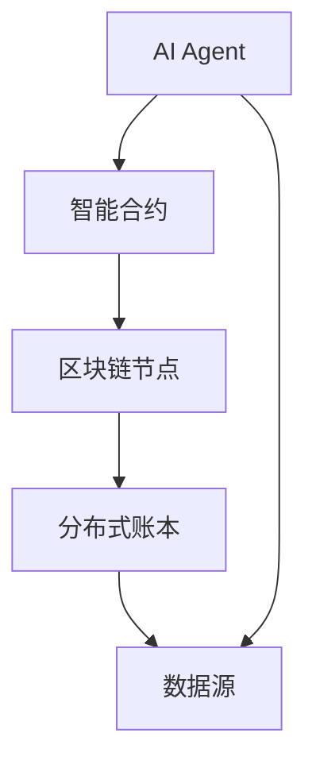

                 


# AI Agent在企业区块链应用中的集成与应用

**关键词：** AI Agent，企业区块链，智能合约，分布式系统，共识机制，机器学习

**摘要：**  
本文深入探讨了AI Agent与企业区块链的集成与应用，从基本概念、核心原理到实际应用场景进行了全面分析。通过结合AI Agent的智能决策能力与区块链的分布式信任机制，本文揭示了AI Agent在企业区块链中的潜在价值与实现路径。同时，本文还详细介绍了AI Agent与区块链的协同工作流程，并通过实际案例展示了其在企业中的具体应用。

---

## 第1章：AI Agent与区块链的概述

### 1.1 AI Agent的基本概念

#### 1.1.1 AI Agent的定义与特点  
AI Agent（人工智能代理）是指能够感知环境并采取行动以实现目标的智能实体。其核心特点包括自主性、反应性、目标导向性和学习能力。AI Agent能够通过数据驱动的方式不断优化决策，适用于复杂场景下的自动化决策和问题解决。

#### 1.1.2 AI Agent在企业中的应用背景  
在企业环境中，AI Agent被广泛应用于智能客服、供应链优化、风险管理等领域。通过AI Agent，企业能够实现业务流程的自动化和智能化，提高效率并降低成本。

#### 1.1.3 区块链技术的基本原理  
区块链是一种分布式账本技术，通过去中心化的方式记录交易数据，并通过共识机制确保数据的准确性和安全性。区块链的核心特征包括去中心化、不可篡改和透明性。

### 1.2 区块链与企业应用的结合

#### 1.2.1 区块链的核心特性  
区块链的去中心化特性能够有效降低信任成本，同时其不可篡改性保证了数据的安全性。这些特性使得区块链在金融、供应链管理等领域具有广泛的应用潜力。

#### 1.2.2 区块链在企业中的应用场景  
区块链在企业中的典型应用场景包括供应链管理、智能合约、数据共享和身份认证等。通过区块链技术，企业能够实现高效、安全的业务流程。

#### 1.2.3 区块链对企业业务流程的影响  
区块链技术能够优化企业现有的业务流程，减少中间环节，提高效率。例如，在供应链管理中，区块链可以实现供应商、制造商和零售商之间的实时数据共享。

### 1.3 AI Agent与区块链的结合

#### 1.3.1 AI Agent在区块链中的作用  
AI Agent可以作为区块链系统中的智能决策组件，负责对区块链中的数据进行分析，并根据需要采取行动。例如，在智能合约中，AI Agent可以自动触发某些操作。

#### 1.3.2 区块链如何赋能AI Agent  
区块链的去中心化和安全性为AI Agent提供了可靠的数据存储和传输环境。同时，区块链的智能合约功能可以作为AI Agent的执行引擎，确保决策的透明性和可追溯性。

#### 1.3.3 两者的协同效应  
AI Agent与区块链的结合能够实现智能化的分布式系统。通过AI Agent的智能决策和区块链的分布式信任机制，企业能够构建高效、安全的业务生态系统。

---

## 第2章：AI Agent在企业区块链中的核心概念

### 2.1 AI Agent的核心概念

#### 2.1.1 AI Agent的决策机制  
AI Agent的决策机制基于数据驱动的分析，通常包括感知环境、分析数据、制定决策和执行操作四个步骤。例如，在供应链管理中，AI Agent可以根据实时数据调整库存策略。

#### 2.1.2 AI Agent的学习能力  
通过机器学习算法，AI Agent能够从历史数据中学习，并不断优化自身的决策模型。例如，基于强化学习的AI Agent可以在复杂的环境中实现自主决策。

#### 2.1.3 AI Agent的交互方式  
AI Agent可以通过多种方式与区块链系统交互，包括通过智能合约调用区块链上的数据和功能，或者通过API与区块链节点进行通信。

### 2.2 区块链的核心概念

#### 2.2.1 区块链的分布式账本  
区块链的分布式账本由多个节点共同维护，确保数据的一致性和安全性。每个节点都有一份完整的账本副本，数据通过共识机制达成一致。

#### 2.2.2 区块链的共识机制  
共识机制是区块链的核心技术之一，用于确保所有节点对交易的有效性达成一致。常见的共识机制包括PoW（工作量证明）、PoS（权益证明）和BFT（拜占庭容错共识）。

#### 2.2.3 区块链的智能合约  
智能合约是区块链上的自动执行程序，能够根据预设的条件自动触发相应的操作。智能合约为AI Agent提供了执行决策的环境。

### 2.3 AI Agent与区块链的结合模型

#### 2.3.1 AI Agent与区块链的映射关系  
AI Agent可以通过智能合约与区块链进行交互，区块链为AI Agent提供数据存储和执行环境，而AI Agent则为区块链提供智能决策能力。

#### 2.3.2 AI Agent在区块链中的角色分配  
在企业区块链系统中，AI Agent可以作为智能合约的执行者，或者作为分布式系统中的决策节点。例如，在供应链管理中，AI Agent可以作为智能合约的触发器，根据库存数据自动调整采购策略。

#### 2.3.3 两者的协同工作流程  
AI Agent与区块链的协同工作流程通常包括数据采集、决策分析、智能合约调用和结果反馈四个阶段。通过这种流程，AI Agent能够实现对区块链系统的智能化管理。

---

## 第3章：AI Agent与区块链的集成原理

### 3.1 AI Agent的算法原理

#### 3.1.1 AI Agent的决策树算法  
决策树是一种常用的机器学习算法，能够通过数据特征进行分类或回归。AI Agent可以通过决策树算法对区块链中的数据进行分析，并制定相应的决策策略。

#### 3.1.2 基于强化学习的AI Agent  
强化学习是一种通过试错机制优化决策模型的算法。AI Agent可以通过强化学习不断优化自身的决策策略，提高决策的准确性。

#### 3.1.3 AI Agent的推理机制  
推理机制是AI Agent的核心算法之一，能够通过逻辑推理对区块链中的数据进行分析，并制定相应的行动方案。

### 3.2 区块链的共识算法

#### 3.2.1 工作量证明机制（PoW）  
PoW是一种通过计算哈希函数来验证交易有效性的共识机制，广泛应用于比特币等区块链系统中。

#### 3.2.2 权益证明机制（PoS）  
PoS是一种基于节点持有的代币数量来决定记账权的共识机制，相比PoW更加高效和节能。

#### 3.2.3 拜占庭容错共识（BFT）  
BFT是一种适用于大规模分布式系统的共识机制，能够容忍部分节点的故障或恶意行为。

### 3.3 AI Agent与区块链的集成流程

#### 3.3.1 数据流的传递与处理  
AI Agent需要通过区块链系统中的数据流进行分析和决策。数据流的传递过程包括数据采集、数据存储和数据处理三个阶段。

#### 3.3.2 AI Agent对区块链数据的分析  
AI Agent可以通过机器学习算法对区块链中的数据进行分析，例如通过聚类分析识别异常交易，或者通过回归分析预测市场趋势。

#### 3.3.3 区块链对AI Agent决策的支持  
区块链系统为AI Agent提供了安全、可靠的数据存储环境，同时通过智能合约功能支持AI Agent的决策执行。

---

## 第4章：AI Agent与区块链的数学模型与公式

### 4.1 AI Agent的数学模型

#### 4.1.1 AI Agent的决策模型  
AI Agent的决策模型可以通过概率论和统计学方法进行建模。例如，可以通过贝叶斯网络对区块链中的交易数据进行概率分析。

#### 4.1.2 AI Agent的优化模型  
AI Agent的优化模型可以通过强化学习算法进行建模。例如，可以通过Q-learning算法优化AI Agent的决策策略。

#### 4.1.3 AI Agent的评价指标  
AI Agent的评价指标包括准确率、召回率、F1分数等。这些指标可以通过数学公式进行计算。

### 4.2 区块链的数学模型

#### 4.2.1 区块链的哈希函数  
哈希函数是区块链的核心算法之一，用于生成区块的哈希值。常见的哈希函数包括SHA-256和RIPEMD-160。

#### 4.2.2 区块链的数字签名  
数字签名是区块链中的重要技术，用于验证交易的合法性和完整性。数字签名可以通过椭圆曲线加密算法进行实现。

#### 4.2.3 区块链的共识机制模型  
共识机制模型可以通过数学公式进行描述。例如，PoW机制可以通过能量消耗和时间复杂度进行建模。

---

## 第5章：AI Agent与区块链的系统设计与实现

### 5.1 系统架构设计

#### 5.1.1 系统功能设计  
AI Agent与区块链的集成系统需要具备数据采集、智能决策、智能合约调用和结果反馈等功能。

#### 5.1.2 系统架构图  
以下是AI Agent与区块链系统的架构图：



#### 5.1.3 系统接口设计  
系统接口设计包括AI Agent与智能合约的交互接口、智能合约与区块链节点的交互接口等。

### 5.2 系统交互流程

#### 5.2.1 数据采集与处理  
AI Agent通过数据采集接口获取区块链中的数据，并对其进行预处理。

#### 5.2.2 智能合约调用  
AI Agent通过智能合约接口调用区块链上的智能合约，执行相应的操作。

#### 5.2.3 结果反馈与优化  
AI Agent根据智能合约的执行结果进行反馈，并优化自身的决策模型。

---

## 第6章：AI Agent与区块链的项目实战

### 6.1 环境安装

#### 6.1.1 安装区块链环境  
需要安装以太坊或Hyperledger等区块链框架。

#### 6.1.2 安装AI Agent开发环境  
需要安装Python、TensorFlow等机器学习框架。

### 6.2 核心代码实现

#### 6.2.1 AI Agent的实现  
以下是基于强化学习的AI Agent实现代码：

```python
class AI_Agent:
    def __init__(self):
        self.model = self.build_model()
        self.memory = []

    def build_model(self):
        # 构建强化学习模型
        pass

    def perceive(self, environment):
        # 与环境交互，获取状态和奖励
        pass

    def decide(self, state):
        # 根据状态选择动作
        pass
```

#### 6.2.2 智能合约的实现  
以下是智能合约的实现代码：

```solidity
contract SmartContract {
    function triggerAction(address agentAddress) external {
        // 调用AI Agent的决策函数
        bytes memory result = agent.call{value: 0}(abi.encodeWithSignature("takeAction()"));
        // 处理返回结果
    }
}
```

### 6.3 案例分析

#### 6.3.1 应用场景  
在供应链管理中，AI Agent可以通过区块链系统实时监控库存数据，并根据市场需求自动调整采购策略。

#### 6.3.2 实施步骤  
1. 安装区块链环境和AI Agent开发环境；
2. 实现AI Agent的决策算法；
3. 部署智能合约到区块链网络；
4. 进行测试和优化。

---

## 第7章：总结与展望

### 7.1 总结  
本文详细探讨了AI Agent与企业区块链的集成与应用，从基本概念、核心原理到实际应用场景进行了全面分析。通过结合AI Agent的智能决策能力与区块链的分布式信任机制，企业能够构建高效、安全的业务生态系统。

### 7.2 展望  
未来，随着AI技术的不断发展，AI Agent在企业区块链中的应用潜力将更加广泛。例如，通过深度学习算法优化智能合约的执行效率，或者通过边缘计算技术实现AI Agent的本地化决策。

---

**附录：**  
- AI Agent与区块链的术语表  
- 相关技术的进一步阅读资料  
- 代码实现的详细说明  

---

**参考文献：**  
[1] 区块链技术入门与实战  
[2] 人工智能代理设计与实现  
[3] 智能合约与分布式系统

