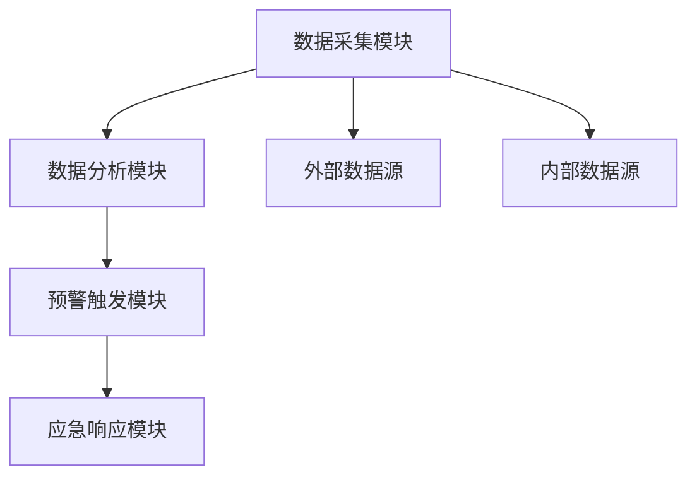
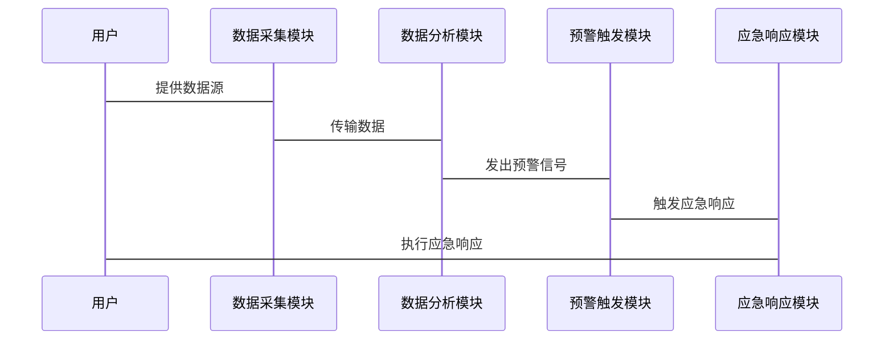

                 


# AI Agent在企业危机预警与应急响应中的关键作用

> 关键词：AI Agent, 企业危机预警, 应急响应, 人工智能, 算法原理, 系统架构

> 摘要：本文深入探讨了AI Agent在企业危机预警与应急响应中的关键作用。通过分析AI Agent的核心概念、算法原理、系统架构以及实际案例，展示了AI Agent如何通过智能化手段提升企业的危机应对能力，实现快速响应和有效处理。文章结构清晰，内容详实，为企业的危机管理提供了重要的参考和实践指导。

---

## 第一部分: AI Agent在企业危机预警与应急响应中的背景与概念

### 第1章: AI Agent与企业危机预警概述

#### 1.1 企业危机预警的定义与重要性
企业危机预警是指通过监测和分析内外部环境中的潜在风险，提前发出警示信号，以帮助企业采取预防性措施，避免或减少危机对企业造成的损失。危机可以是市场波动、供应链中断、自然灾害、网络安全攻击等。

- **1.1.1 什么是企业危机**
  - 危机是指对企业正常运营造成威胁的突发性事件或潜在风险。
  - 危机可以是内部的（如管理问题）或外部的（如市场变化、政策调整）。

- **1.1.2 危机对企业的影响**
  - 经济损失：直接导致财务损失，影响企业声誉和客户信任。
  - 战略调整：危机可能迫使企业重新评估和调整其战略目标。
  - 经营中断：供应链中断、员工流失等可能导致企业运营中断。

- **1.1.3 危机预警的必要性**
  - 提前发现潜在风险，减少损失。
  - 为企业争取应对时间，制定有效策略。
  - 提高企业的抗风险能力和应变能力。

#### 1.2 应急响应的核心概念
应急响应是指在危机发生后，企业迅速采取的一系列行动，以控制事态发展、减少损失并恢复正常运营。

- **1.2.1 应急响应的定义**
  - 应急响应是企业在危机发生后采取的紧急措施，包括信息收集、决策制定和行动执行。

- **1.2.2 应急响应的流程**
  - 信息收集：通过多种渠道获取危机相关信息。
  - 决策制定：基于信息分析，制定应对策略。
  - 行动执行：迅速采取行动，控制事态发展。

- **1.2.3 应急响应的关键要素**
  - 时间：快速响应是关键，延迟可能导致损失扩大。
  - 协调：各部门之间的高效协作是成功应急响应的基础。
  - 资源：充足的资源支持是应对危机的前提条件。

#### 1.3 AI Agent在危机预警与应急响应中的作用
AI Agent（人工智能代理）是一种能够感知环境、自主决策并执行任务的智能系统。它在企业危机预警与应急响应中的作用日益重要。

- **1.3.1 AI Agent的基本概念**
  - AI Agent是一种能够执行特定任务的智能实体，具备感知、推理、决策和行动的能力。

- **1.3.2 AI Agent在危机预警中的优势**
  - 7x24小时监控：AI Agent可以实时监测企业内外部环境，发现潜在风险。
  - 数据处理能力：AI Agent能够快速处理大量数据，识别复杂模式和异常情况。
  - 自适应学习：AI Agent可以通过机器学习不断优化预警模型，提高准确性。

- **1.3.3 AI Agent在应急响应中的应用**
  - 自动触发预警：当检测到潜在危机时，AI Agent可以立即发出预警信号。
  - 智能决策支持：AI Agent可以提供实时数据分析和决策建议，帮助企业在危机发生时迅速制定应对策略。
  - 自动化响应：在某些情况下，AI Agent可以直接执行预设的应急响应措施，例如关闭系统、通知相关人员等。

#### 1.4 本章小结
本章介绍了企业危机预警和应急响应的基本概念，强调了AI Agent在其中的重要作用。AI Agent通过实时监测、智能分析和自主决策，能够显著提升企业的危机应对能力。

---

## 第二部分: AI Agent的核心概念与原理

### 第2章: AI Agent的核心概念与原理

#### 2.1 AI Agent的定义与分类
AI Agent可以根据功能、智能水平和应用场景进行分类。

- **2.1.1 AI Agent的定义**
  - AI Agent是一种能够感知环境、自主决策并执行任务的智能系统。

- **2.1.2 AI Agent的分类**
  - 按智能水平：
    - 基于规则的AI Agent：通过预设规则进行决策。
    - 基于机器学习的AI Agent：通过数据学习，具备一定的自适应能力。
    - 基于深度学习的AI Agent：具有更高的智能水平，能够处理复杂的任务。
  - 按应用场景：
    - 监控型AI Agent：用于实时监控和预警。
    - 交互型AI Agent：与人类或其他系统进行交互，提供决策支持。

- **2.1.3 各类AI Agent的特点**
  - 基于规则的AI Agent：简单易懂，但缺乏灵活性。
  - 基于机器学习的AI Agent：能够学习和适应，但需要大量数据支持。
  - 基于深度学习的AI Agent：具备高度智能，但计算资源需求较高。

#### 2.2 AI Agent的核心原理
AI Agent的核心原理包括感知、推理、决策和行动四个步骤。

- **2.2.1 感知与认知**
  - 感知：AI Agent通过传感器、数据库或其他数据源获取信息。
  - 认知：AI Agent对获取的信息进行理解和分析，识别潜在风险。

- **2.2.2 决策与行动**
  - 决策：基于分析结果，AI Agent制定应对策略。
  - 行动：AI Agent执行预设或自动生成的行动计划。

- **2.2.3 学习与优化**
  - 学习：通过机器学习算法，AI Agent不断优化自身的模型和策略。
  - 优化：AI Agent通过反馈机制，持续改进其性能和效果。

#### 2.3 AI Agent与企业危机预警的结合
AI Agent在企业危机预警中的应用主要体现在数据采集、风险识别和应急响应三个方面。

- **2.3.1 数据采集与处理**
  - AI Agent通过多种渠道（如社交媒体、新闻、内部数据）采集相关信息。
  - 数据处理：AI Agent对采集的数据进行清洗、整合和分析。

- **2.3.2 危机识别与预测**
  - AI Agent利用自然语言处理（NLP）和机器学习技术，识别潜在危机。
  - 预测：AI Agent通过历史数据和当前趋势，预测未来可能发生的危机。

- **2.3.3 应急响应的自动化执行**
  - AI Agent在检测到潜在危机后，自动触发预警机制。
  - AI Agent可以根据预设的策略，自动执行应急响应措施。

#### 2.4 本章小结
本章详细介绍了AI Agent的定义、分类和核心原理，并探讨了AI Agent在企业危机预警中的具体应用。AI Agent通过智能化的感知、分析和决策，能够显著提升企业的危机应对能力。

---

## 第三部分: AI Agent的算法原理与数学模型

### 第3章: AI Agent的算法原理

#### 3.1 基于规则的AI Agent算法
基于规则的AI Agent是一种简单但有效的算法，适用于规则明确的场景。

- **3.1.1 基于规则的算法简介**
  - 基于规则的算法通过预设的规则进行决策，规则通常由专家制定。
  - 优点：简单易懂，适用于规则明确的场景。
  - 缺点：缺乏灵活性，无法处理复杂或模糊的情况。

- **3.1.2 规则的制定与优化**
  - 规则制定：规则的制定需要结合企业的具体需求和行业经验。
  - 规则优化：通过分析实际数据，不断优化规则，提高准确性。

- **3.1.3 规则算法的优缺点**
  - 优点：规则简单，易于理解和维护。
  - 缺点：缺乏灵活性，无法处理复杂情况。

#### 3.2 基于机器学习的AI Agent算法
基于机器学习的AI Agent能够通过数据学习，具备一定的自适应能力。

- **3.2.1 机器学习的基本原理**
  - 机器学习是一种人工智能技术，通过数据训练模型，使其能够进行预测或分类。
  - 常见算法：支持向量机（SVM）、随机森林（Random Forest）、神经网络等。

- **3.2.2 常见的机器学习算法**
  - 支持向量机（SVM）：适用于分类问题。
  - 随机森林：适用于分类和回归问题。
  - 神经网络：适用于复杂任务，如图像识别和自然语言处理。

- **3.2.3 算法的选择与应用**
  - 根据具体问题选择合适的算法。
  - 数据预处理：清洗、特征提取等。
  - 模型训练：使用训练数据训练模型。
  - 模型评估：通过测试数据评估模型的性能。

#### 3.3 基于深度学习的AI Agent算法
基于深度学习的AI Agent具有更高的智能水平，适用于复杂任务。

- **3.3.1 深度学习的基本原理**
  - 深度学习是一种机器学习技术，通过多层神经网络进行特征提取和模式识别。
  - 常见模型：卷积神经网络（CNN）、循环神经网络（RNN）、生成对抗网络（GAN）等。

- **3.3.2 常见的深度学习算法**
  - 卷积神经网络（CNN）：适用于图像识别和处理。
  - 循环神经网络（RNN）：适用于序列数据，如时间序列和自然语言处理。
  - 生成对抗网络（GAN）：适用于生成新的数据，如图像生成。

- **3.3.3 深度学习算法在危机预警中的应用**
  - 图像识别：识别潜在的危机信号。
  - 自然语言处理：分析文本数据，识别潜在风险。

#### 3.4 算法的数学模型与公式
以下是基于机器学习的危机预警模型的数学公式：

- **逻辑回归模型**
  $$ P(y=1|x) = \frac{e^{\beta_0 + \beta_1x_1 + \cdots + \beta_kx_k}}{1 + e^{\beta_0 + \beta_1x_1 + \cdots + \beta_kx_k}} $$
  其中，$x_i$是输入特征，$\beta_i$是模型参数。

- **支持向量机（SVM）**
  $$ y = \text{sign}(\sum_{i=1}^n \alpha_i y_i x_i \cdot x + b) $$
  其中，$\alpha_i$是拉格朗日乘子，$y_i$是标签，$x_i$是支持向量，$b$是偏置项。

---

## 第四部分: 系统分析与架构设计

### 第4章: 系统分析与架构设计

#### 4.1 问题场景介绍
企业危机预警系统需要实时监测企业内外部环境，识别潜在风险，并在危机发生时迅速响应。

- **数据来源**
  - 内部数据：企业内部系统数据，如销售数据、库存数据、员工数据等。
  - 外部数据：市场数据、新闻数据、社交媒体数据等。

- **目标**
  - 实时监控：实时监测企业内外部环境，识别潜在风险。
  - 危机预警：当检测到潜在危机时，立即发出预警信号。
  - 应急响应：在危机发生时，迅速采取应对措施，减少损失。

#### 4.2 系统功能设计
企业危机预警系统的功能模块包括数据采集、数据分析、预警触发和应急响应。

- **数据采集模块**
  - 负责采集企业内外部数据，包括社交媒体、新闻、市场数据等。

- **数据分析模块**
  - 对采集的数据进行清洗、整合和分析，识别潜在风险。

- **预警触发模块**
  - 当数据分析模块发现潜在危机时，触发预警机制，通知相关人员。

- **应急响应模块**
  - 根据预警信息，制定应急响应策略，并执行相应的行动计划。

#### 4.3 系统架构设计
以下是企业危机预警系统的架构图：



- **数据采集模块**
  - 接收外部数据源和内部数据源的数据。
  - 外部数据源包括社交媒体、新闻网站等。
  - 内部数据源包括企业内部系统数据。

- **数据分析模块**
  - 对数据进行清洗、整合和分析。
  - 使用机器学习算法识别潜在风险。

- **预警触发模块**
  - 当数据分析模块发现潜在危机时，触发预警机制。
  - 通过邮件、短信等方式通知相关人员。

- **应急响应模块**
  - 根据预警信息，制定应急响应策略。
  - 执行预设的行动计划，如关闭系统、通知相关部门等。

#### 4.4 系统接口设计
以下是系统接口设计的序列图：



---

## 第五部分: 项目实战

### 第5章: 项目实战

#### 5.1 环境安装
以下是项目实战所需的环境配置：

- **操作系统**
  - Linux或Windows

- **编程语言**
  - Python 3.6+

- **框架与库**
  - TensorFlow
  - Scikit-learn
  - NLTK
  - Flask

- **开发工具**
  - PyCharm
  - VS Code

#### 5.2 核心代码实现
以下是企业危机预警系统的Python代码示例：

```python
import numpy as np
from sklearn import svm
from sklearn.feature_extraction.text import TfidfVectorizer
from sklearn.pipeline import Pipeline

# 数据加载
data = [
    ("销售下降", 1),
    ("库存积压", 1),
    ("员工流失", 1),
    ("市场需求增加", 0),
    ("供应链中断", 1),
    ("政策变化", 1),
]

# 数据预处理
vectorizer = TfidfVectorizer()
X = vectorizer.fit_transform([d[0] for d in data])
y = [d[1] for d in data]

# 模型训练
model = svm.SVC()
model.fit(X, y)

# 模型预测
test_data = ["客户投诉增加"]
test_vector = vectorizer.transform(test_data)
predicted = model.predict(test_vector)
print(predicted)
```

#### 5.3 代码应用解读与分析
上述代码实现了基于机器学习的企业危机预警模型。

- **数据加载**
  - 加载训练数据，数据格式为（描述，标签），标签为0或1，表示是否为危机。

- **数据预处理**
  - 使用TF-IDF（文本频率-逆文档频率）进行特征提取，将文本数据转换为向量表示。

- **模型训练**
  - 使用支持向量机（SVM）进行模型训练，训练数据包括特征向量和标签。

- **模型预测**
  - 对测试数据进行特征提取，并使用训练好的模型进行预测，输出预测结果。

#### 5.4 案例分析
以下是企业危机预警系统的实际案例分析：

- **案例背景**
  - 某企业发现客户投诉增加，希望通过AI Agent进行危机预警。

- **数据处理**
  - 使用TF-IDF进行特征提取，将客户投诉文本转换为向量表示。

- **模型预测**
  - 使用训练好的SVM模型对测试数据进行预测，预测结果为1，表示存在潜在危机。

- **应急响应**
  - 触发预警机制，通知相关部门，制定应急响应策略，如改善客户服务、调查投诉原因等。

#### 5.5 本章小结
本章通过实际案例展示了AI Agent在企业危机预警中的应用。通过数据加载、数据预处理、模型训练和模型预测，实现了对企业危机的智能预警。

---

## 第六部分: 最佳实践与总结

### 第6章: 最佳实践与总结

#### 6.1 小结
AI Agent在企业危机预警与应急响应中的作用不可忽视。通过智能化的感知、分析和决策，AI Agent能够显著提升企业的危机应对能力。

- **核心内容回顾**
  - AI Agent的基本概念和分类。
  - AI Agent在危机预警和应急响应中的具体应用。
  - AI Agent的算法原理和数学模型。
  - 企业危机预警系统的系统架构和项目实战。

- **关键优势**
  - 实时监控：AI Agent能够7x24小时实时监控企业内外部环境，发现潜在风险。
  - 智能分析：AI Agent通过机器学习和深度学习技术，能够识别复杂模式和异常情况。
  - 自动化响应：AI Agent能够在危机发生时迅速采取应对措施，减少损失。

#### 6.2 注意事项
在实际应用中，需要注意以下几点：

- **数据质量**
  - 数据的准确性和完整性直接影响模型的性能。
  - 需要对数据进行清洗和预处理，确保数据质量。

- **模型选择**
  - 根据具体问题选择合适的算法和模型。
  - 需要进行模型评估和优化，确保模型的准确性和稳定性。

- **系统维护**
  - 需要定期维护和更新模型，确保系统的有效性和适应性。
  - 需要对系统进行监控和日志管理，及时发现和解决系统故障。

#### 6.3 拓展阅读
- 《机器学习实战》
- 《深度学习入门：基于Python的理论与实现》
- 《企业风险管理与危机公关》

---

## 附录: 代码实现与参考文献

### 附录A: 代码实现
以下是企业危机预警系统的完整代码实现：

```python
import numpy as np
from sklearn import svm
from sklearn.feature_extraction.text import TfidfVectorizer
from sklearn.pipeline import Pipeline

# 数据加载
data = [
    ("销售下降", 1),
    ("库存积压", 1),
    ("员工流失", 1),
    ("市场需求增加", 0),
    ("供应链中断", 1),
    ("政策变化", 1),
]

# 数据预处理
vectorizer = TfidfVectorizer()
X = vectorizer.fit_transform([d[0] for d in data])
y = [d[1] for d in data]

# 模型训练
model = svm.SVC()
model.fit(X, y)

# 模型预测
test_data = ["客户投诉增加"]
test_vector = vectorizer.transform(test_data)
predicted = model.predict(test_vector)
print(predicted)
```

### 附录B: 参考文献
1. 周志华. 《机器学习实战》. 清华大学出版社, 2016.
2. 王伟. 《深度学习入门：基于Python的理论与实现》. 人民邮电出版社, 2018.
3. 李明. 《企业风险管理与危机公关》. 北京大学出版社, 2017.

---

通过以上内容，我们全面探讨了AI Agent在企业危机预警与应急响应中的关键作用，从理论到实践，从算法到系统架构，为企业的危机管理提供了重要的参考和实践指导。

