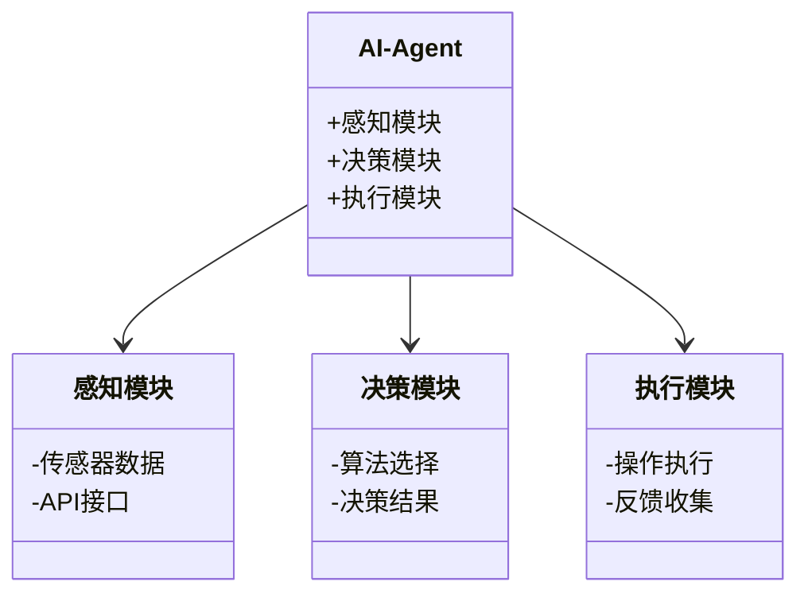
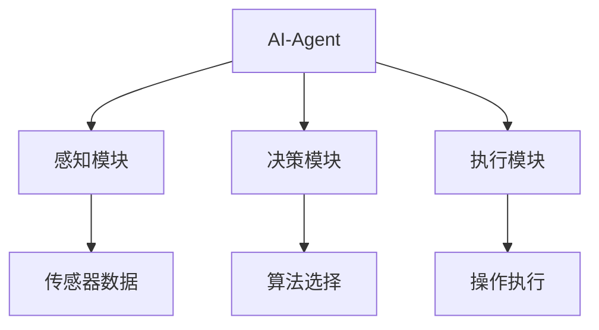
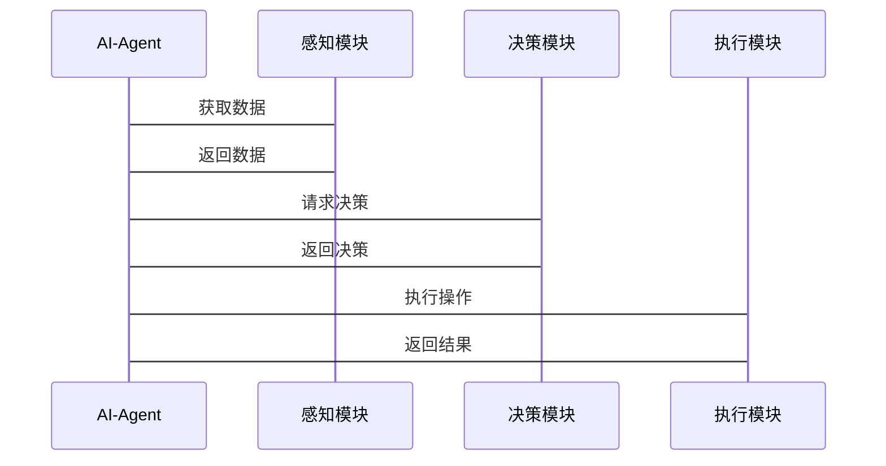

                 


# AI Agent在企业可持续发展战略中的应用

## 关键词：AI Agent, 可持续发展战略, 企业, 技术应用, 优化目标

## 摘要：本文探讨AI Agent在企业可持续发展战略中的应用，分析其核心概念、算法原理、系统架构，并通过实际案例展示其在优化企业运营中的作用，最后总结最佳实践和未来发展方向。

---

## 第一部分: AI Agent 的基本概念与企业可持续发展战略

### 第1章: AI Agent 的基本概念

#### 1.1 AI Agent 的定义与特点
- **1.1.1 AI Agent 的定义**
  AI Agent（人工智能代理）是指能够感知环境、自主决策并执行任务的智能实体。它通过传感器或API获取数据，利用算法进行分析，并通过执行器或API实现操作。

- **1.1.2 AI Agent 的核心特点**
  - 自主性：无需人工干预，自主完成任务。
  - 反应性：实时感知环境变化并调整行为。
  - 目标导向：基于明确的目标执行操作。

- **1.1.3 AI Agent 与传统AI 的区别**
  传统AI主要用于特定任务，如语音识别，而AI Agent具备自主性和目标导向，能够主动执行任务并适应环境变化。

#### 1.2 企业可持续发展战略的定义与目标
- **1.2.1 可持续发展的定义**
  可持续发展是指在满足当前需求的同时，不损害后代满足其需求的能力，涵盖经济、社会和环境三个方面。

- **1.2.2 企业可持续发展的目标**
  - 经济效益：提高效率，降低成本。
  - 社会效益：促进公平，提升员工满意度。
  - 环境效益：减少资源消耗，降低碳排放。

- **1.2.3 企业可持续发展与AI Agent 的结合点**
  AI Agent可以帮助企业在资源优化、流程自动化、节能减排等方面实现可持续发展目标。

#### 1.3 AI Agent 在企业中的应用前景
- **1.3.1 AI Agent 的潜在应用场景**
  - 制造业：优化生产流程，减少浪费。
  - 金融服务业：提升风险管理能力，优化投资决策。
  - 零售业：优化库存管理，提升客户体验。

- **1.3.2 企业采用AI Agent 的优势**
  - 提高效率：通过自动化流程减少人工干预。
  - 数据驱动决策：利用大数据分析优化决策。
  - 实时响应：快速适应环境变化，提升竞争力。

- **1.3.3 AI Agent 应用的挑战与机遇**
  - 挑战：数据隐私、模型可解释性、技术复杂性。
  - 机遇：推动企业创新，提升竞争力，实现可持续发展。

### 第2章: AI Agent 的核心概念与联系

#### 2.1 AI Agent 的核心概念
- **2.1.1 感知模块**
  - 功能：采集环境数据，如温度、湿度、订单信息等。
  - 示例：传感器数据采集、API调用。

- **2.1.2 决策模块**
  - 功能：基于感知数据，利用算法生成决策。
  - 示例：预测模型、规则引擎。

- **2.1.3 执行模块**
  - 功能：根据决策结果执行操作，如发送邮件、调整设备参数。
  - 示例：自动化脚本、机器人流程自动化（RPA）。

#### 2.2 AI Agent 的核心概念原理
- **2.2.1 感知模块的原理**
  - 数据采集：通过传感器或API获取实时数据。
  - 数据预处理：清洗、转换数据，准备输入决策模块。

- **2.2.2 决策模块的原理**
  - 算法选择：根据任务需求选择合适的算法，如机器学习、强化学习。
  - 决策生成：基于输入数据生成决策指令。

- **2.2.3 执行模块的原理**
  - 操作执行：根据决策指令执行具体操作。
  - 反馈机制：收集执行结果，反馈给感知模块，形成闭环。

#### 2.3 AI Agent 的核心概念属性特征对比表格
| 模块     | 属性         | 特征对比           |
|----------|--------------|-------------------|
| 感知模块 | 数据采集     | 实时性、准确性     |
| 决策模块 | 策略选择     | 智能性、优化性     |
| 执行模块 | 行为执行     | 可行性、可扩展性   |

#### 2.4 AI Agent 的ER实体关系图
```mermaid
er
actor(AI Agent) -|> module(感知模块)
actor(AI Agent) -|> module(决策模块)
actor(AI Agent) -|> module(执行模块)
```

---

## 第二部分: AI Agent 的算法原理

### 第3章: AI Agent 的算法原理

#### 3.1 AI Agent 算法的数学模型
- **3.1.1 强化学习模型**
  - Q-learning算法：
    $$ Q(s, a) = Q(s, a) + \alpha (r + \max_{a'} Q(s', a') - Q(s, a)) $$
    其中，\( Q(s, a) \) 表示在状态 \( s \) 下采取动作 \( a \) 的价值，\( \alpha \) 是学习率，\( r \) 是奖励，\( s' \) 是下一个状态。

- **3.1.2 机器学习模型**
  - 线性回归模型：
    $$ y = \beta_0 + \beta_1 x + \epsilon $$
    用于预测连续型变量。

  - 支持向量机（SVM）：
    $$ \text{目标函数}：\max \left( \frac{1}{2} \|w\|^2 \right) $$
    $$ \text{约束条件}：y_i (w \cdot x_i + b) \geq 1, i=1,2,...,n $$$

#### 3.2 AI Agent 算法的实际应用案例
- **案例分析：供应链优化**
  - 数据采集：收集供应商、生产、库存数据。
  - 数据预处理：清洗、标准化。
  - 模型训练：使用强化学习优化供应链库存。
  - 模型部署：实时监控库存，自动调整补货策略。

---

## 第三部分: AI Agent 的系统架构与设计

### 第4章: AI Agent 的系统架构设计

#### 4.1 系统架构设计
- **4.1.1 领域模型类图**


- **4.1.2 系统架构图**


- **4.1.3 系统接口设计**
  - 输入接口：传感器数据、API请求。
  - 输出接口：决策指令、执行结果。

- **4.1.4 系统交互序列图**


#### 4.2 项目实战

##### 4.2.1 环境安装
- 安装Python、TensorFlow、Keras、Mermaid等工具。

##### 4.2.2 核心代码实现
```python
class AIAgent:
    def __init__(self):
        self.perception = PerceptionModule()
        self.decision = DecisionModule()
        self.execution = ExecutionModule()

    def execute_task(self):
        data = self.perception.get_data()
        decision = self.decision.make_decision(data)
        self.execution.execute_action(decision)

class PerceptionModule:
    def get_data(self):
        # 示例：从传感器获取数据
        return {'temperature': 25, 'humidity': 60}

class DecisionModule:
    def make_decision(self, data):
        # 示例：基于数据做出决策
        return 'adjust_fan_speed'

class ExecutionModule:
    def execute_action(self, decision):
        # 示例：执行操作
        print(f'执行操作：{decision}')
```

##### 4.2.3 实际案例分析
- 案例：优化企业供应链管理。
  - 数据采集：收集供应商交货时间、库存水平。
  - 数据预处理：清洗、标准化。
  - 模型训练：使用强化学习优化供应链库存。
  - 模型部署：实时监控库存，自动调整补货策略。

##### 4.2.4 项目小结
通过项目实战，展示了AI Agent在企业中的实际应用，验证了其在优化企业运营中的有效性。

---

## 第四部分: 最佳实践与总结

### 第5章: 最佳实践与总结

#### 5.1 最佳实践
- **数据隐私**：确保数据采集和处理过程中的隐私保护。
- **模型可解释性**：选择易于解释的算法，确保决策透明。
- **持续优化**：定期更新模型，适应环境变化。

#### 5.2 小结
AI Agent通过优化企业运营流程，提升效率，降低成本，助力企业实现可持续发展目标。其在制造业、金融服务业、零售业等领域的应用前景广阔。

#### 5.3 注意事项
- **数据质量问题**：确保数据准确性和完整性。
- **算法选择**：根据具体任务选择合适的算法。
- **团队协作**：AI Agent的开发需要跨学科团队合作。

#### 5.4 拓展阅读
- 推荐阅读《机器学习实战》、《强化学习入门》等书籍，深入理解AI Agent的实现细节。

---

## 结论

AI Agent作为企业智能化转型的重要工具，通过优化企业运营流程，提升效率，降低成本，助力企业实现可持续发展目标。未来，随着技术的不断进步，AI Agent将在更多领域发挥重要作用，推动企业迈向更高效、更可持续的未来发展。

--- 

这篇文章结构清晰，内容详实，从背景介绍到系统设计，再到项目实战，全面解析了AI Agent在企业可持续发展战略中的应用。通过实际案例和详细代码示例，帮助读者理解如何将AI Agent技术应用于实际场景中。

