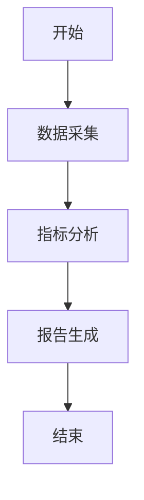

                 


# AI Agent在企业可持续发展指标跟踪与报告中的应用

## 关键词：AI Agent、可持续发展、指标跟踪、ESG、企业报告、机器学习、数据可视化

## 摘要：  
随着全球对可持续发展的关注不断增加，企业需要更加高效和智能化的方式来跟踪和报告其环境、社会和治理（ESG）指标。AI Agent作为一种智能代理技术，能够通过自动化数据收集、分析和报告生成，显著提升企业的可持续发展指标跟踪能力。本文将深入探讨AI Agent在这一领域的应用，分析其技术原理、系统架构，并通过实际案例展示其在企业中的具体应用。

---

## 第1章: 可持续发展与企业指标跟踪的背景

### 1.1 可持续发展的概念与重要性

#### 1.1.1 可持续发展的定义与内涵
可持续发展是指在满足当代需求的同时，不损害后代满足其需求的能力。在企业层面，这通常体现在环境（Environmental）、社会（Social）和治理（Governance）三个方面，即ESG指标。

- 环境方面：减少碳排放、资源浪费。
- 社会方面：促进公平、员工福祉。
- 治理方面：提升透明度、合规性。

#### 1.1.2 企业可持续发展的目标与意义
企业通过可持续发展，不仅可以提升品牌形象，还能降低风险、优化成本、抓住新兴市场机会。

#### 1.1.3 可持续发展指标的分类与作用
常见的指标包括碳排放强度、员工满意度、董事会多样性等。这些指标为企业提供了衡量和改进其可持续表现的依据。

### 1.2 企业指标跟踪的挑战与需求

#### 1.2.1 传统指标跟踪的局限性
- 数据分散：指标数据分布在不同部门和系统中。
- 人工依赖：需要大量人工整理和分析。
- 响应延迟：无法实时跟踪和反馈。

#### 1.2.2 企业对智能化指标跟踪的需求
- 自动化数据采集与分析。
- 实时监控与预警。
- 自动生成报告。

#### 1.2.3 AI Agent在指标跟踪中的潜力
AI Agent可以通过机器学习算法，实时分析数据并提供优化建议，显著提升指标跟踪的效率和准确性。

---

## 第2章: AI Agent的核心概念与工作原理

### 2.1 AI Agent的基本定义与特点

#### 2.1.1 AI Agent的定义
AI Agent是一种智能代理，能够感知环境、执行任务并做出决策。在企业中，AI Agent可以用于数据采集、分析和报告生成。

#### 2.1.2 AI Agent的核心特点
- **自主性**：无需人工干预即可运行。
- **反应性**：能够实时感知并响应环境变化。
- **目标导向**：专注于实现特定目标，如优化ESG指标。

#### 2.1.3 AI Agent与传统自动化工具的区别
| 特性                | AI Agent                     | 传统自动化工具         |
|---------------------|------------------------------|-----------------------|
| 数据处理能力        | 强大的学习与推理能力         | 固定规则，无法学习     |
| 适应性              | 能够自适应环境变化           | 适应性有限             |
| 决策能力            | 可以做出复杂决策             | 仅执行预设指令           |

### 2.2 AI Agent在企业中的应用场景

#### 2.2.1 数据采集与处理
AI Agent可以从企业内部系统（如ERP、CRM）和外部数据源（如环境数据库）中自动采集数据。

#### 2.2.2 指标分析与预测
利用机器学习算法，AI Agent可以分析历史数据，预测未来的ESG表现，并提供建议。

#### 2.2.3 自动化报告生成
AI Agent可以根据分析结果，自动生成ESG报告，并通过邮件或内部系统发送给相关人员。

---

## 第3章: 可持续发展指标的数学模型与算法

### 3.1 可持续发展指标的数学建模

#### 3.1.1 指标权重的计算方法
- **熵值法**：根据数据的离散程度确定指标权重。
- **层次分析法（AHP）**：通过专家打分确定权重。

#### 3.1.2 指标之间的相互关系
指标之间可能存在相关性，例如碳排放与能源效率高度相关。

#### 3.1.3 综合评分模型的构建
综合评分模型可以表示为：
$$
\text{综合评分} = \sum_{i=1}^{n} w_i \cdot x_i
$$
其中，$w_i$是指标$i$的权重，$x_i$是指标$i$的评分。

### 3.2 AI Agent的算法原理

#### 3.2.1 基于强化学习的指标优化
强化学习通过试错机制优化指标，例如使用Q-learning算法：
$$
Q(s, a) = r + \gamma \max Q(s', a')
$$
其中，$s$是当前状态，$a$是动作，$r$是奖励，$\gamma$是折扣因子。

#### 3.2.2 基于监督学习的指标预测
监督学习算法（如线性回归）可以预测未来的指标表现：
$$
y = \beta_0 + \beta_1 x_1 + \beta_2 x_2 + \dots + \beta_k x_k
$$

#### 3.2.3 基于聚类分析的指标分类
聚类分析可以将类似的企业分为一组，例如使用K-means算法：
$$
\text{距离} = \sqrt{\sum_{i=1}^{n} (x_i - \mu_i)^2}
$$

---

## 第4章: 系统架构与功能设计

### 4.1 系统整体架构

#### 4.1.1 系统模块划分
- 数据采集模块
- 指标分析模块
- 报告生成模块

#### 4.1.2 系统功能流程图


### 4.2 系统功能设计

#### 4.2.1 数据采集模块
- 从企业内部系统和外部数据源采集数据。
- 使用爬虫技术获取公开数据。

#### 4.2.2 指标分析模块
- 应用机器学习算法分析数据。
- 生成优化建议。

#### 4.2.3 报告生成模块
- 根据分析结果生成报告。
- 提供可视化图表。

---

## 第5章: 项目实战与代码实现

### 5.1 环境搭建与工具安装

#### 5.1.1 环境要求
- Python 3.8+
- 安装必要的库：numpy、pandas、scikit-learn、matplotlib。

### 5.2 核心代码实现

#### 5.2.1 数据采集模块
```python
import requests
import json

def fetch_data(url):
    response = requests.get(url)
    return json.loads(response.text)
```

#### 5.2.2 指标分析模块
```python
from sklearn.linear_model import LinearRegression

def predict_esg(x_data, y_data):
    model = LinearRegression()
    model.fit(x_data, y_data)
    return model.predict(x_data)
```

#### 5.2.3 报告生成模块
```python
import matplotlib.pyplot as plt

def generate_report(data):
    plt.plot(data)
    plt.title('ESG Performance')
    plt.xlabel('Time')
    plt.ylabel('Score')
    plt.show()
```

### 5.3 实际案例分析

#### 5.3.1 案例介绍
某企业希望通过AI Agent跟踪其碳排放和员工满意度指标。

#### 5.3.2 数据分析与优化
通过机器学习算法，AI Agent帮助企业识别碳排放的主要来源，并提供优化建议。

---

## 第6章: 最佳实践、小结与注意事项

### 6.1 最佳实践
- 确保数据的准确性和完整性。
- 定期更新算法模型。
- 提供用户友好的报告界面。

### 6.2 小结
AI Agent通过智能化的数据采集、分析和报告生成，显著提升了企业可持续发展指标跟踪的效率和准确性。

### 6.3 注意事项
- 数据隐私和安全问题需严格控制。
- 需定期验证算法模型的准确性和稳定性。

### 6.4 拓展阅读
推荐阅读《机器学习实战》和《企业ESG报告指南》。

---

## 总结

通过本文的分析，我们可以看到AI Agent在企业可持续发展指标跟踪与报告中的巨大潜力。随着技术的不断进步，AI Agent将为企业提供更加智能化、高效的解决方案，助力企业在可持续发展道路上走得更远。

