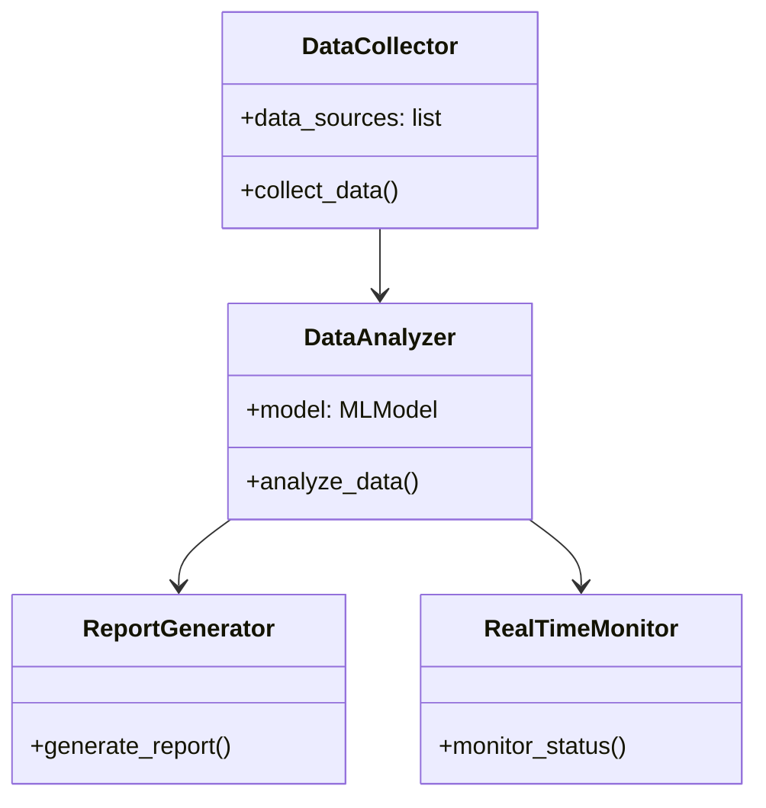
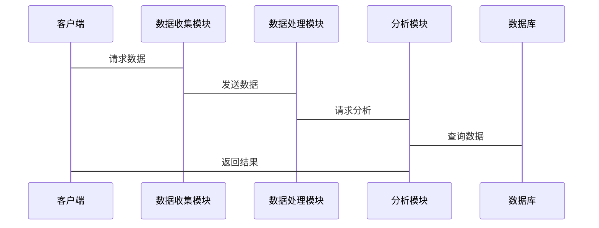

                 


# AI Agent在企业可持续发展目标追踪与报告中的应用

## 关键词：
- AI Agent
- 可持续发展目标
- 企业追踪
- 报告生成
- 数据分析

## 摘要：
本文探讨AI Agent在企业可持续发展目标追踪与报告中的应用。通过分析AI Agent的核心概念、算法原理、系统架构及项目案例，展示其在帮助企业实现可持续发展目标中的潜力和优势。结合实际案例和最佳实践，为企业的可持续发展提供新的思路和技术支持。

---

# 第1章：可持续发展目标的重要性

## 1.1 可持续发展目标的定义与核心要素

### 1.1.1 可持续发展的概念与内涵
可持续发展是一种满足当前需求而不 compromising the ability of future generations to meet their own needs 的发展模式。企业可持续发展目标包括环境、社会和治理（ESG）三个维度，旨在实现长期的经济效益、社会责任和环境责任的平衡。

### 1.1.2 企业可持续发展目标的分类
企业可持续发展目标可以分为短期和长期目标。短期目标如减少碳排放、优化资源利用，长期目标如实现碳中和、构建循环经济体系。

### 1.1.3 可持续发展目标对企业的影响
通过实现可持续发展目标，企业可以提升品牌形象、降低风险、增强竞争力，同时为全球可持续发展做出贡献。

---

## 1.2 企业可持续发展目标追踪的挑战

### 1.2.1 数据收集的复杂性
企业需要从多个来源收集大量数据，包括环境数据、社会数据和治理数据，数据清洗和整合过程复杂。

### 1.2.2 目标分解与执行的困难
可持续发展目标通常涉及多部门协作，目标分解和执行过程中可能面临资源分配和协调问题。

### 1.2.3 报告的准确性和及时性
企业需要定期生成准确的可持续发展报告，但传统方法可能存在数据滞后、计算复杂等问题。

---

# 第2章：AI Agent的概念与作用

## 2.1 AI Agent的基本定义

### 2.1.1 AI Agent的定义
AI Agent是一种智能实体，能够感知环境、自主决策并执行任务，以实现特定目标。

### 2.1.2 AI Agent的核心属性
- **自主性**：能够自主决策。
- **反应性**：能实时感知环境变化。
- **目标导向**：以目标为导向执行任务。
- **学习能力**：通过数据学习和优化。

### 2.1.3 AI Agent与传统自动化工具的区别
AI Agent具有智能性和适应性，能够处理复杂问题和不确定性，而传统自动化工具仅执行预定义任务。

---

## 2.2 AI Agent在企业中的应用前景

### 2.2.1 AI Agent在可持续发展目标追踪中的优势
- **高效数据处理**：AI Agent能够快速处理大量数据，提升追踪效率。
- **智能分析**：通过机器学习算法，AI Agent能够发现数据中的潜在模式和趋势。
- **实时监控**：AI Agent可以实时监控企业的可持续发展目标执行情况，及时调整策略。

### 2.2.2 AI Agent在企业报告中的潜在应用
AI Agent可以帮助企业自动生成准确、详细的可持续发展报告，节省时间和资源。

### 2.2.3 AI Agent与其他技术的协同作用
AI Agent可以与物联网、大数据等技术协同工作，构建智能化的企业可持续发展生态系统。

---

# 第3章：AI Agent在可持续发展目标追踪中的核心概念

## 3.1 数据驱动的AI Agent

### 3.1.1 数据收集与处理
AI Agent需要从多个数据源收集环境、社会和治理相关数据，进行清洗和预处理。

### 3.1.2 数据分析与建模
通过机器学习模型对数据进行分析，识别关键影响因素，预测未来趋势。

### 3.1.3 数据驱动的决策支持
基于分析结果，AI Agent为企业提供优化建议，帮助实现可持续发展目标。

---

## 3.2 可视化与实时监控

### 3.2.1 数据可视化工具
使用可视化工具将数据转化为图表，便于企业理解和监控。

### 3.2.2 实时监控系统
AI Agent实时监控企业的可持续发展目标执行情况，及时发出预警。

---

## 3.3 智能报告生成

### 3.3.1 自动化报告生成
AI Agent可以根据分析结果自动生成可持续发展报告。

### 3.3.2 报告的定制化
企业可以根据需要定制报告内容，满足不同利益相关者的需求。

---

# 第4章：AI Agent的算法原理

## 4.1 机器学习算法的应用

### 4.1.1 线性回归
用于预测企业的碳排放趋势。

### 4.1.2 支持向量机
用于分类企业是否符合可持续发展标准。

### 4.1.3 随机森林
用于识别影响可持续发展目标的关键因素。

---

## 4.2 算法实现步骤

### 4.2.1 数据预处理
使用Python的pandas库清洗数据，处理缺失值和异常值。

### 4.2.2 模型训练
使用scikit-learn库训练机器学习模型，调整参数以优化性能。

### 4.2.3 模型评估
通过准确率、召回率等指标评估模型性能。

---

## 4.3 代码实现

```python
import pandas as pd
from sklearn.model import LinearRegression

# 数据预处理
data = pd.read_csv('sustainability_data.csv')
data = data.dropna()

# 模型训练
model = LinearRegression()
model.fit(data[['CO2_emissions', 'energy_usage']], data['target'])

# 模型预测
predictions = model.predict(data[['CO2_emissions', 'energy_usage']])
```

---

# 第5章：系统架构与设计

## 5.1 问题场景介绍

### 5.1.1 企业可持续发展目标追踪系统
一个实时追踪企业环境、社会和治理目标的系统。

---

## 5.2 项目介绍

### 5.2.1 项目目标
构建一个基于AI Agent的企业可持续发展目标追踪与报告系统。

### 5.2.2 项目范围
涵盖数据收集、分析、报告生成和实时监控功能。

---

## 5.3 系统功能设计

### 5.3.1 领域模型类图


---

## 5.4 系统架构设计

### 5.4.1 分层架构


---

## 5.5 系统接口设计

### 5.5.1 接口描述
- **数据收集接口**：接收来自传感器和其他数据源的数据。
- **分析接口**：调用机器学习模型进行数据分析。
- **报告生成接口**：生成可持续发展报告。

---

## 5.6 交互流程图



---

# 第6章：项目实战

## 6.1 环境安装

### 6.1.1 安装Python
```bash
python --version
pip install --upgrade pip
```

### 6.1.2 安装依赖库
```bash
pip install pandas scikit-learn matplotlib
```

---

## 6.2 核心代码实现

### 6.2.1 数据处理模块

```python
import pandas as pd
import numpy as np

def data_cleaning(data):
    data = data.dropna()
    return data

# 示例数据
data = pd.DataFrame({
    'CO2_emissions': [100, 90, 80, np.nan, 70],
    'energy_usage': [50, 60, 70, 80, 90],
    'target': [1, 0, 1, np.nan, 0]
})

cleaned_data = data_cleaning(data)
print(cleaned_data)
```

---

## 6.3 代码应用解读与分析

### 6.3.1 数据处理模块解读
数据处理模块负责清洗数据，确保数据的完整性和准确性。

### 6.3.2 模型训练模块分析
模型训练模块使用机器学习算法，训练数据以识别模式和趋势。

---

## 6.4 实际案例分析

### 6.4.1 案例背景
某制造企业希望通过AI Agent追踪其碳排放目标。

### 6.4.2 数据分析
使用线性回归模型预测未来碳排放趋势。

---

## 6.5 项目小结

通过项目实战，展示了AI Agent在企业可持续发展目标追踪中的实际应用，验证了其有效性和可行性。

---

# 第7章：最佳实践与总结

## 7.1 最佳实践

### 7.1.1 数据质量管理
确保数据的准确性和完整性。

### 7.1.2 模型优化
定期更新模型，提升预测准确性。

### 7.1.3 人员培训
培训员工，提升对AI Agent的理解和使用能力。

---

## 7.2 小结

本文详细介绍了AI Agent在企业可持续发展目标追踪与报告中的应用，通过理论分析和实际案例，展示了其在帮助企业实现可持续发展目标中的巨大潜力。

---

## 7.3 注意事项

- 数据隐私和安全问题需要重视。
- 模型需要定期更新以适应变化。
- 引入AI Agent需要与企业现有系统和流程相结合。

---

## 7.4 拓展阅读

- 《机器学习实战》
- 《企业可持续发展报告指南》
- 《人工智能在企业中的应用》

---

# 结语

通过本文的探讨，希望企业能够更好地理解和应用AI Agent，推动可持续发展目标的实现，为社会和环境的可持续发展做出贡献。

