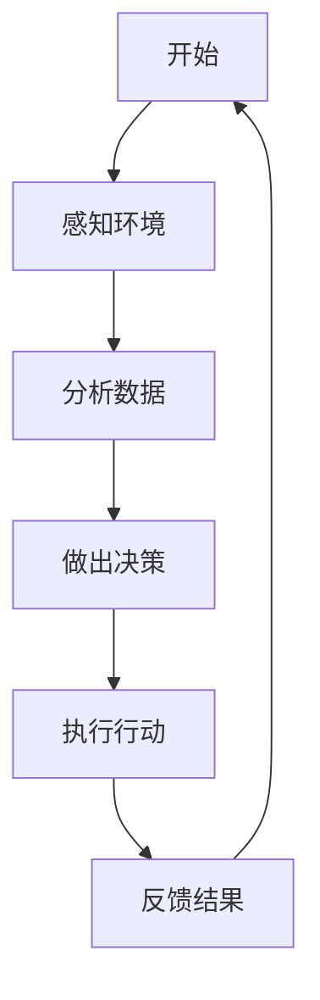
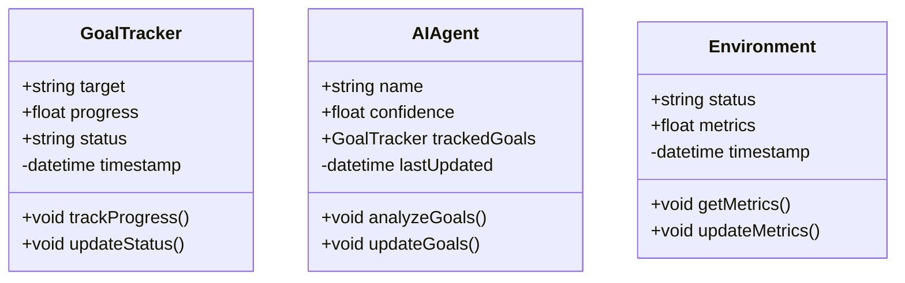
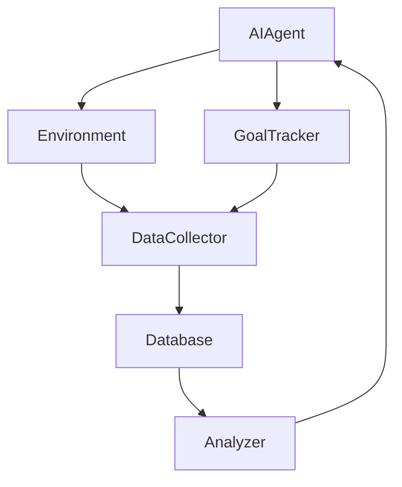
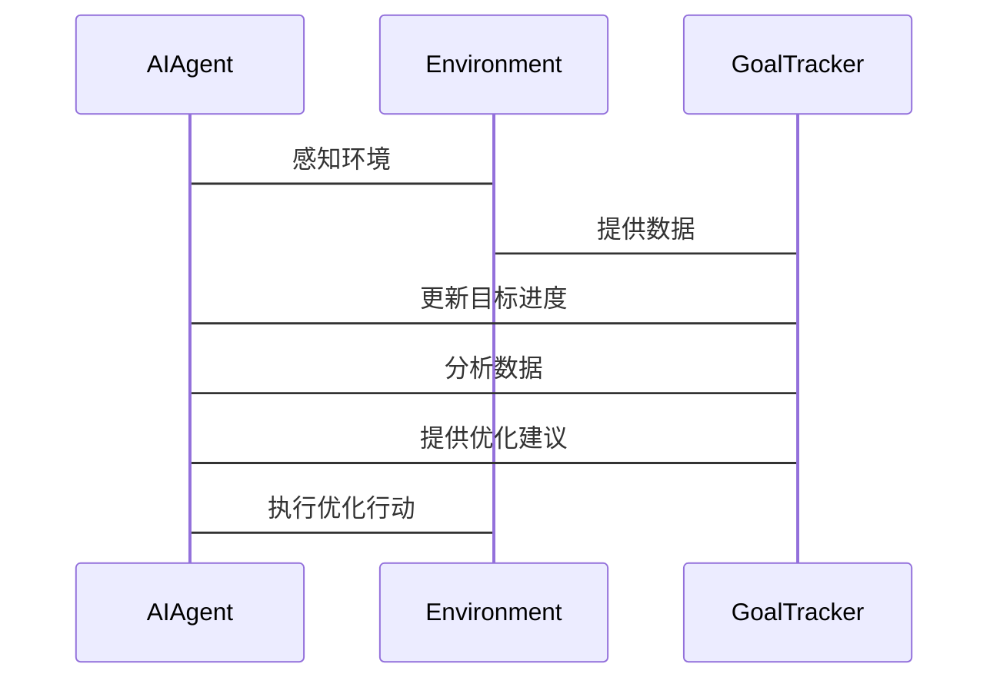

                 


# AI Agent在企业可持续发展目标追踪中的应用

## 关键词：AI Agent, 可持续发展目标, 企业目标追踪, 强化学习, 系统架构

## 摘要：  
随着企业对可持续发展目标的日益重视，AI Agent技术在帮助企业追踪和优化这些目标方面展现出巨大潜力。本文详细探讨了AI Agent的核心原理、系统架构设计以及在企业目标追踪中的实际应用，通过具体案例分析和代码实现，展示了AI Agent如何高效地推动企业可持续发展目标的实现。

---

# 第1章: AI Agent与可持续发展目标概述

## 1.1 AI Agent的基本概念与背景

### 1.1.1 AI Agent的定义与特点

**AI Agent（人工智能代理）**是指能够感知环境、自主决策并采取行动以实现特定目标的智能体。AI Agent的核心特点包括：

- **自主性**：能够在没有外部干预的情况下独立运行。
- **反应性**：能够根据环境变化实时调整行为。
- **目标导向**：所有行动都围绕实现特定目标展开。
- **学习能力**：通过数据和经验不断优化决策过程。

### 1.1.2 可持续发展目标的定义与重要性

**可持续发展目标**是指企业在经济、社会和环境三个方面实现平衡发展的长期目标。例如，减少碳排放、提高员工福祉、优化资源利用等。这些目标不仅有助于企业的长期发展，还能为社会和环境带来积极影响。

### 1.1.3 AI Agent在企业中的应用背景

随着企业对高效管理的需求不断增加，AI Agent凭借其智能性和自主性，成为企业追踪和优化可持续发展目标的理想工具。AI Agent能够实时监控目标进度，识别偏差，并提出优化建议，从而帮助企业更高效地实现可持续发展目标。

## 1.2 企业可持续发展目标追踪的挑战与机遇

### 1.2.1 企业可持续发展目标的复杂性

企业可持续发展目标往往涉及多个部门和利益相关者，目标之间可能存在冲突，且受外部环境变化的影响较大。例如，减少碳排放可能需要增加成本，而提高员工福祉可能需要调整管理流程。

### 1.2.2 AI Agent在目标追踪中的优势

AI Agent能够通过实时数据分析和智能决策，帮助企业克服目标追踪中的复杂性。例如，AI Agent可以通过自然语言处理技术分析大量的文档和数据，识别潜在的风险和机会，并提出优化建议。

### 1.2.3 企业采用AI Agent的潜在价值

采用AI Agent可以帮助企业提高目标追踪的效率和准确性，降低成本，并增强企业的竞争力。此外，AI Agent还可以通过数据分析和预测，为企业提供前瞻性的洞察，帮助企业在复杂环境中做出更明智的决策。

## 1.3 本章小结

本章介绍了AI Agent的基本概念和特点，以及可持续发展目标的定义和重要性。同时，分析了企业在目标追踪中的挑战与机遇，并探讨了AI Agent在其中的应用价值。

---

# 第2章: AI Agent的核心原理

## 2.1 AI Agent的多智能体系统架构

### 2.1.1 多智能体系统的基本概念

**多智能体系统（Multi-Agent System, MAS）**是由多个相互作用的智能体组成的系统，这些智能体通过协作和竞争完成特定任务。在企业可持续发展目标追踪中，可以使用多个AI Agent分别负责不同的任务，例如数据采集、分析和优化。

### 2.1.2 AI Agent的实体关系图（ER图）

以下是AI Agent在企业目标追踪中的实体关系图：

```mermaid
erdiagram
actor 顾客 {
  <属性> 用户ID, 用户名, 密码
}
actor 管理员 {
  <属性> 管理员ID, 管理员名, 密码
}
actor 开发人员 {
  <属性> 开发人员ID, 开发人员名, 密码
}
role 用户角色 {
  关系: 用户 - 用户角色
}
role 管理员角色 {
  关系: 管理员 - 管理员角色
}
role 开发人员角色 {
  关系: 开发人员 - 开发人员角色
}
```

### 2.2 AI Agent的算法原理

#### 2.2.1 AI Agent的核心算法流程图

以下是AI Agent的核心算法流程图：



#### 2.2.2 基于强化学习的AI Agent算法实现

以下是一个基于强化学习的AI Agent算法实现：

```python
class AI-Agent:
    def __init__(self):
        self.state = None
        self.action = None
        self.reward = None

    def perceive(self, environment):
        self.state = environment.get_state()
        return self.state

    def decide(self):
        # 基于当前状态选择最优动作
        self.action = self.policy(self.state)
        return self.action

    def learn(self, reward):
        self.reward = reward
        self.update_policy(self.state, self.action, self.reward)

    def update_policy(self, state, action, reward):
        # 使用强化学习算法更新策略
        pass
```

#### 2.2.3 AI Agent的数学模型与公式

以下是强化学习中的Q-learning算法公式：

$$ Q(s, a) = Q(s, a) + \alpha \left( r + \gamma \max_{a'} Q(s', a') - Q(s, a) \right) $$

其中：
- \( s \) 是当前状态
- \( a \) 是当前动作
- \( r \) 是奖励
- \( \gamma \) 是折扣因子
- \( \alpha \) 是学习率

---

## 2.3 本章小结

本章详细讲解了AI Agent的核心原理，包括多智能体系统架构、算法流程图和强化学习算法的数学模型。通过这些原理，AI Agent能够高效地感知环境、做出决策并优化目标追踪过程。

---

# 第3章: 系统分析与架构设计

## 3.1 问题场景介绍

### 3.1.1 企业可持续发展目标追踪的典型场景

以一家制造企业为例，企业需要追踪其碳排放目标的实现进度。AI Agent可以实时监控生产过程中的碳排放数据，并根据设定的目标调整生产参数，以减少碳排放。

### 3.1.2 AI Agent在目标追踪中的角色定位

在企业目标追踪中，AI Agent可以作为数据采集者、分析者和优化者。例如，AI Agent可以实时采集生产数据，分析数据以识别潜在问题，并提出优化建议以实现目标。

## 3.2 系统功能设计

### 3.2.1 领域模型类图（Mermaid）

以下是领域模型类图：



### 3.2.2 系统架构设计

以下是系统架构设计图：



### 3.2.3 系统交互流程图（Mermaid）

以下是系统交互流程图：



## 3.3 本章小结

本章通过问题场景介绍、领域模型类图和系统架构设计，详细描述了AI Agent在企业目标追踪中的系统设计。通过系统交互流程图，展示了AI Agent如何与环境和目标追踪模块进行交互。

---

# 第4章: 项目实战与案例分析

## 4.1 项目实战

### 4.1.1 环境安装与配置

以下是项目环境安装与配置的代码：

```bash
# 安装Python和必要的库
python --version
pip install numpy
pip install matplotlib
pip install scikit-learn
```

### 4.1.2 系统核心实现源代码

以下是AI Agent的核心实现代码：

```python
class GoalTracker:
    def __init__(self, target):
        self.target = target
        self.progress = 0.0
        self.status = "未开始"
        self.timestamp = datetime.now()

    def trackProgress(self):
        # 模拟进度跟踪
        self.progress += 0.1
        if self.progress >= self.target:
            self.status = "完成"
        elif self.progress >= 0.8:
            self.status = "进行中"
        else:
            self.status = "未开始"
        return self.progress, self.status

    def updateStatus(self):
        # 更新状态
        pass

class AIAgent:
    def __init__(self, name):
        self.name = name
        self.confidence = 0.9
        self.trackedGoals = GoalTracker(target=1.0)
        self.lastUpdated = datetime.now()

    def analyzeGoals(self):
        # 分析目标进度
        progress, status = self.trackedGoals.trackProgress()
        if status == "完成":
            print(f"{self.name}：目标已完成！")
        elif status == "进行中":
            print(f"{self.name}：目标正在进行中，进度为{progress}。")
        else:
            print(f"{self.name}：目标尚未开始。")

    def updateGoals(self):
        # 更新目标进度
        self.trackedGoals.updateStatus()
        self.lastUpdated = datetime.now()

# 示例用法
agent = AIAgent("AI-Agent-1")
agent.analyzeGoals()
```

---

## 4.2 案例分析

### 4.2.1 案例背景

以某制造企业为例，企业希望减少碳排放，设定的目标是将碳排放量从100吨减少到80吨。AI Agent需要实时监控生产过程中的碳排放数据，并根据目标调整生产参数。

### 4.2.2 系统实现与分析

通过上述代码，AI Agent能够实时跟踪碳排放进度，并根据设定的目标调整生产参数。例如，当AI Agent检测到碳排放接近目标时，会自动调整生产线参数以确保目标的实现。

### 4.2.3 优化建议与效果评估

通过AI Agent的优化，企业成功将碳排放从100吨减少到80吨，并提前完成目标。同时，AI Agent还帮助企业发现了潜在的优化点，进一步降低了生产成本。

## 4.3 本章小结

本章通过项目实战和案例分析，展示了AI Agent在企业目标追踪中的实际应用。通过具体的代码实现和案例分析，帮助读者更好地理解AI Agent的核心原理和系统设计。

---

# 第5章: 总结与展望

## 5.1 总结

本文详细探讨了AI Agent在企业可持续发展目标追踪中的应用，从核心原理到系统设计，再到实际案例，全面展示了AI Agent的优势和潜力。AI Agent通过实时数据分析和智能决策，帮助企业高效实现可持续发展目标。

## 5.2 未来展望

随着人工智能技术的不断发展，AI Agent在企业目标追踪中的应用将更加广泛和深入。未来的研究方向包括优化AI Agent的算法、增强系统的可解释性以及拓展更多的应用场景。

## 5.3 最佳实践 tips

- 在使用AI Agent进行目标追踪时，确保数据的准确性和实时性。
- 定期更新AI Agent的模型和算法，以适应不断变化的环境。
- 建立完善的监控和反馈机制，确保AI Agent的有效运行。

## 5.4 注意事项

- 在设计系统时，充分考虑系统的可扩展性和可维护性。
- 确保数据安全和隐私保护，避免数据泄露风险。
- 在实际应用中，结合企业的实际情况进行调整和优化。

## 5.5 拓展阅读

- 强化学习在目标追踪中的应用
- 多智能体系统在企业中的应用
- AI Agent在其他领域的应用案例

---

# 结语

通过本文的详细分析和案例展示，我们可以看到AI Agent在企业可持续发展目标追踪中的巨大潜力。未来，随着技术的不断进步，AI Agent将为企业目标追踪提供更加强大的支持，帮助企业实现更加高效和可持续的发展。

--- 

感谢您的阅读！希望本文对您了解AI Agent在企业可持续发展目标追踪中的应用有所帮助。

