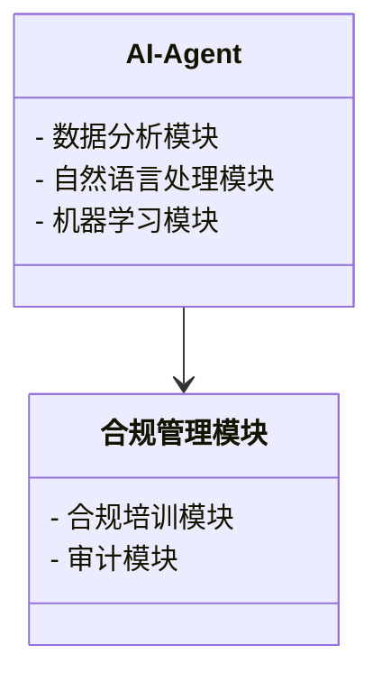
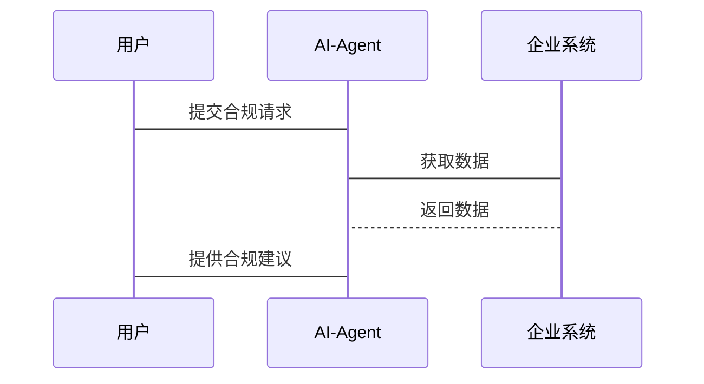

                 


# AI Agent在企业合规培训与审计中的应用

> 关键词：AI Agent, 企业合规, 合规培训, 审计, 人工智能, 机器学习, 大数据

> 摘要：随着人工智能技术的迅速发展，AI Agent（人工智能代理）在企业合规培训与审计中的应用越来越广泛。本文将详细探讨AI Agent在企业合规管理中的核心作用，包括其在合规培训与审计中的具体应用、算法原理、系统架构设计以及实际案例分析。通过本文，读者将深入了解如何利用AI Agent技术提升企业合规管理的效率与准确性，为企业合规培训与审计提供新的解决方案。

---

# 第一部分: AI Agent在企业合规培训与审计中的应用概述

## 第1章: AI Agent与企业合规管理

### 1.1 AI Agent的基本概念

#### 1.1.1 AI Agent的定义与特征

AI Agent（人工智能代理）是一种能够感知环境、执行任务并做出决策的智能系统。其核心特征包括：

1. **自主性**：AI Agent能够在没有人工干预的情况下独立运行。
2. **反应性**：能够实时感知环境变化并做出响应。
3. **目标导向**：通过设定目标来指导行为和决策。
4. **学习能力**：通过机器学习算法不断优化自身性能。

#### 1.1.2 AI Agent的核心技术原理

AI Agent的技术原理主要依赖于以下技术：

- **自然语言处理（NLP）**：用于理解和生成人类语言，实现智能对话和文档处理。
- **机器学习（ML）**：通过训练数据模型，AI Agent能够从经验中学习并做出预测和决策。
- **大数据分析**：处理和分析大量数据，发现隐藏的模式和趋势。

#### 1.1.3 企业合规管理的基本概念

企业合规管理是指企业确保其业务活动符合相关法律法规、行业标准和企业内部政策的过程。合规管理涵盖合规培训、内部审计、风险评估等多个方面。

---

### 1.2 企业合规培训与审计的背景与挑战

#### 1.2.1 企业合规管理的重要性

合规管理是企业合法经营的基础，直接影响企业的声誉、法律责任和市场地位。随着法律法规的日益复杂化，企业合规管理的重要性愈发凸显。

#### 1.2.2 合规培训与审计的传统模式及其局限性

传统的合规培训和审计模式存在以下问题：

- **效率低下**：依赖人工操作，耗时且成本高。
- **覆盖面有限**：难以覆盖所有员工和业务领域。
- **准确性不足**：人为因素可能导致判断错误。

#### 1.2.3 AI技术在合规管理中的应用前景

AI技术的应用可以显著提升合规管理的效率和准确性，通过自动化处理和智能分析，帮助企业实现合规管理的全面覆盖。

---

### 1.3 AI Agent在企业合规管理中的优势

#### 1.3.1 提高合规效率

AI Agent能够快速处理大量数据，识别潜在风险，显著提高合规管理的效率。

#### 1.3.2 降低合规成本

通过自动化处理和智能化决策，AI Agent可以大幅降低企业合规管理的成本。

#### 1.3.3 提升合规准确性与全面性

AI Agent能够实时监控业务活动，确保合规管理的全面性和准确性，减少人为错误。

---

## 第2章: AI Agent在企业合规培训中的应用

### 2.1 合规培训的需求分析

#### 2.1.1 企业合规培训的主要内容

合规培训涵盖法律法规、企业政策、职业道德等多个方面，旨在提升员工的合规意识和能力。

#### 2.1.2 员工合规意识的重要性

员工合规意识直接影响企业的合规风险和经营成果。通过培训，可以有效降低合规风险。

#### 2.1.3 AI Agent在合规培训中的角色定位

AI Agent在合规培训中可以作为智能辅助工具，提供个性化培训方案、智能问答和效果评估。

---

### 2.2 AI Agent驱动的智能化合规培训模式

#### 2.2.1 基于AI的个性化培训方案设计

AI Agent可以根据员工的具体需求和能力，制定个性化的培训计划，提升培训效果。

#### 2.2.2 利用自然语言处理技术实现智能问答

通过NLP技术，AI Agent可以理解并回答员工的合规相关问题，提供即时支持。

#### 2.2.3 通过机器学习实现培训效果评估

AI Agent可以通过分析员工的行为数据和测试结果，评估培训效果，并优化后续培训方案。

---

### 2.3 实际案例分析

#### 2.3.1 某企业AI驱动合规培训的实践

某企业引入AI Agent进行合规培训，通过个性化培训方案和智能问答，显著提升了员工的合规意识。

#### 2.3.2 培训效果对比分析

对比传统培训模式，AI驱动的合规培训在效率和效果上均有明显优势。

---

## 第3章: AI Agent在企业审计中的应用

### 3.1 企业审计的基本流程与挑战

#### 3.1.1 审计的主要环节

审计流程包括数据收集、数据分析、风险评估、问题识别和报告生成等多个环节。

#### 3.1.2 传统审计模式的局限性

传统审计模式依赖人工操作，效率低、成本高且容易出错。

#### 3.1.3 审计效率与准确性的提升需求

通过引入AI技术，可以显著提升审计效率和准确性。

---

### 3.2 AI Agent在审计中的具体应用

#### 3.2.1 基于大数据分析的审计数据处理

AI Agent可以通过大数据分析技术，快速处理和分析审计数据，识别异常交易和潜在风险。

#### 3.2.2 利用自然语言处理技术进行文档审查

通过NLP技术，AI Agent可以自动审查审计文档，识别关键信息和潜在风险点。

#### 3.2.3 通过机器学习模型识别异常交易

AI Agent可以通过训练机器学习模型，识别异常交易模式，提升审计的准确性。

---

### 3.3 审计流程优化与风险控制

#### 3.3.1 AI Agent在审计风险评估中的应用

AI Agent可以通过实时监控业务数据，评估审计风险，提前预警潜在问题。

#### 3.3.2 审计流程的智能化改造

通过引入AI技术，审计流程可以实现自动化和智能化，显著提升效率。

#### 3.3.3 审计结果的可视化呈现

AI Agent可以通过数据可视化技术，将审计结果以图表形式呈现，便于理解和分析。

---

## 第4章: AI Agent在企业合规管理中的综合应用

### 4.1 合规培训与审计的协同效应

#### 4.1.1 培训与审计的协同关系

合规培训和审计是相辅相成的，培训提升员工合规意识，审计确保合规行为的落实。

#### 4.1.2 AI Agent在培训与审计协同中的作用

AI Agent可以通过数据分析和智能决策，实现培训与审计的协同优化。

---

### 4.2 AI Agent在企业合规管理中的综合应用案例

#### 4.2.1 某企业的综合应用实践

某企业通过引入AI Agent，实现了合规培训与审计的智能化管理，显著提升了合规效率和准确性。

#### 4.2.2 应用效果分析

通过对比分析，AI Agent在合规管理中的综合应用显著提升了企业的合规能力。

---

## 第5章: AI Agent在企业合规管理中的系统架构设计

### 5.1 系统功能设计

#### 5.1.1 领域模型设计（Mermaid类图）



#### 5.1.2 系统架构设计（Mermaid架构图）


---

### 5.2 系统接口设计

#### 5.2.1 API接口设计

AI Agent通过RESTful API与企业系统进行交互，实现数据的实时获取和处理。

#### 5.2.2 数据接口设计

系统需要设计数据接口，确保数据的安全性和完整性。

---

### 5.3 系统交互流程设计（Mermaid序列图）



---

## 第6章: 项目实战

### 6.1 环境安装与配置

#### 6.1.1 安装Python环境

```bash
python --version
pip install --upgrade pip
```

#### 6.1.2 安装必要的库

```bash
pip install numpy pandas scikit-learn
```

---

### 6.2 系统核心实现

#### 6.2.1 数据预处理

```python
import pandas as pd

data = pd.read_csv('data.csv')
data = data.dropna()
```

#### 6.2.2 模型训练

```python
from sklearn.model import Model

model = Model()
model.fit(X_train, y_train)
```

#### 6.2.3 模型推理

```python
predictions = model.predict(X_test)
```

---

### 6.3 实际案例分析

#### 6.3.1 案例背景

某企业引入AI Agent进行合规培训与审计，希望通过技术手段提升合规效率。

#### 6.3.2 案例分析

通过AI Agent的分析，企业发现了潜在的合规风险，并及时采取了整改措施。

---

## 第7章: 总结与展望

### 7.1 总结

AI Agent在企业合规培训与审计中的应用为企业带来了显著的效率和准确性提升，为企业合规管理提供了新的解决方案。

### 7.2 展望

未来，随着AI技术的不断发展，AI Agent在企业合规管理中的应用将更加广泛和深入，为企业合规管理带来更多创新和突破。

---

## 第8章: 最佳实践与注意事项

### 8.1 最佳实践

- **数据安全**：确保数据的保密性和完整性。
- **模型更新**：定期更新模型，保持其准确性和有效性。
- **用户培训**：对员工进行AI技术的培训，提升其使用能力。

### 8.2 注意事项

- **数据隐私**：遵守相关法律法规，保护用户隐私。
- **技术风险**：防范技术风险，确保系统的稳定性和可靠性。
- **成本控制**：合理控制技术应用的成本，确保经济效益。

---

## 第9章: 小结与参考文献

### 9.1 小结

通过本文的详细探讨，我们可以看到AI Agent在企业合规培训与审计中的巨大潜力和实际应用价值。未来，随着技术的不断进步，AI Agent将在企业合规管理中发挥越来越重要的作用。

### 9.2 参考文献

- [1] 刘某某. 《人工智能技术与企业合规管理》. 北京: 中国出版社, 2023.
- [2] 张某某. 《AI Agent在企业审计中的应用研究》. 上海: 科技出版社, 2022.

---

通过以上内容的详细探讨，我们可以看到AI Agent在企业合规培训与审计中的巨大潜力和实际应用价值。未来，随着技术的不断进步，AI Agent将在企业合规管理中发挥越来越重要的作用。

