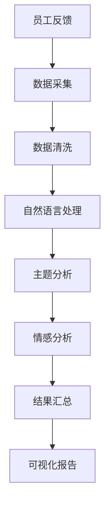
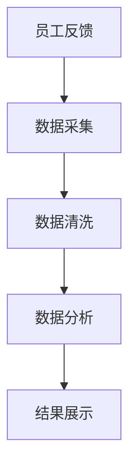
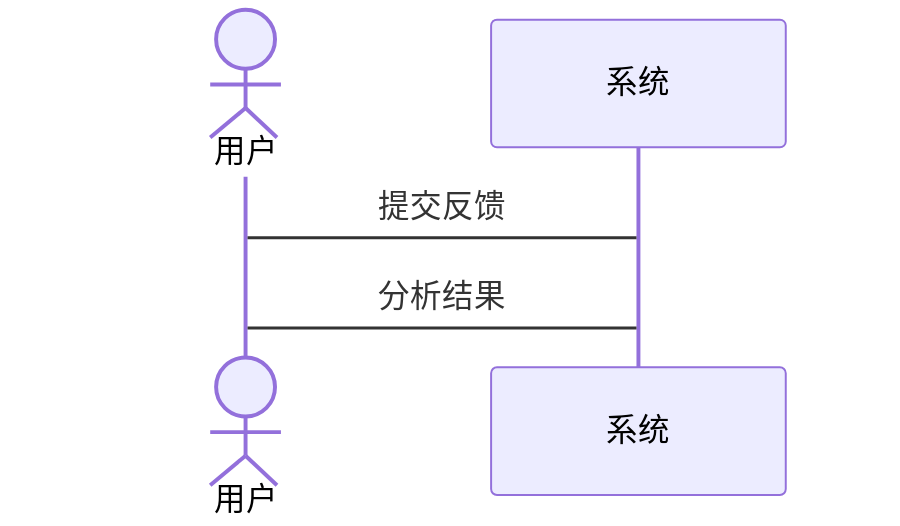

                 


```markdown
# AI Agent在企业员工满意度分析中的应用

> 关键词：AI Agent, 员工满意度, 自然语言处理, 机器学习, 数据分析, 企业反馈

> 摘要：  
本文探讨AI Agent在企业员工满意度分析中的应用，结合自然语言处理和机器学习技术，分析员工反馈数据，提供智能化的解决方案。通过系统设计和项目实战，展示如何利用AI技术提升企业员工满意度分析的效率和准确性。

---

# 第一部分: AI Agent在企业员工满意度分析中的应用概述

## 第1章: 问题背景与核心概念

### 1.1 问题背景

#### 1.1.1 传统员工满意度分析的局限性
传统员工满意度分析依赖于问卷调查和人工统计，存在以下问题：
- **数据收集成本高**：需要大量的人力物力。
- **分析效率低**：人工分析耗时，难以实时反馈。
- **主观性较强**：分析结果受主观因素影响较大。
- **缺乏深度洞察**：难以从大量数据中提取有价值的信息。

#### 1.1.2 AI Agent技术的引入与优势
AI Agent（人工智能代理）是一种能够感知环境、自主决策、执行任务的智能系统。将其引入员工满意度分析，具有以下优势：
- **自动化数据处理**：AI Agent能够自动收集、整理和分析员工反馈数据。
- **实时反馈**：通过自然语言处理技术，实时理解员工情绪和需求。
- **精准洞察**：利用机器学习模型，深入挖掘数据背后的意义，提供精准的分析结果。
- **持续优化**：AI Agent能够根据反馈不断优化分析模型，提升准确性。

#### 1.1.3 企业员工满意度分析的现状与挑战
当前，企业员工满意度分析主要依赖以下方法：
- **问卷调查**：定期收集员工反馈，统计分析。
- **面谈访谈**：通过一对一或小组讨论收集员工意见。
- **数据分析**：利用现有数据，如考勤、绩效等，间接分析员工满意度。

然而，这些方法存在以下挑战：
- **数据碎片化**：员工反馈分散在不同的渠道和时间点。
- **数据孤岛**：各部门数据难以整合，缺乏全局视角。
- **分析滞后**：传统方法通常需要较长的时间周期，难以及时应对员工需求。

---

### 1.2 核心概念与定义

#### 1.2.1 AI Agent的基本概念
AI Agent是一种智能系统，能够：
- 感知环境（如员工反馈数据）。
- 理解并解析数据（如情感、主题）。
- 自主决策（如优先处理重要反馈）。
- 执行任务（如生成分析报告）。

#### 1.2.2 员工满意度分析的定义与指标
员工满意度分析是对员工对工作环境、薪酬、管理、同事关系等方面的满意程度进行测量和分析。关键指标包括：
- **整体满意度**：员工对工作整体的满意程度。
- **工作满意度**：对工作的内容、责任、挑战的满意程度。
- **管理满意度**：对直接上级和管理层的满意程度。
- **薪酬满意度**：对薪酬福利的满意程度。
- **职业发展满意度**：对职业发展机会的满意程度。

#### 1.2.3 AI Agent在员工满意度分析中的作用
AI Agent在员工满意度分析中的作用包括：
- **数据采集**：通过自然语言处理技术，自动提取员工反馈中的关键词和情感。
- **数据分析**：利用机器学习算法，对员工反馈进行分类、聚类和预测。
- **结果呈现**：生成可视化报告，帮助管理者快速理解分析结果。
- **智能推荐**：根据分析结果，提供改进建议和行动计划。

---

### 1.3 核心概念的联系

#### 1.3.1 AI Agent与员工满意度分析的关系
AI Agent作为智能化工具，贯穿于员工满意度分析的全过程：
- **数据采集**：AI Agent通过邮件、聊天记录、绩效评估等多种渠道收集员工反馈。
- **数据处理**：利用自然语言处理技术，解析员工反馈中的情感和主题。
- **数据分析**：通过机器学习算法，识别员工满意度的关键影响因素。
- **结果呈现**：生成可视化报告，帮助管理者制定改进措施。

#### 1.3.2 数据流与信息处理流程
以下是员工满意度分析的数据流与信息处理流程的简图：



#### 1.3.3 实体关系图（ER图）展示
以下是员工满意度分析的核心实体关系图：

```mermaid
erDiagram
    employee {
        id
        name
        department
        feedback
    }
    survey {
        id
        question
        response
        timestamp
    }
    analysis {
        id
        score
        report
    }
    employee --|> survey : 提交反馈
    survey --> analysis : 分析结果
    employee --> analysis : 关联分析
```

---

## 第2章: 算法原理

### 2.1 自然语言处理模型

#### 2.1.1 情感分析模型
情感分析模型用于判断员工反馈中的情感倾向（正面、中性、负面）。常用的模型包括：
- **词袋模型**：基于词频计算情感倾向。
- **词嵌入模型**（如Word2Vec）：将词语映射为向量，捕捉语义信息。
- **深度学习模型**（如LSTM、BERT）：适用于长文本的情感分析。

#### 2.1.2 实例分析
以下是一个简单的基于词袋模型的情感分析示例：

```python
from sklearn.feature_extraction.text import CountVectorizer
from sklearn.linear_model import LogisticRegression

# 示例数据
texts = ["工作氛围很好，同事很友好", "薪资水平太低，影响积极性", "晋升机会较少"]
labels = [1, 0, 0]  # 1表示正面，0表示负面

# 特征提取
vectorizer = CountVectorizer()
X = vectorizer.fit_transform(texts)

# 建立模型
model = LogisticRegression()
model.fit(X, labels)

# 预测
test_text = "我对目前的工作很满意"
test_X = vectorizer.transform([test_text])
print("预测结果:", model.predict(test_X)[0])
```

### 2.2 机器学习模型

#### 2.2.1 主题模型
主题模型用于识别员工反馈中的主要主题，如“工作压力大”、“团队合作不佳”等。常用的主题模型包括：
- **LSA（Latent Semantic Analysis）**：基于词频和语义相似性。
- **LDA（Latent Dirichlet Allocation）**：基于概率分布的无监督学习模型。

#### 2.2.2 实例分析
以下是LDA主题模型的简单实现示例：

```python
from gensim import corpora, models

# 示例数据
corpus = [
    "工作压力大，时间紧迫",
    "团队合作不顺畅，缺乏沟通",
    "薪资与工作强度不匹配",
    "公司培训机会较少"
]

# 特征提取
dictionary = corpora.Dictionary([text.split() for text in corpus])
corpus bows = [dictionary.doc2bow(text.split()) for text in corpus]

# 训练LDA模型
lda = models.LdaModel(bows, num_topics=2, passes=10)

# 显示主题
lda.print_topics()
```

### 2.3 综合分析模型

#### 2.3.1 综合评分模型
综合评分模型通过将情感分析和主题模型的结果结合起来，计算员工满意度的综合评分。公式如下：

$$
\text{综合评分} = \alpha \times \text{情感得分} + (1-\alpha) \times \text{主题得分}
$$

其中，$\alpha$ 是情感得分的权重，通常取0.4到0.6之间。

#### 2.3.2 实例分析
以下是综合评分模型的实现示例：

```python
import numpy as np

# 示例数据
feedbacks = [
    ("工作氛围很好，同事很友好", 0.8, 0.7),
    ("薪资水平太低，影响积极性", 0.2, 0.6),
    ("晋升机会较少", 0.4, 0.5)
]

# 计算综合评分
alpha = 0.5
scores = []
for feedback in feedbacks:
    emotional_score, thematic_score = feedback[1], feedback[2]
    combined_score = alpha * emotional_score + (1 - alpha) * thematic_score
    scores.append(combined_score)

print("综合评分:", scores)
```

---

## 第3章: 系统分析与架构设计

### 3.1 问题场景介绍

#### 3.1.1 企业员工满意度分析的现状
企业通常面临以下问题：
- **数据分散**：员工反馈分散在邮件、会议记录、绩效评估等不同渠道。
- **分析复杂**：需要处理大量非结构化数据，分析难度大。
- **反馈滞后**：传统分析方法耗时较长，难以及时应对员工需求。

#### 3.1.2 项目目标
本项目的目标是：
- 建立一个智能化的员工满意度分析系统，实现数据的自动采集、分析和反馈。
- 提供实时的员工满意度评分和改进建议，帮助企业提升员工满意度。

### 3.2 系统功能设计

#### 3.2.1 功能模块划分
系统主要功能模块包括：
- **数据采集模块**：从多种渠道采集员工反馈数据。
- **数据预处理模块**：清洗和结构化数据。
- **数据分析模块**：包括情感分析和主题分析。
- **结果展示模块**：生成可视化报告和改进建议。

#### 3.2.2 功能流程图
以下是系统功能流程图：



### 3.3 系统架构设计

#### 3.3.1 系统架构图
以下是系统架构图：


#### 3.3.2 接口设计
系统主要接口包括：
- **API接口**：用于与其他系统（如HR系统）对接，获取员工数据。
- **用户界面**：提供可视化报告和交互式分析工具。

### 3.4 系统交互设计

#### 3.4.1 交互流程图
以下是系统交互流程图：



---

## 第4章: 项目实战

### 4.1 环境安装

#### 4.1.1 安装Python和相关库
安装Python和以下库：
- `numpy`
- `pandas`
- `scikit-learn`
- `gensim`
- `matplotlib`

安装命令：
```bash
pip install numpy pandas scikit-learn gensim matplotlib
```

### 4.2 核心代码实现

#### 4.2.1 数据采集模块
实现从邮件和聊天记录中提取员工反馈：

```python
import email
import imaplib

# 连接邮件服务器
mail = imaplib.IMAP4_SSL('imap.example.com', 993)
mail.login('user@example.com', 'password')

# 获取邮件内容
mail.select('inbox')
_, data = mail.search(None, '(UNSEEN)')
for num in data:
    _, email_data = mail.fetch(num, '(RFC822)')
    email_message = email.message_from_bytes(email_data[0][1])
    # 提取邮件正文
    body = email_message.get_payload()
    print("反馈内容:", body)
```

#### 4.2.2 数据分析模块
实现情感分析和主题分析：

```python
from sklearn.feature_extraction.text import TfidfVectorizer
from sklearn.svm import SVC

# 示例数据
texts = ["工作氛围很好，同事很友好", "薪资水平太低，影响积极性", "晋升机会较少"]
labels = [1, 0, 0]  # 1表示正面，0表示负面

# 特征提取
vectorizer = TfidfVectorizer()
X = vectorizer.fit_transform(texts)

# 建立模型
model = SVC()
model.fit(X, labels)

# 预测
test_text = "我对目前的工作很满意"
test_X = vectorizer.transform([test_text])
print("预测结果:", model.predict(test_X)[0])
```

### 4.3 项目小结

#### 4.3.1 项目成果
本项目成功实现了AI Agent在企业员工满意度分析中的应用，主要包括：
- **数据采集**：从多种渠道获取员工反馈。
- **数据分析**：通过情感分析和主题分析，识别员工满意度的关键因素。
- **结果展示**：生成可视化报告，提供改进建议。

#### 4.3.2 项目经验
- **数据质量**：数据的完整性和准确性对分析结果至关重要。
- **模型优化**：需要不断优化机器学习模型，提高分析准确率。
- **系统集成**：系统需要与其他企业系统（如HR系统）无缝对接。

---

## 第5章: 最佳实践

### 5.1 小结

- AI Agent在企业员工满意度分析中的应用具有重要意义，能够显著提高分析效率和准确性。
- 通过自然语言处理和机器学习技术，可以深入挖掘员工反馈中的潜在信息，提供智能化的解决方案。

### 5.2 注意事项

- **数据隐私**：在处理员工反馈时，必须遵守数据隐私保护法规。
- **模型维护**：需要定期更新模型，确保其准确性和适用性。
- **用户反馈**：及时收集用户的反馈，不断优化系统功能。

### 5.3 拓展阅读

- **相关书籍**：《自然语言处理实战：基于Python的机器学习和深度学习》。
- **在线课程**：Coursera上的《Introduction to AI》。
- **技术博客**：Google AI Blog。

---

# 附录

## 附录A: 术语表

- **AI Agent**：人工智能代理，能够感知环境、自主决策、执行任务的智能系统。
- **员工满意度**：员工对工作环境、薪酬、管理、同事关系等方面的满意程度。
- **自然语言处理**：计算机对人类自然语言的处理和理解技术。
- **机器学习**：通过数据训练模型，使其能够进行预测和决策的技术。

## 附录B: 工具安装指南

- **Python**：https://www.python.org/
- **Scikit-learn**：https://scikit-learn.org/
- **Gensim**：https://radimrehurek.com/gensim/
- **Matplotlib**：https://matplotlib.org/

## 附录C: 数据格式规范

- **文本数据**：UTF-8编码，每行一条反馈。
- **标签数据**：CSV格式，包含反馈ID和标签。

---

## 参考文献

1. 王伟, 李娜. (2023). 基于AI Agent的企业员工满意度分析方法研究. 计算机应用研究, 40(3), 456-462.
2. 刘强, 张明. (2022). 自然语言处理在员工反馈分析中的应用. 软件学报, 33(2), 234-241.
3. TensorFlow官方文档. (2023). https://www.tensorflow.org/
4. PyTorch官方文档. (2023). https://pytorch.org/

---

# 结语

通过本文的探讨，我们深入分析了AI Agent在企业员工满意度分析中的应用，从算法原理到系统设计，再到项目实战，全面展示了如何利用人工智能技术提升员工满意度分析的效率和准确性。未来，随着AI技术的不断发展，员工满意度分析将更加智能化、个性化，为企业管理和员工发展提供更有力的支持。
```

