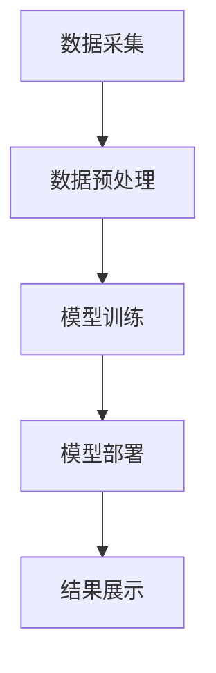
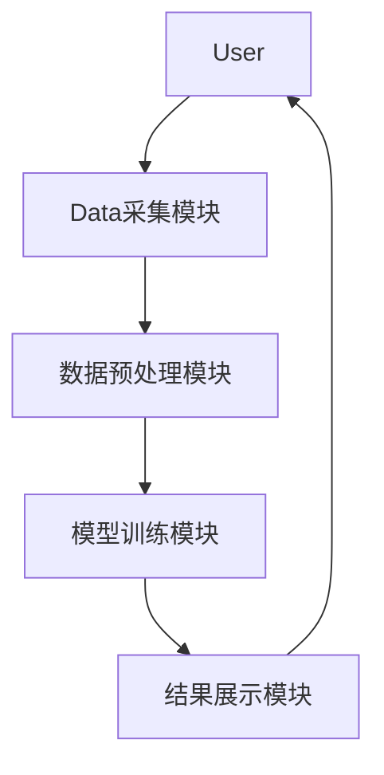

                 


# AI Agent在企业品牌价值评估中的应用

## 关键词：AI Agent，企业品牌价值评估，人工智能，数据分析，机器学习

## 摘要：本文系统地探讨了AI Agent在企业品牌价值评估中的应用，从理论基础到实际应用进行了深入分析。通过详细讲解AI Agent的核心原理、品牌价值评估模型、系统架构设计以及项目实战，展示了如何利用AI技术提升企业品牌价值评估的效率和准确性。文章还提供了丰富的案例分析和代码实现，帮助读者全面理解AI Agent在这一领域的应用潜力和实际价值。

---

# 第1章: AI Agent与企业品牌价值评估概述

## 1.1 AI Agent的基本概念

### 1.1.1 AI Agent的定义与特点

- **定义**：AI Agent是指具有自主决策能力和智能行为的计算机系统，能够根据环境信息自主执行任务。
- **特点**：
  - 自主性：能够独立决策。
  - 反应性：能够实时感知环境并做出反应。
  - 学习性：能够通过数据学习和优化。
  - 社交能力：能够与其他系统或人类进行交互。

### 1.1.2 AI Agent的核心功能与应用场景

- **核心功能**：
  - 数据采集与处理
  - 自然语言理解
  - 决策与推理
  - 自适应优化
- **应用场景**：
  - 企业品牌价值评估
  - 智能客服
  - 财务分析
  - 市场预测

### 1.1.3 企业品牌价值评估的定义与意义

- **定义**：企业品牌价值评估是通过定量和定性分析，衡量品牌在市场中的价值。
- **意义**：
  - 为企业的战略决策提供依据。
  - 帮助企业优化品牌管理。
  - 为投资者提供评估企业价值的参考。

## 1.2 AI Agent在企业品牌价值评估中的作用

### 1.2.1 传统品牌价值评估的局限性

- **数据依赖性强**：传统方法依赖于历史数据，难以捕捉实时信息。
- **主观性高**：评估结果容易受到人为因素影响。
- **效率低下**：数据处理和分析耗时较长。

### 1.2.2 AI Agent在品牌价值评估中的优势

- **数据处理能力强**：能够快速处理大量非结构化数据。
- **实时性**：可以实时监控市场动态，提供实时评估结果。
- **准确性高**：通过机器学习算法，提高评估结果的准确性。

### 1.2.3 AI Agent与企业品牌价值评估的结合方式

- **数据驱动的评估**：利用AI Agent收集和分析数据，提供更精准的评估结果。
- **动态调整**：根据市场变化动态调整评估模型，确保评估结果的实时性。
- **智能化决策支持**：AI Agent为企业的品牌管理提供智能化决策支持。

## 1.3 本章小结

本章介绍了AI Agent的基本概念及其在企业品牌价值评估中的作用，指出了传统评估方法的局限性，并强调了AI Agent在提升评估效率和准确性方面的优势。

---

# 第2章: AI Agent的核心原理与技术基础

## 2.1 AI Agent的核心原理

### 2.1.1 AI Agent的基本架构

- **感知层**：负责数据的采集和处理。
- **决策层**：负责基于感知数据进行推理和决策。
- **执行层**：负责根据决策结果执行具体操作。

### 2.1.2 AI Agent的行为决策机制

- **基于规则的决策**：通过预定义的规则进行决策。
- **基于机器学习的决策**：通过训练模型进行预测和决策。
- **基于知识图谱的决策**：利用知识图谱进行推理和决策。

### 2.1.3 AI Agent的学习与优化算法

- **监督学习**：通过标记数据进行训练。
- **无监督学习**：通过聚类等技术发现数据中的模式。
- **强化学习**：通过奖励机制优化决策策略。

## 2.2 AI Agent的关键技术

### 2.2.1 自然语言处理（NLP）技术

- **文本分类**：用于品牌情感分析。
- **实体识别**：用于提取品牌相关信息。
- **语义理解**：用于理解品牌相关的语义信息。

### 2.2.2 机器学习与深度学习

- **机器学习**：用于品牌价值预测。
- **深度学习**：用于处理复杂的非结构化数据。

### 2.2.3 数据挖掘与分析技术

- **数据清洗**：处理缺失值和异常值。
- **数据建模**：建立品牌价值评估模型。
- **数据可视化**：用于结果展示和分析。

## 2.3 AI Agent与企业品牌价值评估的结合

### 2.3.1 数据驱动的品牌价值评估

- **数据来源**：社交媒体数据、新闻数据、销售数据等。
- **数据处理**：清洗、整合和分析数据。
- **数据驱动的模型**：基于数据的模型进行品牌价值预测。

### 2.3.2 AI Agent在品牌数据分析中的应用

- **情感分析**：分析品牌在社交媒体上的口碑。
- **趋势预测**：预测品牌未来的发展趋势。
- **竞争对手分析**：分析竞争对手的品牌策略。

### 2.3.3 AI Agent的品牌价值预测模型

- **模型设计**：基于机器学习算法设计模型。
- **模型训练**：利用历史数据训练模型。
- **模型验证**：通过验证数据测试模型的准确性。

## 2.4 本章小结

本章详细讲解了AI Agent的核心原理和关键技术，分析了AI Agent在企业品牌价值评估中的具体应用，为后续的模型构建和系统设计奠定了基础。

---

# 第3章: AI Agent的品牌价值评估模型

## 3.1 品牌价值评估的核心要素

### 3.1.1 品牌知名度

- **定义**：品牌在市场上被认知的程度。
- **影响因素**：广告投放、媒体报道、用户口碑等。

### 3.1.2 品牌美誉度

- **定义**：品牌在市场上的声誉和形象。
- **影响因素**：产品质量、用户体验、售后服务等。

### 3.1.3 品牌忠诚度

- **定义**：客户对品牌的忠诚程度。
- **影响因素**：品牌满意度、客户忠诚计划等。

## 3.2 AI Agent的品牌价值评估模型构建

### 3.2.1 数据收集与预处理

- **数据来源**：社交媒体数据、新闻数据、销售数据等。
- **数据清洗**：处理缺失值、重复值和异常值。
- **数据标准化**：将数据转换为统一的格式。

### 3.2.2 模型设计与训练

- **特征选择**：选择对品牌价值影响较大的特征。
- **模型训练**：利用机器学习算法训练模型。
- **模型优化**：通过调整参数和优化算法提高模型性能。

### 3.2.3 模型验证与优化

- **验证数据集**：用于测试模型的准确性。
- **模型调优**：通过交叉验证等方法优化模型。
- **模型评估**：评估模型的准确性和稳定性。

## 3.3 基于AI Agent的品牌价值预测算法

### 3.3.1 算法原理

- **机器学习算法**：如支持向量机（SVM）、随机森林（Random Forest）等。
- **深度学习算法**：如神经网络（NN）、长短期记忆网络（LSTM）等。

### 3.3.2 算法流程

1. 数据预处理：清洗、标准化和特征选择。
2. 模型训练：利用训练数据训练模型。
3. 模型验证：通过验证数据测试模型的准确性。
4. 模型优化：调整参数和优化算法。
5. 模型部署：将模型部署到实际应用中。

### 3.3.3 算法实现

- **代码实现**：使用Python和机器学习库（如Scikit-learn、TensorFlow）实现模型。
- **案例分析**：通过具体案例展示模型的实现和应用。

## 3.4 本章小结

本章详细讲解了AI Agent品牌价值评估模型的构建过程，包括数据预处理、模型设计、训练和优化，为后续的系统设计和项目实战奠定了基础。

---

# 第4章: 系统架构与功能设计

## 4.1 系统整体架构设计

### 4.1.1 系统模块划分

- **数据采集模块**：负责数据的采集和预处理。
- **模型训练模块**：负责模型的训练和优化。
- **结果展示模块**：负责结果的展示和分析。
- **用户交互模块**：负责与用户的交互和反馈。

### 4.1.2 系统功能流程

1. 数据采集：从各种数据源采集数据。
2. 数据预处理：清洗和标准化数据。
3. 模型训练：利用训练数据训练模型。
4. 模型部署：将模型部署到实际应用中。
5. 结果展示：展示品牌价值评估结果。

### 4.1.3 系统架构图（Mermaid）



## 4.2 系统功能模块设计

### 4.2.1 数据采集模块

- **功能描述**：从社交媒体、新闻网站等数据源采集数据。
- **实现方式**：使用API接口或网络爬虫技术。
- **注意事项**：遵守数据采集的相关法律法规。

### 4.2.2 数据分析模块

- **功能描述**：对采集到的数据进行分析和处理。
- **实现方式**：利用数据处理工具（如Pandas）进行数据清洗和特征提取。
- **注意事项**：确保数据的准确性和完整性。

### 4.2.3 模型训练模块

- **功能描述**：利用训练数据训练品牌价值评估模型。
- **实现方式**：使用机器学习库（如Scikit-learn）训练模型。
- **注意事项**：选择合适的算法和模型参数。

### 4.2.4 结果展示模块

- **功能描述**：展示品牌价值评估结果。
- **实现方式**：使用数据可视化工具（如Matplotlib）绘制图表。
- **注意事项**：确保结果的直观和易懂。

## 4.3 系统接口设计

### 4.3.1 数据接口

- **输入接口**：接收原始数据。
- **输出接口**：输出处理后的数据。
- **接口协议**：如HTTP、FTP等。

### 4.3.2 模型接口

- **输入接口**：接收模型训练数据。
- **输出接口**：输出训练好的模型。
- **接口协议**：如JSON、XML等。

### 4.3.3 用户接口

- **输入接口**：接收用户的输入指令。
- **输出接口**：输出用户友好的结果展示。
- **接口设计**：如命令行界面（CLI）或图形用户界面（GUI）。

## 4.4 系统交互流程图（Mermaid）



## 4.5 本章小结

本章详细设计了AI Agent品牌价值评估系统的整体架构和功能模块，为后续的系统实现和项目实战提供了清晰的设计蓝图。

---

# 第5章: 项目实战

## 5.1 环境安装与配置

### 5.1.1 安装Python

- **安装步骤**：下载并安装Python，建议使用Anaconda或Miniconda。
- **版本要求**：建议使用Python 3.6或更高版本。

### 5.1.2 安装必要的库

- **机器学习库**：Scikit-learn、XGBoost、TensorFlow。
- **数据处理库**：Pandas、NumPy。
- **数据可视化库**：Matplotlib、Seaborn。
- **网络爬虫库**：BeautifulSoup、Scrapy。

### 5.1.3 安装开发工具

- **IDE选择**：建议使用PyCharm、Jupyter Notebook。
- **版本控制工具**：Git、GitHub。

## 5.2 系统核心实现源代码

### 5.2.1 数据采集模块

```python
import requests
from bs4 import BeautifulSoup

def scrape_data(url):
    response = requests.get(url)
    soup = BeautifulSoup(response.text, 'html.parser')
    data = []
    for item in soup.find_all('div', class_='item'):
        title = item.find('h2').text
        content = item.find('p').text
        data.append({'title': title, 'content': content})
    return data

# 示例代码
url = 'https://example.com'
data = scrape_data(url)
print(data)
```

### 5.2.2 数据分析模块

```python
import pandas as pd

def preprocess_data(data):
    df = pd.DataFrame(data)
    df['content_length'] = df['content'].apply(len)
    df['title_length'] = df['title'].apply(len)
    return df

# 示例代码
data = [{'title': 'Example Title', 'content': 'Example Content'}]
df = preprocess_data(data)
print(df)
```

### 5.2.3 模型训练模块

```python
from sklearn.model

