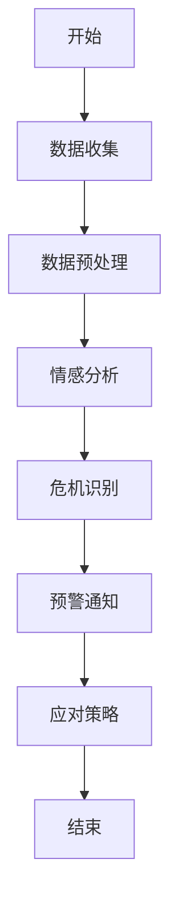
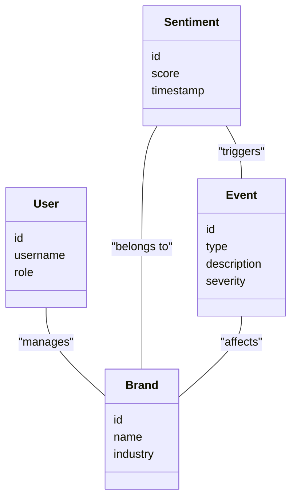
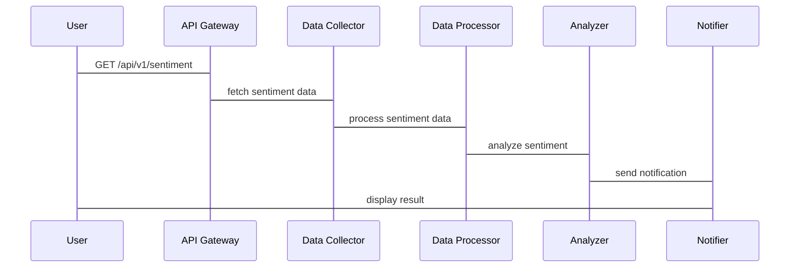

                 


# 第一部分: AI Agent在企业品牌声誉管理与危机预警中的角色

## 第1章: 引言

### 1.1 问题背景

#### 1.1.1 企业品牌声誉管理的重要性
企业品牌声誉是企业在市场中的形象和信誉的集中体现，直接影响客户信任度、市场份额和企业价值。在数字化时代，品牌声誉的管理变得更加复杂，因为消费者可以通过社交媒体、新闻媒体等渠道快速传播对企业形象的正面或负面评价。

#### 1.1.2 危机预警的必要性
危机预警是指在潜在危机发生前，通过监测和分析相关数据，提前识别可能对企业声誉造成负面影响的事件。危机预警的核心在于“预防”，通过及时采取措施，将潜在危机的影响降到最低。

#### 1.1.3 AI Agent在其中的角色
AI Agent（人工智能代理）是一种能够自主感知环境、理解任务目标，并采取行动以实现目标的智能体。在企业品牌声誉管理和危机预警中，AI Agent可以实时监测网络上的相关信息，分析情感倾向，识别潜在风险，并提出应对策略。通过自动化和智能化的方式，AI Agent能够显著提高品牌声誉管理的效率和准确性。

### 1.2 问题描述

#### 1.2.1 传统品牌声誉管理的局限性
传统的品牌声誉管理主要依赖人工监测和分析，这种方式存在效率低、覆盖面有限、响应速度慢等问题。例如，人工监测需要大量的人力资源，且难以实时捕捉网络上的海量信息。此外，人工分析也可能受到主观因素的影响，导致结果不够客观。

#### 1.2.2 危机预警的挑战
危机预警的核心是快速、准确地识别潜在危机。然而，传统的危机预警方法往往依赖于历史数据和经验判断，难以适应新的、未知的危机类型。此外，危机的传播速度往往超过人工监测的能力，导致企业在危机爆发时往往处于被动应对状态。

#### 1.2.3 AI Agent如何解决这些问题
AI Agent通过自然语言处理（NLP）、机器学习（ML）等技术，能够实时监测和分析海量数据，快速识别潜在危机。AI Agent不仅可以自动化处理大量数据，还能通过学习不断提高识别的准确性和效率。此外，AI Agent可以24/7不间断工作，确保企业声誉管理的实时性。

### 1.3 问题解决

#### 1.3.1 AI Agent的核心功能
AI Agent在品牌声誉管理中的核心功能包括：实时监测、情感分析、危机识别、预警通知、应对策略建议等。AI Agent能够自动从社交媒体、新闻媒体、论坛等渠道收集相关信息，分析这些信息的情感倾向，识别潜在的危机，并根据预设的策略自动发出预警通知，甚至可以自动启动应对措施。

#### 1.3.2 AI Agent在声誉管理中的具体应用
AI Agent在品牌声誉管理中的具体应用包括：
- **实时监测**：持续监测网络上的相关信息，包括社交媒体、新闻媒体等。
- **情感分析**：通过自然语言处理技术，分析文本的情感倾向，判断公众对品牌的看法。
- **危机识别**：基于情感分析和上下文理解，识别潜在的危机事件。
- **预警通知**：当识别到潜在危机时，立即通知相关负责人，并提供应对建议。
- **应对策略**：根据危机的性质和严重程度，自动或协助制定应对策略。

#### 1.3.3 危机预警的实现路径
危机预警的实现路径包括：
1. **数据收集**：通过爬虫等技术，收集相关信息。
2. **数据预处理**：清洗数据，提取关键信息。
3. **情感分析**：通过机器学习模型，分析文本的情感倾向。
4. **危机识别**：基于情感分析结果和上下文信息，识别潜在危机。
5. **预警通知**：当识别到危机时，通过邮件、短信等方式通知相关人员。
6. **应对策略**：根据危机的性质，制定相应的应对策略。

### 1.4 边界与外延

#### 1.4.1 AI Agent的适用范围
AI Agent适用于需要实时监测和分析海量数据的场景，特别适合品牌声誉管理和危机预警。然而，AI Agent并不适合所有类型的企业，尤其是那些数据量小、品牌影响力有限的小型企业，可能难以充分发挥AI Agent的优势。

#### 1.4.2 与其他技术的区别
AI Agent与其他技术的主要区别在于其自主性和智能性。传统的大数据分析工具需要人工干预和指导，而AI Agent可以自主学习和优化，能够根据环境的变化自动调整其行为。

#### 1.4.3 品牌声誉管理的边界
品牌声誉管理的边界主要在于如何平衡隐私保护和信息透明度。在监测和分析相关信息时，必须遵守相关法律法规，保护消费者的隐私权益。

### 1.5 概念结构与核心要素

#### 1.5.1 AI Agent的基本构成
AI Agent的基本构成包括：
- **感知模块**：负责收集和处理环境中的信息。
- **推理模块**：负责分析信息，识别潜在危机。
- **行动模块**：负责采取行动，应对潜在危机。
- **学习模块**：负责通过学习不断提高识别和应对能力。

#### 1.5.2 品牌声誉管理的核心要素
品牌声誉管理的核心要素包括：
- **数据收集**：收集与品牌相关的各种信息。
- **情感分析**：分析这些信息的情感倾向。
- **危机识别**：识别潜在的危机事件。
- **预警通知**：通知相关人员，并提供应对建议。

#### 1.5.3 危机预警的系统架构
危机预警的系统架构包括：
- **数据源**：社交媒体、新闻媒体、论坛等。
- **数据处理**：数据清洗、特征提取等。
- **模型训练**：训练情感分析和危机识别模型。
- **预警系统**：实时监测，识别危机，发出预警。

---

## 第2章: 核心概念与联系

### 2.1 AI Agent的核心原理

#### 2.1.1 AI Agent的工作原理
AI Agent通过感知环境、分析信息、推理决策，并采取行动来实现其目标。在品牌声誉管理中，AI Agent的核心任务是实时监测相关信息，分析情感倾向，识别潜在危机，并采取相应的行动。

#### 2.1.2 基于自然语言处理的文本分析
自然语言处理（NLP）是AI Agent实现情感分析和文本理解的核心技术。通过NLP技术，AI Agent可以理解文本的语义，识别情感倾向，并提取关键词和主题。

#### 2.1.3 事件驱动的危机预警机制
事件驱动的危机预警机制是指，AI Agent通过实时监测和分析相关信息，识别潜在危机事件，并根据事件的性质和严重程度，自动启动相应的预警和应对机制。

### 2.2 核心概念对比表

#### 表2-1: AI Agent与传统声誉管理方法的对比

| 对比维度       | AI Agent                     | 传统方法                     |
|----------------|------------------------------|------------------------------|
| 数据处理能力   | 高效、自动化                  | 低效、依赖人工                |
| 响应速度       | 实时                          | 延迟                          |
| 分析精度       | 高，基于机器学习              | 低，依赖人工判断              |
| 覆盖范围       | 宽，可覆盖全球信息             | 有限，依赖人工收集            |
| 成本           | 较低，自动化减少人力成本      | 较高，需要大量人力资源        |
| 可扩展性       | 高，可快速扩展                | 低，难以快速扩展              |

### 2.3 ER实体关系图

#### 图2-1: AI Agent在品牌声誉管理中的实体关系图

```mermaid
erDiagram
    user {
        id : integer
        username : string
        role : string
    }
    brand {
        id : integer
        name : string
        industry : string
    }
    sentiment {
        id : integer
        score : float
        timestamp : datetime
    }
    event {
        id : integer
        type : string
        description : string
        severity : integer
    }
    user -- brand : "manages"
    sentiment -- brand : "belongs to"
    event -- brand : "affects"
    sentiment -- event : "triggers"
```

---

## 第3章: AI Agent的算法原理

### 3.1 算法流程

#### 图3-1: AI Agent的声誉管理流程



### 3.2 算法实现

#### 3.2.1 情感分析算法

```python
import pandas as pd
from sklearn.feature_extraction.text import TfidfVectorizer
from sklearn.svm import SVC

# 数据加载
data = pd.read_csv('sentiment_data.csv')

# 特征提取
vectorizer = TfidfVectorizer(max_features=5000)
X = vectorizer.fit_transform(data['text'])

# 模型训练
model = SVC()
model.fit(X, data['label'])

# 预测
test_text = "The product is terrible!"
test_vec = vectorizer.transform([test_text])
predicted_label = model.predict(test_vec)
print(predicted_label)
```

#### 3.2.2 危机识别算法

```python
import numpy as np
from sklearn.ensemble import IsolationForest

# 数据加载
data = pd.read_csv('event_data.csv')

# 模型训练
model = IsolationForest(n_estimators=100, contamination=0.05)
model.fit(data.drop('severity', axis=1))

# 预测
test_event = data.iloc[-1:][data.columns.drop('severity')]
predicted_severity = model.predict(test_event)
print(predicted_severity)
```

### 3.3 数学公式

#### 3.3.1 情感分析模型

$$
\text{概率} = \frac{\sum_{i=1}^{n} w_i \cdot \text{TF-IDF}(i)}{\sum_{i=1}^{n} \text{TF-IDF}(i)}
$$

其中，$w_i$ 是每个词的情感权重，$\text{TF-IDF}(i)$ 是第i个词的TF-IDF值。

#### 3.3.2 危机识别模型

$$
\text{危机概率} = \frac{\sum_{i=1}^{m} \text{特征权重}(i) \cdot \text{特征值}(i)}{\sum_{i=1}^{m} \text{特征权重}(i)}
$$

其中，$\text{特征权重}(i)$ 是第i个特征的权重，$\text{特征值}(i)$ 是第i个特征的值。

---

## 第4章: 系统分析与架构设计

### 4.1 系统功能设计

#### 4.1.1 领域模型



### 4.2 系统架构设计

#### 4.2.1 架构图

```mermaid
archiDiagram
    component API Gateway {
        provides User Interface
        provides API Endpoints
    }
    component Data Collector {
        uses API Gateway
        provides Raw Data
    }
    component Data Processor {
        uses Data Collector
        provides Processed Data
    }
    component Analyzer {
        uses Data Processor
        provides Sentiment Analysis
        provides Crisis Detection
    }
    componentNotifier {
        uses Analyzer
        provides Notifications
    }
```

### 4.3 系统接口设计

#### 4.3.1 API接口

```http
GET /api/v1/sentiment
POST /api/v1/event
PUT /api/v1/settings
DELETE /api/v1/clean
```

### 4.4 系统交互设计

#### 4.4.1 序列图



---

## 第5章: 项目实战

### 5.1 环境安装

#### 5.1.1 安装Python环境

```bash
python --version
pip install --upgrade pip
pip install numpy
pip install scikit-learn
pip install matplotlib
pip install pandas
```

#### 5.1.2 安装NLP库

```bash
pip install spacy
pip install gensim
pip install transformers
```

### 5.2 核心代码实现

#### 5.2.1 数据收集

```python
import requests
from bs4 import BeautifulSoup

def scrape_data(url):
    response = requests.get(url)
    soup = BeautifulSoup(response.text, 'html.parser')
    articles = soup.find_all('article')
    data = []
    for article in articles:
        title = article.find('h2').text
        content = article.find('p').text
        data.append({'title': title, 'content': content})
    return data
```

#### 5.2.2 情感分析

```python
from transformers import pipeline

sentiment_analyzer = pipeline("sentiment-analysis")
result = sentiment_analyzer("The product is excellent!")
print(result)
```

### 5.3 案例分析

#### 5.3.1 案例背景

假设某品牌在社交媒体上收到大量负面评论，AI Agent需要实时监测并识别这些评论，发出预警，并建议相应的应对措施。

#### 5.3.2 数据处理

```python
import pandas as pd
data = pd.read_csv('comments.csv')
data['sentiment'] = data['text'].apply(lambda x: sentiment_analyzer(x)[0]['label'])
data['score'] = data['text'].apply(lambda x: sentiment_analyzer(x)[0]['score'])
```

#### 5.3.3 危机识别

```python
from sklearn.ensemble import IsolationForest

model = IsolationForest(n_estimators=100, contamination=0.05)
model.fit(data[['sentiment', 'score', 'length']])
outliers = model.predict(data[['sentiment', 'score', 'length']])
data['outlier'] = outliers
```

### 5.4 项目小结

通过上述案例，我们可以看到AI Agent在品牌声誉管理中的巨大潜力。通过实时监测、情感分析和危机识别，AI Agent能够显著提高品牌声誉管理的效率和准确性。然而，AI Agent的应用也面临一些挑战，比如数据隐私、模型解释性等，这些都是未来需要进一步研究和解决的问题。

---

## 第6章: 总结与展望

### 6.1 总结

AI Agent在企业品牌声誉管理与危机预警中的角色日益重要。通过实时监测、情感分析和危机识别，AI Agent能够帮助企业及时发现潜在危机，并采取相应的应对措施，从而保护企业的品牌形象和市场声誉。

### 6.2 未来展望

未来，随着人工智能和大数据技术的不断发展，AI Agent在品牌声誉管理中的应用将更加广泛和深入。例如，结合区块链技术，可以实现数据的不可篡改性和更高的透明度；结合边缘计算，可以实现更快速的数据处理和响应。

### 6.3 最佳实践Tips

1. **数据隐私保护**：在收集和处理数据时，必须遵守相关法律法规，保护消费者的隐私权益。
2. **模型解释性**：在实际应用中，模型的解释性非常重要，尤其是在危机预警中，需要确保决策的透明性和可解释性。
3. **持续优化**：AI Agent需要不断学习和优化，以适应新的数据和场景，提高识别和应对能力。

---

通过以上思考，我们可以看到，AI Agent在企业品牌声誉管理与危机预警中的应用具有巨大的潜力和广阔的发展前景。希望本文能够为读者提供有价值的参考和启发，帮助他们在实际工作中更好地应用AI Agent技术。

