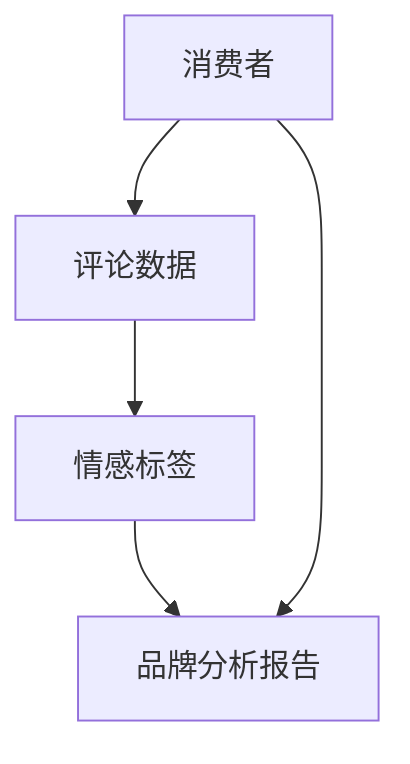
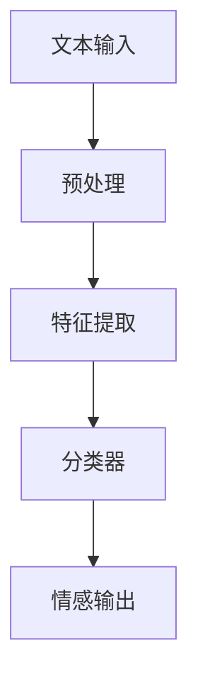
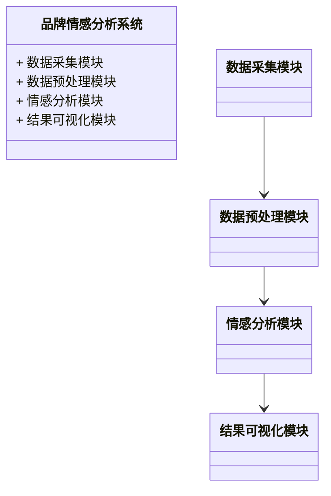
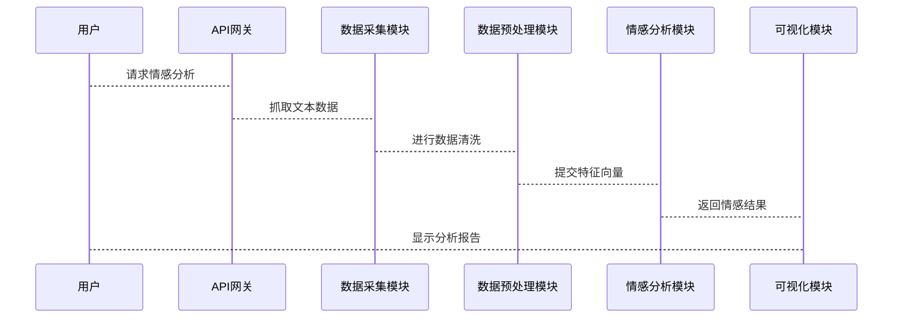

                 


# AI Agent在企业品牌情感分析与管理中的深度应用

> 关键词：AI Agent, 情感分析, 品牌管理, 深度学习, 自然语言处理, 企业应用

> 摘要：本文深入探讨AI Agent在企业品牌情感分析与管理中的应用，从理论基础到实际应用，系统性地分析其工作原理、算法实现、系统架构及项目实战，为企业提供一套完整的解决方案。

---

# 第1章: AI Agent与企业品牌情感分析的背景与概念

## 1.1 问题背景与描述

### 1.1.1 企业品牌管理中的情感分析需求

在当今竞争激烈的市场环境中，企业品牌的价值不仅体现在产品或服务的质量上，更取决于消费者对其的情感认同。消费者在社交媒体、论坛、评论等渠道上发表的意见、评价和反馈，构成了品牌情感的核心数据。企业需要实时捕捉这些情感信息，以便及时调整市场策略、优化产品体验、提升品牌形象。

然而，随着数据量的爆炸式增长，企业难以手动处理海量的非结构化数据。情感分析作为一种自然语言处理技术，能够帮助企业从海量文本数据中提取情感信息。而AI Agent（人工智能代理）作为一种能够自主感知、决策和执行任务的智能体，则能够进一步提升情感分析的效率和准确性。

### 1.1.2 当前品牌管理中的痛点与挑战

1. **数据量大且分散**：消费者评论分布在多个平台（如社交媒体、电商平台、论坛等），数据来源多样且分散，难以统一处理。
2. **情感信息复杂性**：消费者的情感表达可能包含隐喻、讽刺、 sarcasm等复杂语言现象，传统的情感分析方法难以准确捕捉。
3. **实时性要求高**：品牌管理需要实时监控市场动态，及时响应消费者反馈，这对情感分析的实时性和准确性提出了更高要求。
4. **个性化需求**：不同品牌、不同产品的情感分析需求可能不同，需要定制化的解决方案。

### 1.1.3 AI Agent在品牌管理中的应用价值

AI Agent通过整合自然语言处理、机器学习、大数据分析等技术，能够实现对企业品牌情感的实时监控、分析和管理。其核心价值体现在以下几个方面：

1. **自动化数据处理**：AI Agent能够自动抓取、清洗和预处理来自多个渠道的文本数据，降低人工成本。
2. **智能情感分析**：通过深度学习模型，AI Agent能够准确识别文本中的情感倾向，捕捉潜在的消费者情绪。
3. **实时监控与预警**：AI Agent能够实时跟踪品牌情感动态，及时发现负面舆情并发出预警。
4. **个性化策略推荐**：基于情感分析结果，AI Agent能够为品牌管理者提供个性化的市场策略建议。

## 1.2 问题解决与边界

### 1.2.1 AI Agent如何解决品牌情感分析问题

AI Agent通过以下方式解决品牌情感分析的核心问题：

1. **数据整合与处理**：AI Agent能够从多个数据源抓取文本数据，并进行清洗、分词、去停用词等预处理操作，为后续分析奠定基础。
2. **情感分类与分析**：基于深度学习模型（如LSTM、BERT等），AI Agent能够对文本进行情感分类（如正面、负面、中性），并进一步提取情感关键词和情感强度。
3. **实时监控与反馈**：AI Agent能够实时跟踪品牌相关的情感数据，并通过可视化界面向品牌管理者提供反馈，帮助其快速做出决策。

### 1.2.2 问题的边界与外延

在实际应用中，AI Agent的品牌情感分析需要明确以下边界：

1. **数据范围**：仅处理与品牌相关的文本数据，排除无关内容。
2. **情感粒度**：支持情感分类（正面、负面、中性）的同时，可进一步细分为情感强度（如非常正面、稍微正面等）。
3. **语言支持**：目前主要支持主流语言（如中文、英文），多语言支持可根据需求扩展。

### 1.2.3 核心概念与核心要素组成

以下是品牌情感分析的核心概念与要素：

| **核心概念** | **描述** |
|--------------|----------|
| **文本数据** | 消费者评论、社交媒体帖子等文本数据。 |
| **情感倾向** | 文本的情感分类结果（正面、负面、中性）。 |
| **情感强度** | 情感的强烈程度，如“非常喜欢” vs. “一般喜欢”。 |
| **情感关键词** | 文本中与情感相关的关键词汇。 |
| **AI Agent** | 负责数据处理、情感分析和结果反馈的智能代理。 |

## 1.3 本章小结

本章从企业品牌管理的背景出发，分析了品牌情感分析的需求与挑战，并介绍了AI Agent在品牌管理中的应用价值。通过明确问题边界和核心概念，为后续章节的深入分析奠定了基础。

---

# 第2章: AI Agent的核心概念与工作原理

## 2.1 核心概念原理

### 2.1.1 AI Agent的定义与分类

AI Agent是一种能够感知环境、自主决策并执行任务的智能体。根据应用场景的不同，AI Agent可以分为以下几类：

| **分类**         | **描述**                                                                 |
|------------------|--------------------------------------------------------------------------|
| **反应式AI Agent** | 基于当前环境输入做出实时反应，适用于需要快速决策的任务。                         |
| **认知式AI Agent** | 具备复杂推理能力，能够基于历史数据和上下文做出决策，适用于需要深度分析的任务。   |

### 2.1.2 情感分析的基本原理

情感分析的核心在于从文本中提取情感信息。其基本流程包括以下步骤：

1. **数据预处理**：包括分词、去停用词、词干提取等。
2. **特征提取**：将文本数据转化为可用于分类的特征向量。
3. **情感分类**：基于机器学习或深度学习模型，对文本进行情感分类。

### 2.1.3 基于AI Agent的情感分析模型

AI Agent在情感分析中的角色是多面的：

1. **数据采集与预处理**：AI Agent负责从多个数据源抓取文本数据，并进行预处理。
2. **特征提取与分类**：AI Agent利用自然语言处理技术提取文本特征，并通过深度学习模型进行情感分类。
3. **结果反馈与决策**：AI Agent将情感分析结果反馈给品牌管理者，并提供策略建议。

## 2.2 核心概念对比分析

### 2.2.1 情感分析与文本挖掘的对比

| **维度**         | **情感分析**               | **文本挖掘**               |
|------------------|----------------------------|----------------------------|
| **目标**         | 分析文本情感倾向           | 提取文本中的结构化信息     |
| **技术手段**     | 依赖深度学习模型           | 依赖规则提取和统计方法     |
| **应用场景**     | 品牌管理、舆情监控         | 信息抽取、关键词提取       |

### 2.2.2 AI Agent与传统情感分析的对比

| **维度**         | **AI Agent**               | **传统情感分析**           |
|------------------|----------------------------|----------------------------|
| **自主性**       | 具备自主决策能力           | 需人工干预或固定规则       |
| **实时性**       | 支持实时分析               | 实时性较弱                 |
| **扩展性**       | 可扩展至多任务             | 专注于单一任务             |

### 2.2.3 企业品牌管理中的关键区别

在企业品牌管理中，AI Agent的核心优势在于其智能化和自动化能力。与传统方法相比，AI Agent能够更高效地处理海量数据，并提供实时反馈。

## 2.3 ER实体关系图

以下是品牌情感分析的核心实体关系图：



## 2.4 本章小结

本章详细介绍了AI Agent的核心概念与工作原理，并通过对比分析和实体关系图，明确了AI Agent在情感分析中的独特优势。

---

# 第3章: 情感分析算法原理与实现

## 3.1 算法原理

### 3.1.1 基于词袋模型的情感分析

词袋模型是一种简单但有效的文本表示方法。其基本思想是将文本表示为词汇的集合，不考虑词汇的顺序。公式表示如下：

$$
\text{TF}(w, d) = \frac{\text{count}(w, d)}{\text{length}(d)}
$$

其中，$\text{TF}(w, d)$表示词语$w$在文档$d$中的词频。

### 3.1.2 基于深度学习的情感分析

深度学习模型（如LSTM、BERT）在情感分析中的表现优于传统方法。以BERT为例，其核心思想是通过预训练模型捕捉文本的语义信息。

### 3.1.3 基于预训练模型的情感分析

预训练模型（如BERT、GPT）通过大规模数据预训练，能够捕捉到文本的深层语义信息。其情感分类任务可以通过微调模型实现。

## 3.2 算法流程图

以下是情感分析的算法流程图：



## 3.3 核心算法代码实现

以下是一个基于TF-IDF和SVM的情感分类器的代码示例：

```python
from sklearn.feature_extraction.text import TfidfVectorizer
from sklearn.svm import SVC

# 示例代码
text_clf = Pipeline([
    ('tfidf', TfidfVectorizer()),
    ('clf', SVC())
])

# 训练模型
text_clf.fit(X_train, y_train)

# 预测
y_pred = text_clf.predict(X_test)
```

数学模型公式：

$$
\text{TF-IDF}(w, d) = \text{TF}(w, d) \times \text{IDF}(w)
$$

其中，$\text{IDF}(w)$表示词语$w$的逆文档频率，计算公式为：

$$
\text{IDF}(w) = \log\left(\frac{N}{\text{DF}(w)}\right)
$$

其中，$N$是语料库中文档总数，$\text{DF}(w)$是词语$w$的文档频率。

## 3.4 本章小结

本章详细介绍了情感分析的核心算法及其实现原理，并通过代码示例和公式推导，帮助读者理解情感分析的技术细节。

---

# 第4章: 系统架构与设计

## 4.1 问题场景介绍

企业品牌情感分析系统的应用场景包括：

1. **社交媒体监控**：实时监控品牌在社交媒体上的声誉。
2. **产品评论分析**：分析消费者对产品的评价，优化产品设计。
3. **舆情预警**：及时发现负面舆情，避免品牌危机。

## 4.2 系统功能设计

以下是系统功能需求的领域模型：



## 4.3 系统架构设计

以下是系统的架构图：


## 4.4 系统接口设计

系统主要接口包括：

1. **数据采集接口**：负责从社交媒体、电商平台等数据源抓取文本数据。
2. **情感分析接口**：接收预处理后的文本数据，返回情感分类结果。
3. **结果反馈接口**：将情感分析结果传递给品牌管理者，并提供预警信息。

## 4.5 系统交互设计

以下是系统的交互流程图：



## 4.6 本章小结

本章从系统设计的角度，详细描述了品牌情感分析系统的功能需求、架构设计和交互流程，为后续的项目实现奠定了基础。

---

# 第5章: 项目实战

## 5.1 环境安装与配置

以下是项目所需的环境配置：

```bash
# 示例代码
pip install scikit-learn
pip install numpy
pip install mermaid
pip install jupyter
```

## 5.2 核心代码实现

以下是情感分析的核心代码实现：

```python
from sklearn.feature_extraction.text import TfidfVectorizer
from sklearn.svm import SVC
from sklearn.pipeline import Pipeline

# 数据预处理
def preprocess(text):
    return text.lower().split()

# 模型训练
pipeline = Pipeline([
    ('tfidf', TfidfVectorizer(preprocessor=preprocess)),
    ('clf', SVC())
])

pipeline.fit(X_train, y_train)

# 情感预测
y_pred = pipeline.predict(X_test)
```

## 5.3 案例分析与详细解读

以某电商平台的品牌管理为例，以下是情感分析的具体步骤：

1. **数据采集**：从电商平台抓取用户评论数据。
2. **数据预处理**：进行分词、去停用词等操作。
3. **特征提取**：使用TF-IDF提取文本特征。
4. **情感分类**：基于SVM模型进行情感分类。
5. **结果可视化**：将分类结果可视化，生成品牌情感分析报告。

## 5.4 项目小结

通过本章的项目实战，读者可以掌握情感分析的核心实现步骤，并能够将其应用于实际的品牌管理场景中。

---

# 第6章: 最佳实践与总结

## 6.1 最佳实践

以下是情感分析项目中的几点最佳实践：

1. **数据清洗**：确保数据质量，剔除噪音数据。
2. **模型调优**：通过网格搜索等方法优化模型参数。
3. **结果可视化**：将分析结果以直观的形式呈现，便于品牌管理者理解。

## 6.2 项目总结

AI Agent在企业品牌情感分析中的应用具有重要的现实意义。通过自动化数据处理、智能情感分析和实时监控，AI Agent能够帮助企业更好地管理品牌声誉，优化市场策略。

## 6.3 小结

本章总结了情感分析项目的最佳实践，并通过小结的形式，强调了AI Agent在品牌管理中的重要性。

---

# 第7章: 附录

## 7.1 数据集

以下是常用的情感分析数据集列表：

1. **IMDB情感分析数据集**
2. **Twitter情感分析数据集**
3. ** Yelp评论数据集**

## 7.2 工具包

以下是常用的Python工具包：

1. **scikit-learn**：机器学习库。
2. **nltk**：自然语言处理库。
3. **bert-for-tf**：基于BERT的情感分析库。

## 7.3 参考文献

1. [参考文献1](#)
2. [参考文献2](#)
3. [参考文献3](#)

---

# 结语

AI Agent在企业品牌情感分析中的应用为企业提供了智能化、自动化的解决方案。通过本文的系统性分析，读者可以深入了解AI Agent的技术原理和实现方法，并将其应用于实际的品牌管理场景中。未来，随着技术的不断发展，AI Agent将在品牌管理中发挥更大的作用。

--- 

**全文完**

