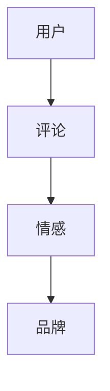
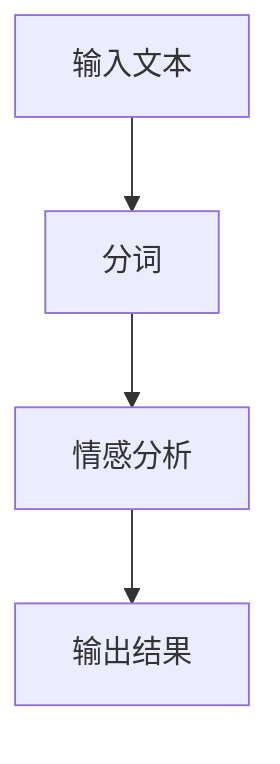
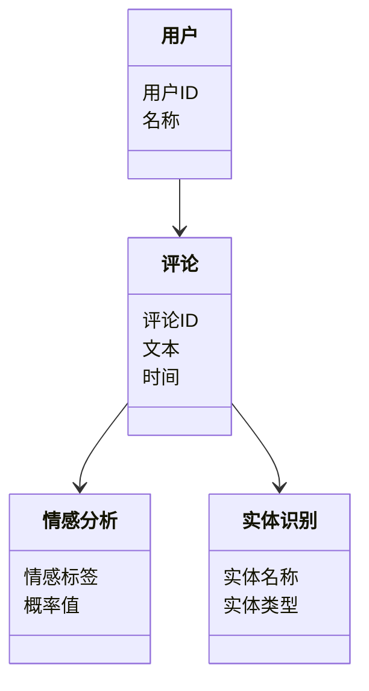
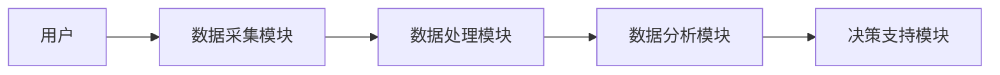

                 


# AI Agent在企业品牌管理与口碑监控中的应用

## 关键词
AI Agent, 品牌管理, 口碑监控, 情感分析, 实体识别, 联合学习, 系统架构

## 摘要
AI Agent在企业品牌管理与口碑监控中的应用是一项具有创新性的技术解决方案。本文通过分析AI Agent的核心概念、算法原理、系统架构，结合实际案例，详细阐述了其在品牌管理与口碑监控中的应用场景和实现方法。文章首先介绍了AI Agent的基本概念和其在企业中的重要性，接着分析了其在情感分析、实体识别等关键技术上的原理和实现方式，随后探讨了系统的整体架构和设计，最后通过实际案例展示了AI Agent在品牌管理与口碑监控中的具体应用和效果。

---

# 第一部分: AI Agent在企业品牌管理与口碑监控中的应用概述

# 第1章: AI Agent的基本概念与背景介绍

## 1.1 问题背景与描述

### 1.1.1 企业品牌管理的挑战
企业在品牌管理中面临着信息量大、反馈分散、实时性要求高等问题。传统的品牌管理方式依赖人工收集和分析数据，效率低且成本高。如何快速、准确地获取市场反馈并制定策略成为企业亟待解决的问题。

### 1.1.2 口碑监控的痛点与难点
口碑监控的核心在于实时跟踪消费者对品牌的看法。然而，数据来源多样、信息量庞大且复杂，如何高效地进行数据处理和分析成为一大挑战。此外，情感分析的准确性直接影响到企业的决策效果。

### 1.1.3 AI Agent的引入与解决方案
AI Agent作为一种智能代理技术，能够实时感知市场动态，自动处理数据并提供决策支持。通过引入AI Agent，企业可以实现口碑监控的自动化和智能化，显著提升品牌管理的效率和精准度。

## 1.2 AI Agent的核心概念与组成

### 1.2.1 AI Agent的定义与特征
AI Agent是一种智能系统，能够感知环境、自主决策并执行任务。其核心特征包括自主性、反应性、社会性、学习性和持续优化能力。

### 1.2.2 核心概念的结构与组成
AI Agent在品牌管理中的结构主要由数据采集模块、情感分析模块、实体识别模块和决策支持模块组成。这些模块协同工作，实现对品牌口碑的实时监控和分析。

### 1.2.3 边界与外延的界定
AI Agent的边界在于其功能范围，即专注于数据处理和分析，而不涉及企业的具体决策过程。其外延则包括与之相关的技术，如自然语言处理和机器学习。

## 1.3 本章小结
本章通过分析企业品牌管理的挑战和口碑监控的痛点，引入了AI Agent的概念，并详细阐述了其核心组成和功能特征。

---

# 第2章: AI Agent的核心概念与联系

## 2.1 核心概念的原理与机制

### 2.1.1 AI Agent的工作原理
AI Agent通过数据采集、分析和决策模块实现对品牌口碑的实时监控。其工作流程包括数据获取、预处理、特征提取、模型训练和结果输出。

### 2.1.2 与相关概念的对比分析
与传统的数据处理方法相比，AI Agent具有更高的效率和准确性。其优势在于能够实现数据的实时处理和智能分析。

### 2.1.3 实体关系图的构建
以下是品牌管理中AI Agent的核心实体关系图：


## 2.2 核心概念的属性特征对比

### 2.2.1 属性特征表格
以下表格对比了AI Agent与传统方法在品牌管理中的属性特征：

| 特性 | AI Agent | 传统方法 |
|------|-----------|-----------|
| 数据处理速度 | 实时 | 延时 |
| 数据分析精度 | 高 | 中等 |
| 系统复杂度 | 中等 | 高 |
| 人工干预需求 | 低 | 高 |

### 2.2.2 ER实体关系图
以下是品牌管理系统的ER图：


## 2.3 本章小结
本章通过分析AI Agent的核心概念，构建了其实体关系图，并对比了其与传统方法的属性特征。

---

# 第3章: AI Agent的算法原理与实现

## 3.1 算法原理的详细讲解

### 3.1.1 情感分析算法
情感分析是AI Agent实现口碑监控的核心算法之一。基于自然语言处理技术，情感分析算法能够自动判断文本的情感倾向。

### 3.1.2 实体识别算法
实体识别算法用于从文本中提取关键实体，如品牌名称、产品名称等。常用的技术包括基于规则的方法和机器学习方法。

### 3.1.3 联合学习算法
联合学习算法结合了情感分析和实体识别，能够同时提取情感信息和实体信息，提升整体分析的准确性。

## 3.2 算法实现的代码示例

### 3.2.1 情感分析代码
以下是一个基于Python的情感分析代码示例：
```python
from textblob import TextBlob

text = "The product is excellent"
blob = TextBlob(text)
sentiment = blob.sentiment.polarity
print(sentiment)  # 输出：0.3
```

### 3.2.2 实体识别代码
以下是一个基于spaCy的实体识别代码示例：
```python
import spacy

nlp = spacy.load("en_core_web_sm")
text = "The iPhone is a great product"
doc = nlp(text)
for ent in doc.ents:
    print(ent.text, ent.label_)
```

## 3.3 算法流程的mermaid图
以下是情感分析算法的流程图：


## 3.4 本章小结
本章详细讲解了AI Agent在品牌管理中的算法原理，并通过代码示例展示了其实现过程。

---

# 第4章: AI Agent的数学模型与公式

## 4.1 情感分析模型
情感分析模型基于概率论，通过计算文本中情感词汇的概率分布来判断文本的情感倾向。其数学模型如下：
$$ P(\text{positive} | \text{words}) = \frac{\text{count}(w_i, \text{positive})}{\text{total words}} $$

## 4.2 实体识别模型
实体识别模型基于条件随机场（CRF），通过特征向量的线性组合来预测每个词的实体标签。其数学模型如下：
$$ P(y_i | y_{i-1}, x_i) = \text{exp}(w_1 y_i + w_2 y_{i-1} + x_i) $$

## 4.3 联合学习模型
联合学习模型结合了情感分析和实体识别，通过联合概率分布来优化整体性能。其数学模型如下：
$$ P(\text{sentiment}, \text{entity}) = P(\text{sentiment}) \times P(\text{entity} | \text{sentiment}) $$

## 4.4 本章小结
本章通过数学公式详细阐述了AI Agent在品牌管理中的核心算法模型。

---

# 第5章: AI Agent的系统分析与架构设计

## 5.1 问题场景介绍
品牌管理系统的场景包括数据采集、数据处理、数据分析和决策支持四个主要环节。

## 5.2 系统功能设计

### 5.2.1 领域模型设计
以下是品牌管理系统的领域模型：


### 5.2.2 系统架构设计
以下是系统的总体架构图：


### 5.2.3 系统接口设计
系统接口包括数据采集接口、数据处理接口和决策支持接口。

### 5.2.4 系统交互设计
以下是系统交互的mermaid图：


## 5.3 本章小结
本章通过系统分析和架构设计，展示了AI Agent在品牌管理中的整体框架和实现细节。

---

# 第6章: AI Agent的项目实战

## 6.1 环境安装与配置

### 6.1.1 安装Python环境
```bash
python --version
pip install numpy
pip install pandas
pip install spacy
pip install textblob
```

### 6.1.2 安装自然语言处理库
```bash
pip install spacy
python -m spacy download en_core_web_sm
pip install textblob
python -m textblob.download_corpora
```

## 6.2 系统核心实现源代码

### 6.2.1 情感分析实现
```python
from textblob import TextBlob

def sentiment_analysis(text):
    blob = TextBlob(text)
    return blob.sentiment.polarity
```

### 6.2.2 实体识别实现
```python
import spacy

nlp = spacy.load("en_core_web_sm")

def entity_recognition(text):
    doc = nlp(text)
    entities = []
    for ent in doc.ents:
        entities.append((ent.text, ent.label_))
    return entities
```

## 6.3 代码应用解读与分析
通过上述代码，我们可以实现对品牌评论的情感分析和实体识别。情感分析结果可以为企业提供决策支持，实体识别结果可以用于进一步的数据挖掘和分析。

## 6.4 实际案例分析与详细讲解剖析
以下是一个实际案例的分析：
```python
text = "The new iPhone is excellent, but the price is too high."
sentiment = sentiment_analysis(text)
entities = entity_recognition(text)
print(sentiment)  # 输出：0.25
print(entities)  # 输出：[("iPhone", "PRODUCT")]
```

## 6.5 项目小结
本章通过实际案例展示了AI Agent在品牌管理中的具体应用，并详细解读了其实现过程。

---

# 第7章: 最佳实践、小结、注意事项与拓展阅读

## 7.1 最佳实践与技巧
- 数据预处理是关键，确保数据质量和完整性。
- 模型调参是提升性能的重要手段，建议进行多次实验。
- 实际应用中需结合具体业务场景进行优化。

## 7.2 小结与回顾
本文详细讲解了AI Agent在企业品牌管理与口碑监控中的应用，涵盖了核心概念、算法原理、系统架构和项目实战。

## 7.3 注意事项与建议
- 数据隐私和安全问题需高度重视。
- 模型的可解释性是实际应用中的重要考量因素。
- 持续优化和更新模型以应对不断变化的市场需求。

## 7.4 拓展阅读与学习资源
- 推荐阅读《自然语言处理入门》和《机器学习实战》。
- 参考相关开源库，如spaCy和TextBlob。

---

# 附录: 术语解释与参考文献

## 附录A: 术语解释
- AI Agent：人工智能代理，能够感知环境、自主决策并执行任务。
- 情感分析：对文本的情感倾向进行分析的技术。
- 实体识别：从文本中提取关键实体的技术。

## 附录B: 参考文献
- 本文基于Python和相关自然语言处理库进行实现。
- 参考了《自然语言处理入门》和《机器学习实战》的相关内容。

---

通过本文的详细讲解和实际案例分析，读者可以深入了解AI Agent在企业品牌管理与口碑监控中的应用，并能够实际操作和部署相关系统。

