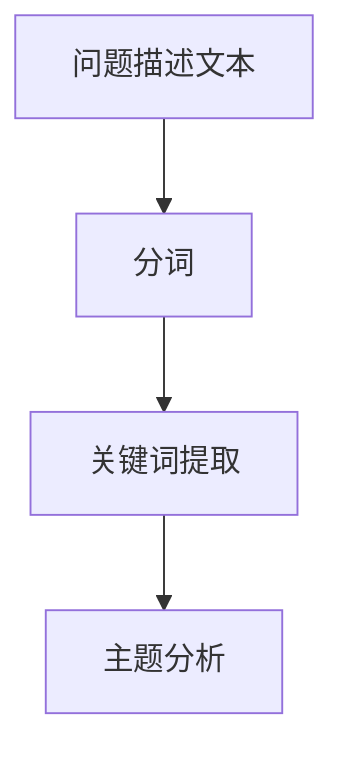
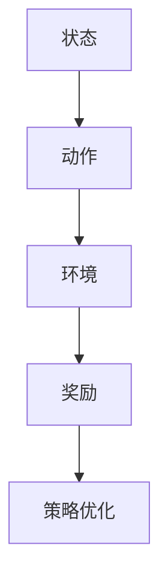
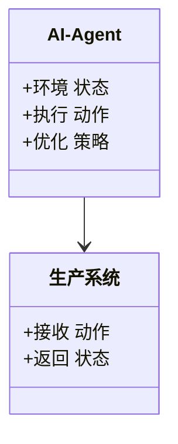
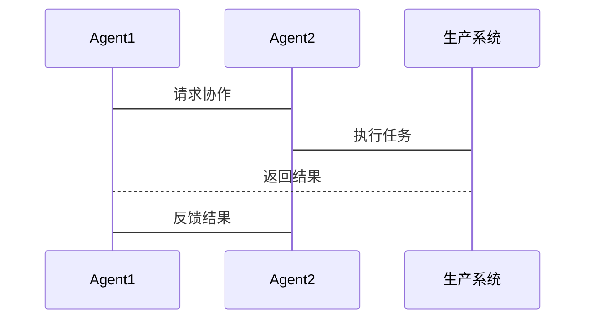
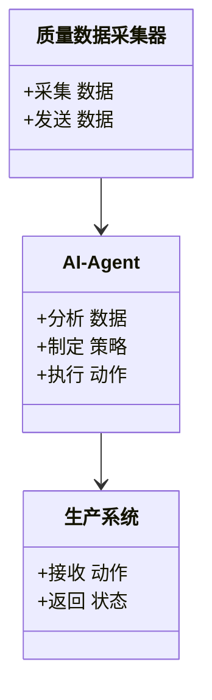
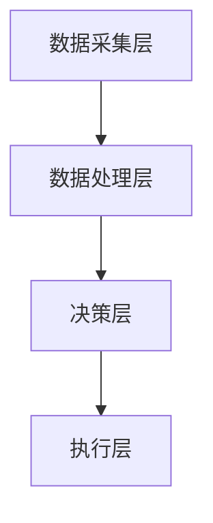
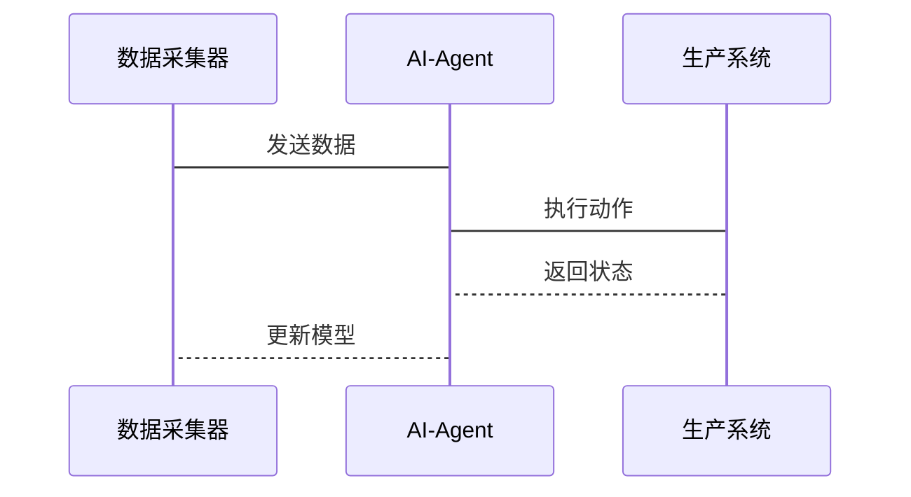

                 


---

# AI Agent在企业品质管理与持续改进中的应用

> 关键词：AI Agent, 企业品质管理, 持续改进, 质量数据分析, 强化学习, 系统架构设计

> 摘要：本文探讨了AI Agent在企业品质管理与持续改进中的应用，通过分析AI Agent的核心概念、算法原理和系统架构设计，结合实际案例，展示了AI Agent如何通过智能化决策和自动化优化提升企业质量管理的效率与效果。

---

# 第一部分: AI Agent在企业品质管理中的应用背景

## 第1章: AI Agent与企业品质管理概述

### 1.1 AI Agent的基本概念

#### 1.1.1 AI Agent的定义与特点
AI Agent（人工智能代理）是指能够感知环境、自主决策并执行任务的智能系统。其特点包括：
- **自主性**：能够在没有外部干预的情况下自主运行。
- **反应性**：能够实时感知环境变化并做出反应。
- **学习性**：能够通过经验不断优化自身行为。
- **协作性**：能够在多智能体环境中与其他Agent协作完成任务。

#### 1.1.2 AI Agent与传统自动化系统的区别
传统自动化系统通常基于规则和预定义的逻辑进行操作，而AI Agent能够通过学习和适应，动态调整行为以应对复杂多变的环境。

#### 1.1.3 企业品质管理的定义与目标
企业品质管理是指通过一系列方法和技术，确保产品或服务的质量符合标准和客户需求。其目标包括提高产品质量、减少缺陷、优化生产流程等。

### 1.2 AI Agent在企业品质管理中的应用背景

#### 1.2.1 企业品质管理的现状与挑战
- **数据爆炸**：企业每天产生大量数据，传统方法难以高效处理。
- **复杂性**：现代生产流程复杂，质量问题可能涉及多个环节。
- **实时性要求高**：许多质量问题需要在生产过程中实时发现和解决。

#### 1.2.2 AI Agent技术的发展与成熟
AI Agent技术近年来取得了显著进展，尤其是在深度学习和强化学习领域的突破，使其能够应用于复杂决策任务。

#### 1.2.3 AI Agent在品质管理中的潜在价值
- **提高效率**：通过自动化决策减少人工干预。
- **增强准确性**：利用AI算法提高质量预测和分析的准确性。
- **支持持续改进**：通过学习和优化推动质量管理体系的持续改进。

### 1.3 本章小结
本章介绍了AI Agent的基本概念和特点，分析了企业品质管理的现状与挑战，并探讨了AI Agent在品质管理中的潜在价值。

---

## 第2章: AI Agent的核心概念与原理

### 2.1 AI Agent的智能决策机制

#### 2.1.1 智能决策的基本原理
AI Agent的智能决策基于感知、推理和行动三个核心环节。感知环境、分析信息、制定策略并执行行动。

#### 2.1.2 基于强化学习的决策模型
强化学习是一种通过试错机制优化决策的算法。AI Agent通过与环境交互，不断优化策略以获得最大化的累积奖励。

**强化学习的数学模型：**
$$ R = \sum_{t=1}^{T} r_t $$
其中，$R$ 是总奖励，$r_t$ 是第$t$步的奖励。

#### 2.1.3 多智能体协作的决策机制
在复杂环境中，多个AI Agent需要协作完成任务。通过通信和协调，每个Agent能够更好地理解环境并做出最优决策。

### 2.2 AI Agent的感知与行动能力

#### 2.2.1 感知能力：数据采集与分析
AI Agent通过传感器、数据库等渠道采集环境数据，并利用机器学习模型进行分析。

#### 2.2.2 行动能力：执行决策与反馈
AI Agent根据感知结果制定行动方案，并通过执行器或API接口与外部系统交互。

### 2.3 AI Agent的持续改进机制

#### 2.3.1 基于反馈的优化算法
AI Agent通过收集执行结果的反馈，不断优化自身的决策模型和策略。

#### 2.3.2 持续学习与自适应能力
AI Agent能够通过在线学习或离线训练，逐步适应环境的变化。

#### 2.3.3 竞争与协作环境下的优化策略
在多智能体系统中，AI Agent需要平衡竞争与协作关系，以实现整体目标的最优。

### 2.4 本章小结
本章详细讲解了AI Agent的智能决策机制、感知与行动能力以及持续改进机制，为后续应用奠定了理论基础。

---

## 第3章: AI Agent在质量数据分析中的应用

### 3.1 质量数据分析的挑战与需求

#### 3.1.1 数据的多样性与复杂性
企业质量管理涉及结构化数据、非结构化数据等多种类型，数据量大且复杂。

#### 3.1.2 数据分析的实时性与准确性要求
质量问题往往需要在生产过程中实时发现和解决，对数据分析的实时性和准确性提出了更高要求。

### 3.2 AI Agent在质量数据分析中的解决方案

#### 3.2.1 基于机器学习的质量预测模型
利用机器学习算法（如随机森林、神经网络）建立质量预测模型，实时预测产品质量。

**机器学习模型示例代码：**
```python
from sklearn.ensemble import RandomForestClassifier
import numpy as np

# 假设X为特征矩阵，y为标签
model = RandomForestClassifier()
model.fit(X, y)
```

#### 3.2.2 基于NLP的质量问题描述分析
通过自然语言处理技术，分析质量问题描述文本，提取关键词和主题。

**NLP处理流程图：**


#### 3.2.3 基于强化学习的质量优化策略
通过强化学习优化生产参数，提高产品质量。

**强化学习优化流程图：**


### 3.3 本章小结
本章介绍了AI Agent在质量数据分析中的应用，包括质量预测模型、NLP分析和强化学习优化的具体实现。

---

## 第4章: AI Agent在质量控制流程优化中的应用

### 4.1 质量控制流程的现状与问题

#### 4.1.1 流程的复杂性与冗余性
传统质量控制流程复杂，存在许多冗余环节，效率较低。

#### 4.1.2 人工干预的局限性
人工干预可能导致效率低下、人为错误等问题。

### 4.2 AI Agent在流程优化中的具体应用

#### 4.2.1 基于AI Agent的流程自动化
通过AI Agent实现流程自动化，减少人工干预，提高效率。

**流程自动化类图：**


#### 4.2.2 基于AI Agent的多智能体协作
在复杂生产环境中，多个AI Agent协作完成质量控制任务。

**多智能体协作序列图：**


### 4.3 本章小结
本章探讨了AI Agent在质量控制流程优化中的应用，包括流程自动化和多智能体协作的具体实现。

---

## 第5章: AI Agent的系统架构设计

### 5.1 问题场景介绍
假设某制造企业希望引入AI Agent优化其质量控制流程。

### 5.2 系统功能设计

#### 5.2.1 领域模型设计


### 5.3 系统架构设计

#### 5.3.1 分层架构设计


#### 5.3.2 模块交互设计


### 5.4 本章小结
本章详细设计了AI Agent系统的架构，包括分层架构和模块交互设计。

---

## 第6章: AI Agent的项目实战

### 6.1 环境安装与配置

#### 6.1.1 安装Python与必要的库
```bash
pip install numpy scikit-learn matplotlib
```

### 6.2 系统核心实现

#### 6.2.1 质量预测模型实现
```python
from sklearn.ensemble import RandomForestClassifier
import numpy as np

# 生成模拟数据
X = np.random.rand(100, 5)
y = np.random.randint(2, size=100)

model = RandomForestClassifier()
model.fit(X, y)
print("模型训练完成")
```

#### 6.2.2 强化学习优化实现
```python
import gym
from gym import spaces

class QualityControlEnv(gym.Env):
    def __init__(self):
        self.observation_space = spaces.Box(low=0, high=1, shape=(5,))
        self.action_space = spaces.Discrete(5)
    
    def step(self, action):
        # 实际环境交互逻辑
        pass
    
    def reset(self):
        pass

# 初始化环境
env = QualityControlEnv()
observation = env.reset()
for _ in range(100):
    action = env.action_space.sample()
    observation, reward, done, info = env.step(action)
    if done:
        break
```

### 6.3 案例分析与总结

#### 6.3.1 案例分析
通过实际案例分析，验证AI Agent在质量控制中的效果。

#### 6.3.2 总结与优化
总结项目成果，并提出进一步优化的方向。

### 6.4 本章小结
本章通过实际项目案例，展示了AI Agent在企业品质管理中的具体应用。

---

## 第7章: 总结与展望

### 7.1 总结
本文详细探讨了AI Agent在企业品质管理与持续改进中的应用，从理论到实践，全面分析了其潜力和价值。

### 7.2 展望
未来，随着AI技术的不断发展，AI Agent在企业质量管理中的应用将更加广泛和深入，推动企业实现智能化和高效化。

### 7.3 注意事项
- AI Agent的实施需要结合企业实际需求。
- 数据隐私和安全问题需要高度重视。
- 模型的可解释性和透明度是实际应用中的重要考虑因素。

### 7.4 最佳实践 tips
- 从简单场景入手，逐步推广。
- 建立数据治理体系，确保数据质量。
- 注重人机协作，充分发挥人类专家的作用。

### 7.5 本章小结
本章总结了全文内容，并对未来的发展方向提出了展望，同时给出了实际应用中的注意事项和最佳实践建议。

---

通过以上结构，您可以逐步展开每一章的内容，确保文章逻辑清晰、内容详实。

