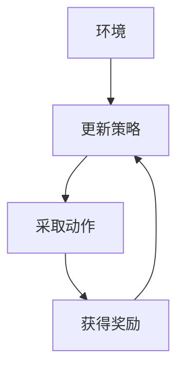
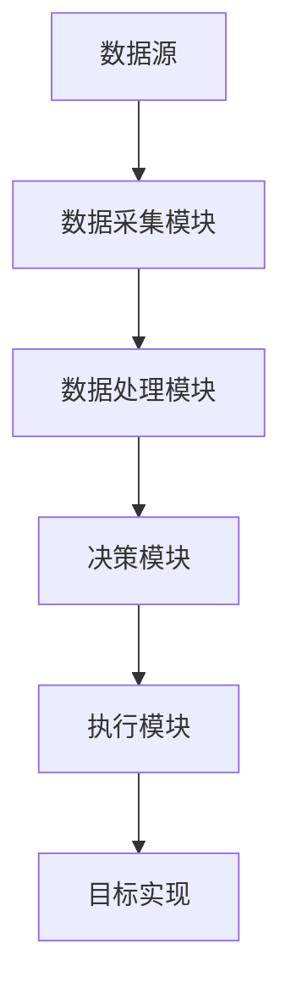
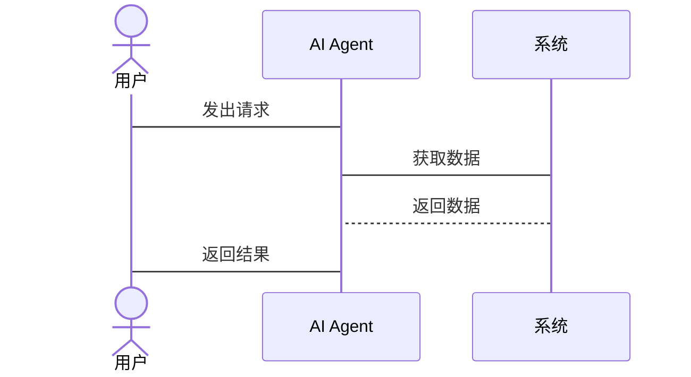

                 


# AI Agent在企业商业模式创新中的应用

## 关键词：AI Agent, 企业商业模式, 人工智能, 商业创新, 技术应用

## 摘要：  
随着人工智能技术的飞速发展，AI Agent（人工智能代理）正在成为企业商业模式创新的重要驱动力。本文从AI Agent的核心概念、算法原理、系统架构到实际应用场景，详细探讨了AI Agent如何赋能企业商业模式的创新。通过案例分析和最佳实践，本文为企业在数字化转型中提供了一套基于AI Agent的创新方法论。

---

## 第1章: AI Agent 的定义与背景

### 1.1 AI Agent 的定义与特点  
AI Agent 是一种能够感知环境、自主决策并执行任务的智能体。与传统AI系统不同，AI Agent 具备以下特点：  
- **自主性**：能够在没有外部干预的情况下独立运行。  
- **反应性**：能够实时感知环境变化并做出响应。  
- **目标导向性**：基于预设目标或学习目标进行决策和行动。  
- **协作性**：能够与其他AI Agent或人类协同工作，共同完成复杂任务。  

### 1.2 AI Agent 与企业商业模式的关系  
企业的商业模式创新通常涉及以下方面：  
- **成本优化**：通过AI Agent自动化处理业务流程，降低运营成本。  
- **收入增长**：利用AI Agent提升客户体验，扩大市场份额。  
- **竞争优势**：通过AI Agent实现智能化决策，提高企业竞争力。  

### 1.3 企业商业模式的痛点与挑战  
- **传统商业模式的局限性**：依赖人工操作，效率低，成本高。  
- **数据驱动决策的需求**：企业需要基于实时数据快速做出决策。  
- **个性化客户需求**：消费者对个性化服务的需求日益增长，传统模式难以满足。  

---

## 第2章: AI Agent 的核心概念与联系

### 2.1 AI Agent 的核心原理  
AI Agent 的核心原理可以分为以下几个步骤：  
1. **感知环境**：通过传感器或数据接口获取环境信息。  
2. **分析与决策**：基于感知数据，结合知识库和决策模型，生成最优决策。  
3. **执行任务**：根据决策结果，执行具体操作或调用其他系统完成任务。  

### 2.2 AI Agent 的系统架构  
AI Agent 的系统架构通常包括以下模块：  
- **感知模块**：负责数据采集和预处理。  
- **决策模块**：负责基于感知数据生成决策。  
- **执行模块**：负责将决策转化为具体操作。  
- **知识库**：存储任务相关的知识和规则。  

### 2.3 AI Agent 的应用场景  
AI Agent 在企业中的应用场景广泛，包括：  
- **智能客服**：通过自然语言处理技术为客户提供个性化服务。  
- **供应链优化**：通过实时数据分析优化库存管理和物流调度。  
- **精准营销**：基于客户行为数据实现个性化推荐。  

---

## 第3章: AI Agent 的算法原理

### 3.1 基于强化学习的决策机制  
强化学习是一种通过试错方式优化决策的算法。AI Agent 在强化学习中的角色类似于一个“玩家”，通过与环境交互获得奖励或惩罚，并逐步优化策略以最大化累计奖励。  

#### 强化学习流程图  


### 3.2 基于监督学习的感知模型  
监督学习是通过训练数据学习输入与输出之间的映射关系。在AI Agent 中，监督学习常用于分类任务，例如图像识别和自然语言处理。  

#### 监督学习数学模型  
$$ y = f(x) $$  
其中，$x$ 是输入数据，$y$ 是输出标签，$f$ 是学习的模型。  

### 3.3 基于无监督学习的知识表示  
无监督学习用于处理未标注数据，常用于聚类和降维任务。在AI Agent 中，无监督学习可以用于发现数据中的隐藏模式。  

---

## 第4章: AI Agent 的系统架构设计

### 4.1 系统功能设计  
AI Agent 的系统功能设计通常包括以下模块：  
- **数据采集模块**：负责采集环境数据。  
- **数据处理模块**：对采集到的数据进行清洗和预处理。  
- **决策模块**：基于数据生成决策。  
- **执行模块**：根据决策执行操作。  

### 4.2 系统架构设计  
以下是一个典型的AI Agent 系统架构图：  



### 4.3 系统接口设计  
AI Agent 的系统接口设计需要考虑以下方面：  
- **输入接口**：用于接收感知数据。  
- **输出接口**：用于执行决策操作。  
- **通信接口**：用于与其他系统或AI Agent 交互。  

### 4.4 系统交互设计  
以下是一个AI Agent 系统的交互序列图：  



---

## 第5章: AI Agent 的项目实战

### 5.1 环境搭建  
- 安装Python和相关库（如TensorFlow、Scikit-learn）。  
- 配置开发环境（如Jupyter Notebook）。  

### 5.2 核心代码实现  
以下是一个基于强化学习的AI Agent 示例代码：  

```python
import numpy as np

class AI-Agent:
    def __init__(self, state_space, action_space):
        self.state_space = state_space
        self.action_space = action_space
        # 初始化策略模型
        self.model = self.build_model()

    def build_model(self):
        # 定义神经网络模型
        model = Sequential()
        model.add(Dense(64, activation='relu', input_dim=state_space))
        model.add(Dense(action_space, activation='softmax'))
        model.compile(optimizer='adam', loss='sparse_categorical_crossentropy')
        return model

    def act(self, state):
        # 根据当前状态选择动作
        prediction = self.model.predict(np.array([state]))
        action = np.argmax(prediction[0])
        return action

    def learn(self, state, action, reward):
        # 增强学习模型更新
        self.model.fit(np.array([state]), np.array([action]), epochs=1, verbose=0)
```

### 5.3 案例分析  
以智能客服为例，AI Agent 可以通过自然语言处理技术分析客户问题，并根据知识库生成最优回复。  

---

## 第6章: 最佳实践与未来展望

### 6.1 最佳实践  
- **数据质量**：确保感知数据的准确性和完整性。  
- **模型优化**：定期更新模型以适应环境变化。  
- **安全与隐私**：保护用户数据的安全和隐私。  

### 6.2 未来展望  
随着AI技术的不断发展，AI Agent 在企业中的应用将更加广泛。未来的AI Agent 将具备更强的自主性和协作性，能够更好地支持企业的商业模式创新。

---

## 结语  
AI Agent 作为人工智能领域的重要技术，正在为企业商业模式的创新提供新的可能性。通过本文的探讨，读者可以全面了解AI Agent 的核心概念、算法原理和实际应用，为企业在数字化转型中提供有力的技术支持。

