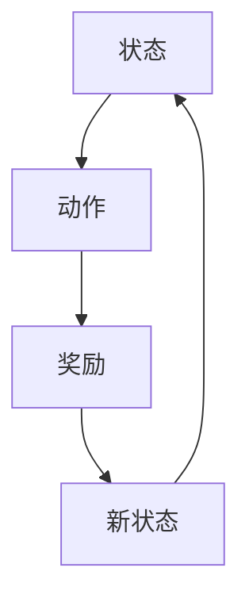
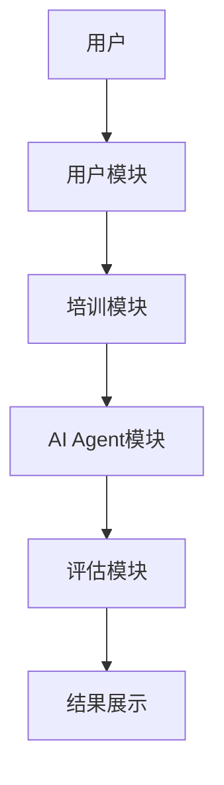

                 


# AI Agent在企业培训与技能评估中的创新应用

> 关键词：AI Agent, 企业培训, 技能评估, 强化学习, 系统架构, 实践案例

> 摘要：本文深入探讨了AI Agent在企业培训与技能评估中的创新应用，详细分析了AI Agent的核心算法、系统架构，并通过实际案例展示了其在企业培训与评估中的价值。文章从理论到实践，全面阐述了AI Agent如何优化企业培训与技能评估流程。

---

## 第1章：引言

### 1.1 AI Agent的基本概念

AI Agent（人工智能代理）是指能够感知环境并采取行动以实现目标的智能实体。AI Agent的核心在于其自主决策和问题解决能力，能够通过数据驱动的方式优化复杂场景中的决策过程。

### 1.2 企业培训与技能评估的现状与挑战

传统的企业培训与技能评估方式存在以下问题：

- **个性化不足**：传统培训方案通常是标准化的，难以满足员工的个性化学习需求。
- **评估滞后**：技能评估往往依赖于定期测试，无法实时反馈员工的技能状态。
- **效率低下**：人工评估耗时且成本高，难以实现大规模评估。

AI Agent通过实时数据分析和自主决策，能够有效解决这些问题，为企业培训与技能评估提供更高效、更个性化的解决方案。

---

## 第2章：AI Agent的核心算法与数学模型

### 2.1 强化学习算法

强化学习是一种通过试错方式优化决策策略的算法。AI Agent通过与环境的交互，不断优化其行为策略以最大化奖励。

#### 2.1.1 Q-learning算法

Q-learning是一种经典的强化学习算法，适用于离散状态和动作的空间。其核心公式为：

$$ Q(s, a) = Q(s, a) + \alpha \left( r + \gamma \max Q(s', a') - Q(s, a) \right) $$

其中：
- $s$ 表示当前状态，
- $a$ 表示动作，
- $r$ 表示奖励，
- $\gamma$ 表示折扣因子，
- $\alpha$ 表示学习率。

#### 2.1.2 算法流程图



### 2.2 监督学习算法

监督学习是一种基于标注数据进行模型训练的算法。AI Agent可以通过监督学习来预测员工的技能水平或推荐适合的学习路径。

#### 2.2.1 线性回归模型

线性回归是一种简单的监督学习模型，适用于预测连续型输出。其数学形式为：

$$ y = \beta_0 + \beta_1 x + \epsilon $$

其中：
- $y$ 表示预测值，
- $x$ 表示输入特征，
- $\beta_0$ 和 $\beta_1$ 是模型参数，
- $\epsilon$ 是误差项。

---

## 第3章：AI Agent在企业培训中的应用

### 3.1 个性化学习路径设计

AI Agent可以通过分析员工的学习行为和技能水平，动态调整学习计划，提供个性化的学习路径。

#### 3.1.1 基于AI Agent的个性化推荐

AI Agent通过分析员工的学习历史和技能水平，推荐适合的学习资源和课程。例如，如果员工在数据分析方面表现不佳，AI Agent可以推荐相关的在线课程和实践任务。

#### 3.1.2 动态调整学习计划

AI Agent可以根据员工的学习进度和反馈，实时调整学习计划。例如，如果员工在某项技能上进步缓慢，AI Agent可以增加相关任务的权重。

---

## 第4章：AI Agent在技能评估中的创新应用

### 4.1 自动化评估系统

AI Agent可以通过自动化评估系统，实时监控员工的技能表现，并提供即时反馈。

#### 4.1.1 AI Agent在评估过程中的角色

AI Agent可以作为评估系统的代理，实时分析员工的表现，并根据预设的评估标准生成评估结果。

#### 4.1.2 多维度评估指标的设计

AI Agent可以根据员工的多项表现指标（如任务完成时间、准确率等）生成综合评估结果。

---

## 第5章：系统架构与设计

### 5.1 系统功能模块

- **用户模块**：负责用户身份认证和权限管理。
- **培训模块**：提供个性化学习路径和学习资源。
- **评估模块**：实时监控员工表现并生成评估结果。
- **AI Agent模块**：负责数据分析和决策优化。

### 5.2 系统架构图



---

## 第6章：项目实战

### 6.1 环境安装

- 安装Python和相关库（如TensorFlow、Scikit-learn）。
- 配置开发环境（如Jupyter Notebook）。

### 6.2 核心代码实现

#### 6.2.1 强化学习代码示例

```python
import numpy as np

# 初始化Q表
Q = np.zeros((4, 4))

# 参数设置
alpha = 0.1
gamma = 0.9

# 状态转移函数
def take_action(s):
    return np.random.randint(4)

# 训练过程
for episode in range(1000):
    s = 0
    while True:
        a = take_action(s)
        s_, r = env.step(a)
        Q[s][a] = Q[s][a] + alpha * (r + gamma * np.max(Q[s_]) - Q[s][a])
        s = s_
```

---

## 第7章：总结与展望

### 7.1 小结

AI Agent通过强化学习和监督学习等算法，能够显著提升企业培训与技能评估的效率和效果。其在个性化学习路径设计和自动化评估系统中的应用，为企业提供了更高效、更智能的解决方案。

### 7.2 注意事项

- **数据隐私**：在实际应用中，需注意员工数据的隐私保护。
- **模型优化**：AI Agent的性能依赖于数据质量和算法优化。

### 7.3 未来展望

随着AI技术的不断发展，AI Agent在企业培训与技能评估中的应用将更加广泛。未来的挑战在于如何进一步优化算法，提升系统的实时性和准确性。

---

通过以上内容，我们可以看到，AI Agent在企业培训与技能评估中的应用前景广阔。希望本文能为企业技术负责人和研究人员提供有价值的参考和启发。

