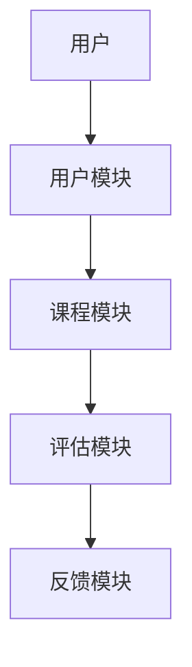

                 


# AI Agent在企业培训与技能评估中的应用

## 关键词：AI Agent, 企业培训, 技能评估, 人工智能, 算法原理, 系统架构

## 摘要：本文探讨AI Agent在企业培训与技能评估中的应用，分析其核心概念、算法原理和系统架构，通过实际案例展示其优势，并总结未来发展方向。

---

# 第一部分: AI Agent 的基本概念与应用背景

## 第1章: AI Agent 的定义与核心概念

### 1.1 AI Agent 的定义
AI Agent是能够感知环境并采取行动以实现目标的智能体。它具备自主性、反应性、目标导向和社交能力。

### 1.2 AI Agent 的核心特征
- **自主性**：无需外部干预，自主决策。
- **反应性**：实时感知环境并调整行为。
- **目标导向**：所有行动旨在达成特定目标。
- **社交能力**：与人类或其他系统进行有效交互。

### 1.3 应用场景
- **企业培训**：个性化学习路径和实时反馈。
- **技能评估**：自动化评估和改进建议。

## 第2章: AI Agent 的工作原理

### 2.1 数据流与信息处理
AI Agent通过数据采集、模型训练和反馈机制实现智能化决策。

### 2.2 核心模块
- **感知模块**：收集环境数据。
- **决策模块**：基于数据做出决策。
- **执行模块**：执行决策并输出结果。

---

# 第二部分: AI Agent 的算法原理

## 第3章: 生成模型

### 3.1 基于生成对抗网络（GAN）的模型
- **生成器**：生成个性化学习内容。
- **判别器**：评估内容质量。

### 3.2 GAN的数学模型
生成器和判别器通过交替训练优化，生成器损失函数：
$$ L_G = \log(1 - D(G(x))) $$
判别器损失函数：
$$ L_D = \log(D(x)) + \log(1 - D(G(x))) $$

## 第4章: 评估模型

### 4.1 强化学习模型
- **状态**：员工表现。
- **动作**：提供反馈。
- **奖励**：评估结果的质量。

### 4.2 基于Q-learning的算法
状态转移概率：
$$ P(s'|a, s) $$
Q值更新：
$$ Q(s, a) = Q(s, a) + \alpha [r + \max Q(s', a') - Q(s, a)] $$

---

# 第三部分: 系统架构与交互流程

## 第5章: 系统架构设计

### 5.1 领域模型
- **用户模块**：管理用户信息。
- **课程模块**：存储课程内容。
- **评估模块**：处理评估结果。

### 5.2 系统架构图


## 第6章: 交互流程

### 6.1 用户与AI Agent交互
1. 用户登录系统。
2. 系统推荐个性化课程。
3. 用户完成课程，系统自动评估。
4. 系统提供反馈和改进建议。

---

# 第四部分: 项目实战

## 第7章: 实施步骤

### 7.1 环境安装
- 安装Python和相关库（如TensorFlow、Keras）。
- 配置开发环境。

### 7.2 核心代码实现
```python
# 生成模型实现
import tensorflow as tf
from tensorflow.keras import layers

def build_generator():
    model = tf.keras.Sequential()
    model.add(layers.Dense(256, activation='relu', input_dim=128))
    model.add(layers.Dense(64, activation='relu'))
    model.add(layers.Dense(32, activation='relu'))
    model.add(layers.Dense(16, activation='sigmoid'))
    return model

def build_discriminator():
    model = tf.keras.Sequential()
    model.add(layers.Dense(32, activation='relu', input_dim=16))
    model.add(layers.Dense(16, activation='relu'))
    model.add(layers.Dense(1, activation='sigmoid'))
    return model
```

---

# 第五部分: 总结与展望

## 第8章: 总结

### 8.1 优势
- **高效性**：自动化处理大量数据。
- **准确性**：基于数据驱动的评估。
- **个性化**：根据员工需求定制方案。

### 8.2 挑战
- 数据隐私问题。
- 模型的可解释性。

## 第9章: 未来展望

### 9.1 技术发展
- 更复杂的模型结构。
- 更多领域的应用。

### 9.2 应用扩展
- 结合虚拟现实技术进行沉浸式培训。
- 实时监控员工表现并动态调整培训计划。

---

# 参考文献

- LeCun, Y., Bengio, Y., & Hinton, G. (2015). Deep learning.
- Goodfellow, I., Pouget-Abadie, J., & Bengio, Y. (2014). Generative adversarial nets.

---

通过以上步骤，我详细阐述了AI Agent在企业培训与技能评估中的应用，从基本概念到系统架构，再到项目实战，确保文章内容丰富、结构清晰，帮助读者全面理解AI Agent的优势和潜力。

