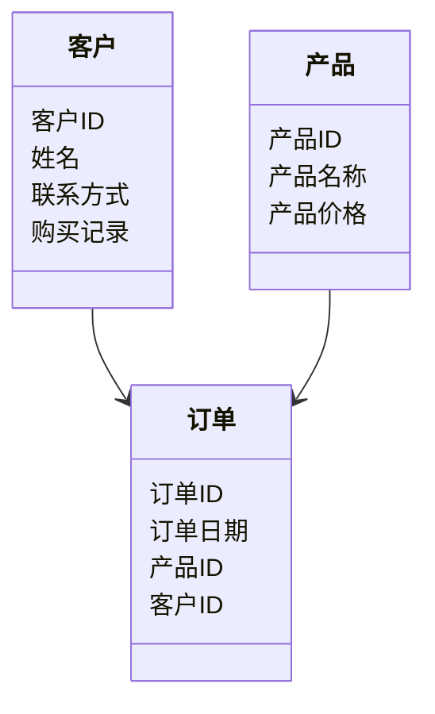
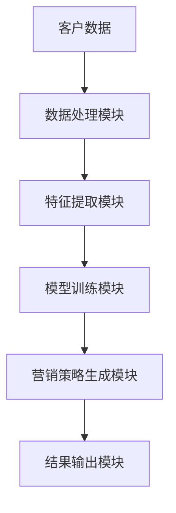
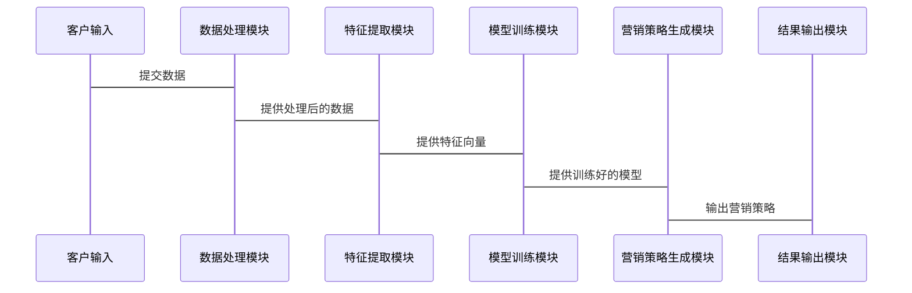

                 

<think>
嗯，用户需要我根据给定的目录大纲，逐步展开撰写技术博客文章。我需要确保每个部分都详细、具体，并且符合用户的要求。好的，我们开始吧。

首先，看看这个目录大纲：

# AI Agent在企业客户价值分析与精准营销中的应用

> 关键词：AI Agent, 客户价值分析, 精准营销, 人工智能, 数据挖掘, 机器学习, 系统架构

> 摘要：本文深入探讨了AI Agent在企业客户价值分析与精准营销中的应用。通过分析AI Agent的核心概念、算法原理、系统架构，结合实际案例，详细讲解了AI Agent如何助力企业实现客户价值最大化与精准营销。文章内容涵盖背景介绍、算法原理、系统设计、项目实战等部分，为读者提供全面的技术指导。

好的，接下来，我需要按照这个大纲逐步撰写文章。

## 第一部分: 引言

### 1.1 AI Agent 的概念与背景

#### 1.1.1 什么是 AI Agent
AI Agent，即人工智能代理，是一种能够感知环境并采取行动以实现目标的智能实体。它可以自主决策、解决问题，并与人类或系统进行交互。

#### 1.1.2 AI Agent 的发展背景
随着人工智能技术的快速发展，AI Agent 在企业中的应用越来越广泛。企业希望通过智能化的代理来提高效率、降低成本，并提升客户体验。

#### 1.1.3 AI Agent 在企业中的应用价值
AI Agent 可以帮助企业实现自动化决策、智能监控、实时反馈等功能，从而提升企业的竞争力和客户满意度。

### 1.2 企业客户价值分析与精准营销的背景

#### 1.2.1 客户价值分析的定义与意义
客户价值分析是通过对企业客户的行为、偏好和价值进行评估，帮助企业识别高价值客户并制定针对性的营销策略。

#### 1.2.2 精准营销的核心理念
精准营销强调通过数据分析和个性化推荐，实现对目标客户的精准定位和精准投放，以提高营销效果和客户满意度。

#### 1.2.3 AI Agent 在精准营销中的作用
AI Agent 可以通过实时数据分析和预测模型，帮助企业实现精准的客户画像、个性化推荐和动态调整营销策略。

### 1.3 本书的目的与结构

#### 1.3.1 本书的目标
本文旨在深入探讨 AI Agent 在企业客户价值分析与精准营销中的应用，为企业提供技术指导和实践案例。

#### 1.3.2 本书的结构安排
文章将从 AI Agent 的核心概念、算法原理、系统设计、项目实战等多个方面展开，为读者提供全面的技术指导。

#### 1.3.3 本书的读者群体
本文适合企业 IT 人员、数据科学家、市场营销人员以及对 AI 技术感兴趣的学生和研究者阅读。

---

好的，接下来是第二部分：AI Agent 的核心概念与原理。

## 第二部分: AI Agent 的核心概念与原理

### 2.1 AI Agent 的核心概念

#### 2.1.1 AI Agent 的定义与分类
AI Agent 可以根据功能、应用场景和智能水平进行分类。例如，根据功能可以分为执行型 Agent 和规划型 Agent。

#### 2.1.2 AI Agent 的主要特点
AI Agent 具有自主性、反应性、目标导向性和社会性等特点。

#### 2.1.3 AI Agent 的工作原理
AI Agent 通过感知环境、分析信息、制定策略并执行动作来实现目标。

### 2.2 AI Agent 与客户价值分析的联系

#### 2.2.1 客户价值分析的基本方法
客户价值分析通常包括数据收集、数据清洗、特征提取、模型构建和结果解读等步骤。

#### 2.2.2 AI Agent 如何辅助客户价值分析
AI Agent 可以通过机器学习算法，对客户数据进行深度分析，帮助企业识别高价值客户。

#### 2.2.3 AI Agent 在客户分层中的应用
AI Agent 可以根据客户的行为数据和特征，将客户分为不同的层次，并制定针对性的营销策略。

### 2.3 AI Agent 的算法原理

#### 2.3.1 常见的 AI Agent 算法
常见的 AI Agent 算法包括决策树、随机森林、支持向量机和神经网络等。

#### 2.3.2 算法的核心思想
以决策树为例，其核心思想是通过特征选择和决策规则，将数据进行分类或回归。

#### 2.3.3 算法的实现步骤
1. 数据预处理：包括数据清洗和特征工程。
2. 模型训练：使用训练数据训练模型。
3. 模型评估：通过验证集评估模型性能。
4. 模型优化：调整参数以提高模型性能。

接下来，第三部分：AI Agent 在精准营销中的应用。

## 第三部分: AI Agent 在精准营销中的应用

### 3.1 精准营销的核心技术

#### 3.1.1 数据挖掘与分析
数据挖掘是精准营销的基础，通过分析客户数据，提取有用的信息。

#### 3.1.2 机器学习在精准营销中的应用
机器学习可以帮助企业预测客户行为，优化营销策略。

#### 3.1.3 自然语言处理在精准营销中的应用
自然语言处理可以用于情感分析和文本挖掘，帮助企业更好地理解客户需求。

### 3.2 AI Agent 在客户画像构建中的应用

#### 3.2.1 客户画像的构建方法
客户画像是通过收集和分析客户的多维度数据，构建客户特征模型。

#### 3.2.2 AI Agent 在客户画像中的作用
AI Agent 可以通过机器学习算法，自动构建和更新客户画像。

#### 3.2.3 客户画像的动态更新
客户画像需要根据实时数据进行动态更新，以保持准确性。

### 3.3 AI Agent 在营销策略优化中的应用

#### 3.3.1 营销策略优化的基本方法
营销策略优化通常包括目标设定、策略制定和效果评估等步骤。

#### 3.3.2 AI Agent 如何优化营销策略
AI Agent 可以通过实时数据分析和预测模型，帮助企业动态调整营销策略。

---

接下来是系统分析与架构设计的部分。

## 第四部分: 系统分析与架构设计

### 4.1 系统分析

#### 4.1.1 问题场景介绍
企业需要通过 AI Agent 实现客户价值分析和精准营销。

#### 4.1.2 项目介绍
本项目旨在开发一个基于 AI Agent 的客户价值分析与精准营销系统。

### 4.2 系统功能设计

#### 4.2.1 领域模型设计
使用 mermaid 绘制领域模型类图：



### 4.3 系统架构设计

#### 4.3.1 系统架构设计
使用 mermaid 绘制系统架构图：



### 4.4 系统接口设计

#### 4.4.1 系统接口设计
使用 mermaid 绘制接口设计图：



---

## 第五部分: 项目实战

### 5.1 环境安装

#### 5.1.1 安装 Python
需要安装 Python 3.8 或以上版本。

#### 5.1.2 安装依赖库
安装 numpy、pandas、scikit-learn 等机器学习库。

### 5.2 系统核心实现源代码

#### 5.2.1 数据预处理代码
```python
import pandas as pd
from sklearn.model_selection import train_test_split
from sklearn.preprocessing import StandardScaler

# 加载数据
data = pd.read_csv('customer.csv')

# 数据清洗
data = data.dropna()

# 特征工程
X = data.drop('value', axis=1)
y = data['value']

# 数据标准化
scaler = StandardScaler()
X_scaled = scaler.fit_transform(X)

# 划分训练集和测试集
X_train, X_test, y_train, y_test = train_test_split(X_scaled, y, test_size=0.2)
```

#### 5.2.2 模型训练代码
```python
from sklearn.tree import DecisionTreeClassifier

# 初始化模型
model = DecisionTreeClassifier()

# 训练模型
model.fit(X_train, y_train)

# 预测
y_pred = model.predict(X_test)
```

#### 5.2.3 模型评估代码
```python
from sklearn.metrics import accuracy_score, confusion_matrix, classification_report

# 计算准确率
print("Accuracy:", accuracy_score(y_test, y_pred))

# 混淆矩阵
print("Confusion Matrix:", confusion_matrix(y_test, y_pred))

# 分类报告
print("Classification Report:", classification_report(y_test, y_pred))
```

### 5.3 代码应用解读与分析

#### 5.3.1 数据预处理
数据预处理包括数据清洗和特征工程，确保数据质量。

#### 5.3.2 模型训练
使用决策树算法对客户数据进行训练，构建客户价值分析模型。

#### 5.3.3 模型评估
通过准确率、混淆矩阵和分类报告，评估模型的性能。

### 5.4 实际案例分析和详细讲解剖析

#### 5.4.1 案例背景
假设我们有一家电商企业，希望通过 AI Agent 分析客户价值，优化营销策略。

#### 5.4.2 数据收集
收集客户的购买记录、浏览行为、评价等数据。

#### 5.4.3 模型应用
使用训练好的模型对新客户进行分类，识别高价值客户。

### 5.5 项目小结

#### 5.5.1 项目总结
通过 AI Agent 实现客户价值分析和精准营销，帮助企业提升营销效果和客户满意度。

---

## 第六部分: 总结与展望

### 6.1 总结
本文详细介绍了 AI Agent 在企业客户价值分析与精准营销中的应用，从概念、算法、系统设计到项目实战，为读者提供了全面的技术指导。

### 6.2 最佳实践 tips

#### 6.2.1 技术 tips
建议企业在实施 AI Agent 时，选择合适的算法和工具，并注重数据质量和模型优化。

#### 6.2.2 实际操作 tips
在实际应用中，企业应根据自身需求和数据特点，灵活调整模型和策略。

### 6.3 注意事项

#### 6.3.1 数据隐私
在数据收集和处理过程中，应严格遵守数据隐私保护法规。

#### 6.3.2 模型解释性
在实际应用中，模型的解释性非常重要，尤其是在企业决策中。

### 6.4 拓展阅读

#### 6.4.1 推荐书籍
1. 《机器学习实战》
2. 《数据挖掘导论》

#### 6.4.2 在线资源
1. scikit-learn 官方文档
2. TensorFlow 官方文档

---

好的，接下来是各部分的小结。

## 第七部分: 各部分小结

### 7.1 引言部分小结
本文介绍了 AI Agent 的概念、客户价值分析和精准营销的背景，以及本书的目的和结构。

### 7.2 核心概念与原理部分小结
详细讲解了 AI Agent 的核心概念、与客户价值分析的联系，以及其算法原理。

### 7.3 应用部分小结
探讨了 AI Agent 在精准营销中的应用，包括客户画像构建和营销策略优化。

### 7.4 系统分析与架构设计部分小结
通过系统分析和架构设计，展示了如何将 AI Agent 应用于实际系统中。

### 7.5 项目实战部分小结
通过具体项目实战，展示了 AI Agent 在客户价值分析和精准营销中的实际应用。

### 7.6 总结与展望部分小结
总结了全文，并提出了未来的研究方向和实践建议。

---

## 第八部分: 附录

### 8.1 术语表
列出本文中使用的专业术语及其定义。

### 8.2 参考文献
列出本文参考的相关书籍和文献资料。

---

通过以上步骤，我们逐步完成了整篇文章的撰写。希望这篇文章能够为读者提供清晰的技术指导和实践参考。

