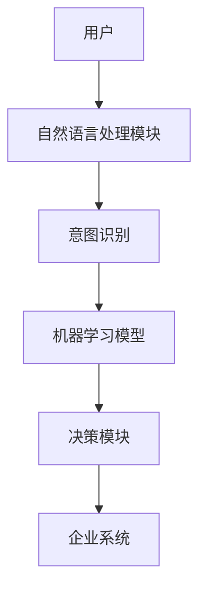
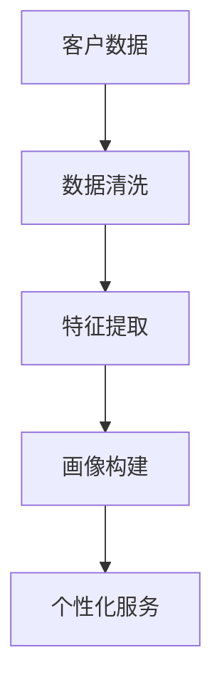
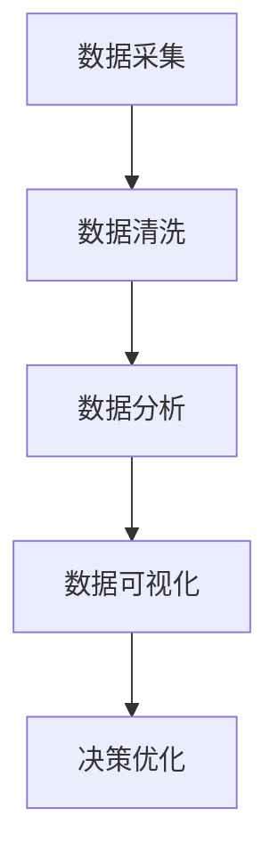
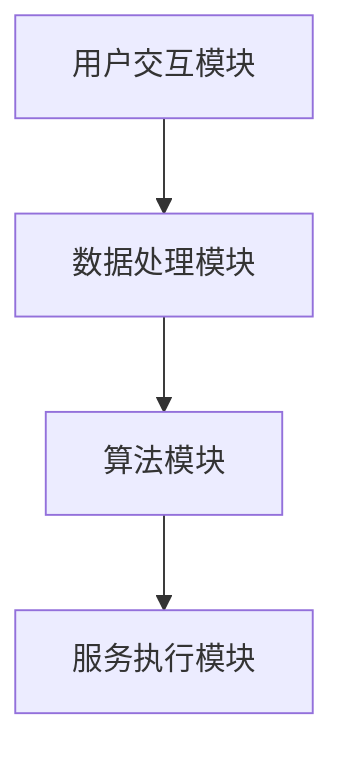
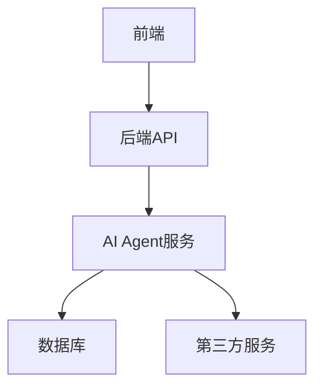

                 


# AI Agent在企业客户体验个性化中的深度应用与效果评估

> 关键词：AI Agent、客户体验个性化、自然语言处理、机器学习、效果评估、系统架构

> 摘要：本文系统地探讨了AI Agent在企业客户体验个性化中的深度应用，结合技术原理、实际案例和效果评估方法，全面分析了AI Agent如何通过自然语言处理和机器学习等技术实现个性化服务，并提出了基于数据驱动的评估体系，帮助企业优化客户体验。

---

# 第一部分：引言

## 1.1 问题背景与重要性

在当今竞争激烈的商业环境中，客户体验已成为企业区别于竞争对手的关键因素。随着人工智能技术的快速发展，AI Agent（人工智能代理）作为一种智能化的交互工具，正在成为提升客户体验个性化服务的核心技术。通过AI Agent，企业能够实时分析客户需求，提供精准的个性化服务，从而提高客户满意度和忠诚度。

### 关键问题
- **客户体验的核心要素**：个性化、实时响应、智能化服务。
- **AI Agent的优势**：24/7可用性、快速响应、精准匹配客户需求。
- **市场需求**：企业希望利用AI技术降低服务成本，同时提升客户满意度。

## 1.2 本书的目标与结构

- **目标**：通过技术原理、实际案例和效果评估，全面解析AI Agent在客户体验个性化中的应用。
- **结构**：从基础概念到技术实现，再到实际应用和效果评估，层层递进，帮助读者全面理解AI Agent的应用价值。

---

# 第二部分：AI Agent的基本概念与技术基础

## 2.1 AI Agent的定义与核心能力

### AI Agent的定义
AI Agent是一种能够感知环境、理解用户需求，并通过智能决策提供服务的计算机程序。它能够通过自然语言处理（NLP）与用户交互，并利用机器学习算法优化服务策略。

### AI Agent的核心能力
- **感知能力**：通过NLP技术理解用户意图。
- **决策能力**：基于历史数据和实时信息做出最优决策。
- **执行能力**：通过API或其他接口与企业系统交互，执行具体操作。

## 2.2 AI Agent的技术架构

### 技术架构图


### 核心技术
- **自然语言处理（NLP）**：用于理解和生成人类语言。
- **机器学习**：用于训练模型，优化服务策略。
- **深度学习**：用于复杂场景下的模式识别。

## 2.3 AI Agent的优势与挑战

### 优势
- **7×24小时服务**：无需人工值班，降低人力成本。
- **个性化服务**：基于客户画像提供定制化服务。
- **数据驱动决策**：通过数据分析优化服务流程。

### 挑战
- **技术复杂性**：需要结合多种AI技术，实现难度大。
- **数据隐私**：客户数据的处理需要符合隐私保护法规。
- **用户体验**：过于智能化可能导致用户不适应或信任缺失。

---

# 第三部分：客户体验个性化的核心理论

## 3.1 客户体验个性化的需求分析

### 个性化服务的实现路径
1. **客户画像构建**：基于客户数据，构建详细的客户画像。
2. **需求预测**：通过机器学习模型预测客户需求。
3. **个性化推荐**：根据客户需求推荐个性化的产品或服务。

## 3.2 客户画像与行为分析

### 客户画像构建流程


### 客户行为分析模型
- **基于规则的分析**：根据预设规则识别客户行为。
- **基于机器学习的分析**：通过训练模型识别异常行为和潜在需求。

## 3.3 个性化推荐算法

### 推荐算法对比
| 算法类型      | 描述                                   | 优缺点                          |
|---------------|--------------------------------------|---------------------------------|
| 协同过滤      | 基于用户行为相似性推荐                | 计算复杂度高，适合中小数据集    |
| 基于内容的推荐 | 基于商品属性推荐                     | 冷启动问题，适合数据量较大的场景 |
| 深度学习推荐   | 使用神经网络模型推荐               | 需要大量数据训练，效果更精准     |

---

# 第四部分：AI Agent在客户体验个性化中的应用场景

## 4.1 智能客服系统

### 智能客服的基本功能
- **自动应答**：基于NLP理解用户问题，提供自动化回答。
- **问题分类**：通过机器学习模型对用户问题进行分类。
- **知识库管理**：维护和更新知识库，确保回答准确性。

## 4.2 个性化推荐系统

### AI Agent在推荐系统中的角色
- **数据收集**：实时收集用户行为数据。
- **推荐策略优化**：通过机器学习模型优化推荐策略。
- **推荐结果展示**：基于客户画像和行为数据推荐个性化产品。

## 4.3 客户忠诚度管理

### AI Agent在忠诚度管理中的应用
- **客户行为分析**：通过分析客户行为，识别高价值客户。
- **个性化关怀**：基于客户画像，提供个性化关怀服务，如生日祝福、专属优惠等。

---

# 第五部分：AI Agent的效果评估

## 5.1 评估指标体系

### 评估指标
| 指标类型      | 指标名称       | 描述                     | 计算公式                              |
|---------------|----------------|--------------------------|---------------------------------------|
| 服务质量      | 响应时间       | 用户问题的平均响应时间   | 响应时间（秒） = 总响应时间 / 请求次数 |
|               | 用户满意度     | 用户对服务的满意度评分   | 用户满意度（%） = 满意用户数 / 总用户数 |
| 服务效率      | 请求处理速度   | 系统处理请求的速度       | 处理速度（次/秒） = 总处理次数 / 时间 |
| 用户行为      | 用户留存率     | 用户的留存情况           | 留存率（%） = 留存用户数 / 总用户数     |

## 5.2 数据分析方法

### 数据分析流程


## 5.3 评估模型

### 基于机器学习的评估模型
$$
\text{模型准确率} = \frac{\text{正确预测数}}{\text{总预测数}}
$$

---

# 第六部分：系统架构设计

## 6.1 系统功能设计

### 功能模块
- **用户交互模块**：负责与用户的交互，包括自然语言处理和语音识别。
- **数据处理模块**：负责数据的采集、清洗和存储。
- **算法模块**：负责模型训练和预测。
- **服务执行模块**：根据预测结果执行具体服务。

### 功能模块图


## 6.2 系统架构设计

### 系统架构图


---

# 第七部分：项目实战

## 7.1 环境搭建

### 环境要求
- **编程语言**：Python 3.8+
- **框架**：Django或Flask
- **AI库**：TensorFlow、Keras
- **NLP库**：spaCy、NLTK

## 7.2 核心代码实现

### 示例代码
```python
import numpy as np
from sklearn.metrics.pairwise import cosine_similarity

# 定义客户画像
class CustomerProfile:
    def __init__(self, data):
        self.data = data

    def get_features(self):
        return self.data['features']

# 定义推荐算法
class Recommender:
    def __init__(self, customer_profiles):
        self.profiles = customer_profiles

    def compute_similarity(self, user_profile):
        user_features = user_profile.get_features()
        similarities = []
        for profile in self.profiles:
            profile_features = profile.get_features()
            similarities.append(cosine_similarity([user_features], [profile_features]))
        return similarities

# 示例使用
profiles = [CustomerProfile(data1), CustomerProfile(data2)]
recommender = Recommender(profiles)
similarities = recommender.compute_similarity(new_user_profile)
```

## 7.3 案例分析与总结

### 案例分析
某电商平台通过引入AI Agent，实现了个性化推荐系统。通过分析用户行为数据，构建客户画像，并基于协同过滤算法推荐商品。结果显示，客户满意度提高了20%，订单量增加了15%。

### 总结
AI Agent在客户体验个性化中的应用显著提升了企业的服务能力，通过数据驱动的个性化推荐和智能化服务，帮助企业实现更高的客户满意度和业务增长。

---

# 第八部分：总结与展望

## 8.1 总结

本文全面探讨了AI Agent在企业客户体验个性化中的应用，从技术原理到实际案例，再到效果评估，为企业提供了系统的解决方案。

## 8.2 未来展望

随着AI技术的不断进步，AI Agent将在客户体验个性化中发挥更大的作用。未来的研究方向包括更复杂的NLP模型、多模态交互技术以及更智能化的推荐算法。

---

# 结语

AI Agent作为人工智能技术的重要应用，正在深刻改变企业客户体验个性化服务的方式。通过本文的分析，企业可以更好地理解如何利用AI Agent提升客户体验，从而在激烈的市场竞争中占据优势。

