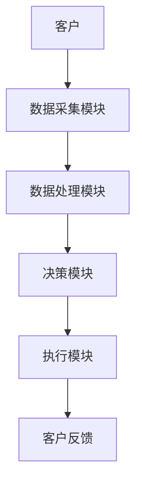
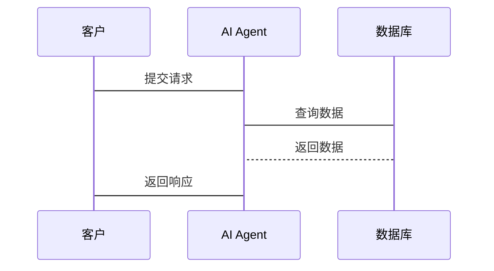

                 


# AI Agent在企业客户体验个性化中的角色

> **关键词**：AI Agent, 客户体验, 个性化服务, 机器学习, 自然语言处理, 系统架构, 项目实战

> **摘要**：  
AI Agent（人工智能代理）正在成为企业客户体验个性化的核心技术。通过机器学习、自然语言处理和强化学习等技术，AI Agent能够实时分析客户需求，提供个性化服务，优化客户体验。本文将从AI Agent的基本概念、核心算法、系统架构到实际项目案例，详细分析其在企业客户体验中的角色和应用。

---

# 第一部分: AI Agent与企业客户体验概述

## 第1章: AI Agent与客户体验个性化概述

### 1.1 AI Agent的基本概念
AI Agent是一种智能代理系统，能够通过感知环境、理解用户需求并采取行动来实现目标。在企业客户体验中，AI Agent主要用于提供个性化的服务，例如推荐系统、智能客服和自动化流程管理。

#### 1.1.1 AI Agent的定义
AI Agent是一种能够感知环境、理解用户需求，并通过决策和行动来优化结果的智能系统。它通常结合了机器学习、自然语言处理和强化学习等技术。

#### 1.1.2 AI Agent的核心特征
- **自主性**：能够在没有人工干预的情况下独立运行。
- **反应性**：能够实时感知环境变化并做出响应。
- **学习能力**：通过数据和经验不断优化自身行为。
- **可扩展性**：能够适应不同的业务场景和客户需求。

#### 1.1.3 企业客户体验的个性化需求
随着市场竞争的加剧，客户对个性化服务的需求日益增长。企业需要通过AI Agent来实时分析客户行为，预测需求，并提供定制化的服务。

---

### 1.2 AI Agent在客户体验中的角色
AI Agent在客户体验个性化中的作用主要体现在以下几个方面：

#### 1.2.1 客户体验个性化的核心问题
- **需求识别**：如何准确识别客户的个性化需求。
- **实时响应**：如何快速响应客户的需求变化。
- **服务优化**：如何通过数据驱动的方式不断优化服务体验。

#### 1.2.2 AI Agent在客户体验中的应用场景
- **智能推荐系统**：基于客户行为数据，推荐个性化的产品或服务。
- **智能客服**：通过自然语言处理技术，提供24/7的智能客服支持。
- **自动化流程管理**：优化企业的业务流程，提高客户满意度。

#### 1.2.3 AI Agent与客户体验的结合方式
- **数据驱动**：通过收集和分析客户数据，实现个性化推荐。
- **实时互动**：通过实时对话或交互，提供动态的个性化服务。
- **反馈优化**：通过客户反馈不断优化AI Agent的行为。

---

## 第2章: AI Agent的核心原理与技术基础

### 2.1 AI Agent的技术基础
AI Agent的核心技术包括机器学习、自然语言处理和强化学习。

#### 2.1.1 机器学习与深度学习
机器学习是AI Agent的核心技术之一，用于从数据中学习客户的行为模式和偏好。深度学习通过神经网络模型进一步提高学习的准确性和效率。

#### 2.1.2 自然语言处理（NLP）
NLP技术用于理解和生成人类语言，是实现智能客服和个性化推荐的重要基础。

#### 2.1.3 强化学习与决策优化
强化学习通过模拟试错过程，优化AI Agent的决策能力，使其能够更好地满足客户需求。

---

### 2.2 AI Agent的算法原理
AI Agent的算法主要分为基于规则的算法、基于模型的算法和基于强化学习的算法。

#### 2.2.1 基于规则的AI Agent
基于规则的AI Agent通过预定义的规则来实现简单的决策，适用于规则明确的场景。

#### 2.2.2 基于模型的AI Agent
基于模型的AI Agent通过机器学习模型来预测客户行为，适用于复杂场景。

#### 2.2.3 基于强化学习的AI Agent
基于强化学习的AI Agent通过试错和反馈不断优化决策，适用于动态变化的场景。

---

### 2.3 AI Agent与客户体验个性化的关系
AI Agent通过学习客户需求，提供个性化服务，从而提升客户体验。同时，客户体验数据反过来又为AI Agent提供了优化的依据。

---

## 第3章: AI Agent的系统架构与设计

### 3.1 AI Agent的系统架构
AI Agent的系统架构通常包括数据采集模块、数据处理模块、决策模块和执行模块。

#### 3.1.1 系统模块划分
- **数据采集模块**：负责收集客户行为数据。
- **数据处理模块**：对数据进行清洗、特征提取和建模。
- **决策模块**：基于模型预测客户需求。
- **执行模块**：根据决策结果执行相应操作。

#### 3.1.2 数据流与信息处理流程
数据采集模块将客户数据传输到数据处理模块，经过处理后，决策模块生成决策，执行模块执行决策并反馈结果。

---

### 3.2 AI Agent的系统架构设计

#### 3.2.1 系统功能设计
- **客户行为分析**：分析客户的浏览、点击和购买行为。
- **个性化推荐**：基于客户行为推荐产品或服务。
- **智能客服**：提供实时的问答和问题解决服务。

#### 3.2.2 系统架构图
以下是AI Agent的系统架构图：



---

### 3.3 AI Agent的接口设计

#### 3.3.1 API接口
- **数据接口**：用于数据的传输和存储。
- **服务接口**：用于与其他系统（如CRM）的交互。
- **用户接口**：用于与客户的直接交互，如聊天界面。

#### 3.3.2 系统交互流程
以下是系统交互流程图：



---

## 第4章: 项目实战

### 4.1 电商领域的AI Agent应用

#### 4.1.1 系统设计
- **数据采集**：收集客户的浏览、点击和购买数据。
- **推荐算法**：基于协同过滤或深度学习模型推荐产品。
- **智能客服**：提供实时的问答和问题解决服务。

#### 4.1.2 核心代码实现
以下是推荐算法的代码示例：

```python
import numpy as np

# 假设用户行为数据为一个矩阵，行表示用户，列表示商品
user_item_matrix = np.array([[0, 1, 0], [1, 0, 1], [0, 1, 1]])

# 计算相似用户
similar_users = user_item_matrix.dot(user_item_matrix.T)

# 找出最相似的用户
similar_users = similar_users[0].argsort()[::-1]
```

#### 4.1.3 案例分析
通过分析客户的购买行为，AI Agent能够准确推荐相关产品，提升客户的购买转化率。

---

## 第5章: 总结与展望

### 5.1 总结
AI Agent通过机器学习、自然语言处理和强化学习等技术，能够实现客户体验的个性化服务。通过实时分析客户需求，AI Agent能够提高客户满意度和忠诚度。

### 5.2 未来展望
随着技术的不断进步，AI Agent在客户体验中的应用将更加广泛。未来，AI Agent将更加智能化，能够处理更复杂的需求，并提供更加个性化的服务。

---

通过以上内容，我们可以看到AI Agent在企业客户体验个性化中的重要角色。AI Agent不仅能够提高客户满意度，还能优化企业的运营效率。随着技术的不断发展，AI Agent将在客户体验领域发挥更大的作用。

