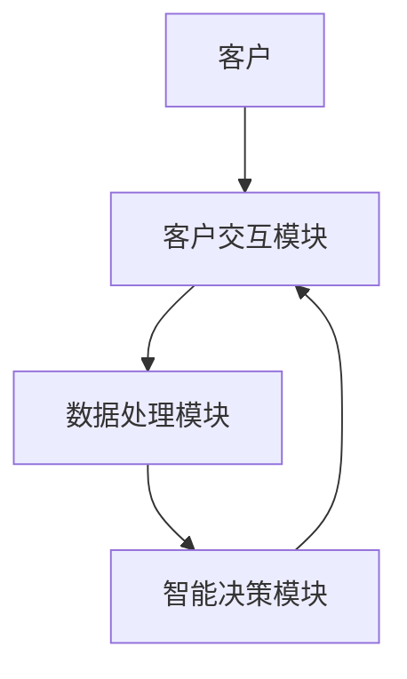

                 


# AI Agent在企业客户服务中的应用：提升效率与满意度

> **关键词**：AI Agent, 企业客户服务, 自然语言处理, 机器学习, 智能客服, 客户满意度

> **摘要**：本文深入探讨了AI Agent在企业客户服务中的应用，分析了其核心概念、技术原理、系统架构及项目实战。通过自然语言处理和机器学习的结合，AI Agent能够显著提升客户服务的效率与客户满意度。文章详细介绍了AI Agent的实现过程，包括算法原理、系统设计和实际案例，为读者提供了全面的技术指导和实践参考。

---

# 第一部分: AI Agent 在企业客户服务中的应用概述

## 第1章: AI Agent 的核心概念与背景

### 1.1 AI Agent 的定义与背景

#### 1.1.1 什么是 AI Agent
AI Agent（人工智能代理）是一种能够感知环境并采取行动以实现特定目标的智能系统。在企业客户服务中，AI Agent通常以聊天机器人或虚拟助手的形式出现，通过自然语言处理（NLP）与客户交互，解决客户问题并提供支持。

#### 1.1.2 AI Agent 的发展背景
随着企业对高效、智能化客户服务需求的增加，AI Agent凭借其快速响应、7x24小时服务和数据分析能力，逐渐成为企业客户服务体系的重要组成部分。尤其是在疫情后，远程办公和自动化服务的需求激增，推动了AI Agent的快速发展。

#### 1.1.3 企业客户服务中的问题与挑战
传统的客户服务模式依赖人工坐席执行，存在响应速度慢、成本高、服务质量不稳定等问题。AI Agent的引入可以有效解决这些问题，通过自动化处理大量重复性任务，提升客户满意度和企业效率。

---

### 1.2 AI Agent 的核心概念

#### 1.2.1 AI Agent 的核心要素
AI Agent的核心要素包括：
1. **感知能力**：通过NLP技术理解客户输入的文本或语音。
2. **决策能力**：基于训练好的模型生成合适的响应。
3. **执行能力**：通过API或其他接口调用后端系统执行操作（如查询数据库、下单等）。

#### 1.2.2 AI Agent 的类型与特点
| 类型         | 描述                                                                 |
|--------------|----------------------------------------------------------------------|
| 基于规则的AI Agent | 通过预定义的规则和关键词匹配进行响应，适用于简单场景。                   |
| 基于统计的AI Agent | 基于大数据训练的模型，能够理解上下文，适用于复杂场景。                   |
| 基于深度学习的AI Agent | 使用深度学习模型（如BERT、GPT）进行自然语言理解，实现更智能的交互。         |

#### 1.2.3 AI Agent 的工作原理
AI Agent的工作流程如下：
1. 接收客户输入（文本或语音）。
2. 通过NLP技术解析输入，提取关键信息。
3. 基于训练好的模型生成响应。
4. 返回响应并执行相关操作。

---

### 1.3 AI Agent 在企业客户服务中的应用前景

#### 1.3.1 AI Agent 的潜在应用领域
- **客户支持**：解答常见问题、处理投诉。
- **销售辅助**：提供产品推荐、订单跟踪。
- **数据分析**：收集客户反馈，优化服务流程。

#### 1.3.2 企业采用 AI Agent 的优势
1. **提高效率**：自动化处理大量客户咨询，减少人工成本。
2. **7x24小时服务**：全天候为客户提供支持。
3. **个性化服务**：通过数据分析提供定制化服务。

#### 1.3.3 AI Agent 应用的挑战与机遇
- **挑战**：模型准确率不足、数据隐私问题、客户信任度。
- **机遇**：技术进步（如大语言模型）、成本降低、客户体验提升。

---

## 1.4 本章小结
本章介绍了AI Agent的核心概念、工作原理及其在企业客户服务中的应用前景。AI Agent通过自动化和智能化的方式，帮助企业提升客户满意度和效率，是未来客户服务的重要趋势。

---

# 第二部分: AI Agent 的技术原理与算法基础

## 第2章: 自然语言处理与 AI Agent

### 2.1 自然语言处理（NLP）基础

#### 2.1.1 NLP 的核心任务
| 任务         | 描述                                                                 |
|--------------|----------------------------------------------------------------------|
| 分词         | 将连续文本分割成词或短语。                                             |
| 词性标注     | 给每个词标注其词性（名词、动词等）。                                   |
| 命名实体识别 | 识别文本中的专有名词（人名、地名等）。                                 |
| 情感分析     | 判断文本的情感倾向（正面、负面、中性）。                               |

#### 2.1.2 NLP 的常见技术
- **TF-IDF**：用于关键词提取，计算词的重要性。
- **Word2Vec**：将词语映射为向量，用于语义分析。
- **BERT**：一种基于Transformer的预训练模型，常用于问答系统。

#### 2.1.3 NLP 在 AI Agent 中的应用
AI Agent通过NLP技术理解客户输入，提取关键信息，并生成合适的响应。

---

### 2.2 机器学习与深度学习在 AI Agent 中的应用

#### 2.2.1 机器学习的基本概念
机器学习是一种通过数据训练模型，使其能够从经验中学习并做出预测的技术。

#### 2.2.2 深度学习的核心技术
- **卷积神经网络（CNN）**：常用于图像识别。
- **循环神经网络（RNN）**：适合处理序列数据（如文本）。
- **Transformer**：目前在NLP领域应用广泛，如BERT、GPT。

#### 2.2.3 机器学习在 AI Agent 中的实现
1. **训练数据准备**：收集客户咨询数据，标注关键词和意图。
2. **模型训练**：使用训练数据训练NLP模型。
3. **模型部署**：将模型部署到AI Agent系统中，实时处理客户咨询。

---

### 2.3 AI Agent 的算法实现

#### 2.3.1 基于规则的 AI Agent
- **优点**：实现简单，适合规则明确的场景。
- **缺点**：难以处理复杂场景。

#### 2.3.2 基于统计的 AI Agent
- **优点**：能够处理复杂场景，学习能力强。
- **缺点**：需要大量数据支持。

#### 2.3.3 基于深度学习的 AI Agent
- **优点**：语义理解能力强，能够处理复杂的对话。
- **缺点**：训练成本高，需要大量计算资源。

---

### 2.4 本章小结
本章介绍了NLP和机器学习在AI Agent中的应用，重点讲解了深度学习技术在自然语言处理中的作用。通过这些技术，AI Agent能够实现更智能的客户交互。

---

## 第3章: AI Agent 的系统架构设计

### 3.1 系统架构概述

#### 3.1.1 系统架构的组成
AI Agent系统通常包括以下模块：
1. **客户交互模块**：负责接收客户输入并返回响应。
2. **数据处理模块**：对客户输入进行预处理和分析。
3. **智能决策模块**：基于模型生成响应。

#### 3.1.2 系统架构的分类
| 分类         | 描述                                                                 |
|--------------|----------------------------------------------------------------------|
| 单体架构     | 所有模块集中部署，适合小型项目。                                       |
| 分布式架构   | 模块分布部署，适合大型项目。                                           |
| 微服务架构   | 每个模块独立部署，便于扩展和维护。                                     |

#### 3.1.3 企业级 AI Agent 的架构特点
- **高可用性**：确保系统稳定运行。
- **可扩展性**：能够应对高并发请求。
- **安全性**：保护客户数据和系统安全。

---

### 3.2 系统功能设计

#### 3.2.1 客户交互模块
- **功能**：接收客户输入，返回响应。
- **实现**：支持多种交互方式（文本、语音）。

#### 3.2.2 数据处理模块
- **功能**：对客户输入进行预处理和分析。
- **实现**：使用NLP技术提取关键词和意图。

#### 3.2.3 智能决策模块
- **功能**：基于模型生成响应。
- **实现**：使用深度学习模型进行语义理解。

---

### 3.3 系统架构的实现

#### 3.3.1 系统架构的实现步骤
1. **需求分析**：明确系统功能和性能需求。
2. **架构设计**：选择合适的系统架构。
3. **模块开发**：分别开发各模块的功能。
4. **系统集成**：将各模块集成到一起，进行测试和优化。

#### 3.3.2 系统架构的实现工具
- **开发工具**：Python、Java、C#等。
- **框架**：Flask、Django（Python）、Spring Boot（Java）等。
- **部署工具**：Docker、Kubernetes等。

#### 3.3.3 系统架构的实现案例
以下是一个简单的AI Agent系统架构图：



---

### 3.4 本章小结
本章详细介绍了AI Agent的系统架构设计，包括各个模块的功能和实现步骤。通过合理的设计和选择，可以构建一个高效、稳定的AI Agent系统。

---

## 第四部分: AI Agent 的项目实战与案例分析

## 第4章: AI Agent 的项目实战

### 4.1 项目环境搭建

#### 4.1.1 开发环境的安装与配置
- **操作系统**：建议使用Linux或macOS。
- **Python版本**：建议使用Python 3.8以上。
- **安装依赖**：`pip install numpy pandas scikit-learn transformers`

#### 4.1.2 开发工具的选择与使用
- **IDE**：推荐使用PyCharm或VS Code。
- **版本控制**：使用Git进行代码管理。

#### 4.1.3 数据集的准备与预处理
- **数据来源**：可以从公开数据集（如Kaggle）获取客户咨询数据。
- **数据清洗**：去除重复数据、填充缺失值等。

---

### 4.2 系统核心实现源代码

#### 4.2.1 客户交互模块
```python
import transformers
from transformers import pipeline

# 初始化对话模型
model = pipeline("question-answering", model="deepseek/roberta-base-squad")

def get_response(question, context):
    response = model(question=question, context=context)
    return response['answer']
```

#### 4.2.2 数据处理模块
```python
import pandas as pd

def preprocess_data(data):
    # 假设data是一个DataFrame，包含'question'和'answer'两列
    # 分词处理
    data['tokens'] = data['question'].apply(lambda x: x.split())
    return data
```

#### 4.2.3 智能决策模块
```python
import numpy as np
from sklearn.feature_extraction.text import TfidfVectorizer

def train_model(train_data):
    # 提取特征
    vectorizer = TfidfVectorizer()
    X = vectorizer.fit_transform(train_data['question'])
    # 训练模型
    from sklearn.naive_bayes import MultinomialNB
    clf = MultinomialNB().fit(X, train_data['label'])
    return clf, vectorizer

def predict(clf, vectorizer, test_question):
    X_test = vectorizer.transform([test_question])
    prediction = clf.predict(X_test)
    return prediction[0]
```

---

### 4.3 实际案例分析

#### 4.3.1 案例背景
假设我们正在开发一个银行的AI Agent，用于回答客户的金融相关问题。

#### 4.3.2 案例分析
1. **数据准备**：收集银行客户的问题和答案，构建训练数据集。
2. **模型训练**：使用Tfidf和朴素贝叶斯算法训练分类模型。
3. **系统部署**：将模型部署到银行的客服系统中，实时处理客户咨询。

#### 4.3.3 代码实现
```python
# 训练数据
train_data = pd.DataFrame({
    'question': ["What is your account balance?", "How to reset password?"],
    'label': [0, 1]
})

# 训练模型
model, vectorizer = train_model(train_data)

# 测试
print(predict(model, vectorizer, "What is my account balance?"))  # 输出0
print(predict(model, vectorizer, "How can I reset my password?"))  # 输出1
```

---

### 4.4 本章小结
本章通过一个实际案例，详细介绍了AI Agent的项目实战过程，包括环境搭建、代码实现和案例分析。通过这些步骤，读者可以更好地理解如何将理论应用于实践。

---

## 第5章: 总结与未来展望

### 5.1 总结
本文详细探讨了AI Agent在企业客户服务中的应用，分析了其核心概念、技术原理、系统架构及项目实战。通过自然语言处理和机器学习的结合，AI Agent能够显著提升客户服务的效率与客户满意度。

---

### 5.2 未来展望
随着技术的不断进步，AI Agent将在企业客户服务中发挥越来越重要的作用。未来的发展方向包括：
1. **更智能的交互**：通过大语言模型实现更自然的对话。
2. **多模态交互**：支持文本、语音、图像等多种交互方式。
3. **个性化服务**：基于客户画像提供定制化服务。

---

## 附录

### 附录A: 术语表
- **NLP**：自然语言处理。
- **BERT**：Bidirectional Encoder Representations from Transformers，一种深度学习模型。

### 附录B: 工具与库
- **Transformers**：用于NLP模型的库。
- **Scikit-learn**：用于机器学习的库。

---

以上就是本文的全部内容，希望对您有所帮助！

