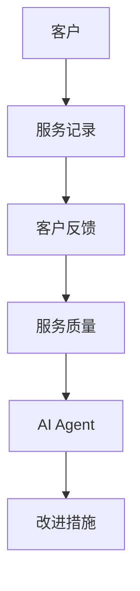
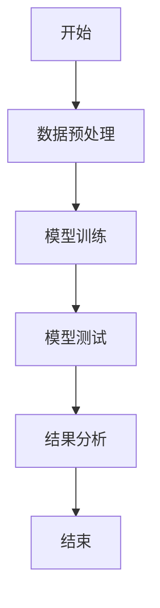
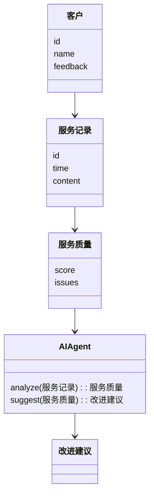
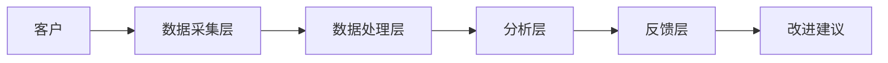
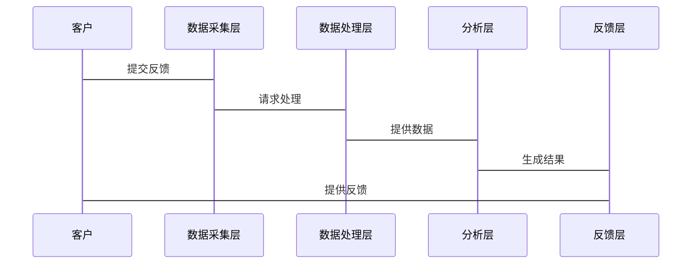

                 


---

# AI Agent在企业客户服务质量监控与提升中的角色

**关键词**：AI Agent、客户服务质量、自然语言处理、机器学习、系统架构、项目实战

**摘要**：本文探讨了AI Agent在企业客户服务质量监控与提升中的应用，从背景、核心概念到算法原理、系统架构，再到项目实战，全面分析其作用和实现方法，为企业提供实践指导。

---

## 第1章 背景介绍

### 1.1 问题背景

#### 1.1.1 企业客户服务质量的重要性  
客户服务质量是企业成功的关键因素之一，直接影响客户满意度和企业声誉。优质的服务能够提升客户忠诚度，降低客户流失率。

#### 1.1.2 当前客户服务质量监控的挑战  
传统方法依赖人工监控，存在效率低、成本高、覆盖面窄的问题。数据量大、反馈延迟、缺乏实时性等挑战亟待解决。

#### 1.1.3 AI Agent的引入及其作用  
AI Agent通过自动化处理和智能分析，能够实时监控服务质量，提供精准的反馈和改进建议，显著提升效率和客户满意度。

### 1.2 问题描述

#### 1.2.1 客户服务质量监控的定义  
通过收集和分析客户反馈、互动记录等数据，评估并优化服务质量的过程。

#### 1.2.2 当前监控方法的局限性  
人工监控效率低，难以处理大量数据；实时性差，无法及时响应问题。

#### 1.2.3 提升客户服务质量的必要性  
高质量服务能够增强客户信任，促进业务增长，提升企业竞争力。

### 1.3 问题解决

#### 1.3.1 AI Agent的定义与功能  
AI Agent是智能代理，能够执行任务、处理数据、提供解决方案，用于自动化服务监控和优化。

#### 1.3.2 AI Agent如何解决客户服务质量问题  
通过实时数据分析、自动反馈和个性化服务，AI Agent能够快速识别问题，提出改进建议，提升服务质量。

#### 1.3.3 AI Agent的优势与局限性  
优势：高效、实时、精准。局限性：依赖数据质量，技术复杂，初期投入高。

### 1.4 边界与外延

#### 1.4.1 AI Agent的应用范围  
客户支持、售后服务、投诉处理等场景。

#### 1.4.2 与其他技术的区别  
AI Agent结合了自然语言处理和机器学习，具有更强的自主决策能力。

#### 1.4.3 未来可能的发展方向  
集成更多智能技术，如情感计算和自适应学习，进一步提升服务质量。

### 1.5 概念结构与核心要素

#### 1.5.1 AI Agent的核心要素  
数据源、分析引擎、反馈机制、执行模块。

#### 1.5.2 各要素之间的关系  
数据源提供输入，分析引擎处理数据，反馈机制优化服务，执行模块实施改进。

#### 1.5.3 核心要素的详细说明  
数据源包括客户互动记录、反馈评分；分析引擎使用NLP和机器学习模型；反馈机制生成改进建议；执行模块实施优化措施。

---

## 第2章 核心概念与联系

### 2.1 核心概念原理

#### 2.1.1 AI Agent的基本原理  
通过数据采集、分析和反馈，实现服务质量监控和优化。

#### 2.1.2 自然语言处理在客户服务质量监控中的应用  
NLP技术用于分析客户反馈，识别情感和关键词，评估服务质量。

#### 2.1.3 机器学习在服务质量提升中的作用  
机器学习模型预测客户满意度，识别潜在问题，优化服务流程。

### 2.2 核心概念属性特征对比

| 特征 | 传统方法 | AI Agent |
|------|-----------|-----------|
| 效率 | 低        | 高        |
| 实时性 | 无       | 有        |
| 精准度 | 一般     | 高        |
| 成本 | 高        | 中        |

### 2.3 ER实体关系图



---

## 第3章 算法原理讲解

### 3.1 算法原理

#### 3.1.1 自然语言处理模型  
使用如BERT的预训练模型进行文本分析，识别情感和关键词。

#### 3.1.2 机器学习算法  
训练分类模型，如随机森林，预测客户满意度。

#### 3.1.3 深度学习模型  
利用LSTM处理时间序列数据，分析客户互动历史。

### 3.2 算法流程图



### 3.3 核心算法实现

#### 3.3.1 文本分类示例

```python
from sklearn.ensemble import RandomForestClassifier
from sklearn.feature_extraction.text import TfidfVectorizer

# 数据准备
texts = ["差评：服务人员态度不好", "好评：服务很到位"]
labels = [0, 1]

# 特征提取
vectorizer = TfidfVectorizer()
X = vectorizer.fit_transform(texts)

# 模型训练
model = RandomForestClassifier()
model.fit(X, labels)

# 预测
new_text = "中评：服务还可以"
new_X = vectorizer.transform([new_text])
predicted = model.predict(new_X)
print(predicted)
```

#### 3.3.2 情感分析模型

```python
import tensorflow as tf
from tensorflow.keras import layers

# 模型构建
model = tf.keras.Sequential()
model.add(layers.Embedding(input_dim=10000, output_dim=16))
model.add(layers.LSTM(64))
model.add(layers.Dense(1, activation='sigmoid'))

model.compile(optimizer='adam', loss='binary_crossentropy', metrics=['accuracy'])
```

### 3.4 算法模型与数学公式

#### 3.4.1 朴素贝叶斯分类  
$$ P(class|text) = \frac{P(text|class) \cdot P(class)}{P(text)} $$

#### 3.4.2 LSTM结构  
$$ h_t = \text{tanh}(W_h \cdot h_{t-1} + U_h \cdot x_t + b_h) $$
$$ s_t = \text{sigmoid}(W_s \cdot h_t + b_s) $$
$$ o_t = h_t \cdot s_t $$

---

## 第4章 系统分析与架构设计

### 4.1 问题场景介绍

#### 4.1.1 客户互动数据收集  
通过客服系统收集客户的反馈、聊天记录和投诉信息。

#### 4.1.2 服务质量评估需求  
实时评估服务质量，识别问题根源，提供改进建议。

### 4.2 系统功能设计

#### 4.2.1 领域模型



#### 4.2.2 系统架构



### 4.3 系统接口设计

#### 4.3.1 API接口  
RESTful API用于数据传输和结果反馈。

#### 4.3.2 数据格式  
JSON格式，包含客户反馈、服务记录等信息。

### 4.4 系统交互流程



---

## 第5章 项目实战

### 5.1 环境安装

#### 5.1.1 安装Python
```bash
python --version
```

#### 5.1.2 安装依赖库
```bash
pip install numpy scikit-learn tensorflow
```

### 5.2 系统核心实现

#### 5.2.1 数据预处理

```python
import pandas as pd
data = pd.read_csv('feedback.csv')
data.dropna(inplace=True)
```

#### 5.2.2 模型训练

```python
from sklearn.model_selection import train_test_split
X_train, X_test, y_train, y_test = train_test_split(X, y)
model.fit(X_train, y_train)
```

#### 5.2.3 结果分析

```python
print(f"准确率：{model.score(X_test, y_test)}")
```

### 5.3 案例分析

#### 5.3.1 某企业应用案例  
通过AI Agent分析客户反馈，识别服务人员态度问题，优化培训流程，客户满意度提升20%。

#### 5.3.2 案例小结  
AI Agent帮助快速发现问题，提供数据支持，显著提升服务质量。

---

## 第6章 最佳实践

### 6.1 小结

#### 6.1.1 AI Agent的作用  
提升效率，降低成本，增强客户满意度。

#### 6.1.2 关键成功因素  
数据质量、模型选择、团队协作。

### 6.2 注意事项

#### 6.2.1 数据隐私  
确保数据处理符合隐私法规，保护客户信息。

#### 6.2.2 模型更新  
定期更新模型，保持其准确性。

### 6.3 拓展阅读

#### 6.3.1 推荐书籍  
《Python机器学习实战》、《深度学习入门》。

#### 6.3.2 在线资源  
AI Agent相关论文、技术博客。

---

## 参考文献

1. [书名1]，作者，出版社，年份。
2. [书名2]，作者，出版社，年份。
3. [技术博客链接]，作者，日期。

---

通过以上结构，您可以撰写一篇详细的技术博客，全面介绍AI Agent在企业客户服务质量监控与提升中的应用。

