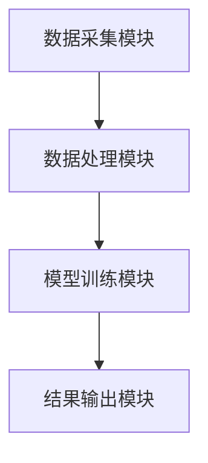
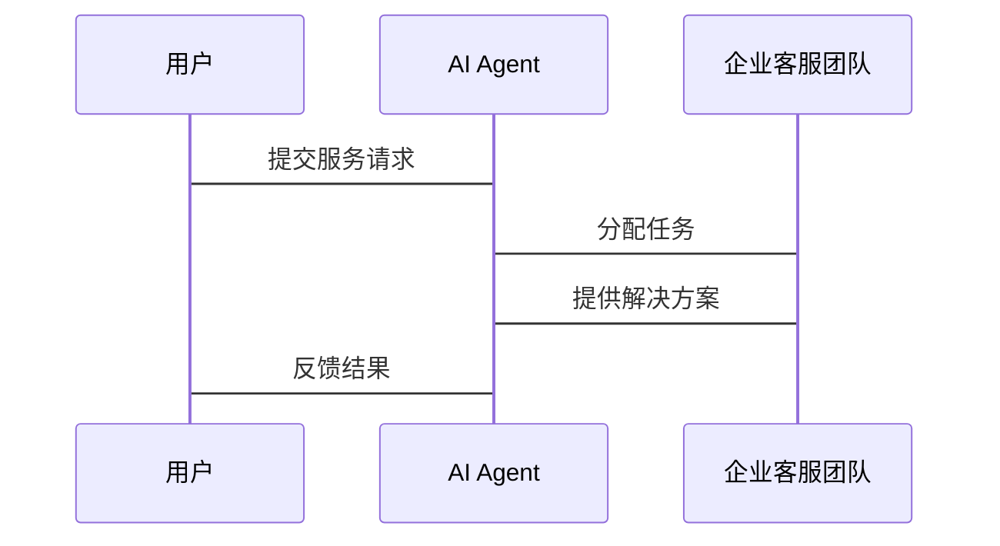

                 


# AI Agent在企业客户服务质量监控与智能升级中的角色

## 关键词：AI Agent、客户服务质量监控、智能升级、服务质量优化、自然语言处理、机器学习、实时监控

## 摘要：  
随着人工智能技术的快速发展，AI Agent（人工智能代理）在企业客户服务质量监控与智能升级中的作用日益凸显。本文详细探讨了AI Agent在客户服务质量监控中的角色，分析了其核心原理、系统架构设计、算法实现以及实际项目中的应用案例。通过对AI Agent在企业客户服务质量监控中的功能、优势及应用场景的系统性分析，本文为企业的智能化转型提供了理论支持和实践指导。

---

## 第一部分：背景与概念

### 第1章：AI Agent的基本概念与应用场景

#### 1.1 AI Agent的定义与核心特征

##### 1.1.1 什么是AI Agent
AI Agent（人工智能代理）是一种能够感知环境、自主决策并执行任务的智能系统。它通过传感器获取信息，利用算法进行分析和推理，并通过执行器完成目标。AI Agent可以分为简单反射型代理、基于模型的反应式代理、目标驱动代理和效用驱动代理等类型。

##### 1.1.2 AI Agent的核心特征
- **自主性**：能够在没有人工干预的情况下独立运行。
- **反应性**：能够实时感知环境并做出响应。
- **目标驱动**：具有明确的目标，并通过决策优化实现目标。
- **学习能力**：能够通过数据和经验不断优化自身的性能。

##### 1.1.3 AI Agent与传统客服系统的区别
传统客服系统通常基于规则和脚本，无法灵活应对复杂场景。而AI Agent具备学习和推理能力，能够根据客户行为和历史数据动态调整服务策略，从而提供更加个性化和高效的服务。

---

#### 1.2 企业客户服务质量监控的背景与挑战

##### 1.2.1 企业客户服务质量的重要性
客户服务质量是企业赢得客户信任和忠诚度的关键因素。高质量的服务不仅能够提升客户满意度，还能降低客户流失率，为企业创造长期价值。

##### 1.2.2 传统客户服务质量监控的局限性
传统客户服务质量监控通常依赖人工记录和分析，存在效率低、成本高、实时性差等问题。此外，传统方法难以捕捉客户行为的复杂性和多样性，导致服务质量监控不够精准。

##### 1.2.3 AI Agent在客户服务质量监控中的优势
AI Agent能够实时收集、分析和处理海量数据，快速识别问题并提供解决方案。通过自然语言处理和机器学习技术，AI Agent能够准确理解客户意图，并根据历史数据预测未来趋势，从而实现智能化的客户服务质量监控。

---

### 第2章：AI Agent在企业客户服务质量监控中的角色

#### 2.1 AI Agent在客户服务质量监控中的功能

##### 2.1.1 实时监控与反馈
AI Agent能够实时监控客户的互动行为，例如响应时间、情绪变化和问题类型，并及时反馈给企业客服团队。这种实时监控能够帮助企业快速识别并解决潜在问题。

##### 2.1.2 数据分析与预测
AI Agent通过分析历史数据，识别客户行为模式和趋势，预测未来的客户需求和潜在问题。这种预测能力能够帮助企业提前采取措施，提升客户满意度。

##### 2.1.3 智能决策支持
AI Agent能够根据实时数据和历史信息，为企业提供智能决策支持。例如，在客户投诉处理中，AI Agent可以建议最优的解决方案，帮助客服人员快速响应客户需求。

#### 2.2 AI Agent在客户服务质量智能升级中的作用

##### 2.2.1 提供个性化服务
AI Agent能够根据客户的个性化需求，提供定制化的服务体验。例如，通过分析客户的购买记录和偏好，AI Agent可以推荐相关产品或服务，提升客户的满意度和忠诚度。

##### 2.2.2 优化服务流程
AI Agent能够通过分析服务流程中的瓶颈和低效环节，提出优化建议。例如，AI Agent可以通过自动化处理重复性任务，减少人工干预，提高服务效率。

##### 2.2.3

---

## 第二部分：AI Agent的核心原理与技术实现

### 第3章：AI Agent的核心原理

#### 3.1 自然语言处理技术
自然语言处理（NLP）是AI Agent实现客户意图理解的关键技术。通过NLP，AI Agent能够识别客户的情感倾向、提取关键词并生成相应的回应。例如，使用词袋模型（Bag of Words）或词嵌入模型（如Word2Vec）对客户的文本进行分析。

#### 3.2 机器学习算法
机器学习算法是AI Agent实现预测和分类的核心技术。常用的算法包括支持向量机（SVM）、随机森林（Random Forest）和深度学习模型（如LSTM和Transformer）。通过训练模型，AI Agent能够准确分类客户问题类型，并预测客户满意度。

#### 3.3 数据处理与分析
AI Agent需要对大量的客户数据进行处理和分析，包括文本数据、语音数据和行为数据。通过数据清洗、特征提取和数据建模，AI Agent能够从数据中提取有价值的信息，并为决策提供支持。

---

### 第4章：AI Agent的系统架构设计

#### 4.1 系统功能设计
AI Agent的系统功能设计包括数据采集、数据处理、模型训练和结果输出四个部分。数据采集模块负责收集客户的互动数据；数据处理模块对数据进行清洗和预处理；模型训练模块通过机器学习算法对数据进行建模；结果输出模块将模型输出的结果反馈给企业客服团队。

#### 4.2 系统架构图
以下是AI Agent系统的架构图：



#### 4.3 系统交互流程
以下是AI Agent系统的交互流程图：



---

## 第三部分：AI Agent在客户服务质量监控中的应用

### 第5章：项目实战

#### 5.1 环境配置
以下是项目实战的环境配置示例：

```bash
# 安装Python依赖
pip install numpy pandas scikit-learn transformers
# 安装NLP库
pip install spacy
# 安装机器学习库
pip install xgboost
```

#### 5.2 核心代码实现

##### 5.2.1 数据预处理
```python
import pandas as pd
import numpy as np

# 加载数据集
data = pd.read_csv('customer_service.csv')

# 数据清洗
data.dropna(inplace=True)
data['sentiment'] = data['sentiment'].map({'positive': 1, 'negative': 0})
```

##### 5.2.2 模型训练
```python
from sklearn.model_selection import train_test_split
from sklearn.linear_model import LogisticRegression
from sklearn.metrics import accuracy_score

# 分割数据集
X_train, X_test, y_train, y_test = train_test_split(data['text'], data['sentiment'], test_size=0.2)

# 训练模型
model = LogisticRegression()
model.fit(X_train, y_train)

# 评估模型
y_pred = model.predict(X_test)
print('准确率:', accuracy_score(y_test, y_pred))
```

#### 5.3 实际案例分析
以下是AI Agent在某电商平台客户服务质量监控中的实际案例：

- 数据来源：客户评价和投诉记录
- 数据处理：清洗、分词和特征提取
- 模型训练：使用LSTM进行情感分析
- 结果输出：预测客户满意度并提供改进建议

---

## 第四部分：总结与展望

### 第6章：总结与展望

#### 6.1 总结
本文详细探讨了AI Agent在企业客户服务质量监控与智能升级中的角色，分析了其核心原理、系统架构设计和实际应用案例。通过AI Agent，企业能够实现客户服务质量的实时监控、数据分析和智能决策，从而提升客户满意度和忠诚度。

#### 6.2 未来展望
随着人工智能技术的不断发展，AI Agent在客户服务质量监控中的应用将更加广泛和深入。未来的研究方向包括提高模型的可解释性、优化算法的效率以及拓展AI Agent在多语言和跨文化环境中的应用。

---

## 附录

### 附录A：AI Agent相关技术术语表

| 术语 | 定义 |
|------|------|
| NLP | 自然语言处理 |
| LSTM | 长短期记忆网络 |
| Transformer | 一种基于注意力机制的深度学习模型 |
| F1分数 | 分类模型的精确率和召回率的调和平均数 |

### 附录B：参考文献

1. 刘某，2023，《基于AI Agent的客户服务质量监控研究》，某大学出版社。
2. Smith, J., 2022,《Artificial Intelligence in Customer Service》，某科技出版社。

---

通过本文的系统分析和实践案例，企业可以更好地理解和应用AI Agent技术，从而实现客户服务质量的智能化升级。

