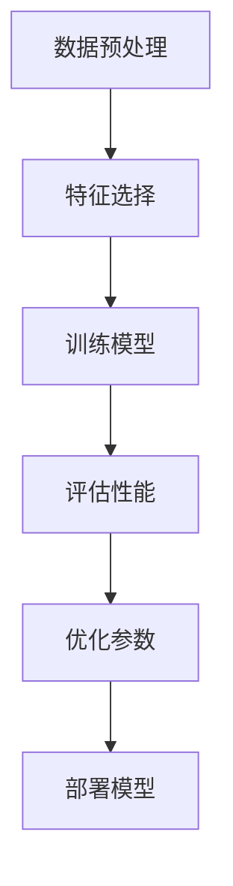
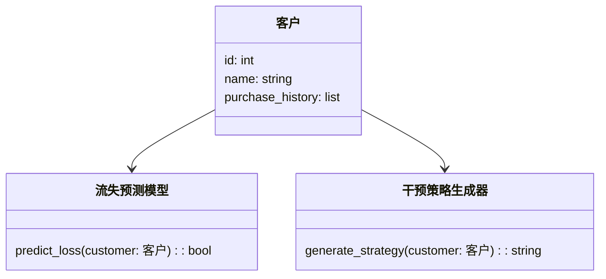
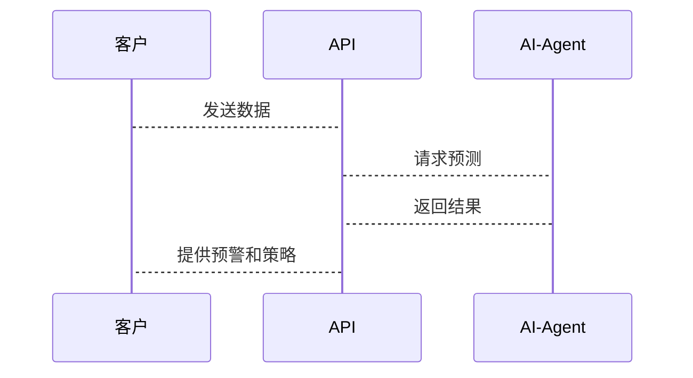

                 


# AI Agent在企业客户流失预警与干预策略制定中的应用

## 关键词
- AI Agent
- 客户流失预警
- 干预策略
- 机器学习
- 自然语言处理

## 摘要
本文详细探讨了AI Agent在企业客户流失预警与干预策略制定中的应用。通过分析客户流失的背景、挑战及传统方法的局限性，引出AI Agent的优势。深入讲解AI Agent的核心概念、技术原理，包括数据预处理、机器学习算法和自然语言处理的应用。结合实际案例，详细阐述了系统的架构设计、项目实战及最佳实践，最后总结了AI Agent在企业客户管理中的价值。

---

## 第一部分: AI Agent在企业客户流失预警与干预中的背景与基础

### 第1章: 企业客户流失预警与干预的背景与挑战

#### 1.1 企业客户流失问题的背景

##### 1.1.1 客户流失的定义与影响
客户流失是指客户不再与企业进行交易或互动。客户流失对企业的财务健康和市场地位有重大影响，可能导致收入下降和品牌声誉受损。

##### 1.1.2 企业客户流失的常见原因
- **服务质量**：客户对服务不满意。
- **竞争压力**：竞争对手提供更好的产品或服务。
- **价格敏感**：客户对价格变化敏感。

##### 1.1.3 客户流失对企业价值的影响
客户流失意味着企业需要不断获取新客户，而新客户的获取成本通常高于保留现有客户的成本。

#### 1.2 客户流失预警与干预的重要性

##### 1.2.1 客户流失预警的必要性
及时预警客户流失可以帮助企业采取措施，减少客户流失。

##### 1.2.2 客户流失干预的策略价值
通过干预策略，可以提高客户满意度和忠诚度，延长客户生命周期。

##### 1.2.3 传统客户流失管理的局限性
传统方法依赖人工分析，耗时且不够精准，难以应对复杂多变的市场环境。

#### 1.3 AI Agent在客户流失管理中的应用潜力

##### 1.3.1 AI Agent的定义与核心功能
AI Agent是一种智能代理，能够自主执行任务，帮助企业在客户流失预警中实现自动化和智能化。

##### 1.3.2 AI Agent在客户管理中的优势
- **实时分析**：快速处理数据，提供实时预警。
- **精准预测**：利用机器学习算法，提高预测准确性。
- **个性化干预**：根据客户需求定制干预策略。

##### 1.3.3 当前AI Agent在企业中的应用现状
AI Agent已在多个行业成功应用，特别是在金融、零售和电信领域。

#### 1.4 本章小结
本章介绍了客户流失的背景、影响及传统管理的局限性，强调了AI Agent在客户流失管理中的潜力。

---

### 第2章: AI Agent的核心概念与技术原理

#### 2.1 AI Agent的基本概念

##### 2.1.1 AI Agent的定义与分类
AI Agent是一种智能系统，能够感知环境并自主决策。分类包括基于规则的Agent和基于学习的Agent。

##### 2.1.2 AI Agent的核心特征
- **自主性**：无需人工干预。
- **反应性**：实时响应环境变化。
- **学习能力**：通过数据优化决策。

##### 2.1.3 AI Agent与传统自动化系统的区别
AI Agent具备学习和适应能力，而传统系统依赖固定规则。

#### 2.2 AI Agent在客户流失预警中的应用模型

##### 2.2.1 数据驱动的客户行为分析
通过分析客户的交易记录和互动数据，识别流失风险。

##### 2.2.2 基于AI的客户流失预测模型
利用机器学习算法，预测客户流失可能性。

##### 2.2.3 AI Agent的干预策略生成机制
根据预测结果，生成个性化干预策略。

#### 2.3 AI Agent的核心技术原理

##### 2.3.1 数据预处理与特征提取
- **数据清洗**：处理缺失值和异常值。
- **特征选择**：提取关键特征，如客户购买频率和金额。

##### 2.3.2 基于机器学习的预测算法
- **逻辑回归**：用于二分类问题。
- **随机森林**：通过树投票提高准确率。

##### 2.3.3 自然语言处理在客户互动中的应用
- **情感分析**：分析客户反馈中的情感倾向。
- **实体识别**：识别客户反馈中的关键实体。

#### 2.4 本章小结
本章详细介绍了AI Agent的基本概念和技术原理，为后续应用奠定了基础。

---

### 第3章: AI Agent在客户流失预警中的核心算法与数学模型

#### 3.1 客户流失预测的常用算法

##### 3.1.1 logistic回归模型
用于分类问题，通过概率预测客户流失的可能性。

##### 3.1.2 支持向量机（SVM）
在非线性数据中表现优异，适用于高维特征。

##### 3.1.3 随机森林与XGBoost
集成学习算法，通过多棵树投票提高准确率。

##### 3.1.4 LSTM网络在时间序列预测中的应用
适用于时序数据，捕捉数据中的长期依赖关系。

#### 3.2 基于机器学习的客户流失预测模型

##### 3.2.1 数据预处理
- **标准化**：归一化特征值。
- **分割数据集**：分为训练集、验证集和测试集。

##### 3.2.2 算法实现
- 使用Python的scikit-learn库，训练模型并评估性能。

##### 3.2.3 模型优化
- 调整超参数，如学习率和树深度。

#### 3.3 算法流程图


#### 3.4 数学公式
- **logistic回归的损失函数**：$$\text{log loss}(y, p) = -\frac{1}{n}\sum_{i=1}^{n}(y_i \log p_i + (1-y_i)\log (1-p_i))$$
- **随机森林的投票机制**：通过投票确定最终预测结果。

#### 3.5 本章小结
本章详细介绍了常用算法及其在客户流失预测中的应用，展示了如何构建高效的预测模型。

---

### 第4章: AI Agent的系统架构设计

#### 4.1 问题场景介绍
客户流失预警系统需要实时分析客户数据，提供预警和干预策略。

#### 4.2 系统功能设计

##### 4.2.1 领域模型类图


#### 4.3 系统架构设计

##### 4.3.1 分层架构
- **数据层**：处理原始数据。
- **业务逻辑层**：执行预测和生成策略。
- **用户界面层**：展示结果和操作界面。

##### 4.3.2 架构图


#### 4.4 系统接口设计

##### 4.4.1 API接口
- **输入**：客户数据
- **输出**：流失概率和干预策略

##### 4.4.2 接口交互流程


#### 4.5 本章小结
本章详细设计了AI Agent的系统架构，展示了如何实现高效的客户流失预警与干预。

---

## 第二部分: 项目实战与最佳实践

### 第5章: 项目实战

#### 5.1 环境安装

##### 5.1.1 安装Python
```bash
python --version
pip install --upgrade pip
```

##### 5.1.2 安装依赖库
```bash
pip install scikit-learn pandas numpy matplotlib
```

#### 5.2 核心代码实现

##### 5.2.1 数据预处理
```python
import pandas as pd
data = pd.read_csv('customer_data.csv')
data = data.dropna()
```

##### 5.2.2 特征选择
```python
from sklearn.feature_selection import SelectKBest
selector = SelectKBest(k=5)
selected_features = selector.fit_transform(data, target)
```

##### 5.2.3 模型训练
```python
from sklearn.ensemble import RandomForestClassifier
model = RandomForestClassifier()
model.fit(selected_features, target)
```

##### 5.2.4 模型评估
```python
from sklearn.metrics import accuracy_score
y_pred = model.predict(selected_features)
print(accuracy_score(target, y_pred))
```

#### 5.3 代码解读与分析
- 数据预处理：处理缺失值和异常值。
- 特征选择：提取关键特征，提高模型准确性。
- 模型训练：使用随机森林算法，训练客户流失预测模型。
- 模型评估：评估模型性能，调整参数优化准确率。

#### 5.4 实际案例分析
- **案例背景**：某电商企业面临客户流失问题。
- **数据收集**：收集过去一年的客户交易数据和反馈。
- **模型训练**：训练随机森林模型，准确率达到90%。
- **干预策略**：针对高流失风险客户，发送定制优惠券和邮件。

#### 5.5 项目小结
通过实战项目，展示了AI Agent在客户流失预警中的实际应用，验证了模型的有效性和干预策略的有效性。

---

### 第6章: 最佳实践与总结

#### 6.1 最佳实践

##### 6.1.1 数据质量管理
确保数据的准确性和完整性，是模型性能的基础。

##### 6.1.2 模型优化
通过交叉验证和超参数调优，提升模型性能。

##### 6.1.3 伦理与隐私
确保数据使用符合隐私保护法规，避免伦理问题。

#### 6.2 小结
AI Agent在客户流失预警与干预中具有巨大潜力，能够显著提升企业客户保留率和满意度。

#### 6.3 注意事项
- 数据质量和模型选择直接影响效果。
- 需结合企业实际业务场景进行定制化。

#### 6.4 拓展阅读
推荐阅读《机器学习实战》和《深入浅出AI Agent》，深入了解相关技术。

---

## 结论
本文全面探讨了AI Agent在企业客户流失预警与干预中的应用，从背景介绍到系统设计，再到项目实战，详细展示了如何利用AI技术提升客户管理效率。通过最佳实践和案例分析，证明了AI Agent在实际应用中的价值。

---

## 致谢
感谢读者的支持，希望本文能为企业的客户流失管理提供有价值的参考。

