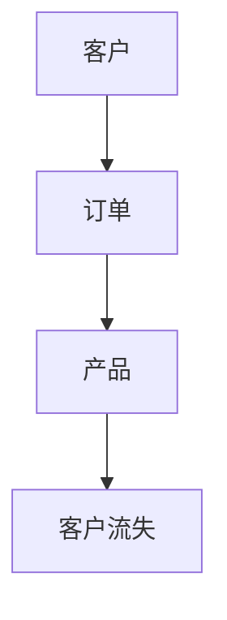
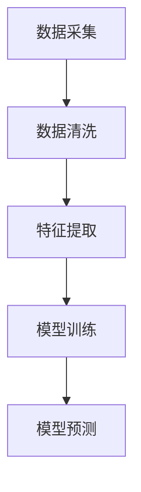

                 


# AI Agent在企业客户流失预警与精准干预中的应用

## 关键词：AI Agent，客户流失预警，精准干预，机器学习，数据挖掘

## 摘要：  
本文详细探讨了AI Agent在企业客户流失预警与精准干预中的应用，从理论基础到实际应用，系统性地分析了AI Agent在客户流失预测中的核心概念、算法原理、系统架构及项目实战。文章通过具体案例和代码实现，深入解析了如何利用AI技术提升客户留存率，为企业制定精准的客户干预策略提供科学依据。

---

# 第1章: 客户流失预警与精准干预的背景与挑战

## 1.1 客户流失的背景与问题描述

### 1.1.1 客户流失对企业的影响  
客户流失是指企业客户因各种原因停止与企业合作或减少使用企业产品/服务的现象。客户流失不仅会导致收入减少，还会增加企业的获客成本。根据相关研究，客户流失率每降低1%，企业的利润可能增加2.5%~3%。因此，客户流失预警与干预是企业运营管理中的重要环节。

### 1.1.2 传统客户流失预警的局限性  
传统客户流失预警方法通常依赖人工经验或简单的统计分析，存在以下问题：  
1. **数据维度单一**：仅依赖销售额或订单量，忽视客户行为数据、产品使用数据等多维信息。  
2. **预测精度低**：基于简单的线性回归或经验判断，难以捕捉复杂客户行为模式。  
3. **干预策略单一**：缺乏个性化的干预措施，难以满足不同客户的实际需求。  

### 1.1.3 AI Agent在客户流失预警中的优势  
AI Agent（人工智能代理）通过整合多源数据、运用机器学习算法，能够实时分析客户行为，预测客户流失风险，并自动触发精准干预措施。其优势包括：  
1. **实时性**：能够实时监测客户行为数据，快速响应客户流失风险。  
2. **精准性**：基于机器学习模型，能够准确预测客户流失概率，制定个性化干预策略。  
3. **自动化**：AI Agent可以自动执行干预措施，如发送优惠券、调整服务策略等。  

---

## 1.2 AI Agent的基本概念与核心功能

### 1.2.1 AI Agent的定义与特点  
AI Agent是一种能够感知环境、自主决策并执行任务的智能系统。在客户流失预警中，AI Agent主要通过以下方式实现功能：  
1. **数据采集**：从CRM系统、用户行为日志等多源数据中获取客户信息。  
2. **特征提取**：从数据中提取关键特征，如客户行为频率、产品使用时长、投诉记录等。  
3. **模型预测**：利用机器学习算法预测客户流失概率。  
4. **干预策略**：根据预测结果，触发个性化干预措施。  

### 1.2.2 AI Agent在客户流失预警中的应用场景  
AI Agent在客户流失预警中的典型应用场景包括：  
1. **零售行业**：通过分析客户的购买频率和金额，预测客户流失风险。  
2. **金融行业**：通过分析客户的交易行为和信用评分，预测客户流失风险。  
3. **通信行业**：通过分析客户的使用时长和费用，预测客户流失风险。  

### 1.2.3 AI Agent的核心功能模块  
AI Agent在客户流失预警中的核心功能模块包括：  
1. **数据采集模块**：负责从多源数据中采集客户信息。  
2. **特征提取模块**：对采集的数据进行特征提取和数据清洗。  
3. **模型预测模块**：利用机器学习算法预测客户流失概率。  
4. **干预策略模块**：根据预测结果，制定并执行干预措施。  

---

## 1.3 本章小结  
本章主要介绍了客户流失预警的重要性、传统方法的局限性以及AI Agent的优势。通过分析AI Agent的基本概念和核心功能，为后续章节的算法实现和系统设计奠定了基础。

---

# 第2章: AI Agent在客户流失预警中的核心概念与联系

## 2.1 AI Agent的核心概念原理

### 2.1.1 数据采集与特征提取  
数据采集是AI Agent的第一步，主要从以下渠道获取数据：  
1. **CRM系统**：客户的基本信息、交易记录等。  
2. **用户行为日志**：客户的访问频率、停留时长等行为数据。  
3. **产品使用数据**：客户对产品的使用情况，如功能使用频率、使用时长等。  

特征提取是数据预处理的关键步骤，通常包括以下操作：  
1. **数据清洗**：去除缺失值、异常值。  
2. **特征选择**：通过统计分析或机器学习方法选择重要特征。  
3. **特征工程**：对特征进行标准化、归一化处理，或添加新特征。  

### 2.1.2 模型训练与预测  
模型训练是AI Agent的核心环节，常用的算法包括：  
1. **逻辑回归（Logistic Regression）**：用于分类任务，预测客户流失概率。  
2. **随机森林（Random Forest）**：用于特征重要性分析和分类预测。  
3. **XGBoost**：一种高效的梯度提升算法，适合处理复杂的数据关系。  

### 2.1.3 预警与干预策略  
根据模型预测结果，AI Agent可以触发以下干预措施：  
1. **主动联系客户**：通过邮件、短信或电话通知客户，表达关怀或提供优惠。  
2. **个性化推荐**：根据客户特征推荐符合其需求的产品或服务。  
3. **调整服务策略**：如延长试用期、降低价格等。  

---

## 2.2 核心概念属性特征对比表

| 概念 | 属性 | 特征 |
|------|------|------|
| 数据采集 | 数据来源 | CRM系统、用户行为数据 |
| 特征提取 | 特征类型 | 用户行为特征、产品特征、服务特征 |
| 模型训练 | 算法选择 | 分类算法、回归算法 |

---

## 2.3 ER实体关系图（Mermaid流程图）



---

## 2.4 本章小结  
本章详细阐述了AI Agent在客户流失预警中的核心概念与原理，通过对比表和流程图直观展示了系统的核心模块及其关系，为后续章节的算法实现和系统设计奠定了基础。

---

# 第3章: AI Agent的算法原理与实现

## 3.1 客户流失预测算法原理

### 3.1.1 数据预处理与特征工程  
数据预处理是模型训练的前提，主要包括以下步骤：  
1. **数据清洗**：去除缺失值、异常值。  
2. **特征选择**：通过相关系数分析或Lasso回归选择重要特征。  
3. **特征工程**：对特征进行标准化、归一化处理，或添加新特征（如时间特征）。  

### 3.1.2 模型训练与调优  
模型训练是AI Agent的核心环节，常用算法包括：  
1. **逻辑回归**：用于分类任务，预测客户流失概率。  
2. **随机森林**：用于特征重要性分析和分类预测。  
3. **XGBoost**：一种高效的梯度提升算法，适合处理复杂的数据关系。  

模型调优包括参数优化和模型评估，常用的评估指标包括准确率、召回率、F1分数等。  

### 3.1.3 模型评估与优化  
模型评估是确保模型性能的关键步骤，常用的评估方法包括：  
1. **交叉验证**：通过K折交叉验证评估模型的泛化能力。  
2. **混淆矩阵**：通过混淆矩阵分析模型的分类性能。  
3. **AUC-ROC曲线**：评估模型的区分能力。  

---

## 3.2 算法实现流程图（Mermaid）



---

## 3.3 算法实现代码示例

### 3.3.1 数据预处理

```python
import pandas as pd
from sklearn.preprocessing import StandardScaler

# 加载数据
df = pd.read_csv('customer_data.csv')

# 去除缺失值
df.dropna(inplace=True)

# 标准化处理
scaler = StandardScaler()
df[['feature1', 'feature2']] = scaler.fit_transform(df[['feature1', 'feature2']])
```

### 3.3.2 模型训练

```python
from sklearn.model import LogisticRegression

# 初始化模型
model = LogisticRegression()

# 训练模型
model.fit(X_train, y_train)

# 预测结果
y_pred = model.predict(X_test)
```

---

## 3.4 数学模型与公式

### 3.4.1 客户流失概率模型

客户流失概率可以用逻辑回归模型表示：

$$ P(y=1) = \frac{1}{1 + e^{-\beta_0 - \beta_1x_1 - \beta_2x_2}} $$

其中，$y$ 表示客户是否流失（$y=1$ 表示流失，$y=0$ 表示未流失），$x_1, x_2$ 表示特征变量，$\beta_0, \beta_1, \beta_2$ 表示模型参数。

### 3.4.2 模型损失函数

逻辑回归的损失函数为：

$$ L(\theta) = -\frac{1}{m} \sum_{i=1}^{m} \left[ y_i \ln(h(x_i)) + (1 - y_i) \ln(1 - h(x_i)) \right] $$

其中，$h(x_i) = \frac{1}{1 + e^{-\theta^T x_i}}$，$\theta$ 表示模型参数，$m$ 表示样本数量。

---

## 3.5 本章小结  
本章详细阐述了AI Agent在客户流失预测中的算法原理与实现过程，通过代码示例和数学公式展示了模型的训练与优化过程，为后续章节的系统设计奠定了基础。

---

接下来的章节将围绕系统架构设计、项目实战及最佳实践展开，具体内容将在后续更新中呈现。

