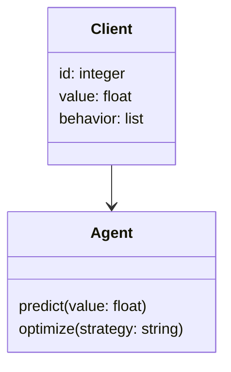
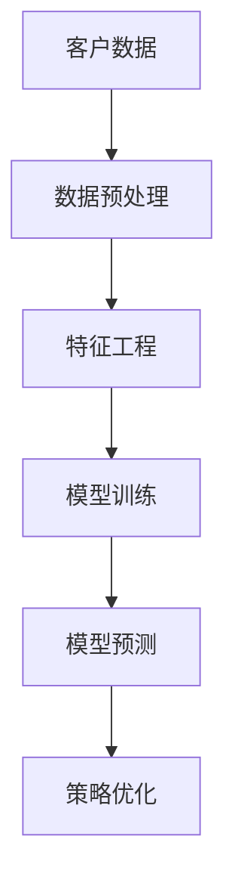
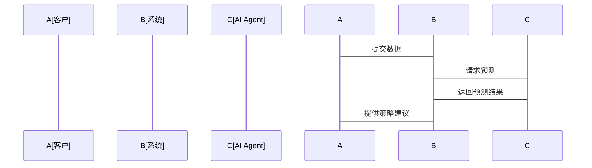

                 


# AI Agent在企业客户生命周期价值预测与管理中的应用

## 关键词：AI Agent, 客户生命周期价值, 企业客户管理, 强化学习, 数据分析

## 摘要：
本文探讨了AI Agent在企业客户生命周期价值预测与管理中的应用。通过介绍AI Agent的基本概念、算法原理、系统架构设计以及实际项目案例，详细阐述了如何利用AI Agent技术提升客户价值预测的准确性和管理效率。文章结合理论与实践，为读者提供了一个全面了解AI Agent在企业客户管理中的应用框架。

---

# 第一部分: AI Agent与客户生命周期价值预测概述

## 第1章: AI Agent与客户生命周期价值预测的背景与概念

### 1.1 什么是AI Agent
#### 1.1.1 AI Agent的定义
AI Agent（人工智能代理）是指能够感知环境并采取行动以实现目标的智能实体。它能够通过数据输入、模型训练和决策优化，帮助企业在复杂环境中做出更高效的决策。

#### 1.1.2 AI Agent的核心特征
| 核心特征 | 描述 |
|----------|------|
| 智能性 | 能够自主学习和优化决策 |
| 适应性 | 能够根据环境变化调整策略 |
| 可交互性 | 能够与人类或其他系统进行交互 |

#### 1.1.3 AI Agent与传统算法的区别
| 特性       | AI Agent             | 传统算法             |
|------------|----------------------|----------------------|
| 自主性      | 高                   | 低                   |
| 学习能力    | 强                   | 无/弱               |
| 决策能力    | 强                   | 依赖规则或经验       |

### 1.2 客户生命周期价值预测的定义与重要性
#### 1.2.1 客户生命周期价值的定义
客户生命周期价值（Customer Lifetime Value, CLV）是指一个客户在其生命周期内为企业带来的总收入减去相关成本。CLV的预测帮助企业更好地制定客户管理策略。

#### 1.2.2 客户生命周期价值预测的重要性
1. **精准营销**：通过预测客户价值，企业可以制定个性化的营销策略。
2. **客户分层管理**：根据客户价值分层，企业能够更高效地分配资源。
3. **风险控制**：预测客户流失风险，提前采取措施降低客户流失率。

#### 1.2.3 企业客户管理中的挑战与机遇
- **挑战**：数据复杂性、模型准确性、实时性要求高。
- **机遇**：通过AI技术提升预测精度，优化客户管理流程。

### 1.3 AI Agent在客户生命周期价值预测中的应用
#### 1.3.1 AI Agent的基本原理
AI Agent通过感知环境、分析数据、制定策略并执行行动来优化目标。在客户价值预测中，AI Agent可以实时分析客户行为数据，预测客户价值并调整营销策略。

#### 1.3.2 AI Agent在客户价值预测中的优势
- **实时性**：能够实时分析数据并做出决策。
- **自适应性**：能够根据市场变化自动调整预测模型。
- **高效性**：通过强化学习算法，提升预测准确率。

#### 1.3.3 AI Agent与企业客户管理的结合
AI Agent可以嵌入企业客户管理系统中，实时监控客户行为，预测客户价值，并根据预测结果优化客户管理策略。

---

# 第二部分: AI Agent的核心算法与数学模型

## 第2章: AI Agent的核心算法原理

### 2.1 强化学习的基本原理
#### 2.1.1 强化学习的定义与特点
强化学习（Reinforcement Learning, RL）是一种通过试错方式学习策略的方法。AI Agent通过与环境交互，获得奖励或惩罚，从而优化决策策略。

#### 2.1.2 强化学习的核心要素：状态、动作、奖励
- **状态（State）**：环境的当前情况，例如客户的行为数据。
- **动作（Action）**：AI Agent采取的行动，例如发送营销邮件。
- **奖励（Reward）**：行动的结果，例如客户点击邮件的概率。

#### 2.1.3 Q-learning算法的实现原理
Q-learning是一种常用的强化学习算法，通过更新Q值表来优化决策策略。数学公式如下：
$$ Q(s, a) = Q(s, a) + \alpha [r + \gamma \max Q(s', a') - Q(s, a)] $$

### 2.2 AI Agent的决策树算法
#### 2.2.1 决策树的定义与特点
决策树是一种树状结构，用于分类或回归问题。AI Agent可以通过决策树分析客户行为，预测客户价值。

#### 2.2.2 ID3算法与信息增益
ID3算法通过计算信息增益选择最优特征进行分类。信息增益公式为：
$$ \text{信息增益} = \text{熵}(S) - \text{期望熵}(S, A) $$

#### 2.2.3 决策树在客户价值预测中的应用
通过决策树算法，企业可以将客户分为不同的价值层级，制定相应的管理策略。

### 2.3 随机森林与集成学习
#### 2.3.1 随机森林的定义与特点
随机森林是一种基于决策树的集成学习方法，通过构建多棵决策树并进行投票或平均，提升模型的准确性和稳定性。

#### 2.3.2 集成学习的基本原理
集成学习通过将多个弱分类器的结果进行整合，提升整体性能。常用方法包括袋装法（Bagging）和提升法（Boosting）。

#### 2.3.3 随机森林在客户价值预测中的应用
随机森林能够处理高维数据，适合客户价值预测中的复杂场景。

---

# 第三部分: 客户生命周期价值预测的数学模型与算法实现

## 第3章: 客户生命周期价值预测的数学模型

### 3.1 线性回归模型
#### 3.1.1 线性回归的定义与特点
线性回归是一种简单而有效的回归分析方法，适用于线性关系的数据。

#### 3.1.2 线性回归的数学公式
$$ y = \beta_0 + \beta_1x + \epsilon $$

#### 3.1.3 线性回归在客户价值预测中的应用
通过线性回归模型，企业可以预测客户的基本价值趋势。

### 3.2 逻辑回归模型
#### 3.2.1 逻辑回归的定义与特点
逻辑回归是一种用于分类问题的统计方法，适用于二分类或多分类场景。

#### 3.2.2 逻辑回归的数学公式
$$ P(y=1|x) = \frac{e^{\beta_0 + \beta_1x}}{1 + e^{\beta_0 + \beta_1x}} $$

#### 3.2.3 逻辑回归在客户价值预测中的应用
通过逻辑回归模型，企业可以预测客户流失的概率。

### 3.3 随机森林模型
#### 3.3.1 随机森林的定义与特点
随机森林是一种基于决策树的集成学习方法，适用于高维数据和复杂场景。

#### 3.3.2 随机森林的数学公式
$$ y = \text{median}(\{f_i(x)\}) $$

#### 3.3.3 随机森林在客户价值预测中的应用
通过随机森林模型，企业可以实现高精度的客户价值预测。

---

## 第4章: AI Agent在客户生命周期价值预测中的系统架构设计

### 4.1 系统功能设计
#### 4.1.1 领域模型类图


#### 4.1.2 系统架构图


### 4.2 系统接口设计
- **输入接口**：客户行为数据、历史交易记录。
- **输出接口**：客户价值预测结果、优化策略建议。

### 4.3 系统交互序列图


---

## 第5章: 项目实战——基于AI Agent的客户价值预测系统

### 5.1 环境安装
- **工具安装**：Python 3.8+, scikit-learn, TensorFlow, Pandas。
- **数据准备**：收集客户行为数据、交易记录等。

### 5.2 系统核心实现源代码
#### 5.2.1 数据预处理
```python
import pandas as pd

# 读取数据
data = pd.read_csv('customer_data.csv')

# 去除缺失值
data.dropna(inplace=True)

# 标准化处理
from sklearn.preprocessing import StandardScaler
scaler = StandardScaler()
data_scaled = scaler.fit_transform(data)
```

#### 5.2.2 特征工程
```python
from sklearn.ensemble import RandomForestClassifier

# 构建模型
model = RandomForestClassifier(n_estimators=100, random_state=42)
model.fit(X_train, y_train)
```

#### 5.2.3 模型训练与部署
```python
import tensorflow as tf
from tensorflow.keras import layers

# 构建强化学习模型
model = tf.keras.Sequential([
    layers.Dense(64, activation='relu'),
    layers.Dense(1, activation='sigmoid')
])

model.compile(optimizer='adam', loss='binary_crossentropy')
model.fit(X_train, y_train, epochs=10, batch_size=32)
```

### 5.3 实际案例分析
以电商行业为例，通过AI Agent预测客户价值，优化营销策略。

---

## 第6章: 总结与展望

### 6.1 本章小结
本文详细介绍了AI Agent在客户生命周期价值预测中的应用，包括算法原理、系统架构设计和实际案例分析。

### 6.2 未来发展方向
- **模型优化**：探索更高效的强化学习算法。
- **多模态数据融合**：结合文本、图像等多种数据源提升预测精度。
- **实时性提升**：优化系统架构，提高实时响应能力。

### 6.3 最佳实践 tips
- 数据质量是预测模型的基础，需确保数据的完整性和准确性。
- 模型部署后需持续监控，定期更新以适应环境变化。
- 在实际应用中，结合业务需求选择合适的AI Agent算法。

---

通过本文的系统介绍，读者可以全面了解AI Agent在客户生命周期价值预测中的应用，并能够将其应用于实际的企业管理中。

