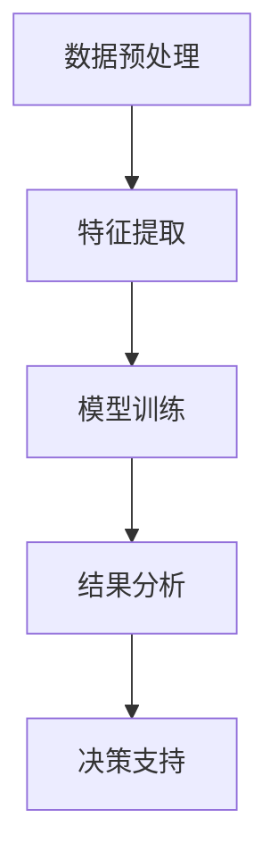
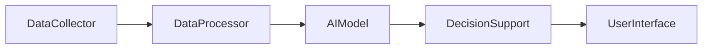

                 


```markdown
# AI Agent在企业客户画像与细分中的应用

> 关键词：AI Agent，客户画像，客户细分，数据驱动决策，智能分析

> 摘要：本文探讨了AI Agent在企业客户画像与细分中的应用，详细分析了其核心概念、算法原理、系统架构，并通过项目实战展示了如何利用AI Agent提升客户分析效率和准确性。文章内容涵盖了从理论到实践的各个方面，旨在为读者提供全面的指导。

---

# 第一部分: 背景介绍

## 第1章: 问题背景

### 1.1 传统客户分析的局限性
- 传统客户分析依赖人工处理，效率低且容易出错
- 数据孤岛问题导致信息不全面
- 客户需求变化快，传统方法难以实时响应

### 1.2 数据驱动决策的重要性
- 数据是企业决策的核心依据
- 利用数据可以精准识别客户需求
- 数据驱动决策能够提高企业运营效率

### 1.3 AI Agent在客户分析中的优势
- 自动化处理数据，提升效率
- 实时分析，快速响应客户需求
- 多维度分析，提高客户画像的准确性

## 第2章: 问题描述

### 2.1 客户画像的核心目标
- 描述客户的基本特征和行为模式
- 发现客户群体中的潜在规律
- 为精准营销提供数据支持

### 2.2 客户细分的挑战与需求
- 如何有效区分不同客户群体
- 如何动态调整客户细分策略
- 如何确保客户细分的准确性和实时性

### 2.3 AI Agent的应用场景
- 客户数据的智能采集与处理
- 客户行为的实时分析与预测
- 客户分群的自动化与优化

## 第3章: 问题解决方法

### 3.1 AI Agent的基本概念
- 定义：AI Agent是具有感知和决策能力的智能体
- 特性：自主性、反应性、目标导向
- 应用：数据处理、模式识别、决策支持

### 3.2 数据采集与处理技术
- 数据源：CRM系统、社交媒体、网站日志
- 数据清洗：处理缺失值、异常值
- 数据预处理：标准化、特征提取

### 3.3 智能分析与决策支持
- 机器学习算法：聚类、分类、回归
- 自然语言处理：情感分析、实体识别
- 可视化工具：数据仪表盘、图表展示

## 第4章: 边界与外延

### 4.1 AI Agent的适用范围
- 适用于数据量大、复杂度高的客户分析场景
- 适用于需要实时响应的动态客户分析
- 适用于多渠道、多维度的客户细分需求

### 4.2 与其他技术的区分
- 区分于传统数据分析工具的自动化与智能化
- 区分于规则引擎的灵活性和自适应性
- 区分于其他AI技术的应用场景和目标

### 4.3 应用中的潜在风险与伦理问题
- 数据隐私泄露的风险
- 算法偏见可能导致的不公正结果
- 依赖AI Agent可能带来的决策依赖风险

## 第5章: 核心概念与组成

### 5.1 AI Agent的定义与分类
- 定义：AI Agent是具有感知环境、目标导向、自主决策能力的智能体
- 分类：基于任务类型、智能水平、应用领域

### 5.2 客户画像的构建要素
- 客户基本信息：年龄、性别、职业
- 客户行为数据：购买记录、浏览行为、点击率
- 客户反馈数据：满意度调查、投诉记录

### 5.3 客户细分的标准与方法
- 标准：客户价值、购买习惯、消费能力
- 方法：聚类分析、决策树、K均值聚类

---

# 第二部分: 核心概念与联系

## 第6章: AI Agent的核心原理

### 6.1 核心概念原理
- 数据处理：AI Agent能够自动采集和清洗数据
- 智能分析：基于机器学习算法进行模式识别
- 决策支持：根据分析结果提供个性化建议

### 6.2 属性特征对比表格
| 特性           | 传统客户分析 | AI Agent驱动的客户分析 |
|----------------|--------------|------------------------|
| 数据处理速度   | 较慢         | 快                     |
| 分析深度       | 较浅         | 深                     |
| 自动化程度     | 低           | 高                     |

### 6.3 ER实体关系图
```mermaid
er
    Customer: id, name, age, gender, location
    CustomerBehavior: id, customerId, timestamp, action
    CustomerPreference: id, customerId, category, preferenceLevel
    AIModel: modelId, modelName, description
    TrainingData: dataId, modelId, datasetPath
```

---

# 第三部分: 算法原理讲解

## 第7章: 算法流程与实现

### 7.1 算法流程图


### 7.2 算法实现代码
```python
def customer_segmentation(data):
    # 数据预处理
    processed_data = preprocess(data)
    # 特征提取
    features = extract_features(processed_data)
    # 模型训练
    model = train_model(features)
    # 预测与分析
    predictions = model.predict(features)
    return predictions
```

### 7.3 数学模型与公式
- 聚类分析公式：
  $$ \text{距离} = \sqrt{(x_i - x_j)^2 + (y_i - y_j)^2} $$
- K均值聚类算法：
  1. 初始化K个中心点
  2. 计算每个数据点到中心点的距离
  3. 将数据点归类到最近的中心点
  4. 更新中心点
  5. 重复步骤2-4直到收敛

---

# 第四部分: 系统分析与架构设计

## 第8章: 系统架构设计

### 8.1 系统功能设计
- 数据采集模块：负责收集客户数据
- 数据处理模块：清洗和预处理数据
- 智能分析模块：运行机器学习算法
- 决策支持模块：提供分析结果和建议

### 8.2 系统架构图


### 8.3 接口设计与交互流程
- API接口：RESTful API
- 交互流程：
  1. 用户提交请求
  2. 系统接收并处理数据
  3. 返回分析结果

---

# 第五部分: 项目实战

## 第9章: 项目实施与案例分析

### 9.1 环境安装
- 安装Python、机器学习库（如scikit-learn、TensorFlow）

### 9.2 核心代码实现
```python
from sklearn.cluster import KMeans
import pandas as pd

# 数据加载
data = pd.read_csv('customer_data.csv')

# 特征提取
features = data[['age', 'income', 'purchase_frequency']]

# 模型训练
model = KMeans(n_clusters=5, random_state=42)
model.fit(features)

# 结果分析
labels = model.labels_
print(labels)
```

### 9.3 案例分析与结果解读
- 案例背景：一家零售企业的客户数据分析
- 模型选择：K均值聚类
- 分析结果：将客户分为5个群体，每个群体具有不同的特征

---

# 第六部分: 小结与注意事项

## 第10章: 总结与优化建议

### 10.1 项目小结
- 成功实现了AI Agent驱动的客户画像与细分
- 提高了客户分析的效率和准确性

### 10.2 注意事项
- 数据隐私保护的重要性
- 模型的可解释性和透明度
- 持续优化和更新模型

### 10.3 拓展阅读
- 推荐书籍：《机器学习实战》
- 推荐博客：AI与大数据技术博客

---

# 附录: 参考文献与工具

## 附录A: 参考文献
- [1] 周志华. 机器学习[M]. 清华大学出版社, 2016.
- [2] Goodfellow I, Bengio Y, Courville A. Deep Learning[M]. MIT Press, 2016.

## 附录B: 开源工具
- scikit-learn：机器学习库
- TensorFlow：深度学习框架
- Mermaid：图表工具

---

# 结束语

通过本文的详细讲解，读者可以全面了解AI Agent在企业客户画像与细分中的应用。从理论到实践，结合实际案例分析，为读者提供了深入的指导。希望本文能够帮助企业在客户分析中更好地应用AI技术，提升竞争力。
```

