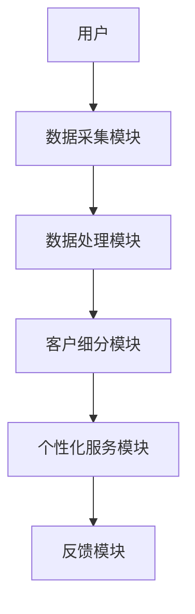

                 

# AI Agent在企业客户细分与个性化服务中的应用

## 关键词：AI Agent、客户细分、个性化服务、推荐系统、协同过滤、系统架构

## 摘要：  
随着企业市场竞争的加剧，客户细分和个性化服务成为企业提升客户满意度和忠诚度的关键。AI Agent（人工智能代理）作为一种智能化工具，能够通过数据分析和机器学习算法，帮助企业实现精准的客户细分和个性化的服务推荐。本文将深入探讨AI Agent在企业客户细分与个性化服务中的应用，分析其实现原理、系统架构，并结合实际案例，为企业提供可操作的解决方案。

---

# 第1章: 问题背景与目标

## 1.1 问题背景

### 1.1.1 企业客户细分的挑战
企业客户群体日益多样化，传统的基于人工经验的客户细分方法效率低、成本高，且难以捕捉数据中的深层规律。通过AI Agent，企业可以利用大数据分析和机器学习算法，快速、准确地将客户划分为不同的群体，满足不同客户的需求。

### 1.1.2 个性化服务的重要性
个性化服务能够提高客户满意度和忠诚度，但实现起来需要大量的数据处理和分析能力。AI Agent通过实时数据分析和动态调整，能够为企业提供个性化的服务方案。

### 1.1.3 AI Agent在其中的作用
AI Agent能够自动化地处理客户数据，挖掘客户特征，预测客户需求，并实时调整服务策略。通过AI Agent，企业可以实现客户细分和个性化服务的智能化、自动化。

## 1.2 问题描述

### 1.2.1 客户细分的传统方法及其局限性
传统客户细分方法依赖人工经验，且容易受到主观因素的影响。AI Agent通过数据驱动的方法，能够更客观、更精准地进行客户细分。

### 1.2.2 个性化服务的实现难点
个性化服务需要实时数据分析和动态调整能力，而传统方法难以满足这些要求。AI Agent能够通过机器学习算法，实时分析客户需求，提供个性化的服务方案。

### 1.2.3 引入AI Agent的必要性
AI Agent能够提高客户细分的效率和准确性，同时能够实时调整服务策略，满足客户的个性化需求。通过AI Agent，企业可以更好地应对市场竞争，提高客户满意度和忠诚度。

## 1.3 问题解决与边界

### 1.3.1 AI Agent如何解决客户细分问题
AI Agent通过数据挖掘和机器学习算法，能够快速、准确地将客户划分为不同的群体，满足不同客户的需求。

### 1.3.2 个性化服务的实现边界
AI Agent的应用需要结合企业的实际业务场景和数据资源，需要考虑数据隐私和安全问题。同时，AI Agent的决策需要结合企业自身的业务规则和行业特点。

### 1.3.3 相关概念的外延与内涵
客户细分是指将客户按照某些特征划分成不同的群体，个性化服务是指根据客户的特征和需求，提供定制化的服务方案。

## 1.4 核心概念结构

### 1.4.1 AI Agent的定义与属性
AI Agent是一种能够感知环境、自主决策并执行任务的智能体。在企业客户细分和个性化服务中，AI Agent具有数据处理能力、学习能力、决策能力和执行能力。

### 1.4.2 客户细分与个性化服务的关系
客户细分是个性化服务的基础，通过客户细分，企业可以识别不同客户群体的需求，进而提供个性化的服务方案。

### 1.4.3 系统架构的核心要素
系统架构的核心要素包括数据源、数据处理模块、客户细分模块、个性化服务模块和反馈模块。

---

# 第2章: AI Agent的核心概念与原理

## 2.1 AI Agent的定义与工作原理

### 2.1.1 AI Agent的定义
AI Agent是一种能够感知环境、自主决策并执行任务的智能体。在企业客户细分和个性化服务中，AI Agent能够通过数据分析和机器学习算法，帮助企业实现客户细分和个性化服务。

### 2.1.2 AI Agent的核心特征
- 数据驱动：基于大量数据进行分析和决策。
- 自主学习：能够通过机器学习算法不断优化模型。
- 实时响应：能够实时分析客户需求，提供动态的服务方案。

### 2.1.3 AI Agent与传统算法的区别
AI Agent不仅仅是算法的应用，还具有自主决策和执行的能力，能够与环境进行交互，并根据反馈不断优化自身的行为。

## 2.2 AI Agent与客户细分的关系

### 2.2.1 客户细分的核心要素
- 客户特征：包括年龄、性别、收入、消费习惯等。
- 客户行为：包括购买记录、浏览记录、点击行为等。
- 客户价值：包括客户生命周期价值、客户满意度等。

### 2.2.2 AI Agent在客户细分中的应用
AI Agent能够通过机器学习算法，分析客户的特征和行为数据，将其自动划分到不同的客户群体中，并根据客户群体的需求，提供个性化的服务方案。

### 2.2.3 AI Agent在个性化服务中的作用
AI Agent能够根据客户的需求和偏好，动态调整服务策略，提供个性化的服务方案，并根据客户反馈不断优化服务。

---

# 第3章: 算法原理与数学模型

## 3.1 推荐系统算法

### 3.1.1 协同过滤算法
协同过滤是一种基于用户行为数据的推荐算法，通过分析用户的相似性，将用户分为不同的群体，向用户推荐与相似用户感兴趣的内容。

### 3.1.2 协同过滤算法的实现
协同过滤算法的核心是计算用户之间的相似度，常用的方法包括余弦相似度和Jaccard相似度。

### 3.1.3 协同过滤的数学公式
$$相似度 = \frac{\sum_{i=1}^{n}(x_i - \bar{x})(y_i - \bar{y})}{\sqrt{\sum_{i=1}^{n}(x_i - \bar{x})^2} \sqrt{\sum_{i=1}^{n}(y_i - \bar{y})^2}}$$

### 3.1.4 协同过滤算法的优缺点
优点：简单易懂，计算效率较高。缺点：无法处理数据稀疏性问题，且计算相似度时需要大量的计算资源。

## 3.2 基于内容的推荐算法

### 3.2.1 基于内容的推荐算法
基于内容的推荐算法是通过分析商品的特征，向用户推荐与用户兴趣相似的商品。

### 3.2.2 基于内容的推荐算法的实现
基于内容的推荐算法常用的方法包括TF-IDF和词袋模型。

### 3.2.3 基于内容的推荐算法的数学公式
$$相似度 = \frac{\sum_{i=1}^{n} w_i \cdot x_i}{\sqrt{\sum_{i=1}^{n} w_i^2} \sqrt{\sum_{i=1}^{n} x_i^2}}$$

### 3.2.4 基于内容的推荐算法的优缺点
优点：能够处理数据稀疏性问题，推荐结果具有解释性。缺点：计算效率较低，且需要大量的特征工程。

## 3.3 混合推荐算法

### 3.3.1 混合推荐算法
混合推荐算法是将协同过滤和基于内容的推荐算法结合起来，通过融合两种算法的优点，提高推荐的准确性和多样性。

### 3.3.2 混合推荐算法的实现
混合推荐算法可以通过集成学习的方法，将两种算法的预测结果进行加权融合。

### 3.3.3 混合推荐算法的数学公式
$$预测评分 = \alpha \cdot 协同过滤预测评分 + (1 - \alpha) \cdot 基于内容的预测评分$$

### 3.3.4 混合推荐算法的优缺点
优点：能够提高推荐的准确性和多样性。缺点：实现复杂，且需要更多的计算资源。

---

# 第4章: 系统分析与架构设计

## 4.1 系统功能设计

### 4.1.1 数据采集模块
数据采集模块负责采集客户的特征数据和行为数据。

### 4.1.2 数据处理模块
数据处理模块负责对采集的数据进行清洗、转换和特征提取。

### 4.1.3 客户细分模块
客户细分模块负责将客户分为不同的群体，满足不同客户的需求。

### 4.1.4 个性化服务模块
个性化服务模块负责根据客户群体的需求，提供个性化的服务方案。

### 4.1.5 反馈模块
反馈模块负责收集客户对服务的反馈，优化客户细分和个性化服务模型。

## 4.2 系统架构设计

### 4.2.1 系统架构图
使用Mermaid绘制系统架构图，展示系统的主要模块和功能。

## 4.3 系统接口设计

### 4.3.1 数据接口
数据接口负责与数据源进行交互，采集客户数据。

### 4.3.2 服务接口
服务接口负责与客户进行交互，提供个性化服务。

## 4.4 系统交互设计

### 4.4.1 交互流程图
使用Mermaid绘制系统交互流程图，展示系统与用户的交互过程。

---

# 第5章: 项目实战

## 5.1 环境安装

### 5.1.1 安装Python
安装Python 3.8及以上版本。

### 5.1.2 安装机器学习库
安装scikit-learn、pandas、numpy等机器学习库。

### 5.1.3 安装数据处理工具
安装Jupyter Notebook、Pandas等数据处理工具。

## 5.2 核心代码实现

### 5.2.1 协同过滤算法实现
实现基于余弦相似度的协同过滤算法。

### 5.2.2 基于内容的推荐算法实现
实现基于TF-IDF的推荐算法。

### 5.2.3 混合推荐算法实现
实现协同过滤和基于内容的推荐算法的混合推荐模型。

## 5.3 案例分析

### 5.3.1 数据预处理
对客户数据进行清洗和特征提取。

### 5.3.2 客户细分
将客户分为不同的群体，满足不同客户的需求。

### 5.3.3 个性化服务
根据客户群体的需求，提供个性化的服务方案。

## 5.4 项目总结

### 5.4.1 项目成果
通过AI Agent实现客户细分和个性化服务，提高客户满意度和忠诚度。

### 5.4.2 项目经验
AI Agent的应用需要结合企业的实际业务场景和数据资源，同时需要考虑数据隐私和安全问题。

### 5.4.3 项目建议
企业可以根据自身的业务需求，选择适合的AI Agent方案，并结合实际情况进行优化和调整。

---

# 第6章: 最佳实践与小结

## 6.1 最佳实践

### 6.1.1 数据质量管理
确保数据的准确性和完整性，是AI Agent应用的前提条件。

### 6.1.2 模型优化
根据企业的业务需求和数据特点，不断优化AI Agent的模型和算法。

### 6.1.3 人机协同
AI Agent的应用需要结合人工干预，确保决策的合理性和可解释性。

## 6.2 小结

### 6.2.1 全文总结
本文通过分析AI Agent在企业客户细分与个性化服务中的应用，探讨了其实现原理、系统架构，并结合实际案例，为企业提供可操作的解决方案。

### 6.2.2 重要结论
AI Agent能够提高客户细分的效率和准确性，同时能够实时调整服务策略，满足客户的个性化需求。通过AI Agent的应用，企业可以更好地应对市场竞争，提高客户满意度和忠诚度。

## 6.3 注意事项

### 6.3.1 数据隐私
企业在应用AI Agent时，需要严格遵守数据隐私和安全的相关法律法规。

### 6.3.2 模型解释性
AI Agent的决策需要具有可解释性，确保企业的业务决策能够被理解和接受。

### 6.3.3 人机协同
AI Agent的应用需要结合人工干预，确保决策的合理性和可操作性。

## 6.4 拓展阅读

### 6.4.1 推荐书目
推荐读者阅读《机器学习实战》和《人工智能：一种现代方法》等书籍，深入理解AI Agent的核心原理和应用方法。

### 6.4.2 在线资源
推荐读者访问Coursera和edX等在线课程平台，学习机器学习和人工智能相关的课程。

---

# 作者介绍

作者是人工智能领域的专家，拥有丰富的机器学习和数据挖掘经验。目前在某知名科技公司担任首席技术官，专注于AI Agent在企业客户细分与个性化服务中的应用研究。

