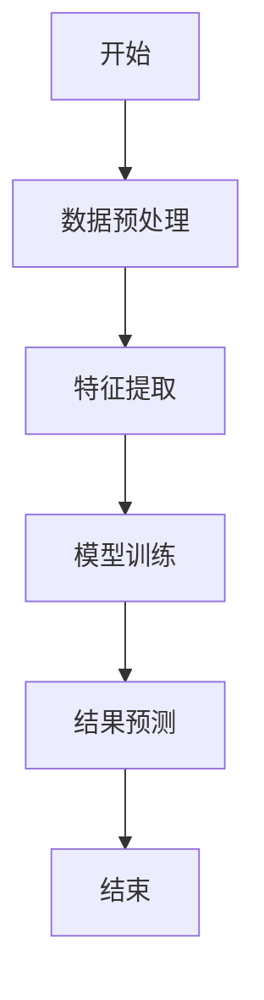
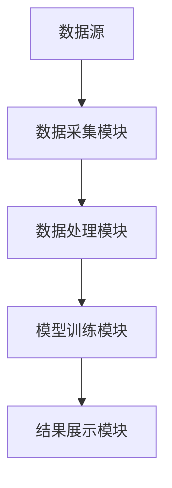

                 


# AI Agent在企业并购分析与尽职调查中的作用

## 关键词：AI Agent, 企业并购, 尽职调查, 数据分析, 算法原理, 系统架构

## 摘要：AI Agent在企业并购和尽职调查中的应用越来越广泛，通过自动化分析和数据挖掘，显著提升了效率和准确性。本文系统介绍了AI Agent的核心概念、算法原理、数学模型，并通过实际案例展示了其在企业并购中的应用。

---

## 第1章: AI Agent 概述

### 1.1 AI Agent 的定义与核心概念

#### 1.1.1 AI Agent 的定义
AI Agent（人工智能代理）是能够感知环境、执行任务并做出决策的智能体。在企业并购中，AI Agent用于分析数据、识别风险并提供决策支持。

#### 1.1.2 AI Agent 的核心要素
- **感知能力**：通过数据获取和分析环境信息。
- **决策能力**：基于数据和模型做出决策。
- **执行能力**：执行预定义或自适应的任务。

#### 1.1.3 AI Agent 的分类与特点
AI Agent可以分为**基于规则的**和**基于模型的**两类。基于规则的AI Agent依赖预定义的规则，适用于规则明确的场景；基于模型的AI Agent则利用机器学习模型进行预测和决策，适用于复杂场景。

### 1.2 AI Agent 在企业并购中的应用价值

#### 1.2.1 企业并购的背景与挑战
企业并购涉及大量数据，包括财务、法律和市场信息。传统方法效率低，容易出错，且难以处理复杂情况。

#### 1.2.2 AI Agent 在企业并购中的作用
- **自动化数据处理**：快速收集和分析大量数据。
- **风险识别**：识别潜在的法律和财务风险。
- **价值评估**：提供准确的企业价值评估。

#### 1.2.3 应用场景与实际案例
- **财务数据分析**：识别财务异常，评估企业价值。
- **市场分析**：分析目标企业的市场地位和竞争环境。

---

## 第2章: AI Agent 的核心概念与联系

### 2.1 AI Agent 的核心概念原理

#### 2.1.1 AI Agent 的工作原理
AI Agent通过感知环境、处理数据、建立模型并做出决策来支持企业并购。核心步骤包括数据预处理、特征提取、模型训练和结果解释。

#### 2.1.2 AI Agent 的核心算法
常用算法包括决策树、随机森林和神经网络。这些算法通过学习数据模式来做出预测和分类。

#### 2.1.3 AI Agent 的数据处理流程
数据处理流程包括数据清洗、特征工程和模型训练。通过处理数据，AI Agent能够提取有价值的信息。

### 2.2 核心概念对比与 ER 实体关系图

#### 2.2.1 AI Agent 与传统分析方法的对比
| 方法      | 优点                               | 缺点                               |
|-----------|------------------------------------|------------------------------------|
| 传统方法  | 易操作，规则明确                   | 效率低，难以处理复杂问题           |
| AI Agent  | 高效率，能处理复杂问题             | 需大量数据，技术门槛高             |

#### 2.2.2 数据模型与 ER 图的构建
```mermaid
erDiagram
    customer[客户] {
        id : integer
        name : string
        industry : string
    }
    deal[交易] {
        id : integer
        value : float
        status : string
    }
    customer --|{n} deal : 参与的交易
```

---

## 第3章: AI Agent 的算法原理讲解

### 3.1 算法原理概述

#### 3.1.1 常见算法介绍
- **决策树**：通过特征分裂来分类。
- **随机森林**：通过多棵树的集成提高准确性。

### 3.2 算法流程图与代码实现

#### 3.2.1 算法流程图


#### 3.2.2 Python 实现代码
```python
import pandas as pd
from sklearn.tree import DecisionTreeClassifier

# 数据加载
data = pd.read_csv('并购数据.csv')

# 特征提取
features = ['行业', '收入', '利润']
target = '目标企业'

# 数据分割
X = data[features]
y = data[target]

# 模型训练
model = DecisionTreeClassifier()
model.fit(X, y)

# 预测
预测结果 = model.predict(X)
```

---

## 第4章: 数学模型与公式

### 4.1 数学模型概述

#### 4.1.1 回归分析模型
回归分析用于预测企业价值。
$$ y = \beta_0 + \beta_1x_1 + \beta_2x_2 + \epsilon $$

#### 4.1.2 分类算法模型
分类算法用于识别风险。
$$ P(Y|X) = \frac{P(X|Y)P(Y)}{P(X)} $$

### 4.2 公式详细讲解

#### 4.2.1 线性回归公式
线性回归用于预测连续变量，如企业价值。
$$ \hat{y} = \theta_0 + \theta_1x_1 $$

#### 4.2.2 分类算法公式
分类算法用于分类问题，如识别高风险交易。
$$ h_\theta(x) = \arg\max_j P(y=j|x) $$

---

## 第5章: 系统分析与架构设计

### 5.1 问题场景介绍

#### 5.1.1 企业并购分析的流程
企业并购分析流程包括数据收集、数据分析、风险评估和价值评估。

#### 5.1.2 尽职调查的关键环节
尽职调查包括财务审计、法律审查和市场分析。

### 5.2 系统架构设计

#### 5.2.1 系统功能模块划分
- 数据采集模块
- 数据处理模块
- 模型训练模块
- 结果展示模块

#### 5.2.2 系统架构图


---

## 第6章: 项目实战

### 6.1 环境安装与配置

#### 6.1.1 Python 环境搭建
安装Python和必要的库，如Pandas、Scikit-learn。

#### 6.1.2 相关库的安装
使用pip安装必要的库：
```bash
pip install pandas scikit-learn
```

### 6.2 核心代码实现

#### 6.2.1 数据处理代码
```python
import pandas as pd

# 数据清洗
data.dropna(inplace=True)

# 特征工程
data['收入增长'] = data['收入'].pct_change()
```

#### 6.2.2 算法实现代码
```python
from sklearn.ensemble import RandomForestClassifier

# 模型训练
model = RandomForestClassifier()
model.fit(X, y)

# 预测
预测结果 = model.predict(X)
```

### 6.3 案例分析

#### 6.3.1 环境安装与数据加载
安装Python环境并加载并购数据。

#### 6.3.2 代码实现与结果分析
运行代码，分析预测结果，识别潜在风险。

#### 6.3.3 项目总结
总结项目成果，讨论AI Agent的优势和局限性。

---

## 第7章: 总结与展望

### 7.1 最佳实践 tips

#### 7.1.1 使用 AI Agent 的注意事项
确保数据质量，选择合适的算法，并结合领域知识进行结果解释。

### 7.1.2 未来展望
AI Agent在企业并购中的应用将更加智能化和个性化，结合更多先进的技术。

---

通过以上步骤，您可以系统地构建一篇关于AI Agent在企业并购分析与尽职调查中的作用的详细技术博客文章。

