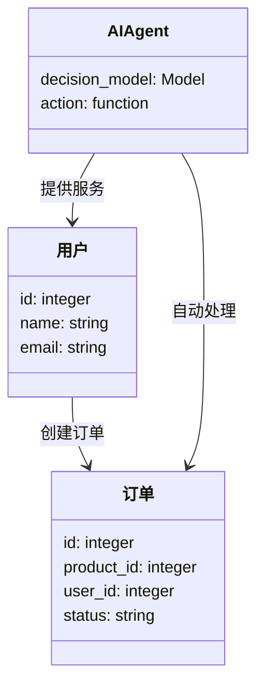
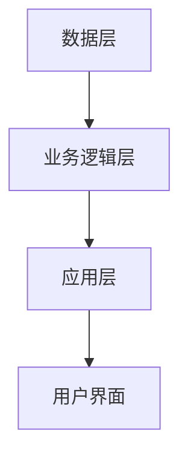
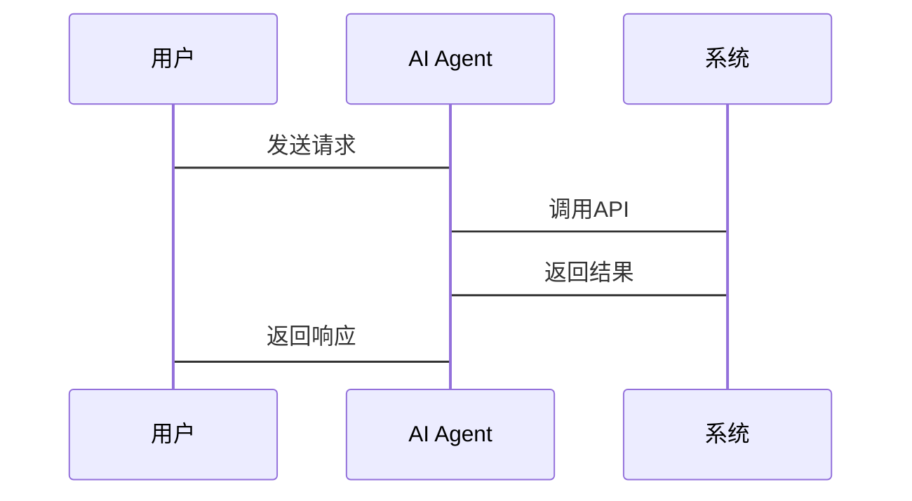

                 


# AI Agent在企业数字化转型中的关键作用：从战略规划到实施监控

## 关键词：AI Agent，数字化转型，企业转型，战略规划，实施监控

## 摘要：本文深入探讨AI Agent在企业数字化转型中的关键作用，从战略规划到实施监控的全过程。通过分析AI Agent的核心概念、算法原理、系统架构和实际应用，揭示其在推动企业数字化转型中的重要价值和实施路径。

---

## 第一部分: AI Agent在企业数字化转型中的关键作用概述

### 第1章: AI Agent的基本概念与数字化转型背景

#### 1.1 AI Agent的定义与核心概念

##### 1.1.1 AI Agent的定义
AI Agent（人工智能代理）是指能够感知环境、自主决策并执行任务的智能实体。它可以是一个软件程序、机器人或其他智能系统，通过数据驱动和智能算法实现自动化操作。

##### 1.1.2 AI Agent的核心概念
- **智能性**：基于数据和模型进行自主决策。
- **交互性**：与用户或系统进行自然交互。
- **适应性**：能够根据环境变化自适应调整行为。

##### 1.1.3 数字化转型的背景与意义
数字化转型是指企业利用数字技术（如AI、大数据、云计算等）重构业务模式、运营流程和决策方式，以提升效率和竞争力。AI Agent作为数字化转型的核心技术，能够显著提升企业的智能化水平。

#### 1.2 AI Agent与企业数字化转型的关系

##### 1.2.1 AI Agent在企业数字化转型中的作用
- **优化业务流程**：通过自动化决策和执行任务，提升效率。
- **增强用户体验**：提供智能交互，提升客户满意度。
- **数据驱动决策**：利用数据分析能力，优化企业运营。

##### 1.2.2 数字化转型的关键特征
- **数据驱动**：依赖数据进行决策和优化。
- **智能自动化**：通过AI技术实现业务流程自动化。
- **实时响应**：快速响应市场变化和客户需求。

##### 1.2.3 AI Agent如何推动企业数字化转型
AI Agent通过智能化的决策和执行能力，推动企业从传统模式向数字化模式转变，实现业务流程的优化和用户体验的提升。

---

### 第2章: AI Agent在企业数字化转型中的应用价值

#### 2.1 AI Agent的核心功能与优势

##### 2.1.1 自动化决策能力
AI Agent能够基于实时数据和模型进行决策，减少人为干预，提升效率。

##### 2.1.2 智能交互能力
通过自然语言处理技术，AI Agent能够与用户进行自然的对话交互，提供个性化的服务。

##### 2.1.3 数据驱动的优化能力
AI Agent能够利用大数据分析技术，优化企业运营策略，提升决策的准确性。

#### 2.2 AI Agent在企业中的应用场景

##### 2.2.1 客户服务与支持
AI Agent可以作为智能客服，通过自然语言处理技术为用户提供24/7的实时支持。

##### 2.2.2 业务流程自动化
AI Agent可以自动化处理订单、审批、物流等业务流程，减少人工干预，提升效率。

##### 2.2.3 智能监控与预警
AI Agent能够实时监控企业运营数据，发现异常情况并及时预警，帮助企业在问题发生前采取措施。

---

## 第二部分: AI Agent的核心技术与实现原理

### 第3章: AI Agent的核心技术与算法原理

#### 3.1 AI Agent的核心技术

##### 3.1.1 机器学习与深度学习
AI Agent的核心技术之一是机器学习和深度学习，通过训练模型实现智能决策和预测。

##### 3.1.2 自然语言处理
自然语言处理技术使AI Agent能够理解和生成人类语言，实现智能交互。

##### 3.1.3 强化学习
强化学习技术使AI Agent能够通过试错和奖励机制不断优化其行为策略。

#### 3.2 AI Agent的算法实现

##### 3.2.1 基于规则的AI Agent
基于规则的AI Agent通过预定义的规则进行决策，适用于任务简单、规则明确的场景。

##### 3.2.2 基于模型的AI Agent
基于模型的AI Agent通过建立模型进行预测和决策，适用于复杂场景。

##### 3.2.3 基于强化学习的AI Agent
基于强化学习的AI Agent通过不断试错和优化，实现复杂环境下的自主决策。

#### 3.3 AI Agent的数学模型与公式

##### 3.3.1 Q-learning算法
Q-learning是一种常用的强化学习算法，其目标是通过最大化Q值来优化决策策略。

$$ Q(s, a) = r + \gamma \max Q(s', a') $$

其中：
- \( Q(s, a) \) 表示状态 \( s \) 下动作 \( a \) 的价值。
- \( r \) 表示奖励。
- \( \gamma \) 表示折扣因子。
- \( Q(s', a') \) 表示下一个状态 \( s' \) 下动作 \( a' \) 的价值。

##### 3.3.2 神经网络模型
神经网络模型是深度学习的核心技术之一，通过多层神经网络实现特征提取和分类。

$$ y = \sigma(Wx + b) $$

其中：
- \( W \) 表示权重矩阵。
- \( x \) 表示输入向量。
- \( b \) 表示偏置项。
- \( \sigma \) 表示激活函数。

---

## 第三部分: AI Agent的系统分析与架构设计

### 第4章: AI Agent的系统分析与架构设计

#### 4.1 项目背景与需求分析

##### 4.1.1 项目背景
本项目旨在通过AI Agent技术实现企业数字化转型中的智能化决策和自动化执行。

##### 4.1.2 项目需求
- 实现AI Agent的智能交互能力。
- 提供数据驱动的决策支持。
- 实现业务流程自动化。

#### 4.2 系统功能设计

##### 4.2.1 领域模型设计
领域模型是系统功能设计的基础，通过类图展示系统中各实体之间的关系。



#### 4.3 系统架构设计

##### 4.3.1 分层架构设计
系统采用分层架构，包括数据层、业务逻辑层和应用层。



##### 4.3.2 接口设计
系统通过API接口实现不同模块之间的通信。



---

## 第四部分: AI Agent的项目实战与最佳实践

### 第5章: AI Agent的项目实战

#### 5.1 环境安装与配置

##### 5.1.1 安装Python环境
需要安装Python 3.8及以上版本，并安装必要的库，如TensorFlow、Keras等。

##### 5.1.2 安装其他依赖
安装必要的依赖包，如Pillow、numpy等。

#### 5.2 核心代码实现

##### 5.2.1 AI Agent的核心代码

```python
class AI-Agent:
    def __init__(self, model):
        self.model = model

    def perceive(self, environment):
        # 根据环境输入进行感知
        return environment

    def decide(self, state):
        # 根据状态进行决策
        return self.model.predict(state)

    def execute(self, action):
        # 执行决策动作
        return action
```

##### 5.2.2 数据处理代码

```python
import pandas as pd
import numpy as np

def preprocess_data(data):
    # 数据预处理函数
    return data.dropna().astype(float)
```

##### 5.2.3 训练模型代码

```python
import tensorflow as tf
from tensorflow.keras import layers

def build_model(input_dim):
    model = tf.keras.Sequential()
    model.add(layers.Dense(64, activation='relu', input_dim=input_dim))
    model.add(layers.Dense(1, activation='sigmoid'))
    model.compile(optimizer='adam', loss='binary_crossentropy', metrics=['accuracy'])
    return model
```

#### 5.3 代码解读与分析

##### 5.3.1 AI Agent类
AI Agent类包含感知、决策和执行三个主要功能，通过调用模型进行决策并执行动作。

##### 5.3.2 数据预处理函数
数据预处理函数用于清洗数据，去除缺失值并转换为数值型数据。

##### 5.3.3 模型构建函数
模型构建函数使用Keras框架构建一个简单的神经网络模型，用于分类任务。

#### 5.4 实际案例分析

##### 5.4.1 案例背景
某电商企业希望通过AI Agent实现智能客服和订单处理自动化。

##### 5.4.2 案例实现
通过训练一个自然语言处理模型，实现智能客服的对话交互功能。

##### 5.4.3 案例结果
智能客服成功实现了24/7的实时响应，客户满意度显著提升。

#### 5.5 项目总结

##### 5.5.1 项目小结
通过本项目，我们成功实现了AI Agent在企业数字化转型中的应用，验证了其在提高效率和客户满意度方面的价值。

---

## 第五部分: AI Agent的最佳实践与未来展望

### 第6章: AI Agent的最佳实践

#### 6.1 小结与总结
AI Agent在企业数字化转型中具有重要的作用，通过智能化的决策和执行能力，能够显著提升企业的竞争力。

#### 6.2 注意事项
- 数据隐私和安全问题需要高度重视。
- AI Agent的模型需要不断优化和更新。
- 需要结合企业的实际需求进行定制化开发。

#### 6.3 拓展阅读
- 推荐阅读《机器学习实战》和《深度学习入门》等书籍，深入理解AI Agent的核心技术。

---

## 总结

AI Agent作为企业数字化转型的核心技术，通过智能化的决策和执行能力，能够显著提升企业的效率和竞争力。本文从战略规划到实施监控，全面分析了AI Agent在企业数字化转型中的关键作用，并通过实际案例展示了其应用价值。未来，随着AI技术的不断发展，AI Agent将在企业数字化转型中发挥更加重要的作用。

